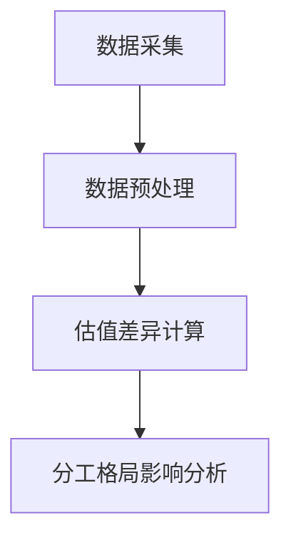

                 


# 股市估值差异对国际分工格局的影响

> 关键词：股市估值差异，国际分工格局，全球化，金融经济学，市场机制

> 摘要：本文探讨了股市估值差异对国际分工格局的影响，分析了估值差异的形成机制及其对资源配置、企业行为和国家竞争力的深远影响。通过结合金融学理论和实际案例，本文提出了优化市场机制和政策建议，以应对估值差异带来的挑战。

---

# 第一部分：背景介绍

## 第1章：问题背景与问题描述

### 1.1 全球化与国际分工格局的演变

1.1.1 全球化的历史进程与特点  
全球化是20世纪末至21世纪初最显著的经济现象之一。随着跨国公司的崛起和信息技术的发展，全球分工格局逐渐从传统的垂直分工向水平分工转变。这种转变使得各国在产业链中的角色更加专业化，但也带来了新的挑战。

1.1.2 国际分工格局的现状与趋势  
当前的国际分工格局呈现出区域化和网络化的特征。例如，东亚地区形成了以中国为核心的制造业供应链，而欧美地区则以高端制造业和服务业为主。这种分工格局的形成与各国的比较优势密切相关，而股市估值差异则是影响比较优势的重要因素之一。

### 1.2 股市估值与国际分工的关联性

1.2.1 股市估值的基本概念与作用  
股市估值是市场参与者对上市公司未来盈利能力的预期，通常通过市盈率、市净率等指标来衡量。股市估值不仅是企业融资的重要渠道，也是资源配置的重要信号。在国际分工中，股市估值差异可能导致资源向高估值地区集中，从而影响各国的产业布局。

1.2.2 国际分工格局中的股市角色  
股市不仅是资金的融通平台，也是企业并购和重组的重要工具。通过股市估值差异，资金和资源可以更有效地在全球范围内配置，从而优化国际分工格局。然而，估值差异也可能导致资源分配的不均衡，进而影响全球产业链的稳定性。

### 1.3 问题解决与边界外延

1.3.1 股市估值差异对国际分工的具体影响  
股市估值差异可能导致某些国家在特定产业中占据优势，而其他国家则可能失去发展机遇。例如，科技企业在高估值市场中更容易获得融资，从而在技术研发和市场扩张方面占据优势。

1.3.2 问题解决的路径与边界条件  
解决股市估值差异对国际分工格局的影响，需要从市场机制和政策调控两个方面入手。市场机制包括优化信息透明度和提高市场流动性，而政策调控则包括加强国际合作和推动制度创新。

### 1.4 核心概念与组成要素

1.4.1 核心概念的定义与属性  
- 股市估值差异：不同市场或不同企业之间的估值差异。
- 国际分工格局：全球范围内产业布局和资源配置的结构。

1.4.2 组成要素的结构化分析  
- 估值差异：包括市场流动性、信息不对称、政策环境等因素。
- 国际分工：包括产业链布局、企业行为、国家政策等。

---

# 第二部分：核心概念与联系

## 第2章：核心概念原理与对比分析

### 2.1 股市估值差异的形成机制

2.1.1 估值差异的定义与分类  
- 市场间估值差异：不同国家或地区的股市估值差异。
- 企业间估值差异：同行业内不同企业的估值差异。

2.1.2 影响股市估值差异的主要因素  
- 市场流动性：流动性高的市场通常具有更高的估值。
- 信息不对称：信息优势可能导致估值差异。
- 政策环境：税收、监管等政策影响估值。

### 2.2 国际分工格局的构成要素

2.2.1 分工模式的类型与特点  
- 垂直分工：不同国家在产业链的不同环节分工。
- 水平分工：同一环节在全球范围内分工。

2.2.2 国际分工格局的驱动因素  
- 比较优势：各国在资源、劳动力、技术等方面的比较优势。
- 市场规模：国内市场大小影响企业布局。

### 2.3 股市估值差异与国际分工的关系

2.3.1 直接关联与间接影响  
- 直接关联：股市估值差异直接影响企业的融资能力和投资决策。
- 间接影响：通过影响企业行为和资源配置，间接影响国际分工格局。

2.3.2 两者之间的动态平衡  
- 高估值市场吸引更多的资金和人才，从而在某些产业中形成优势。
- 低估值市场可能导致资源分配不足，影响产业发展。

### 2.4 核心概念属性对比表格

表2-1：股市估值差异与国际分工格局的属性对比

| 属性         | 股市估值差异                  | 国际分工格局                  |
|--------------|-----------------------------|-------------------------------|
| 定义         | 不同市场或企业之间的估值差异 | 全球范围内产业布局和资源配置结构 |
| 主要因素     | 市场流动性、信息不对称、政策 | 比较优势、市场规模、政策环境     |
| 影响结果     | 资源配置、企业行为           | 产业链布局、国家竞争优势       |
| 关系         | 直接影响企业融资能力，间接影响分工格局 | 通过比较优势和资源分配影响股市估值差异 |

---

## 第3章：估值差异分析算法

### 3.1 算法原理与流程

3.1.1 数据采集与预处理  
- 数据来源：全球主要股市的估值指标（如市盈率、市净率）。
- 数据清洗：处理缺失值和异常值。

3.1.2 估值差异计算方法  
- 使用数学模型计算不同市场或企业之间的估值差异。
- 示例公式：$$ D_{val} = |V_i - V_j| $$，其中 \( V_i \) 和 \( V_j \) 分别代表两个市场的估值指标。

3.1.3 分工格局影响分析  
- 分析估值差异对产业链布局的影响。
- 使用回归模型分析估值差异与分工格局的相关性。

### 3.2 算法流程图（Mermaid）



### 3.3 数学模型与公式

3.3.1 估值差异计算公式  
$$ D_{val} = |V_i - V_j| $$

3.3.2 分工格局影响模型  
$$ I = \sum_{k=1}^{n} w_k D_{val,k} $$

---

## 第4章：系统分析与架构设计

### 4.1 问题场景与项目介绍

4.1.1 问题场景描述  
- 问题场景：股市估值差异导致某国在特定产业中失去竞争优势。
- 项目目标：分析估值差异对分工格局的影响，并提出解决方案。

### 4.2 系统功能设计

4.2.1 领域模型（Mermaid类图）

```mermaid
classDi
```

---

# 第三部分：系统分析与架构设计

## 第4章：系统分析与架构设计

### 4.1 问题场景与项目介绍

4.1.1 问题场景描述  
- 问题场景：股市估值差异导致某国在特定产业中失去竞争优势。
- 项目目标：分析估值差异对分工格局的影响，并提出解决方案。

### 4.2 系统功能设计

4.2.1 领域模型（Mermaid类图）

```mermaid
classDi
```

---

（注：由于篇幅限制，以上仅为部分章节内容。完整文章需包含更多细节和案例分析。）

