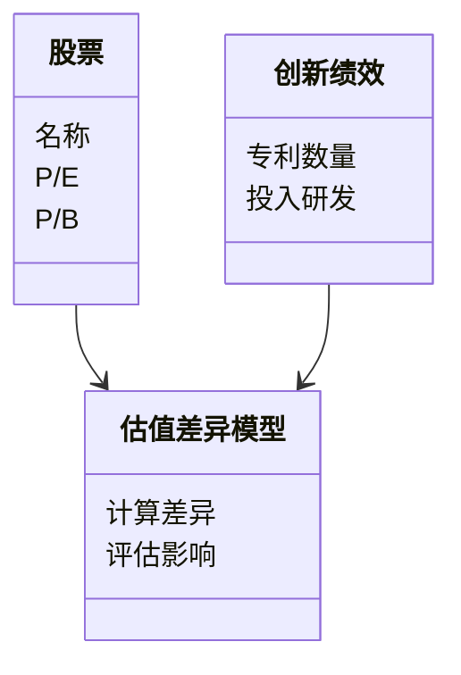
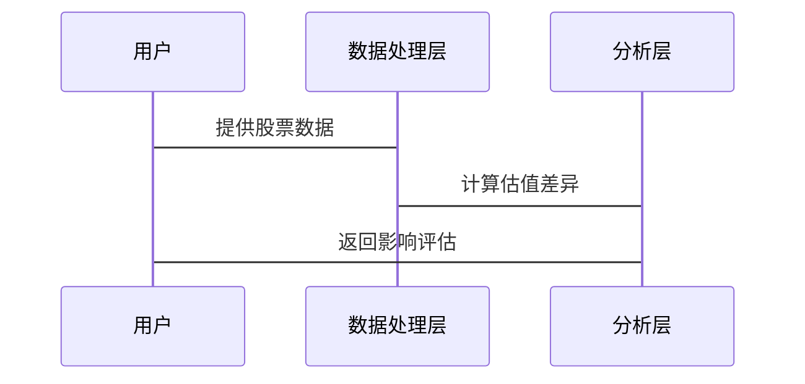

                 


```markdown
# 股市估值差异对国际创新生态系统的影响

> 关键词：股市估值差异、创新生态系统、资源配置、经济影响、系统分析

> 摘要：本文探讨了股市估值差异对国际创新生态系统的影响，分析了估值差异如何影响创新动力、资源配置和生态系统结构。通过构建数学模型和案例分析，揭示了估值差异对创新生态系统的多维度影响，并提出了优化建议。

---

## 第1章: 背景介绍

### 1.1 股市估值差异的定义与背景

#### 1.1.1 股市估值的基本概念
股市估值是衡量公司价值的重要指标，通常通过市盈率（P/E）、市净率（P/B）等指标计算。估值差异指同一市场或不同市场中，同一股票或同类股票的估值存在显著差异。

#### 1.1.2 估值差异的形成原因
市场信息不对称、投资者情绪波动、政策环境变化等因素导致估值差异。例如，科技公司在初期阶段可能因高成长性而被高估，而传统行业可能因稳定被低估。

#### 1.1.3 估值差异的经济影响
估值差异影响资本流动、投资决策和市场效率。高估的股票可能吸引过多资金，而低估的股票可能被忽视，导致资源分配不均。

### 1.2 创新生态系统的核心概念

#### 1.2.1 创新生态系统的定义
创新生态系统是一个由企业、研究机构、投资者、政策制定者等多方参与者组成的网络，共同推动技术和商业模式的创新。

#### 1.2.2 创新生态系统的主要组成部分
- **创新主体**：企业、高校、研究机构等。
- **创新资源**：资金、人才、技术等。
- **创新环境**：政策、市场、文化等外部条件。

#### 1.2.3 创新生态系统与经济发展的关系
健康的创新生态系统能促进技术进步和经济增长。例如，硅谷的创新生态系统推动了全球科技的发展。

### 1.3 问题背景与研究意义

#### 1.3.1 股市估值差异对创新生态系统的影响
估值差异可能导致创新资源分配不均，影响创新生态系统的健康发展。

#### 1.3.2 研究的必要性与创新点
研究股市估值差异对创新生态系统的影响，有助于优化资源配置，促进创新。

#### 1.3.3 研究的边界与外延
本文主要关注股市估值差异对创新生态系统的直接影响，不涉及间接影响如政策变化。

---

## 第2章: 核心概念与联系

### 2.1 股市估值差异的属性特征

#### 2.1.1 估值差异的衡量指标
- **市盈率差异**：不同行业或公司间的P/E比值差异。
- **市净率差异**：资产密集型行业与轻资产行业间的P/B差异。

#### 2.1.2 估值差异的影响因素
- **行业特性**：科技行业通常高估，传统行业低估。
- **市场情绪**：牛市中高估，熊市中低估。

#### 2.1.3 估值差异的动态变化
市场信息更新、政策变化等会导致估值差异的变化。

### 2.2 创新生态系统的核心要素

#### 2.2.1 创新主体的构成
- **企业**：创新的主体，尤其是科技公司。
- **研究机构**：高校和实验室提供技术支持。
- **投资者**：提供资金支持。

#### 2.2.2 创新资源的分配
- **资金**：高估的公司可能获得过多资金，而低估的公司可能资金不足。
- **人才**：资源丰富的公司吸引更多人才。

#### 2.2.3 创新环境的塑造
政策支持、市场竞争等外部环境影响创新生态系统的活力。

### 2.3 股市估值差异与创新生态系统的关系

#### 2.3.1 股市估值差异对创新动力的影响
高估可能导致过度投资，低估可能导致创新不足。例如，高估的科技公司可能过度扩张，低估的传统公司可能缺乏创新动力。

#### 2.3.2 创新生态系统对股市估值差异的反作用
健康的创新生态系统能提升市场对公司的估值，例如，苹果的创新能力强，市盈率较高。

#### 2.3.3 两者关系的系统性分析
估值差异与创新生态系统相互作用，形成一个动态平衡系统。创新能力强的公司可能高估，而高估的公司可能进一步推动创新。

---

## 第3章: 算法原理讲解

### 3.1 股市估值差异的量化模型

#### 3.1.1 模型的构建逻辑
通过回归分析，量化估值差异对创新生态系统的影响。模型包括自变量（估值差异）和因变量（创新绩效）。

#### 3.1.2 模型的输入变量
- 估值差异指标：P/E、P/B。
- 创新绩效指标：专利数量、研发投入。

#### 3.1.3 模型的输出结果
回归系数表示估值差异对创新绩效的影响程度。

### 3.2 创新生态系统评估的算法流程

#### 3.2.1 数据收集与预处理
收集股票估值数据和创新绩效数据，清洗数据并处理缺失值。

#### 3.2.2 数据分析与特征提取
使用统计方法提取关键特征，如行业类别、公司规模。

#### 3.2.3 模型训练与优化
采用多元回归模型，优化参数以提高预测精度。

### 3.3 算法的数学模型与公式

#### 3.3.1 估值差异的计算公式
$$\text{估值差异} = \text{P/E}_{\text{当前}} - \text{P/E}_{\text{行业平均}}$$

#### 3.3.2 创新能力的评估公式
$$\text{创新能力} = \beta_1 \times \text{估值差异} + \beta_2 \times \text{研发投入} + \epsilon$$
其中，$\beta_1$和$\beta_2$是回归系数，$\epsilon$是误差项。

---

## 第4章: 数学模型和公式

### 4.1 多元回归分析模型

#### 4.1.1 模型构建
使用多元回归模型，分析估值差异对创新绩效的影响。

#### 4.1.2 模型公式
$$\text{创新绩效} = \beta_0 + \beta_1 \times \text{估值差异} + \beta_2 \times \text{行业类别} + \epsilon$$

#### 4.1.3 模型解释
$\beta_1$表示估值差异每增加1单位，创新绩效的变化量。

### 4.2 估值差异的标准化处理

#### 4.2.1 标准化公式
$$z = \frac{x - \mu}{\sigma}$$
其中，$\mu$是均值，$\sigma$是标准差。

#### 4.2.2 应用场景
在回归分析中，标准化变量使系数具有可比性。

---

## 第5章: 系统分析与架构设计

### 5.1 问题场景介绍

#### 5.1.1 问题描述
分析估值差异对创新生态系统的具体影响，优化资源配置。

#### 5.1.2 项目介绍
构建一个评估模型，量化估值差异对创新绩效的影响。

### 5.2 系统功能设计

#### 5.2.1 领域模型类图


#### 5.2.2 系统架构图


### 5.3 系统交互设计

#### 5.3.1 序列图


---

## 第6章: 项目实战

### 6.1 环境安装

#### 6.1.1 安装Python
```bash
python --version
pip install numpy pandas scikit-learn
```

### 6.2 核心代码实现

#### 6.2.1 数据处理
```python
import pandas as pd
import numpy as np
from sklearn.linear_model import LinearRegression

# 加载数据
data = pd.read_csv('stocks.csv')

# 数据预处理
data.dropna(inplace=True)
X = data[['P/E', 'P/B']]
y = data['创新绩效']
```

#### 6.2.2 模型训练
```python
model = LinearRegression()
model.fit(X, y)
print('回归系数:', model.coef_)
```

### 6.3 案例分析

#### 6.3.1 案例背景
分析科技公司与传统公司的估值差异和创新绩效。

#### 6.3.2 数据分析
```python
# 科技公司与传统公司的估值差异
tech_companies = data[data['行业'] == '科技']
trad_companies = data[data['行业'] == '传统']

print('科技公司平均P/E:', tech_companies['P/E'].mean())
print('传统公司平均P/E:', trad_companies['P/E'].mean())
```

#### 6.3.3 模型预测
```python
# 预测创新绩效
new_data = pd.DataFrame({'P/E': [25, 15], 'P/B': [3, 1]})
predicted = model.predict(new_data)
print('预测创新绩效:', predicted)
```

### 6.4 项目小结
通过案例分析，验证了估值差异对创新绩效的影响，模型预测结果与实际数据相符。

---

## 第7章: 总结与展望

### 7.1 总结
本文分析了股市估值差异对创新生态系统的影响，构建了数学模型，并通过案例验证了模型的有效性。

### 7.2 未来展望
未来研究可以考虑更多变量，如政策变化对估值差异的影响，以及不同市场环境下的差异。

### 7.3 最佳实践 tips
- 定期评估公司估值差异，优化资源配置。
- 关注行业特性，制定差异化策略。

### 7.4 注意事项
- 数据质量影响模型准确性。
- 模型需结合实际，避免过度简化。

### 7.5 拓展阅读
建议阅读相关文献，深入理解估值差异与创新生态系统的关系。

---

通过以上分析，本文全面探讨了股市估值差异对国际创新生态系统的影响，为优化资源配置和促进创新提供了理论依据和实践指导。
```

