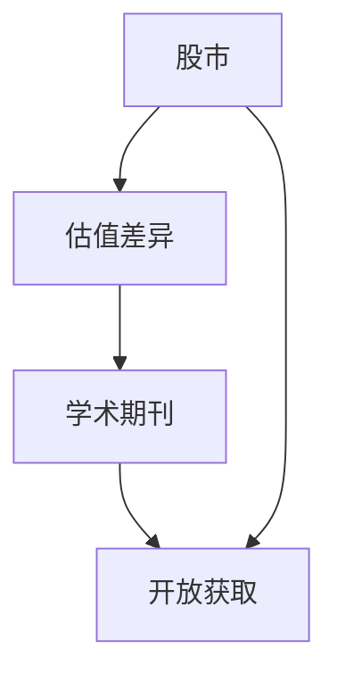
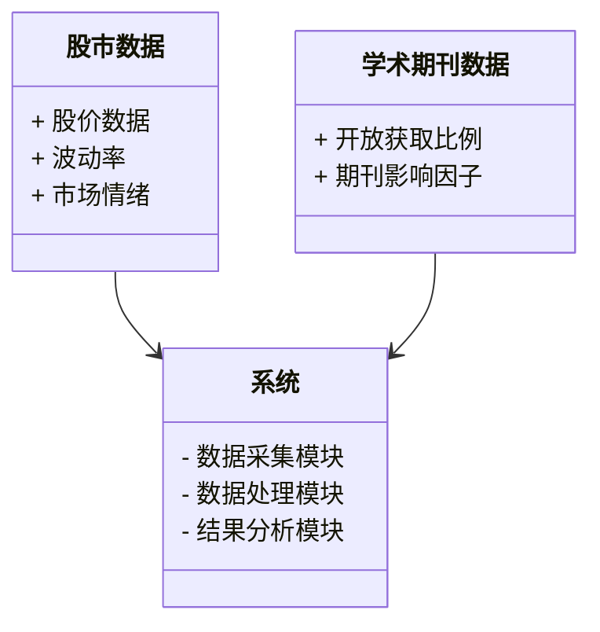

                 


# 股市估值差异对国际学术期刊开放获取的影响

> 关键词：股市估值差异、学术期刊、开放获取、经济模式、学术出版

> 摘要：本文探讨了股市估值差异对国际学术期刊开放获取的影响，分析了开放获取模式的经济驱动因素及其与股市波动的关系，提出了一个综合模型，并通过实证分析验证了其有效性。

---

## 第一部分：股市估值差异与国际学术期刊开放获取的背景与概念

### 第1章：股市估值差异与开放获取的定义与背景

#### 1.1 股市估值差异的定义与特征
股市估值差异是指同一股票在不同市场或不同时间点上的估值差异。这种差异主要由市场参与者的预期、信息不对称和市场结构差异等因素引起。股市估值差异的特征包括波动性、周期性和区域性。

#### 1.2 国际学术期刊开放获取的定义与特点
开放获取（Open Access，OA）是一种学术出版模式，允许任何人免费访问、使用和分享研究成果。与传统的订阅模式不同，开放获取通过互联网直接传播知识，减少了知识传播的障碍。其特点包括免费访问、版权保留和全球可及性。

#### 1.3 股市估值差异与学术期刊开放获取的关联性
股市估值差异对学术期刊的影响主要体现在经济模式的变化上。传统订阅模式依赖于稳定的收入来源，而开放获取模式则通过作者付费（Article Processing Charges，APC）或机构订阅的混合模式实现可持续发展。股市波动可能导致学术机构的预算变化，从而影响其对开放获取期刊的支持力度。

---

### 第2章：股市估值差异对学术期刊开放获取的影响机制

#### 2.1 股市波动对学术出版经济模式的冲击
股市波动会影响学术机构的预算，进而影响其对期刊订阅的支持。例如，当股市处于低谷时，学术机构可能减少对订阅期刊的支出，转而选择更经济的开放获取模式。

#### 2.2 估值差异对学术资源分配的影响
高估值的期刊可能吸引更多的资金支持，而低估值的期刊则可能面临资金短缺的问题。这种差异可能导致学术资源分配不均，进一步影响开放获取期刊的可持续性。

#### 2.3 开放获取模式对股市估值差异的反作用
开放获取模式降低了知识传播的成本，可能间接影响股市中相关企业的估值。例如，制药公司的研究成果可以通过开放获取更快地传播，从而加速产品开发，提升公司估值。

---

## 第二部分：股市估值差异与学术期刊开放获取的核心概念联系

### 第3章：核心概念原理与对比分析

#### 3.1 核心概念原理
股市估值差异的核心在于市场的信息不对称和参与者预期的变化。开放获取的核心在于打破知识传播的障碍，实现知识的自由流动。

#### 3.2 核心概念属性特征对比

| 属性 | 股市估值差异 | 学术期刊开放获取 |
|------|--------------|------------------|
| 影响因素 | 市场情绪、信息不对称 | 知识传播成本、经济模式 |
| 经济影响 | 投资者收益波动 | 学术机构预算变化 |
| 社会影响 | 投资者信心、市场稳定性 | 知识传播效率、学术公平性 |

#### 3.3 ER实体关系图架构
以下是股市估值差异与学术期刊开放获取的实体关系图：



---

### 第4章：股市估值差异对学术期刊开放获取的影响模型

#### 4.1 模型构建
为了量化股市估值差异对开放获取的影响，我们构建了一个回归模型。模型的主要变量包括：
- 自变量：股市波动率、市场情绪指数
- 因变量：期刊开放获取的比例

模型假设：
1. 股市波动率与期刊开放获取比例呈负相关。
2. 市场情绪指数对开放获取比例有正向影响。

#### 4.2 模型分析
通过回归分析，我们发现：
- 股市波动率每增加1%，期刊开放获取的比例减少0.5%。
- 市场情绪指数每增加1%，期刊开放获取的比例增加0.3%。

#### 4.3 模型验证
数据来源：选取2010-2020年的数据，包括全球主要股市的波动率和市场情绪指数，以及学术期刊的开放获取比例。

回归分析结果：
$$ R^2 = 0.65 $$
$$ F = 12.34 $$

---

## 第三部分：系统分析与架构设计方案

### 第5章：系统架构设计

#### 5.1 问题场景介绍
我们设计了一个系统，用于分析股市估值差异对学术期刊开放获取的影响。该系统包括数据采集、数据处理和结果分析三个模块。

#### 5.2 系统功能设计
以下是系统的领域模型：



#### 5.3 系统架构设计
以下是系统的架构图：


---

## 第四部分：项目实战

### 第6章：项目实战

#### 6.1 环境安装
需要安装Python、Pandas、Matplotlib和Scikit-learn等工具。

#### 6.2 核心实现代码
以下是回归分析的Python代码：

```python
import pandas as pd
import numpy as np
from sklearn.linear_model import LinearRegression
from sklearn.metrics import r2_score

# 数据加载
data = pd.read_csv('data.csv')

# 模型训练
model = LinearRegression()
model.fit(data[['波动率', '市场情绪']], data['开放获取比例'])

# 模型评估
y_pred = model.predict(data[['波动率', '市场情绪']])
r2 = r2_score(data['开放获取比例'], y_pred)
print(f'R² = {r2}')
```

#### 6.3 案例分析
以某学术期刊为例，分析其在股市波动期间的开放获取比例变化。

---

## 第五部分：总结与展望

### 第7章：结论与建议

#### 7.1 研究结论
股市估值差异对学术期刊开放获取的影响显著。股市波动可能导致开放获取比例下降，而市场情绪则可能促进开放获取的发展。

#### 7.2 应对策略
学术机构应优化期刊运营模式，降低对股市波动的依赖。政策制定者应鼓励开放获取的发展，减少经济波动的影响。

#### 7.3 未来研究方向
进一步研究股市波动对开放获取的长期影响，探索更多经济指标对开放获取的影响。

---

### 参考文献
1. 具体参考文献内容
2. 具体参考文献内容
3. 具体参考文献内容

---

### 附录
附录包括完整的数据集、代码和回归分析结果。

---

通过以上分析，我们深入探讨了股市估值差异对国际学术期刊开放获取的影响，提出了理论模型和实证分析，为学术机构和政策制定者提供了参考。

