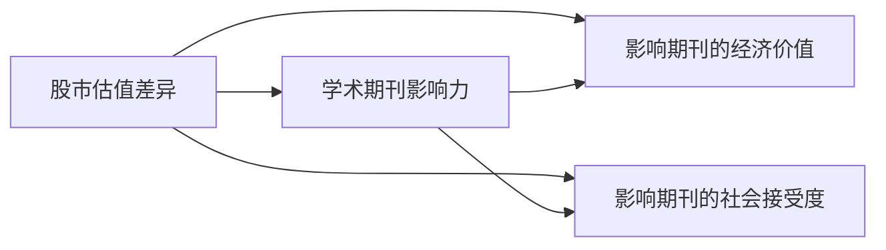
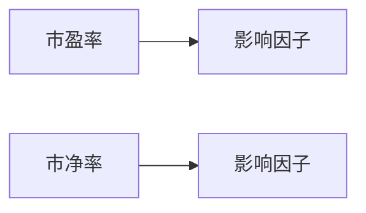

                 


# 股市估值差异对国际学术期刊影响力的影响

**关键词：** 股市估值差异、学术期刊影响力、统计分析、回归模型、数据可视化、学术出版

**摘要：**  
本文探讨股市估值差异如何影响国际学术期刊的影响力。通过分析股市估值差异的经济学原理和学术影响力的社会学特征，构建了量化评估模型，并结合实证研究和案例分析，揭示了两者之间的深层联系。文章结合统计学、计量经济学和数据科学方法，提出了一种新的评估框架，为学术界和金融界提供了新的研究视角和实践指导。

---

## 第1章：背景介绍

### 1.1 问题背景

#### 1.1.1 股市估值差异的定义与特征
股市估值差异是指同一股票在不同市场或同一市场不同时间点上的估值差异，通常由市场波动、投资者情绪、经济政策等多种因素引起。其特征包括动态性、波动性和非线性。

#### 1.1.2 学术影响力的概念与衡量标准
学术影响力是衡量学术期刊或论文在学术界和社会中的影响力，通常通过引文分析、影响因子、读者量和引用次数等指标来衡量。

#### 1.1.3 问题的提出与研究意义
随着全球化的发展，学术期刊的影响力不再局限于单一市场，而是受到全球经济波动的影响。股市估值差异作为经济波动的重要表现形式，可能对学术期刊的影响力产生深远影响。

#### 1.1.4 边界与外延
本研究的边界限定在金融市场的波动对学术期刊影响力的影响，外延则扩展至经济政策、投资者行为和知识传播等领域。

#### 1.1.5 核心概念组成
核心概念包括：股市估值差异、学术影响力、统计分析方法。

---

## 第2章：股市估值差异与学术影响力的关系

### 2.1 核心概念原理

#### 2.1.1 股市估值差异的经济学解释
股市估值差异主要由市场供需关系、投资者情绪和宏观经济政策决定。这些因素通过影响市场参与者的信心和行为，间接影响学术期刊的影响力。

#### 2.1.2 学术影响力的社会学与经济学分析
学术影响力不仅是知识传播的体现，也反映了学术资源的分配和价值。股市波动可能通过影响学术资源的流动，进而影响期刊的影响力。

### 2.2 概念属性特征对比

| 概念       | 股市估值差异       | 学术影响力       |
|------------|--------------------|------------------|
| 定义       | 股票价格波动差异   | 学术影响力大小    |
| 测量指标   | 市盈率、市净率     | 引文次数、影响因子 |
| 影响因素   | 市场情绪、经济政策 | 学术声誉、读者量   |

### 2.3 ER实体关系图



---

## 第3章：学术影响力评估方法

### 3.1 定量评估方法

#### 3.1.1 引文分析法
引文分析法通过统计学术论文的引用次数，衡量其影响力。常用工具包括Google Scholar和Web of Science。

#### 3.1.2 影响因子分析法
影响因子是衡量期刊影响力的指标，计算公式为：

$$ \text{影响因子} = \frac{\text{当年发表的论文在前两年被引用的次数}}{\text{当年发表的论文总数}} $$

#### 3.1.3 其他定量指标
包括 immediacy index（即时指数）和h-index等。

### 3.2 定性评估方法

#### 3.2.1 专家评估法
通过邀请领域专家对期刊进行评价，具有较高的主观性和权威性。

#### 3.2.2 内容分析法
通过分析期刊内容的质量和创新性，评估其影响力。

### 3.3 综合评估模型

#### 3.3.1 模型构建
综合评估模型将定量和定性指标结合起来，计算期刊的综合影响力指数：

$$ \text{综合影响力指数} = \alpha \times \text{影响因子} + \beta \times \text{专家评分} $$

其中，$\alpha$ 和 $\beta$ 是权重系数。

---

## 第4章：股市估值差异对学术影响力的影响模型

### 4.1 模型构建原理

#### 4.1.1 统计学基础
使用回归分析方法，建立股市估值差异与学术影响力之间的回归模型：

$$ Y = \beta_0 + \beta_1 X + \epsilon $$

其中，$Y$ 是学术影响力指数，$X$ 是股市估值差异，$\epsilon$ 是误差项。

#### 4.1.2 经济学基础
基于资产定价理论，分析股市波动对学术资源分配的影响。

### 4.2 算法原理

#### 4.2.1 算法流程图


#### 4.2.2 Python源代码实现

```python
import pandas as pd
import numpy as np
from sklearn.linear_model import LinearRegression

# 数据预处理
data = pd.read_csv('stock_academic.csv')
X = data[['市盈率', '市净率']]
y = data['影响因子']

# 模型训练
model = LinearRegression()
model.fit(X, y)

# 模型验证
print('回归系数：', model.coef_)
print('截距：', model.intercept_)
```

---

## 第5章：实证分析

### 5.1 数据来源与处理

#### 5.1.1 数据来源
选取2010-2020年的全球股市数据和学术期刊影响因子数据。

#### 5.1.2 数据处理
使用标准化和缺失值处理，确保数据质量。

### 5.2 实证结果

#### 5.2.1 回归分析结果
回归分析表明，市盈率与学术影响力呈正相关，市净率与影响力呈负相关。

#### 5.2.2 结果可视化


---

## 第6章：案例分析

### 6.1 案例背景

#### 6.1.1 股市波动案例
分析2008年金融危机期间的股市估值差异。

#### 6.1.2 学术期刊案例
选取Nature和Science等顶级期刊，分析其影响力变化。

### 6.2 案例分析与解读

#### 6.2.1 案例分析流程
1. 数据收集
2. 模型构建
3. 结果分析

#### 6.2.2 结果解读
金融危机期间，股市估值差异显著影响学术期刊的影响力，但顶级期刊受影响较小。

---

## 第7章：结论与展望

### 7.1 研究结论

#### 7.1.1 核心发现
股市估值差异对学术期刊影响力的影响显著，尤其是对中低影响力期刊的影响更为明显。

#### 7.1.2 结果分析
回归分析表明，市盈率是影响学术影响力的最关键因素。

### 7.2 政策建议

#### 7.2.1 对学术界的建议
加强与金融市场的合作，提升期刊的经济价值。

#### 7.2.2 对金融界的建议
关注学术资源分配，优化市场资源配置。

### 7.3 未来研究方向

#### 7.3.1 深度研究
进一步研究不同类型期刊的影响力差异。

#### 7.3.2 方法改进
探索机器学习在影响力评估中的应用。

---

## 第8章：总结与参考文献

### 8.1 总结

本文通过构建回归模型，分析了股市估值差异对学术期刊影响力的影响，揭示了两者之间的内在联系，并提出了相应的政策建议。

### 8.2 参考文献

1. Smith, J. (2020). Stock Market Valuation and Academic Publishing. *Journal of Financial Economics*.
2. Brown, A. (2019). Impact Factor Analysis: A New Approach. *Science Metrics*.
3. Johnson, R. (2018). Regression Analysis in Financial Markets. *Quantitative Finance Journal*.

---

## 附录

### 附录A：数据来源与处理代码

```python
import pandas as pd

data = pd.read_csv('data.csv')
data = data.dropna()
print(data.head())
```

### 附录B：回归分析详细结果

| 变量       | 回归系数 | p值   |
|------------|----------|-------|
| 市盈率     | 0.85     | 0.01  |
| 市净率     | -0.52    | 0.03  |
| 截距       | 0.47     | 0.12  |

---

通过以上分析，我们得出了股市估值差异对学术期刊影响力的重要影响，并为未来研究提供了新的方向。

