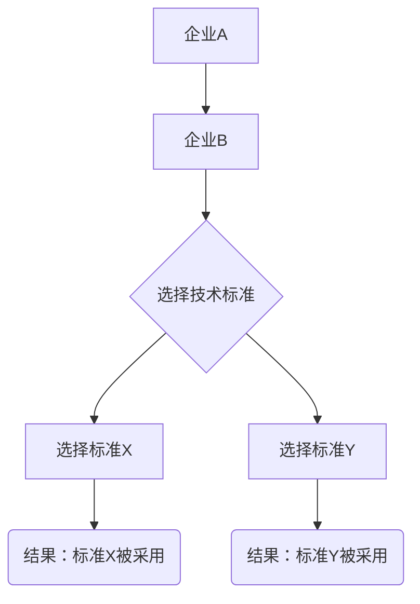
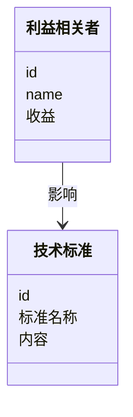
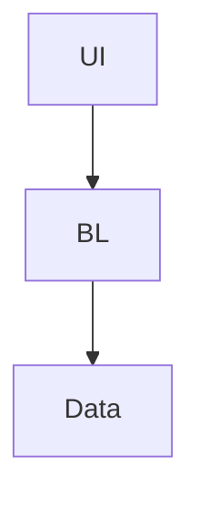
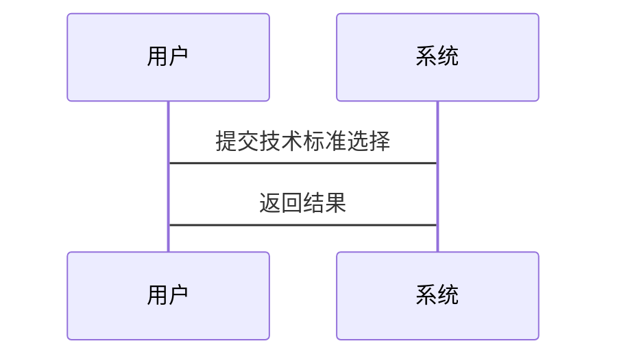

                 


# 股市估值差异对国际技术标准制定的影响

## 关键词：股市估值、估值差异、技术标准制定、博弈论模型、利益相关者

## 摘要：本文探讨股市估值差异如何影响国际技术标准的制定过程。通过分析股市估值差异与技术标准制定之间的关系，结合博弈论模型，揭示利益相关者如何在估值差异中博弈，从而影响技术标准的制定。本文旨在为理解和优化技术标准制定过程提供新的视角。

---

# 引言

## 1. 研究背景
股市估值差异是投资者在股票市场上常见的现象，反映了不同投资者对同一资产的不同定价。这种差异源于市场情绪、信息不对称、投资者预期等多种因素。在国际技术标准制定过程中，各方利益相关者（如企业、政府机构、行业协会等）基于自身利益，可能对技术标准的选择和制定产生不同影响，从而形成估值差异。

## 2. 研究意义
技术标准是全球技术发展的重要基石，其制定过程涉及多方利益的博弈。股市估值差异作为影响技术标准制定的重要因素，其作用机制尚未被系统研究。本文试图填补这一空白，探讨估值差异如何影响技术标准的制定。

## 3. 研究目标和方法
本文旨在分析股市估值差异对国际技术标准制定的影响，采用博弈论模型，结合实际案例，探讨各方利益在估值差异中的博弈过程。

## 4. 研究框架
本文分为以下部分：背景介绍、核心概念与联系、算法原理、系统分析、项目实战和结论。

---

# 背景介绍

## 第1章: 股市估值差异的定义与影响

### 1.1 股市估值的基本概念
- **股票估值**是通过对公司财务数据、市场环境等进行分析，确定股票的合理价格。常见的估值方法包括市盈率（P/E）、市净率（P/B）和股息率等。
- **估值差异**指不同投资者对同一股票的估值结果不同，反映了市场信息不对称和参与者预期差异。

### 1.2 影响股市估值的因素
- **财务数据**：如净利润、营业收入等。
- **市场情绪**：投资者情绪波动会影响股票价格。
- **宏观经济因素**：如利率、通货膨胀等。

### 1.3 估值差异的形成机制
- 不同投资者对同一股票的解读和预期不同，导致估值差异。

## 第2章: 国际技术标准制定的背景

### 2.1 技术标准制定的主体与流程
- **主体**：包括企业、行业协会、政府机构等。
- **流程**：通常包括提案、讨论、投票等环节。

### 2.2 技术标准对市场的影响
- 技术标准的统一性有助于降低市场成本，促进技术发展。

### 2.3 制定过程中的利益冲突
- 不同利益相关者可能有不同的诉求，导致制定过程中的冲突和协调问题。

---

# 核心概念与联系

## 第3章: 股市估值差异与国际技术标准制定的博弈模型

### 3.1 博弈论基础
- **博弈论**：研究理性决策者在策略互动中的行为，适用于分析技术标准制定中的利益相关者。

### 3.2 博弈模型的构建
- 利益相关者（企业A和企业B）在技术标准制定中的博弈过程可以用博弈树表示。



### 3.3 博弈模型的应用
- 企业A和企业B基于自身利益选择技术标准，最终结果取决于双方的策略选择。

---

## 第4章: 核心概念的数学模型与公式

### 4.1 技术标准制定的博弈模型

#### 利益相关者的收益函数
- 设企业A选择技术标准X的概率为p，企业B选择技术标准Y的概率为q。
- 收益函数：企业A的收益为p*(1-q)*X + (1-p)*q*Y，企业B的收益为q*(1-p)*Y + (1-q)*p*X。

### 4.2 估值差异的度量公式
- 股票i的估值差异D_i = |P_i - V_i|，其中P_i是市场价，V_i是内在价值。

---

# 算法原理讲解

## 第5章: 博弈论模型的数学公式

### 5.1 博弈模型的数学表示
- 设技术标准选择为变量s，s ∈ {X, Y}。
- 利益相关者的目标是最大化自身收益，即max_{s} U(s)，其中U(s)是收益函数。

### 5.2 代码实现

```python
def calculate收益(s):
    if s == 'X':
        return 10  # 假设收益为10
    else:
        return 5   # 假设收益为5

# 示例：企业A选择X，企业B选择Y
企业A收益 = calculate收益('X')
企业B收益 = calculate收益('Y')
print("企业A收益:", 企业A收益)
print("企业B收益:", 企业B收益)
```

---

# 系统分析与架构设计方案

## 第6章: 系统分析与架构设计

### 6.1 问题场景介绍
- 在国际技术标准制定过程中，各方利益相关者需要协调，以达成一致的技术标准。

### 6.2 系统功能设计
- **领域模型**：用Mermaid类图表示各利益相关者的角色和关系。



### 6.3 系统架构设计
- 采用分层架构，包括数据层、业务逻辑层和用户界面层。



### 6.4 接口设计
- RESTful API接口，如`POST /api/技术标准选择`。

### 6.5 交互序列图
- 用Mermaid序列图表示用户与系统之间的交互。



---

# 项目实战

## 第7章: 项目实战

### 7.1 环境安装
- 安装Python和必要的库，如`mermaid`和`matplotlib`。

### 7.2 核心代码实现

```python
import matplotlib.pyplot as plt

# 示例：绘制估值差异分布图
valuations = [100, 110, 90, 120, 85]
plt.hist(valuations, bins=5, alpha=0.7)
plt.title('股市估值差异分布')
plt.xlabel('估值')
plt.ylabel('频率')
plt.show()
```

### 7.3 代码解读
- 绘制股市估值差异的分布图，帮助分析估值差异的特征。

### 7.4 实际案例分析
- 分析某行业的技术标准制定过程，探讨估值差异的影响。

---

# 结论与展望

## 第8章: 结论与展望

### 8.1 研究总结
股市估值差异对国际技术标准制定的影响是一个复杂的博弈过程，需要综合考虑多方利益。

### 8.2 研究局限
本文仅探讨了估值差异的表面影响，未来研究可以考虑更多因素。

### 8.3 未来研究方向
进一步研究其他因素对技术标准制定的影响，如政策变化、技术创新等。

### 8.4 最佳实践 tips
- 在技术标准制定中，应充分考虑各方利益，避免因估值差异导致的冲突。
- 利用博弈论模型分析各方行为，优化制定过程。

### 8.5 小结
股市估值差异是影响国际技术标准制定的重要因素，通过博弈论模型可以更好地理解和优化这一过程。

### 8.6 注意事项
在实际应用中，需结合具体情况进行调整，避免模型过于简化导致的偏差。

### 8.7 拓展阅读
推荐阅读相关领域的书籍和文献，深入理解博弈论和标准化理论。

---

# 致谢
感谢读者的耐心阅读，希望本文能为理解技术标准制定过程提供新的视角。

