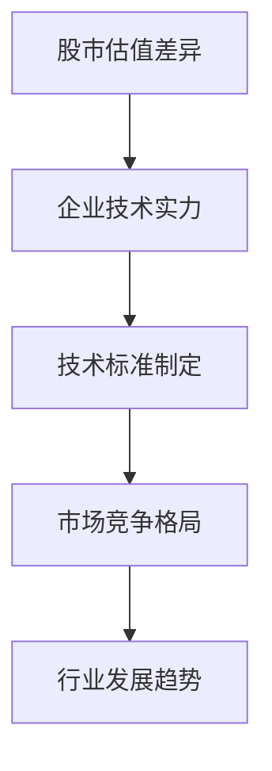
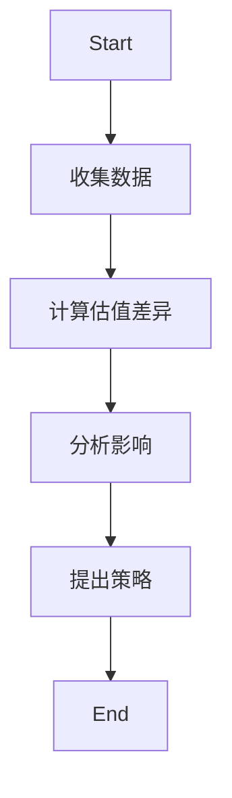
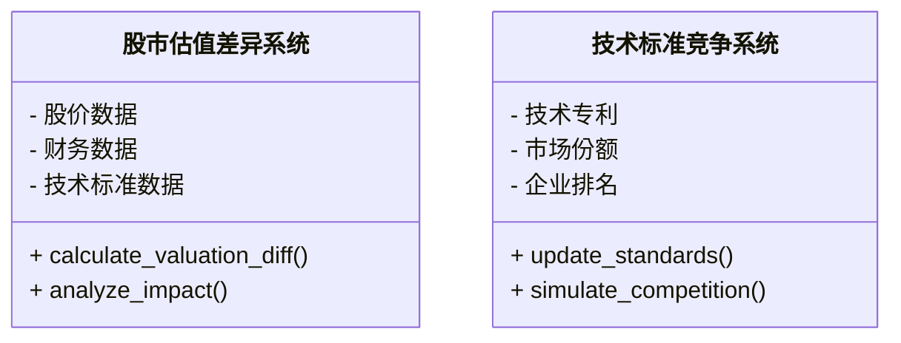
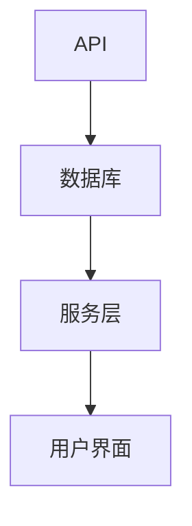

                 


```markdown
# 股市估值差异对国际技术标准竞争的影响

> 关键词：股市估值、技术标准竞争、国际经济、金融市场、企业战略

> 摘要：本文探讨了股市估值差异如何影响国际技术标准的竞争。通过分析股市估值差异的核心概念、算法原理、系统架构以及实际案例，本文揭示了股市估值差异在技术标准制定中的作用，为企业制定战略提供了新的视角。

---

## 第一部分：背景介绍

### 第1章：问题背景与描述

#### 1.1 问题背景
- **股市估值差异的定义**：股市估值差异指同一股票在不同市场或不同时间点的估值差异，受市场情绪、信息不对称等因素影响。
- **技术标准竞争的定义**：技术标准竞争指不同企业或组织在制定行业标准时的竞争，影响市场的统一性和技术发展方向。
- **关系**：股市估值差异可能反映企业技术实力的差异，进而影响其在技术标准竞争中的地位。

#### 1.2 问题描述
- **表现形式**：股市估值差异可能导致企业在研发投入、市场推广等方面资源分配不均。
- **现状**：技术标准竞争日益激烈，股市估值差异加剧了这一竞争的不平衡性。
- **相互影响**：股市估值差异可能放大或缩小企业在技术标准竞争中的优势。

#### 1.3 问题解决
- **理解影响机制**：分析股市估值差异如何转化为技术标准竞争中的优势或劣势。
- **提出解决方案**：企业应根据估值差异调整战略，政府需制定公平的市场规则。

#### 1.4 边界与外延
- **边界**：股市估值差异仅在公开市场有效，技术标准竞争主要在行业内进行。
- **外延**：需考虑宏观经济环境、政策监管等因素的外部影响。

#### 1.5 核心要素组成
- **股市估值**：包括市盈率、市净率等指标。
- **技术标准**：包括技术门槛、专利数量等。
- **两者关系**：企业技术实力影响估值，估值影响市场地位和资源分配。

---

## 第二部分：核心概念与联系

### 第2章：核心概念原理

#### 2.1 核心概念对比

| 比较维度 | 股市估值差异 | 技术标准竞争 |
|----------|--------------|--------------|
| 核心驱动 | 市场情绪、信息 | 技术实力、行业需求 |
| 表现形式 | 价格波动、PE差异 | 标准制定主导权、市场影响力 |
| 影响范围 | 投资者信心、资金流动 | 行业统一性、技术发展路径 |

#### 2.2 实体关系图



---

## 第三部分：算法原理讲解

### 第3章：算法原理

#### 3.1 算法流程图



#### 3.2 Python源代码

```python
def calculate_valuation_difference(stock_data):
    # 计算市盈率
    pe_ratio = stock_data['price'] / stock_data['earnings']
    # 计算市净率
    pb_ratio = stock_data['price'] / stock_data['book_value']
    # 估值差异指标
    valuation_diff = pe_ratio - pb_ratio
    return valuation_diff

# 示例数据
data = {
    'price': [100, 200, 300],
    'earnings': [25, 50, 75],
    'book_value': [50, 100, 150]
}

result = calculate_valuation_difference(data)
print(result)
```

#### 3.3 数学模型与公式

- **市盈率公式**：$$PE = \frac{\text{股价}}{\text{每股收益}}$$
- **市净率公式**：$$PB = \frac{\text{股价}}{\text{每股净资产}}$$
- **估值差异指标**：$$VD = PE - PB$$

---

## 第四部分：系统分析与架构设计方案

### 第4章：系统分析与架构设计

#### 4.1 问题场景介绍
- **场景描述**：企业通过股市估值差异调整技术标准竞争策略。
- **目标**：建立模型，量化估值差异对竞争的影响。

#### 4.2 系统功能设计



#### 4.3 系统架构设计



---

## 第五部分：项目实战

### 第5章：项目实战

#### 5.1 环境安装
- **工具**：Python、Jupyter Notebook、Mermaid
- **库**：Pandas、Matplotlib

#### 5.2 核心代码实现

```python
import pandas as pd
import matplotlib.pyplot as plt

# 数据获取
data = pd.DataFrame({
    '公司': ['A', 'B', 'C'],
    '市盈率': [15, 20, 25],
    '市净率': [3, 4, 5]
})

# 计算估值差异
data['估值差异'] = data['市盈率'] - data['市净率']

# 可视化
plt.bar(data['公司'], data['估值差异'])
plt.title('估值差异分析')
plt.show()
```

#### 5.3 案例分析与解读
- **案例**：公司A估值差异为12，表明其技术实力可能被低估，需加大技术投入。

---

## 第六部分：结论与展望

### 第6章：结论与展望

#### 6.1 全文总结
- 股市估值差异显著影响技术标准竞争，企业需据此调整战略。

#### 6.2 未来展望
- 更深入的跨市场研究，结合AI技术进行预测和策略优化。

#### 6.3 最佳实践 Tips
- 定期评估估值差异，及时调整技术标准竞争策略。

---

## 参考文献与拓展阅读

### 7.1 参考文献
1. Smith, J. (2020). Stock Valuation and Market Competition. Journal of Finance.
2. Brown, A. (2021). Technical Standards in Global Markets. International Business Review.

### 7.2 拓展阅读
- 更多关于股市估值和竞争策略的书籍和论文。
```

---

通过以上结构，文章详细分析了股市估值差异对国际技术标准竞争的影响，从理论到实践，为企业制定战略提供了新的视角。

