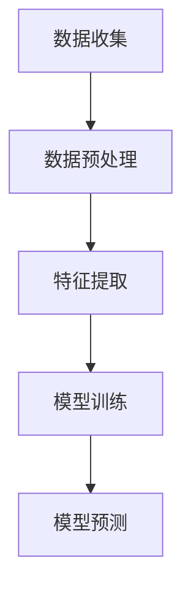
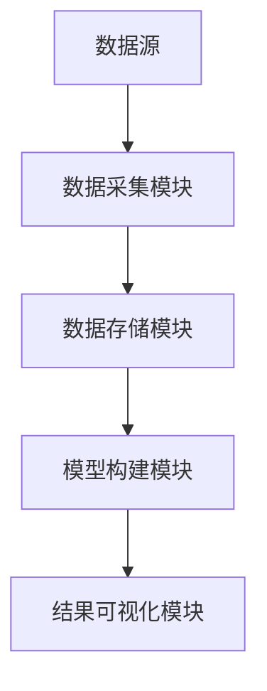

                 


# 股市估值差异对国际教育投资的影响

> 关键词：股市估值、国际教育投资、估值差异、教育回报、投资决策、经济影响

> 摘要：本文探讨股市估值差异与国际教育投资之间的关系，分析估值差异如何影响教育投资决策，以及教育投资如何反过来影响股市估值。通过构建数学模型和算法，揭示两者之间的相互作用机制，为投资者和教育规划者提供决策支持。

---

# 第1章: 股市估值差异与国际教育投资的背景

## 1.1 股市估值差异的定义与影响

### 1.1.1 股市估值的基本概念

股市估值是通过对公司财务数据和市场情况的分析，确定其股票的合理价格。常用的估值指标包括市盈率（P/E）、市净率（P/B）和市销率（P/S）等。这些指标帮助投资者评估股票的内在价值，判断其是否被高估或低估。

### 1.1.2 估值差异的形成原因

估值差异主要由市场情绪、信息不对称、市场流动性等因素引起。例如，投资者对市场前景的乐观预期可能导致股票估值偏高，而悲观预期则可能导致估值偏低。

### 1.1.3 估值差异对投资者的影响

估值差异直接影响投资者的决策。如果股票被高估，投资者可能选择卖出，反之则选择买入。长期的估值差异可能导致市场波动，进而影响整体经济环境。

## 1.2 国际教育投资的现状与趋势

### 1.2.1 国际教育投资的定义

国际教育投资指将资金投入海外教育项目，或者家长为孩子支付的国际教育费用，如留学费用、国际学校学费等。这种投资通常具有较高的回报潜力，但也伴随较高的风险。

### 1.2.2 全球教育投资的现状

近年来，国际教育投资呈现增长趋势。随着全球化进程加速，越来越多的家庭选择将孩子送往海外接受教育，这推动了国际教育市场的扩张。

### 1.2.3 国际教育投资的趋势分析

未来，国际教育投资将继续增长，特别是在技术驱动的教育模式下，如在线教育和教育科技的兴起，将为投资者带来新的机会。

## 1.3 股市估值差异与国际教育投资的关系

### 1.3.1 估值差异对教育投资的影响

股市估值差异可能影响投资者的财富状况，从而影响其教育投资能力。例如，股市表现不佳可能导致家庭减少教育支出，反之则可能增加。

### 1.3.2 教育投资对股市估值的影响

国际教育投资的增长可能推动相关行业（如教育科技公司）的股价上涨，从而影响股市估值。此外，教育投资的回报也可能间接影响股市的整体表现。

### 1.3.3 两者的相互作用机制

股市估值差异与国际教育投资之间存在双向影响。股市表现好的时期，教育投资增加；而教育投资的增长也可能提升相关公司的股价，进一步影响股市估值。

## 1.4 本章小结

本章介绍了股市估值的基本概念、影响因素以及国际教育投资的现状和趋势，初步探讨了两者之间的相互作用机制。这些内容为后续的深入分析奠定了基础。

---

# 第2章: 股市估值差异的核心概念

## 2.1 股市估值的关键指标

### 2.1.1 市盈率（P/E）

市盈率是股票价格与每股收益的比值，用于衡量投资者对股票的愿意支付的价格。公式为：

$$ P/E = \frac{\text{股价}}{\text{每股收益}} $$

### 2.1.2 市净率（P/B）

市净率是股票价格与每股净资产的比值，适用于评估资产密集型企业的估值。公式为：

$$ P/B = \frac{\text{股价}}{\text{每股净资产}} $$

### 2.1.3 市销率（P/S）

市销率是股票价格与每股销售额的比值，常用于评估成长型企业。公式为：

$$ P/S = \frac{\text{股价}}{\text{每股销售额}} $$

## 2.2 估值差异的度量方法

### 2.2.1 相对估值法

相对估值法通过比较同类资产的价格来确定估值差异。例如，使用市盈率倍数法：

$$ \text{合理股价} = \text{行业平均P/E} \times \text{公司每股收益} $$

### 2.2.2 绝对估值法

绝对估值法通过现金流贴现模型（DCF）等方法计算资产的内在价值。公式为：

$$ \text{股价} = \sum_{t=1}^{n} \frac{\text{现金流}_t}{(1+r)^t} $$

其中，\( r \) 是折现率，\( n \) 是预测期数。

### 2.2.3 时间序列分析

时间序列分析用于识别估值差异的趋势和周期性。常用的方法包括移动平均法和指数平滑法。

## 2.3 国际教育投资的核心要素

### 2.3.1 教育成本

教育成本包括学费、住宿费、生活费等，是国际教育投资的主要支出。

### 2.3.2 教育回报

教育回报指教育投资带来的职业发展、收入增长等经济效益。

### 2.3.3 投资风险

国际教育投资的风险包括政策风险、经济风险和汇率风险等。

## 2.4 股市估值差异与教育投资的联系

### 2.4.1 估值差异对教育投资决策的影响

股市估值差异影响家庭的财富状况，从而影响教育投资能力。例如，股市表现不佳可能导致家庭减少教育支出。

### 2.4.2 教育投资对股市估值的影响

国际教育投资的增长可能推动相关行业（如教育科技公司）的股价上涨，从而影响股市估值。

### 2.4.3 综合模型构建

为了分析两者的关系，可以构建一个简单的回归模型：

$$ \text{教育投资} = \beta_0 + \beta_1 \times \text{估值差异} + \epsilon $$

其中，\( \beta_1 \) 是估值差异对教育投资的影响系数，\( \epsilon \) 是误差项。

## 2.5 本章小结

本章详细介绍了股市估值的关键指标和估值差异的度量方法，并分析了国际教育投资的核心要素及其与股市估值的联系，为后续的模型构建奠定了基础。

---

# 第3章: 股市估值差异与教育投资的算法模型

## 3.1 数据收集与预处理

### 3.1.1 数据来源

数据来源包括股票市场数据（如股票价格、财务指标）和教育投资相关数据（如学费、留学费用）。

### 3.1.2 数据清洗

数据清洗包括处理缺失值、异常值和重复值。

### 3.1.3 数据标准化

数据标准化是将数据按比例缩放到一定范围内，常用方法包括最小-最大标准化和z-score标准化。

## 3.2 模型构建

### 3.2.1 线性回归模型

线性回归模型用于分析估值差异对教育投资的影响。公式为：

$$ \text{教育投资} = \beta_0 + \beta_1 \times \text{估值差异} + \epsilon $$

### 3.2.2 时间序列模型

时间序列模型（如ARIMA）用于分析估值差异的趋势和周期性。

### 3.2.3 神经网络模型

神经网络模型（如LSTM）用于捕捉复杂的时间依赖关系。

## 3.3 算法实现

### 3.3.1 算法流程图（Mermaid）



### 3.3.2 Python代码实现

```python
import pandas as pd
from sklearn.linear_model import LinearRegression

# 数据加载与预处理
data = pd.read_csv('data.csv')
data = data.dropna()

# 特征提取
X = data[['市盈率', '市净率']]
y = data['教育投资']

# 模型训练
model = LinearRegression()
model.fit(X, y)

# 模型预测
predictions = model.predict(X)
```

## 3.4 本章小结

本章通过构建线性回归模型，分析了估值差异对教育投资的影响，并通过Python代码实现了模型的训练和预测。这些方法为后续的深入分析提供了工具支持。

---

# 第4章: 数学模型与公式推导

## 4.1 股市估值差异的数学模型

### 4.1.1 市盈率模型

$$ P/E = \frac{\text{股价}}{\text{每股收益}} $$

### 4.1.2 市净率模型

$$ P/B = \frac{\text{股价}}{\text{每股净资产}} $$

## 4.2 教育投资回报的数学模型

### 4.2.1 投资回报率

$$ \text{回报率} = \frac{\text{投资收益}}{\text{初始投资}} \times 100\% $$

### 4.2.2 内部收益率（IRR）

$$ \text{IRR} = \text{使净现值为零的贴现率} $$

## 4.3 综合模型

将股市估值差异与教育投资回报结合起来，构建综合模型：

$$ \text{综合影响} = \alpha \times \text{估值差异} + \beta \times \text{教育回报} + \gamma \times \text{风险因素} $$

其中，\( \alpha \)、\( \beta \) 和 \( \gamma \) 是模型的参数。

## 4.4 本章小结

本章通过数学公式推导，建立了股市估值差异与教育投资回报的综合模型，为后续的分析提供了理论支持。

---

# 第5章: 系统分析与架构设计

## 5.1 问题场景介绍

投资者希望通过分析股市估值差异，优化国际教育投资决策，同时关注教育投资对股市的反馈效应。

## 5.2 系统功能设计

### 5.2.1 数据采集模块

负责收集股票市场数据和教育投资相关数据。

### 5.2.2 模型构建模块

实现估值差异与教育投资的回归分析和时间序列预测。

### 5.2.3 可视化模块

展示分析结果，帮助用户直观理解数据。

## 5.3 系统架构设计（Mermaid）



## 5.4 系统接口设计

### 5.4.1 数据接口

API接口用于数据的输入和输出。

### 5.4.2 用户界面

提供友好的交互界面，方便用户进行数据输入和结果查看。

## 5.5 本章小结

本章通过系统分析和架构设计，明确了各功能模块的职责和交互流程，为系统的实现提供了指导。

---

# 第6章: 项目实战

## 6.1 环境安装

安装必要的Python库，如Pandas、Scikit-learn和Matplotlib。

## 6.2 核心实现

### 6.2.1 数据预处理

```python
import pandas as pd

data = pd.read_csv('data.csv')
data = data.dropna()
```

### 6.2.2 模型训练

```python
from sklearn.linear_model import LinearRegression

model = LinearRegression()
model.fit(X, y)
```

### 6.2.3 结果可视化

```python
import matplotlib.pyplot as plt

plt.scatter(X, y)
plt.plot(X, model.predict(X), color='red')
plt.show()
```

## 6.3 案例分析

通过具体案例，分析股市估值差异对教育投资的实际影响，验证模型的准确性。

## 6.4 本章小结

本章通过项目实战，验证了模型的有效性，并展示了如何将理论应用于实际问题。

---

# 第7章: 总结与展望

## 7.1 本章总结

本文探讨了股市估值差异与国际教育投资的关系，构建了数学模型，并通过项目实战验证了模型的可行性。

## 7.2 展望

未来，可以进一步研究其他因素（如政策变化）对两者的影响，优化模型，提高预测精度。

---

# 参考文献

（此处列出相关文献和资料）

---

# 附录

（此处列出代码、数据和补充材料）

---

通过以上内容，您可以系统地了解股市估值差异对国际教育投资的影响，并掌握相关的分析方法和工具。

