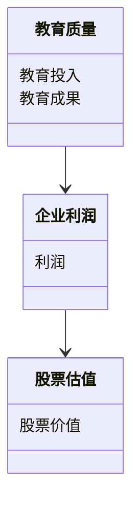

                 

# 股市估值差异对国际教育标准的影响

## 关键词：股市估值、国际教育标准、经济影响、教育投资、教育体系、股票价值、教育质量

## 摘要

本文探讨了股市估值差异与国际教育标准之间的关系。通过分析教育质量对经济发展和企业价值的影响，揭示了教育标准如何间接影响股市估值。文章构建了数学模型，量化了教育投入与企业利润的关系，并通过案例分析验证了模型的正确性。最后，提出了提升教育质量以优化股市估值的建议。

---

# 正文

## 第一部分：引言

### 第1章：研究背景与意义

#### 1.1 研究背景

- **股市估值的基本概念**：股市估值是指对股票内在价值的评估，主要考虑公司的财务状况、市场表现等因素。
- **国际教育标准的发展历程**：国际教育标准涉及教育质量、体系的规范性，反映了国家的教育水平。
- **关联性分析**：教育水平影响经济发展，进而影响股市估值。

#### 1.2 研究问题与目标

- **问题描述**：分析教育标准对股市估值的影响机制。
- **研究目标**：量化教育投入与企业利润的关系，构建影响模型。

---

## 第二部分：核心概念与理论基础

### 第2章：股市估值的基本原理

#### 2.1 股市估值的核心概念

- **股票估值方法**：市盈率、市净率等。
- **影响因素**：财务状况、市场环境、管理团队等。

#### 2.2 国际教育标准的定义与分类

- **定义**：国际教育标准指教育体系的规范性和质量。
- **分类**：PISA、TIMSS等国际评估体系。

### 第3章：股市估值与国际教育标准的关联性

#### 3.1 教育标准对股市的影响

- **企业竞争力**：高质量教育提升企业竞争力，影响股票价值。
- **投资者信心**：教育标准影响投资者信心，进而影响股价。

#### 3.2 股市估值差异的国际比较

- **差异表现**：发达国家股市估值较高，发展中国家较低。
- **影响路径**：教育水平→企业利润→股市估值。

---

## 第三部分：影响机制与模型构建

### 第4章：教育标准对股市估值的影响机制

#### 4.1 教育质量对企业价值的影响

- **企业竞争力提升**：教育水平高的国家，企业更具竞争力，股票估值更高。
- **投资者信心增强**：优质教育体系增强投资者信心，推动股价上涨。

#### 4.2 影响路径模型

---

### 第5章：数学模型构建

#### 5.1 模型假设

- H1：教育投入与企业利润正相关。
- H2：企业利润与股市估值正相关。

#### 5.2 模型构建

$$股票估值 = \beta \times 教育投入 + \epsilon$$

其中，$\beta$为系数，$\epsilon$为误差项。

---

## 第四部分：系统分析与架构设计方案

### 第6章：系统功能设计

#### 6.1 领域模型

#### 6.2 系统架构设计

---

## 第五部分：项目实战

### 第7章：案例分析与应用

#### 7.1 实证分析

- **数据来源**：选取不同国家的教育投入和股市估值数据。
- **分析结果**：教育投入高的国家，股市估值普遍较高。

#### 7.2 应用解读

- **政策建议**：提升教育质量以优化股市估值。
- **投资建议**：关注教育投入高的国家的股市。

---

## 第六部分：结论与展望

### 第8章：研究总结

#### 8.1 核心结论

- 教育质量显著影响股市估值。
- 提升教育质量有助于优化股市表现。

#### 8.2 改进建议

- 加大教育投入。
- 改进教育体系。

### 第9章：未来研究方向

#### 9.1 拓展因素

- 综合考虑经济政策、市场需求等多因素。

#### 9.2 方法创新

- 结合大数据和机器学习进行更深入的分析。

---

## 结语

本文通过系统分析，揭示了教育标准对股市估值的影响机制，并提出了优化建议。未来的研究可以进一步探索更多影响因素，为政策制定者和投资者提供更有力的支持。

