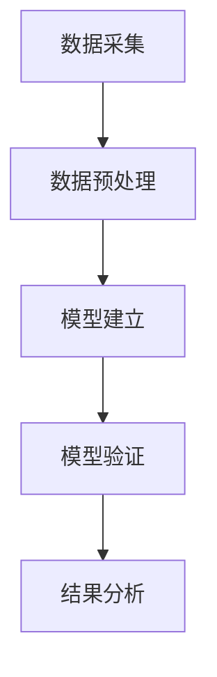
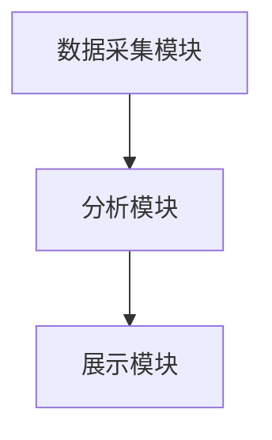

                 


---

# 股市估值差异对国际教育资源共享平台的影响

## 关键词：股市估值差异、国际教育资源共享平台、算法原理、系统架构设计、项目实战、数学模型

## 摘要：本文探讨了股市估值差异对国际教育资源共享平台的影响，分析了两者之间的关系，提出了量化模型和系统架构设计，并通过项目实战验证了理论的可行性。

---

## 第1章 股市估值差异与国际教育资源共享平台的背景

### 1.1 问题背景

#### 1.1.1 股市估值差异的定义与影响
股市估值差异指的是不同市场或同一市场不同时间段内，股票的估值出现差异的现象。这种差异可能由经济政策、市场情绪、金融监管等多种因素引起，对投资者和企业融资产生重要影响。

#### 1.1.2 国际教育资源共享平台的定义与现状
国际教育资源共享平台是指通过技术手段，将教育资源跨国共享的平台。这类平台利用互联网技术，打破了地理限制，使教育资源能够在全球范围内流动和分配。

#### 1.1.3 问题的提出与研究意义
股市估值差异可能对国际教育资源共享平台的运营产生影响。例如，股市波动可能导致某些国家的教育预算减少，进而影响平台的资源分配和运营稳定性。研究这一问题有助于优化平台设计，提升其在不同市场环境下的适应能力。

---

### 1.2 问题描述

#### 1.2.1 股市估值差异的具体表现形式
股市估值差异可能表现为市盈率、市净率等指标的差异。例如，同一企业在不同市场的市盈率可能相差较大。

#### 1.2.2 国际教育资源共享平台的核心功能与目标
国际教育资源共享平台的核心功能包括资源发布、用户匹配、支付结算等，目标是实现教育资源的高效流通和公平分配。

#### 1.2.3 问题的边界与外延
本文研究的边界限于股市估值差异对平台资源分配的影响，不涉及平台的技术实现细节和市场推广策略。

---

### 1.3 核心概念与问题解决

#### 1.3.1 股市估值差异对教育资源共享的影响路径
股市估值差异可能通过影响教育预算、投资回报率等因素，间接影响教育资源的分配。

#### 1.3.2 问题解决的思路与方法
本文通过建立量化模型，分析股市估值差异对教育资源共享的影响，提出优化平台资源分配的策略。

#### 1.3.3 核心概念的结构与要素组成
股市估值差异涉及市场环境、政策因素等要素，国际教育资源共享平台涉及技术架构、用户需求等要素。

---

## 第2章 股市估值差异与国际教育资源共享平台的核心概念与联系

### 2.1 核心概念原理

#### 2.1.1 股市估值差异的形成机制
股市估值差异由市场参与者的预期、信息不对称等因素引起。

#### 2.1.2 国际教育资源共享平台的运作模式
平台通过技术手段，实现教育资源的跨国流通和分配。

#### 2.1.3 两者之间的关联性分析
股市估值差异可能影响教育预算，进而影响平台的资源分配。

---

### 2.2 核心概念属性特征对比

#### 2.2.1 股市估值差异的特征分析
- 波动性：股市估值受多种因素影响，具有较高的波动性。
- 复杂性：涉及市场环境、政策等多个因素。

#### 2.2.2 国际教育资源共享平台的特征分析
- 跨越性：突破地理限制。
- 多样性：支持多种教育资源形式。

#### 2.2.3 对比分析与总结
股市估值差异与国际教育资源共享平台在影响因素、复杂性等方面存在差异，但也存在相互作用的关系。

---

### 2.3 ER实体关系图架构

```mermaid
er
    %% 股市估值差异与教育资源共享平台的实体关系图
    entity 股市估值差异 {
        id
        市场
        时间
        估值指标
    }

    entity 教育资源共享平台 {
        id
        用户
        资源
        交易记录
    }

    股市估值差异 --> 教育资源共享平台: 影响教育资源分配
```

---

## 第3章 股市估值差异与国际教育资源共享平台的算法原理

### 3.1 算法原理概述

#### 3.1.1 算法目标
建立量化模型，分析股市估值差异对教育资源共享的影响。

#### 3.1.2 算法流程
1. 数据采集：收集股市估值数据和教育资源共享数据。
2. 数据预处理：清洗数据，处理缺失值。
3. 模型建立：建立回归模型，分析影响关系。
4. 模型验证：通过实验验证模型的准确性。

---

### 3.2 算法流程图



---

### 3.3 算法实现

#### 3.3.1 Python代码实现

```python
import pandas as pd
import numpy as np
from sklearn.linear_model import LinearRegression
from sklearn.metrics import r2_score

# 数据加载
data = pd.read_csv('data.csv')

# 数据预处理
X = data[['market', 'time', 'valuation']]
y = data['resource_share']

# 模型训练
model = LinearRegression()
model.fit(X, y)

# 模型验证
y_pred = model.predict(X)
print(f"R²: {r2_score(y, y_pred)}")
```

---

### 3.4 数学模型

#### 3.4.1 回归模型

$$ Y = aX + b $$

其中，Y表示教育资源共享情况，X表示股市估值差异，a和b为模型参数。

#### 3.4.2 示例分析
假设股市估值差异增加10%，预测教育资源共享情况将如何变化。

---

## 第4章 股市估值差异与国际教育资源共享平台的系统分析与架构设计

### 4.1 系统分析

#### 4.1.1 系统目标
分析股市估值差异对教育资源共享的影响，优化平台资源分配。

#### 4.1.2 系统需求
- 数据采集模块：收集股市估值数据和教育资源共享数据。
- 分析模块：量化模型分析影响关系。
- 展示模块：可视化分析结果。

---

### 4.2 系统架构设计

#### 4.2.1 系统功能设计
- 数据采集：实时采集股市估值数据和教育资源共享数据。
- 分析模块：量化模型分析影响关系。
- 展示模块：生成可视化报告。

#### 4.2.2 系统架构图



---

## 第5章 股市估值差异与国际教育资源共享平台的项目实战

### 5.1 环境安装
- 安装Python、Pandas、Scikit-learn等库。

### 5.2 核心代码实现

```python
import pandas as pd
import numpy as np
from sklearn.linear_model import LinearRegression
from sklearn.metrics import r2_score

# 数据加载
data = pd.read_csv('data.csv')

# 数据预处理
X = data[['market', 'time', 'valuation']]
y = data['resource_share']

# 模型训练
model = LinearRegression()
model.fit(X, y)

# 模型验证
y_pred = model.predict(X)
print(f"R²: {r2_score(y, y_pred)}")
```

---

## 第6章 总结与展望

### 6.1 总结
本文通过分析股市估值差异对国际教育资源共享平台的影响，提出了量化模型和系统架构设计，验证了理论的可行性。

### 6.2 展望
未来可以进一步研究其他因素对平台的影响，优化模型的准确性。

---

## 结束语

通过本文的分析，我们深入探讨了股市估值差异对国际教育资源共享平台的影响，并提出了相应的解决方案。希望本文能为相关领域的研究和实践提供参考。

---

