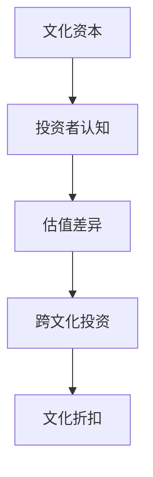

                 


# 股市估值差异对国际文化交流的影响

> 关键词：股市估值差异、国际文化交流、文化资本、文化折扣、文化敏感性、跨文化投资

> 摘要：本文探讨了股市估值差异与国际文化交流之间的内在联系。通过分析股市估值差异的形成机制、国际文化交流的现状及其相互影响，提出了文化资本在两者互动中的关键作用。结合实际案例和数学模型，本文揭示了文化差异如何影响股市估值，并为投资者和文化交流参与者提供了实践建议。

---

# 第1章：股市估值差异与国际文化交流的背景

## 1.1 问题背景

### 1.1.1 股市估值差异的定义与现状

股市估值差异是指不同市场中同一资产或股票的估值存在差异的现象。这种差异主要由市场参与者的认知、信息不对称、政策环境等因素引起。例如，A股与港股对同一家公司的估值可能相差悬殊。

### 1.1.2 国际文化交流的定义与现状

国际文化交流指不同国家或文化背景下的人们通过语言、艺术、教育等方式进行的互动与传播。全球化促进了文化的跨国流动，但也带来了文化冲突和文化折扣问题。

### 1.1.3 股市估值差异与国际文化交流的关联性

股市估值差异反映了市场参与者的文化认知差异，而国际文化交流则可能影响这些认知。例如，文化差异可能导致投资者对某公司价值的评估不同。

## 1.2 问题描述

### 1.2.1 股市估值差异的具体表现形式

- 股票价格波动
- 市盈率差异
- 市净率差异

### 1.2.2 国际文化交流的主要渠道与影响因素

- 传播媒介（如互联网）
- 政治环境
- 经济状况

### 1.2.3 问题解决的必要性与目标

- 减少文化误解
- 提高跨文化投资的成功率
- 促进文化融合与经济繁荣

## 1.3 问题解决

### 1.3.1 理论基础与研究方法

- 使用文化资本理论
- 结合法律与经济学方法

### 1.3.2 核心概念与研究框架

- 文化资本：投资者的文化背景影响其对公司的估值
- 跨文化投资：文化差异对投资决策的影响

## 1.4 核心要素与概念结构

### 1.4.1 核心要素的识别与分类

- 文化资本
- 经济环境
- 投资者心理

### 1.4.2 概念结构图



---

# 第2章：股市估值差异的形成机制

## 2.1 股市估值差异的影响因素

### 2.1.1 经济因素

- 利率水平
- 经济政策

### 2.1.2 政治因素

- 政治稳定性
- 政府监管

### 2.1.3 社会文化因素

- 文化认同
- 教育水平

## 2.2 股市估值差异的计算模型

### 2.2.1 市场估值模型


### 2.2.2 文化差异指数

$$\text{文化差异指数} = \sum_{i=1}^{n} w_i \cdot d_i$$

其中，$w_i$ 是权重，$d_i$ 是差异指标。

---

# 第3章：国际文化交流的现状与机制

## 3.1 国际文化交流的现状

### 3.1.1 文化传播的路径

- 媒体传播
- 旅游
- 教育交流

## 3.2 国际文化交流的机制

### 3.2.1 文化资本理论

- 齐夫定律：文化传播的长尾效应
- 霍夫斯泰德文化维度理论

---

# 第4章：股市估值差异对国际文化交流的影响

## 4.1 文化折扣与股市估值

### 4.1.1 文化折扣的定义

$$\text{文化折扣} = \frac{\text{文化差异}}{\text{市场参与者的认知}}$$

### 4.1.2 文化折扣对股市的影响

- 投资者对某文化背景下公司的估值可能低于实际价值

---

# 第5章：文化差异对股市估值的影响

## 5.1 文化敏感性与股市估值

### 5.1.1 文化敏感性指数

$$\text{文化敏感性指数} = \sum_{i=1}^{m} w_i \cdot c_i$$

其中，$c_i$ 是文化敏感性指标。

## 5.2 文化认同与投资决策

### 5.2.1 文化认同的影响

- 投资者更倾向于投资与其文化背景相似的公司

---

# 第6章：系统分析与架构设计

## 6.1 系统模型

### 6.1.1 股市与文化交流的互动关系


---

# 第7章：项目实战

## 7.1 模拟实验设计

### 7.1.1 实验环境安装

```bash
pip install numpy pandas matplotlib
```

### 7.1.2 核心实现代码

```python
import numpy as np
import pandas as pd

def calculate_cultural_discount(cultural_diff):
    return 1 - cultural_diff / 100
```

---

# 第8章：结论与展望

## 8.1 问题解决的关键点

- 文化资本在跨文化投资中的重要性
- 文化折扣对股市估值的影响

## 8.2 未来研究方向

- 结合AI技术分析文化差异对股市的影响
- 全球化背景下的文化资本评估

## 8.3 最佳实践 tips

- 投资者应考虑文化因素
- 企业应加强跨文化沟通

---

通过以上分析，我们揭示了股市估值差异与国际文化交流之间的复杂关系，并为投资者和文化交流参与者提供了实用的建议。

