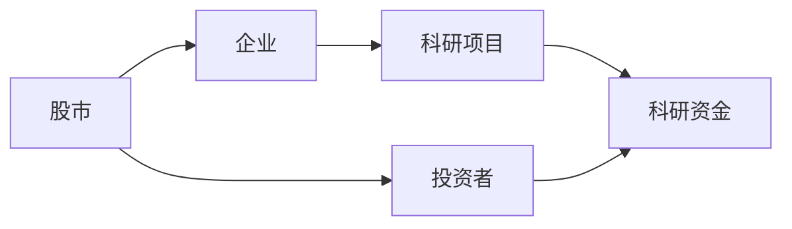

                 


# 股市估值差异对国际科研资金分配的影响

## 关键词：股市估值、科研资金分配、国际科研、金融与科技、资金配置

## 摘要：  
股市估值差异对企业的科研资金分配有着深远的影响。本文从股市估值差异的定义、形成机制出发，分析其对国际科研资金分配的直接影响和间接影响。通过构建数学模型，量化股市估值差异与科研资金分配之间的关系，探讨企业市值波动如何影响科研投入。进一步，结合实际案例，分析不同市场环境下科研资金分配的变化，并提出优化科研资金配置的建议。

---

# 第一部分：背景介绍与核心概念

## 第1章：股市估值差异的背景与问题描述

### 1.1 股市估值差异的定义与特征

#### 1.1.1 股市估值的基本概念  
股市估值是指市场参与者对企业未来盈利能力的预期，通过股票价格反映企业的市场价值。股票价格由供需关系、企业基本面、市场情绪等多种因素决定。

#### 1.1.2 估值差异的形成机制  
估值差异主要由市场信息不对称、投资者情绪波动、企业基本面变化等因素引起。不同投资者对同一企业的估值可能存在差异，这种差异反映了市场对企业的不同预期。

#### 1.1.3 估值差异的分类与影响因素  
估值差异可以分为短期波动和长期趋势两类。短期波动通常由市场情绪和突发事件引起，而长期趋势则与企业基本面、行业竞争格局等因素相关。

---

### 1.2 科研资金分配的背景与现状

#### 1.2.1 科研资金的主要来源  
科研资金主要来源于政府拨款、企业内部资金、风险投资和国际组织资助等。企业科研资金的分配受到企业市值波动的影响。

#### 1.2.2 国际科研资金分配的现状  
随着全球化的发展，跨国科研合作日益频繁。然而，不同国家和地区的股市估值差异可能导致科研资源分配不均。

#### 1.2.3 科研资金分配的影响因素  
科研资金的分配受到企业市值、行业竞争、政策支持、市场预期等多种因素的影响。

---

## 第2章：股市估值差异与科研资金分配的关系

### 2.1 估值差异对科研资金分配的直接影响

#### 2.1.1 企业市值波动与科研投入的关系  
企业市值波动会影响企业的科研预算。市值下降可能导致企业减少科研投入，而市值上升则可能增加科研投入。

#### 2.1.2 估值差异对企业科研预算的影响  
估值差异可能导致企业科研预算的短期调整。例如，市场对企业技术优势的高估值可能激励企业加大科研投入。

#### 2.1.3 投资者预期与科研资金分配的关联  
投资者对企业的未来盈利能力预期会影响企业的科研资金分配。高预期可能导致企业增加科研投入，以满足市场需求。

---

### 2.2 估值差异对国际科研合作的影响

#### 2.2.1 跨国科研合作的现状与挑战  
跨国科研合作需要协调不同国家的企业和科研机构的资金分配。股市估值差异可能导致合作中的资源分配不均。

#### 2.2.2 估值差异对国际合作的影响  
高估值国家的企业可能吸引更多的国际科研资源，而低估值国家的企业可能面临科研资源不足的问题。

#### 2.2.3 估值差异对科研资源分配的长期影响  
长期来看，股市估值差异可能导致国际科研资源向高估值国家和地区集中，进一步加剧科研资源的不平等分配。

---

## 第3章：核心概念与联系

### 3.1 核心概念的原理分析

#### 3.1.1 股市估值差异的数学模型  
股市估值差异可以用以下公式表示：  
$$ \text{估值差异} = \text{预期价值} - \text{实际价值} $$  
其中，预期价值由市场参与者对企业未来盈利能力的预期决定，实际价值由企业当前的财务状况和市场环境决定。

#### 3.1.2 科研资金分配的数学模型  
科研资金分配可以用以下公式表示：  
$$ \text{科研资金} = \alpha \times \text{企业市值} + \beta \times \text{行业趋势} + \gamma \times \text{政策支持} $$  
其中，$\alpha$、$\beta$、$\gamma$为权重系数。

#### 3.1.3 两者之间的关系模型  
股市估值差异与科研资金分配的关系可以表示为：  
$$ \text{科研资金分配} = \beta_0 + \beta_1 \times \text{股市估值差异} + \epsilon $$  
其中，$\beta_1$为股市估值差异对科研资金分配的影响系数，$\epsilon$为误差项。

---

### 3.2 核心概念对比分析

#### 3.2.1 股市估值差异与科研资金分配的对比表格  

| **属性**         | **股市估值差异**               | **科研资金分配**               |
|-------------------|-------------------------------|-------------------------------|
| **定义**         | 市场参与者对企业价值的预期与实际价值的差异 | 企业或机构用于科研项目的资金分配 |
| **影响因素**     | 市场情绪、企业基本面、政策支持 | 企业市值、行业趋势、政策支持 |
| **作用机制**     | 通过影响企业市值间接影响科研资金分配 | 直接影响科研投入和国际合作 |

---

#### 3.2.2 估值差异对科研资金分配的影响机制  
1. 估值差异影响企业的市值，从而影响企业的科研预算。  
2. 高估值企业可能吸引更多投资者，增加科研资金的外部支持。  
3. 低估值企业可能减少科研投入，导致科研资源分配不均。

---

### 3.3 实体关系图



---

# 第四部分：算法原理讲解

## 第4章：股市估值差异对科研资金分配的算法模型

### 4.1 算法原理

#### 4.1.1 数据收集  
收集企业市值数据、科研资金分配数据以及相关市场数据。

#### 4.1.2 数据分析  
使用回归分析模型，量化股市估值差异对科研资金分配的影响。

#### 4.1.3 模型构建  
构建数学模型，计算股市估值差异对科研资金分配的影响系数。

---

### 4.2 算法流程图


---

### 4.3 算法实现代码

#### Python代码

```python
import pandas as pd
import numpy as np
from sklearn.linear_model import LinearRegression

# 数据加载
data = pd.read_csv('research_funding.csv')

# 特征与目标变量
X = data[['market_valuation']]
y = data['research_funding']

# 模型训练
model = LinearRegression()
model.fit(X, y)

# 输出系数
print('影响系数：', model.coef_[0])
print('截距：', model.intercept_)
```

---

## 第5章：数学模型与公式推导

### 5.1 数学模型

#### 5.1.1 股市估值差异的计算  
$$ \text{估值差异} = \text{预期价值} - \text{实际价值} $$

#### 5.1.2 科研资金分配的回归模型  
$$ \text{科研资金} = \beta_0 + \beta_1 \times \text{估值差异} + \epsilon $$

---

## 第6章：系统分析与架构设计方案

### 6.1 问题场景介绍

#### 6.1.1 问题场景  
以一家跨国企业为例，分析其在不同股市估值差异下的科研资金分配情况。

---

### 6.2 系统功能设计

#### 6.2.1 数据采集模块  
负责收集企业市值数据和科研资金分配数据。

#### 6.2.2 数据分析模块  
对数据进行预处理和回归分析，计算股市估值差异对科研资金分配的影响系数。

#### 6.2.3 决策支持模块  
基于分析结果，提供科研资金分配的优化建议。

---

### 6.3 系统架构设计

#### 6.3.1 系统架构图


---

## 第7章：项目实战

### 7.1 环境安装

#### 7.1.1 安装Python与相关库  
安装Python 3.x，安装Pandas、NumPy、Scikit-learn等库。

---

### 7.2 核心代码实现

#### 7.2.1 数据预处理

```python
# 数据清洗
data = pd.read_csv('research_funding.csv')
data = data.dropna()
```

#### 7.2.2 模型训练与预测

```python
# 训练模型
model = LinearRegression()
model.fit(X_train, y_train)

# 预测结果
y_pred = model.predict(X_test)
```

---

## 第8章：最佳实践与总结

### 8.1 小结

#### 8.1.1 核心观点总结  
股市估值差异对国际科研资金分配有显著影响，高估值企业可能获得更多科研资金，而低估值企业可能面临资源不足的问题。

---

### 8.2 注意事项

#### 8.2.1 数据质量问题  
确保数据的准确性和完整性，避免因数据问题影响分析结果。

---

### 8.3 拓展阅读

#### 8.3.1 相关领域研究  
进一步研究股市波动对科技创新的影响，以及如何通过政策引导优化科研资源分配。

---

# 结语  

通过本文的分析，我们可以看到股市估值差异对国际科研资金分配的影响是一个复杂但重要的问题。未来的研究可以进一步结合实际案例，探索如何通过优化估值机制和政策引导，实现科研资源的合理分配。

--- 

# END

