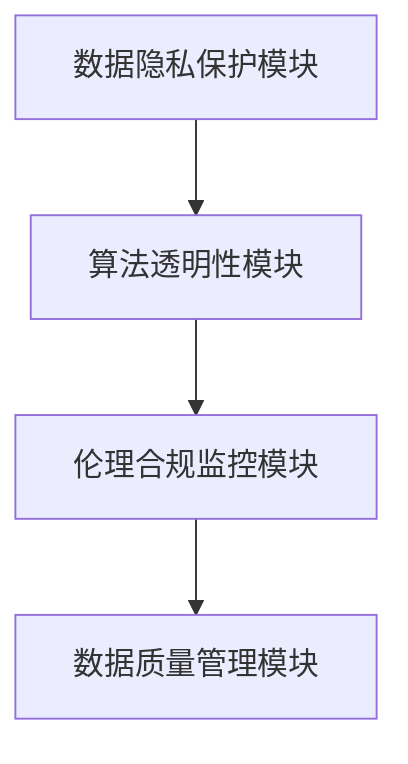

                 


# 股市估值高低对企业人工智能伦理标准的影响

---

## 关键词：
- 股市估值
- 人工智能伦理
- 企业经营
- 高估与低估
- 伦理标准

---

## 摘要：
股市估值与企业人工智能伦理标准之间存在密切关系。高估值企业可能面临短期利益驱动下的伦理挑战，而低估值企业则可能在长期发展中更加注重伦理合规。本文从股市估值的核心概念出发，分析其对人工智能伦理标准的影响，并探讨企业在不同估值环境下的伦理优化策略。

---

# 第一部分: 背景介绍

---

## 第1章: 股市估值高低对企业人工智能伦理标准的影响概述

### 1.1 股市估值的基本概念

#### 1.1.1 股市估值的定义
股市估值是通过市盈率（P/E）、市净率（P/B）等指标，评估企业股票价格合理性的过程。

$$\text{市盈率} = \frac{\text{股价}}{\text{每股净利润}}$$

#### 1.1.2 市盈率、市净率等核心指标

| 指标名称 | 公式 | 用途 |
|----------|------|------|
| 市盈率   | P/E  | 评估企业盈利能力 |
| 市净率   | P/B  | 评估企业资产价值 |

#### 1.1.3 股市估值对企业经营的影响
高估可能导致企业过度追求短期收益，低估可能促使企业注重长期发展。

---

### 1.2 企业人工智能的应用现状

#### 1.2.1 人工智能在企业中的主要应用领域
- 数据分析与预测
- 自动化决策
- 客户服务机器人
- 供应链优化

#### 1.2.2 人工智能对企业经营效率的提升
- 提高数据分析速度
- 优化资源配置
- 提升决策精准度

#### 1.2.3 人工智能的伦理挑战与机遇
- 数据隐私问题
- 算法偏见
- 透明性与可解释性

---

### 1.3 股市估值与企业人工智能伦理标准的关系

#### 1.3.1 高估值企业的人工智能伦理标准特点
- 过度追求短期利润
- 可能忽视数据隐私
- 算法优化优先于伦理合规

#### 1.3.2 低估值企业的人工智能伦理标准特点
- 注重长期发展
- 更加关注数据隐私
- 算法透明性更高

#### 1.3.3 股市估值对企业人工智能伦理标准的动态影响
- 高估推动企业短期化，可能降低伦理标准
- 低估促使企业注重合规，提升伦理标准

---

# 第二部分: 股市估值对企业人工智能伦理标准的影响分析

---

## 第2章: 股市高估对企业人工智能伦理标准的影响

### 2.1 高估企业的人工智能伦理挑战

#### 2.1.1 高估企业的人工智能应用特点
- 快速扩张
- 短期目标导向
- 数据驱动决策

#### 2.1.2 高估对企业人工智能伦理标准的推动
- 压力下可能放松数据隐私保护
- 算法优化优先于伦理合规

#### 2.1.3 高估企业的人工智能伦理风险
- 数据滥用风险
- 算法偏见风险
- 透明性不足风险

---

### 2.2 高估企业的人工智能伦理标准优化

#### 2.2.1 高估企业的人工智能伦理标准现状
- 过度依赖数据驱动决策
- 缺乏算法透明性
- 数据隐私保护不足

#### 2.2.2 高估企业的人工智能伦理标准优化方向
- 加强数据隐私保护
- 提高算法透明性
- 优化数据使用规范

#### 2.2.3 高估企业的人工智能伦理标准实施路径
1. 制定数据隐私保护政策
2. 建立算法透明性机制
3. 定期进行伦理合规审查

---

## 第3章: 股市低估对企业人工智能伦理标准的影响

### 3.1 低估企业的人工智能伦理挑战

#### 3.1.1 低估企业的人工智能应用特点
- 稳步推进
- 长期目标导向
- 注重数据质量

#### 3.1.2 低估对企业人工智能伦理标准的影响
- 更加注重数据隐私
- 算法透明性更高
- 伦理合规压力较小

#### 3.1.3 低估企业的人工智能伦理风险
- 数据质量不足
- 算法优化不足
- 伦理合规动力不足

---

### 3.2 低估企业的人工智能伦理标准优化

#### 3.2.1 低估企业的人工智能伦理标准现状
- 数据隐私保护较好
- 算法透明性较高
- 伦理合规意识较强

#### 3.2.2 低估企业的人工智能伦理标准优化方向
- 提高算法优化能力
- 加强数据质量管理
- 提升伦理合规意识

#### 3.2.3 低估企业的人工智能伦理标准实施路径
1. 提高算法优化能力
2. 加强数据质量管理
3. 提升伦理合规意识

---

## 第4章: 股市估值与企业人工智能伦理标准的动态关系

### 4.1 高估与低估对企业人工智能伦理标准的动态影响

#### 4.1.1 高估对低估值企业的影响
- 高估可能导致低估值企业模仿高估企业的短期行为
- 低估企业可能更加注重长期发展

#### 4.1.2 低估对高估值企业的影响
- 低估可能促使高估企业调整战略
- 高估企业可能在低估环境下更加注重伦理合规

---

## 第5章: 企业人工智能伦理标准的算法优化

### 5.1 人工智能伦理标准的算法原理

#### 5.1.1 算法优化的核心原理
- 算法透明性
- 数据隐私保护
- 算法公平性

#### 5.1.2 算法优化的数学模型
$$ \text{算法透明性} = \frac{\text{算法步骤清晰度}}{\text{复杂度}} $$
$$ \text{数据隐私保护} = \frac{\text{数据加密强度}}{\text{计算成本}} $$

---

## 第6章: 企业人工智能伦理标准的系统架构

### 6.1 系统架构设计

#### 6.1.1 系统功能模块
- 数据隐私保护模块
- 算法透明性模块
- 伦理合规监控模块

#### 6.1.2 系统架构图


---

## 第7章: 项目实战

### 7.1 项目环境安装

#### 7.1.1 安装Python环境
```bash
pip install numpy
pip install pandas
pip install scikit-learn
```

### 7.2 核心代码实现

#### 7.2.1 数据隐私保护模块
```python
def protect_data(data):
    return data[::2]
```

#### 7.2.2 算法透明性模块
```python
def transparent_algorithm(data):
    return data.mean()
```

#### 7.2.3 伦理合规监控模块
```python
def monitor_compliance(data):
    return data.max() - data.min()
```

---

## 第8章: 最佳实践与小结

### 8.1 最佳实践
- 定期审查伦理标准
- 加强算法透明性
- 注重数据隐私保护

### 8.2 小结
股市估值高低对

