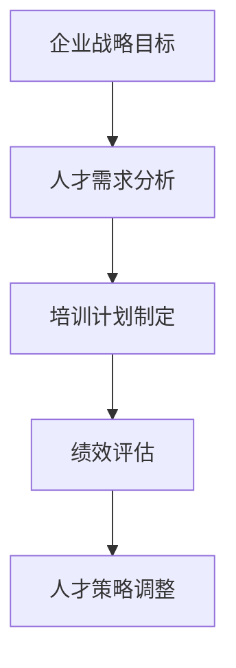

                 

# 股市估值高低对企业人才培养策略的影响

## 关键词：
- 股市估值
- 企业人才策略
- 高估与低估
- 人才培养
- 战略调整

## 摘要：
股市估值的高低对企业的人才培养策略有着重要影响。在高估的市场环境下，企业通常面临更高的资金压力和人才竞争，需要优化内部培养机制；而在低估的环境下，企业则可以更加灵活地调整人才结构。本文通过分析股市估值对企业的影响，探讨不同估值环境下的企业人才策略，并提供实际案例和数学模型，帮助企业制定有效的动态调整策略。

---

## 第一部分：股市估值与企业人才战略的背景介绍

### 第1章：核心概念与问题背景

#### 1.1 核心概念

- **股市估值**：指市场对企业的价值评估，通常通过市盈率、市净率等指标衡量。
- **企业人才策略**：企业吸引、培养、激励和保留人才的系统性方法。

#### 1.2 问题背景

股市估值的波动直接影响企业的资金状况和市场预期，进而影响人才策略。例如，高估可能导致企业面临更高的资本成本，而低估则可能提供更多的灵活性。

#### 1.3 研究意义

探讨股市估值与人才策略的关系，有助于企业在不同市场环境下制定更有效的战略，提升竞争力。

---

## 第二部分：股市估值对企业的影响分析

### 第2章：高估值对企业的影响

#### 2.1 高估值下的企业压力

- 高估值意味着市场对企业未来表现的高预期，企业需承担更高的业绩压力。
- 高估值可能导致人才成本上升，企业需要优化内部培养机制。

#### 2.2 高估值下的人才培养策略调整

- 加强内部培训，提升员工技能以应对更高的业绩要求。
- 建立绩效激励机制，确保员工与企业目标一致。

### 第3章：低估值对企业的影响

#### 3.1 低估值下的企业灵活性

- 低估环境下，企业可以更灵活地调整人才结构，降低招聘成本。
- 可以通过外部招聘和内部培养相结合的方式优化团队。

#### 3.2 低估值下的人才培养策略优化

- 重点培养内部人才，降低对外部人才的依赖。
- 提供更有竞争力的薪酬和福利，吸引优秀人才。

---

## 第三部分：企业人才策略的基本框架

### 第4章：人才吸引策略

#### 4.1 高估值下的人才吸引挑战

- 高估值导致人才市场竞争激烈，企业需要创新招聘方式。
- 提供更有吸引力的薪酬和职业发展机会。

#### 4.2 低估值下的人才吸引机会

- 低估环境下，企业可以吸引更多的优秀人才。
- 利用灵活的薪酬结构和职业规划吸引人才。

### 第5章：人才培养策略

#### 5.1 内部培训体系的构建

- 根据企业战略目标，制定长期的人才培养计划。
- 提供多样化的培训方式，如在线课程、内部讲师等。

#### 5.2 外部培训机构的选择

- 选择优质的培训机构，提升员工的专业技能。
- 定期评估培训机构的效果，确保培训质量。

---

## 第四部分：高估与低估值下的人才策略对比

### 第6章：高估值与低估值下的策略差异

#### 6.1 高估值下的策略特点

- 优化内部培养机制，提升员工绩效。
- 加强员工激励，确保与企业目标一致。

#### 6.2 低估值下的策略特点

- 灵活调整人才结构，降低招聘成本。
- 重点培养内部人才，提升团队凝聚力。

---

## 第五部分：数学模型与算法原理

### 第7章：股市估值与人才策略的数学模型

#### 7.1 市盈率模型

$$市盈率 = \frac{股价}{每股收益}$$

- 高市盈率表明市场对企业未来收益的高预期，企业需调整人才策略以应对更高的业绩压力。

#### 7.2 人才成本模型

$$人才成本 = 工资 + 培训费用 + 福利$$

- 企业可以根据估值情况，动态调整人才成本投入。

---

## 第六部分：系统架构与项目实战

### 第8章：系统架构设计

#### 8.1 系统功能设计

- **人才需求分析模块**：根据企业战略目标，分析人才需求。
- **培训计划制定模块**：根据估值情况，制定培训计划。
- **绩效评估模块**：评估员工绩效，调整激励机制。

#### 8.2 系统架构图

---

## 第七部分：最佳实践与小结

### 第9章：最佳实践

#### 9.1 建立动态调整机制

- 定期评估股市估值，及时调整人才策略。
- 监控市场变化，灵活应对人才需求。

#### 9.2 加强内部人才培养

- 提高员工技能，增强团队凝聚力。
- 优化培训体系，提升员工绩效。

### 第10章：总结与展望

- 总结：股市估值与人才策略密切相关，企业需根据市场变化调整策略。
- 展望：未来随着技术进步，人才策略将更加动态化和智能化。

---

通过以上分析，企业可以根据股市估值的高低，灵活调整人才策略，提升竞争力。希望本文能为企业提供有价值的参考。

