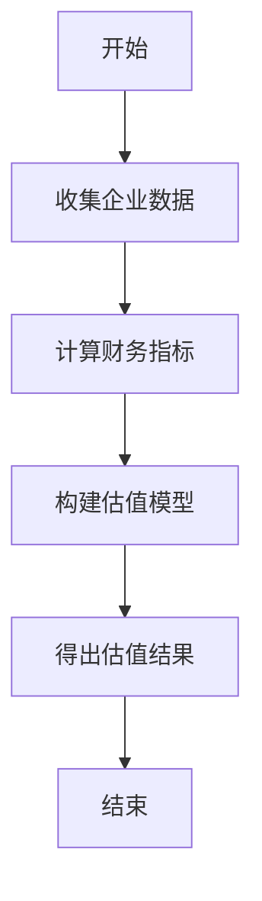
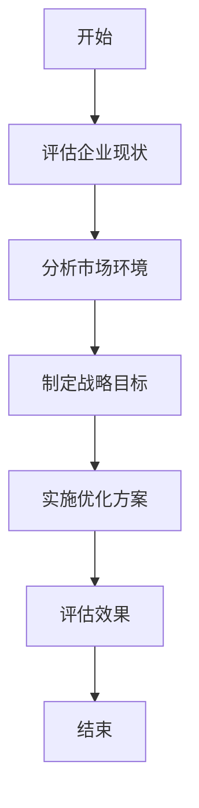
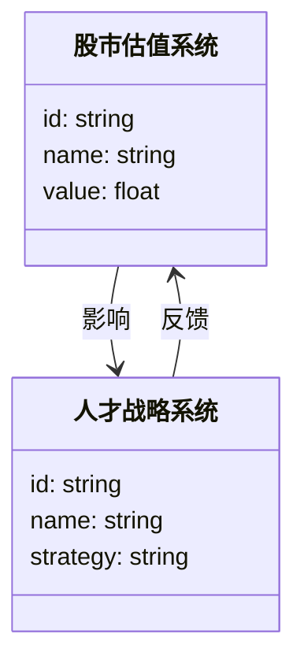
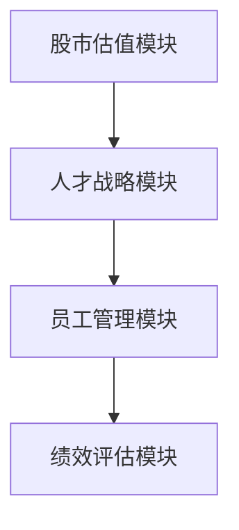
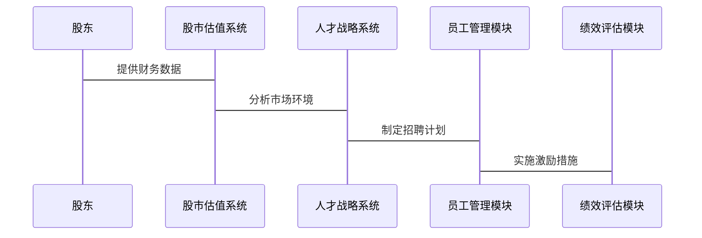

                 


# 股市估值高低对企业人才战略的影响

> 关键词：股市估值，企业人才战略，人才招聘，员工激励，企业绩效

> 摘要：股市估值作为反映企业市场价值的重要指标，对企业的管理决策具有重要影响。本文深入探讨了股市估值与企业人才战略之间的关系，分析了高估值和低估值对企业人才战略的具体影响，并提出了相应的优化策略。

---

## 第1章: 股市估值与企业人才战略的背景介绍

### 1.1 股市估值的基本概念

#### 1.1.1 股市估值的定义与计算方法
股市估值是通过对企业财务数据和市场表现的分析，对其未来盈利能力的评估。常用的估值方法包括市盈率（P/E）、市净率（P/B）和现金流折现法（DCF）。例如，市盈率公式为：

$$ \text{市盈率} = \frac{\text{股票价格}}{\text{每股净利润}} $$

#### 1.1.2 企业市值与股东价值的关系
企业市值是市场对企业价值的直接反映，而股东价值则是企业为股东创造的财富。高市值通常意味着市场对企业的认可度高，股东价值也随之提升。

#### 1.1.3 股市估值对企业管理的影响
股市估值不仅是企业财务健康的重要指标，还直接影响企业的管理决策。例如，高估值企业通常会更加注重成本控制，而低估值企业则可能加大投资力度。

### 1.2 企业人才战略的核心要素

#### 1.2.1 人才战略的定义与目标
人才战略是企业为实现长期发展目标而制定的人员管理策略，包括招聘、培训、激励等多个方面。其目标是通过优化人力资源配置，提升企业竞争力。

#### 1.2.2 企业人才战略的类型与特点
企业人才战略可以分为吸引型、保留型和开发型三种。吸引型战略注重外部人才的引进，保留型战略则关注内部员工的稳定，开发型战略侧重员工能力的提升。

#### 1.2.3 人才战略与企业绩效的关系
人才战略的有效实施能够显著提升企业绩效。例如，合理的激励机制可以提高员工的工作积极性，从而为企业创造更多的价值。

### 1.3 股市估值与人才战略的关联性

#### 1.3.1 股市估值对企业人才战略的影响路径
股市估值通过影响企业的财务状况和市场声誉，进而影响人才战略的制定和实施。例如，高估值企业通常能够吸引更多的优秀人才。

#### 1.3.2 高估值企业的人才战略特点
高估值企业通常具有更强的市场竞争力，能够提供更高的薪资和更好的职业发展机会，从而吸引更多的高端人才。

#### 1.3.3 低估值企业的人才战略调整
低估值企业可能面临人才流失的问题，因此需要通过优化薪酬结构和提升企业形象来吸引和留住人才。

---

## 第2章: 股市估值与人才战略的核心概念与联系

### 2.1 核心概念原理

#### 2.1.1 股市估值的核心公式与模型
股市估值的核心公式包括市盈率、市净率和股息率等。例如，股息率公式为：

$$ \text{股息率} = \frac{\text{每股股息}}{\text{股票价格}} $$

#### 2.1.2 人才战略的实施机制
人才战略的实施机制包括需求分析、战略制定、执行落地和效果评估四个阶段。每个阶段都需要结合企业的实际情况进行调整。

#### 2.1.3 两者关系的理论框架
股市估值与人才战略之间存在相互影响的关系。高估值企业可以通过吸引优秀人才进一步提升企业价值，而低估值企业则需要通过优化人才战略来改善市场形象。

### 2.2 概念属性特征对比表格

| 概念       | 定义                               | 影响因素               | 实施目标               |
|------------|------------------------------------|------------------------|------------------------|
| 股市估值   | 股票市场对企业的价值评估           | 盈利能力、行业地位     | 提高企业价值           |
| 人才战略   | 企业为实现目标而采取的人才管理策略 | 市场环境、企业资源     | 提升企业竞争力         |

### 2.3 ER实体关系图

```mermaid
er
actor 股东 {
  id: string
  name: string
}
actor 员工 {
  id: string
  name: string
}
actor 企业 {
  id: string
  name: string
}
```

---

## 第3章: 股市估值与人才战略的算法原理

### 3.1 股市估值预测算法



### 3.2 人才战略优化算法



---

## 第4章: 系统分析与架构设计方案

### 4.1 问题场景介绍
股市估值与人才战略的关系可以通过系统分析的方法进行建模。我们需要构建一个能够反映两者关系的系统模型，并分析其交互作用。

### 4.2 项目介绍
本项目旨在通过系统分析的方法，研究股市估值对企业人才战略的影响，并提出相应的优化策略。

### 4.3 系统功能设计



### 4.4 系统架构设计



### 4.5 系统接口设计
系统接口包括数据输入、处理和输出三个部分。数据输入包括企业财务数据和市场数据，处理包括估值计算和战略优化，输出包括估值结果和战略建议。

### 4.6 系统交互设计



---

## 第5章: 项目实战

### 5.1 环境安装
需要安装Python和相关数据分析库，如Pandas、NumPy和Matplotlib。

### 5.2 系统核心实现源代码

```python
import pandas as pd
import numpy as np

# 示例代码：计算市盈率
def calculate_pe_ratio(price, earnings_per_share):
    return price / earnings_per_share

# 示例代码：人才战略优化
def optimize_talent_strategy(value, employees):
    return "吸引型" if value > 100 else "保留型"
```

### 5.3 代码应用解读与分析
以上代码展示了如何通过Python进行股市估值计算和人才战略优化。市盈率的计算可以帮助企业评估自身的市场价值，而人才战略的优化则可以根据企业的实际情况进行调整。

### 5.4 实际案例分析
以某科技公司为例，假设其市盈率为30，高于行业平均水平。因此，该公司应采取吸引型人才战略，加大高端人才的引进力度。

### 5.5 项目小结
通过实际案例分析，我们可以看到股市估值与人才战略之间的相互作用。企业需要根据自身的估值情况，灵活调整人才战略。

---

## 第6章: 总结与展望

### 6.1 最佳实践 tips
- 定期评估企业的股市估值
- 根据估值情况调整人才战略
- 注重员工的激励与培养

### 6.2 小结
股市估值与人才战略密切相关。高估值企业应注重吸引高端人才，低估值企业则需要优化内部管理，提升员工绩效。

### 6.3 注意事项
- 股市估值具有波动性，需结合市场环境进行分析
- 人才战略的实施需要考虑企业的实际情况

### 6.4 拓展阅读
- 《企业价值评估与管理》
- 《人才管理与企业绩效》

---

通过以上分析，我们可以看到股市估值对企业人才战略的影响是多方面的。企业需要根据自身的估值情况，灵活调整人才战略，以实现长期的可持续发展。

