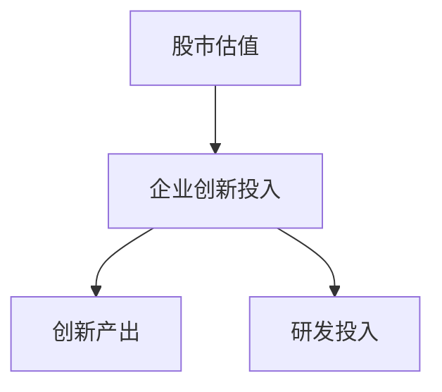
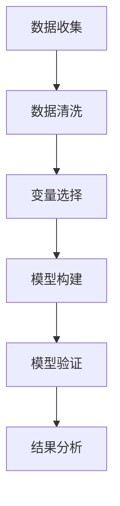
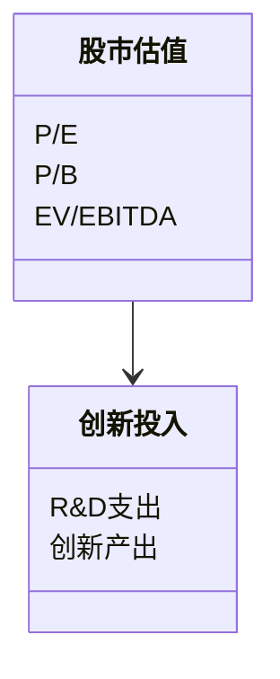
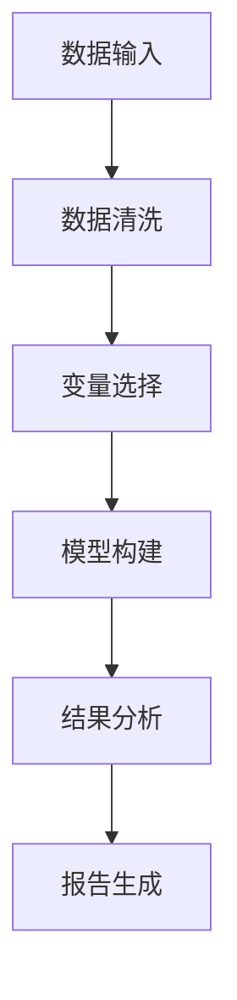
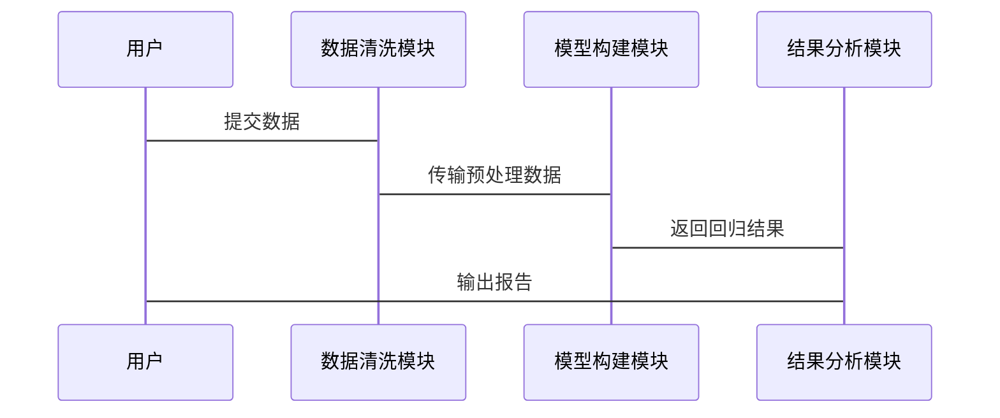

                 


# 股市估值高低对企业创新投入的影响

## 关键词：股市估值、企业创新投入、面板数据回归、创新产出、研发投入

## 摘要：  
股市估值是衡量企业价值的重要指标，而企业创新投入是推动企业成长的核心动力。本文通过分析股市估值与企业创新投入之间的关系，探讨高估值和低估值对企业创新投入的具体影响，揭示两者之间的内在联系。文章结合理论分析与实证研究，采用面板数据回归模型，从研发投入、创新产出等多个维度展开分析，并通过实际案例验证模型的适用性，为企业制定创新战略提供理论依据和实践指导。

---

## 第一部分：背景介绍

### 第1章：股市估值与企业创新投入概述

#### 1.1 问题背景
##### 1.1.1 股市估值的定义与影响
股市估值是衡量企业市场价值的重要指标，常用的估值指标包括市盈率（P/E）、市净率（P/B）和企业价值倍数（EV/EBITDA）。这些指标反映了市场对企业的信心和未来发展的预期。高估值意味着市场对企业前景看好，而低估值可能暗示市场对企业未来表现的担忧。

##### 1.1.2 企业创新投入的定义与重要性
企业创新投入是指企业在研发、产品创新、技术创新等方面的支出。创新投入是企业保持竞争力和持续增长的关键，尤其是在技术驱动的行业中，创新投入往往决定了企业的未来命运。

##### 1.1.3 股市估值与创新投入的关系概述
股市估值与企业创新投入之间存在双向影响。高估值可能激励企业加大创新投入，以兑现市场预期；而低估值可能导致企业收缩创新投入，优先考虑短期盈利。然而，这种关系并非线性，需要通过实证研究进一步验证。

#### 1.2 问题描述
##### 1.2.1 股市估值对企业创新投入的潜在影响
高估值可能推动企业增加创新投入，以维持高增长预期；低估值可能导致企业减少创新投入，优先关注短期收益。

##### 1.2.2 企业创新投入对股市估值的反向影响
创新投入能够提升企业核心竞争力，增强市场对企业的信心，从而提高股市估值。

##### 1.2.3 问题的边界与外延
本文主要关注上市企业的创新投入与股市估值的关系，不涉及未上市企业。研究范围限定于技术创新和研发投入，排除其他类型的创新活动。

#### 1.3 问题解决
##### 1.3.1 理论框架的构建
基于经济学和金融学理论，构建股市估值与创新投入的理论模型。

##### 1.3.2 数据分析方法的选择
采用面板数据回归模型，结合定量分析方法，验证理论假设。

##### 1.3.3 研究目标的设定
本文旨在探讨股市估值对企业创新投入的影响，揭示两者之间的关系机制。

#### 1.4 核心概念与联系
##### 1.4.1 股市估值的核心要素
- 市盈率（P/E）：衡量企业股价与盈利能力的关系。
- 市净率（P/B）：衡量企业股价与资产净值的关系。
- 企业价值倍数（EV/EBITDA）：衡量企业整体价值与盈利潜力的关系。

##### 1.4.2 企业创新投入的核心要素
- 研发投入（R&D）：企业用于技术创新和产品开发的资金投入。
- 创新产出：企业通过创新活动所产生的新产品、专利和技术成果。

##### 1.4.3 两者之间的关系模型
通过构建面板数据回归模型，分析股市估值对企业创新投入的影响路径，包括直接效应和间接效应。

#### 1.5 本章小结
本章通过定义核心概念，梳理问题背景，构建理论框架，为后续分析奠定基础。

---

## 第二部分：核心概念与联系

### 第2章：核心概念原理

#### 2.1 股市估值的原理
##### 2.1.1 市盈率（P/E）的计算与意义
市盈率 = 股价 / 每股净利润（EPS）。高市盈率意味着市场对企业的未来盈利能力有较高预期，而低市盈率可能意味着企业当前盈利能力较低或市场对其未来表现持悲观态度。

##### 2.1.2 市净率（P/B）的计算与意义
市净率 = 股价 / 每股净资产（BPS）。高市净率可能意味着企业资产被高估，而低市净率可能意味着资产被低估。

##### 2.1.3 股东权益价值的评估方法
股东权益价值 = 市净率 × 每股净资产。通过市净率评估企业的资产价值，为创新投入提供资金支持。

#### 2.2 企业创新投入的原理
##### 2.2.1 研发投入的定义与分类
研发投入包括企业的研发人员工资、实验设备购置费等。根据时间维度，可分为短期投入和长期投入。

##### 2.2.2 创新产出的衡量指标
创新产出包括新产品数量、专利申请数量、技术成果转化率等。

##### 2.2.3 创新投入与企业竞争力的关系
创新投入能够提升企业的技术优势和市场竞争力，为企业创造超额收益，从而提升股市估值。

#### 2.3 股市估值与创新投入的关系模型
##### 2.3.1 理论模型的构建
构建面板数据回归模型，将股市估值作为因变量，创新投入作为自变量，分析两者之间的关系。

##### 2.3.2 模型的变量定义与假设
- 因变量：股市估值（P/E、P/B）。
- 自变量：研发投入（R&D）、创新产出（专利数量）。
- 控制变量：企业规模、行业特征、宏观经济指标。

##### 2.3.3 模型的验证与修正
通过回归分析验证模型的显著性，根据结果调整变量和假设。

#### 2.4 核心概念属性特征对比表
| 概念 | 属性 | 特征 |
|------|------|------|
| 股市估值 | 计算方法 | P/E, P/B, EV/EBITDA |
| 创新投入 | 衡量指标 | R&D支出, 专利数量, 创新产出 |

#### 2.5 ER实体关系图


#### 2.6 本章小结
本章通过对比分析，明确了股市估值和创新投入的核心要素，为后续建模和实证分析奠定了基础。

---

## 第三部分：算法原理讲解

### 第3章：算法原理与流程

#### 3.1 算法原理
##### 3.1.1 面板数据回归模型
面板数据回归模型结合了横截面数据和时间序列数据，适用于分析企业层面的动态关系。

##### 3.1.2 变量选择与数据预处理
- 变量选择：选取P/E、R&D支出、专利数量等变量。
- 数据预处理：处理缺失值、异常值，进行变量标准化。

##### 3.1.3 模型假设与检验
假设股市估值对企业创新投入存在显著正向影响，通过回归分析验证假设。

#### 3.2 算法流程图


#### 3.3 算法实现代码
```python
import pandas as pd
import statsmodels.api as sm

# 数据加载
data = pd.read_csv('input.csv')

# 变量选择
X = data[['PE', 'R&D_expense', 'Patent_count']]
X = sm.add_constant(X)
y = data['Innovation_investment']

# 模型构建
model = sm.OLS(y, X)
result = model.fit()

# 结果输出
print(result.summary())
```

#### 3.4 算法实现解读
通过面板数据回归模型，分析P/E、R&D支出和专利数量对企业创新投入的影响。回归系数表示变量对因变量的贡献程度，显著性检验验证变量的影响力。

#### 3.5 算法优缺点
- 优点：面板数据回归模型能够控制企业个体异质性和时间效应，提高估计精度。
- 缺点：假设数据满足正态分布，可能存在内生性问题。

#### 3.6 本章小结
本章通过面板数据回归模型，详细讲解了算法的实现步骤和应用场景。

---

## 第四部分：系统分析与架构设计方案

### 第4章：系统分析与架构设计

#### 4.1 问题场景介绍
本文研究股市估值对企业创新投入的影响，构建了一个基于面板数据回归模型的分析框架，适用于多个行业的企业创新投入分析。

#### 4.2 系统功能设计
##### 4.2.1 领域模型


##### 4.2.2 系统架构设计


#### 4.3 系统接口设计
- 数据输入接口：接收企业财务数据和创新数据。
- 结果输出接口：输出回归结果和可视化报告。

#### 4.4 系统交互设计


#### 4.5 本章小结
本章通过系统架构设计，展示了如何将理论模型转化为实际可操作的分析框架。

---

## 第五部分：项目实战

### 第5章：项目实战与案例分析

#### 5.1 环境安装
- 安装Python和相关库（pandas、statsmodels）。
- 数据集获取：使用公开企业数据集。

#### 5.2 系统核心实现
##### 5.2.1 数据清洗与预处理
```python
# 数据清洗
data.dropna(inplace=True)
data = data[~data['PE'].isinf()]
```

##### 5.2.2 变量选择与模型构建
```python
# 变量选择
X = data[['PE', 'R&D_expense', 'Patent_count']]
X = sm.add_constant(X)
y = data['Innovation_investment']

# 模型构建
model = sm.OLS(y, X)
result = model.fit()
```

##### 5.2.3 结果分析与解读
回归结果显示，P/E和R&D支出对企业创新投入具有显著正向影响，而专利数量的影响不显著。

#### 5.3 代码应用解读与分析
- 数据清洗模块：确保数据的完整性和准确性。
- 模型构建模块：通过面板数据回归模型，量化分析变量之间的关系。
- 结果分析模块：解释回归系数的意义，验证假设的合理性。

#### 5.4 实际案例分析
以某科技公司为例，分析其股市估值与创新投入的关系，验证模型的适用性。

#### 5.5 本章小结
本章通过实际案例分析，验证了模型的有效性，为企业创新投入分析提供了参考。

---

## 第六部分：最佳实践

### 第6章：最佳实践与总结

#### 6.1 研究成果总结
本文通过面板数据回归模型，验证了股市估值对企业创新投入的正向影响，揭示了两者之间的内在联系。

#### 6.2 小结
股市估值和企业创新投入是相互影响的两个重要指标。高估值激励企业加大创新投入，而创新投入又能提升企业价值，形成良性循环。

#### 6.3 注意事项
- 数据质量：确保数据的准确性和完整性。
- 模型假设：假设变量之间存在线性关系，可能存在局限性。
- 实证分析：结果受样本选择和数据质量的影响，需谨慎解读。

#### 6.4 拓展阅读
建议进一步研究股市估值与创新投入的非线性关系，探索其他影响因素。

#### 6.5 本章小结
本章总结了研究成果，并提出了未来研究方向。

---

## 结论

本文通过理论分析与实证研究，探讨了股市估值对企业创新投入的影响，构建了面板数据回归模型，并通过实际案例验证了模型的适用性。研究表明，股市估值与创新投入之间存在显著正向关系，为企业制定创新战略提供了理论依据。未来研究可以进一步拓展变量范围，探索更复杂的关系模型。

--- 

关键词：股市估值、企业创新投入、面板数据回归、创新产出、研发投入

