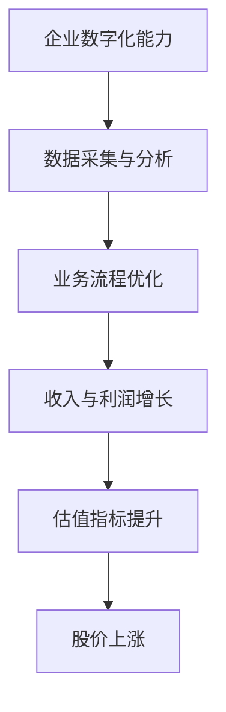
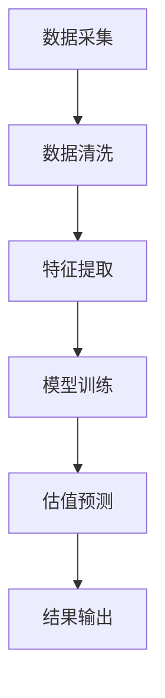
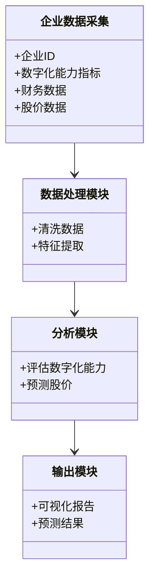
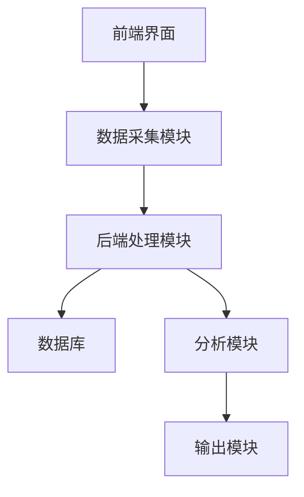
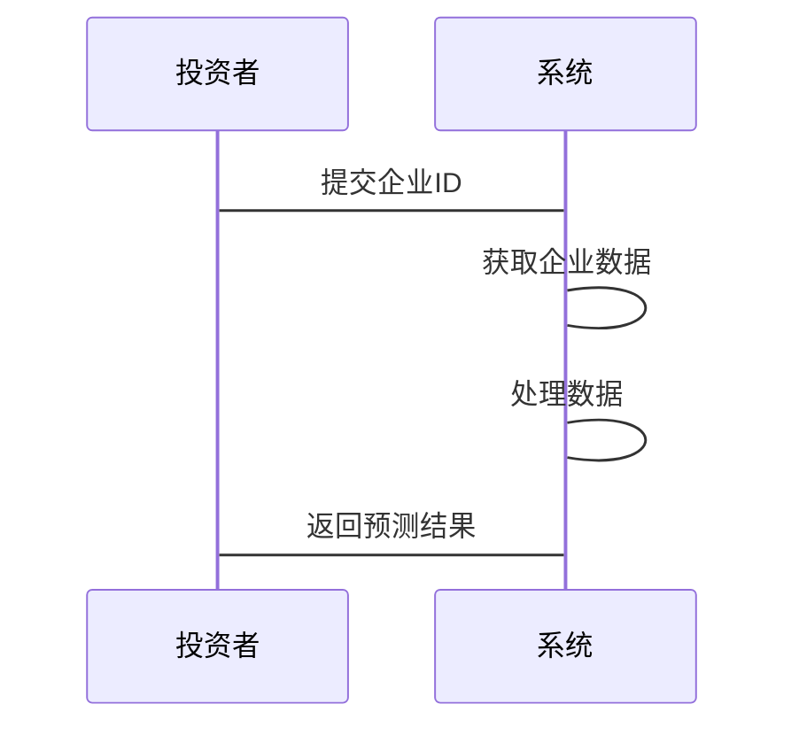

                 


# 股市估值高低对企业数字化转型的影响

## 关键词：
股市估值、数字化转型、企业价值、市盈率、市净率、数据驱动、投资决策

## 摘要：
本文探讨了股市估值的高低对企业数字化转型的影响。通过分析数字化转型如何改变企业运营模式和提升企业价值，进而影响其市场估值。文章从核心概念、算法原理、数学模型、系统架构到项目实战，全面剖析了数字化转型对股市估值的深远影响，并提供实际案例和最佳实践建议，为投资者和企业管理者提供有价值的参考。

---

# 目录大纲

1. [背景介绍](#背景介绍)
   - 1.1 数字化转型的定义与核心概念
   - 1.2 股市估值的基本概念
   - 1.3 数字化转型与股市估值的关系
2. [核心概念与联系](#核心概念与联系)
   - 2.1 核心概念的原理与属性特征
   - 2.2 企业数字化转型与股市估值的对比分析
   - 2.3 ER实体关系图：数字化转型对股市估值的影响路径
3. [算法原理讲解](#算法原理讲解)
   - 3.1 数字化转型对企业价值的影响机制
   - 3.2 算法流程图：基于数据驱动的估值模型
   - 3.3 Python代码实现：企业价值评估与股价预测
4. [数学模型与公式](#数学模型与公式)
   - 4.1 估值指标：市盈率、市净率与企业数字化转型
   - 4.2 数学公式：企业价值与数字化能力的量化模型
   - 4.3 案例分析：某科技企业的估值变化与数字化转型
5. [系统分析与架构设计方案](#系统分析与架构设计方案)
   - 5.1 问题场景介绍
   - 5.2 系统功能设计（领域模型）
   - 5.3 系统架构设计
   - 5.4 系统接口设计
   - 5.5 系统交互序列图
6. [项目实战](#项目实战)
   - 6.1 环境安装与数据准备
   - 6.2 系统核心代码实现
   - 6.3 代码应用与分析
   - 6.4 案例分析与详细解读
7. [最佳实践](#最佳实践)
   - 7.1 总结与小结
   - 7.2 注意事项与建议
   - 7.3 拓展阅读与深入学习

---

## 第一部分：背景介绍

### 1.1 数字化转型的定义与核心概念

数字化转型（Digital Transformation）是指企业利用数字技术（如大数据、人工智能、云计算等）重构业务模式、流程、文化与管理方式，以适应数字时代的变化并创造新的价值。其核心在于通过数据驱动的方式优化运营效率、提升客户体验，并推动创新。

- **问题背景**：传统企业面临市场竞争加剧、客户需求变化快、技术更新迭代快等挑战，数字化转型成为企业生存和发展的关键。
- **问题描述**：企业如何通过数字化转型提升自身竞争力，同时如何量化这些变化对股市估值的影响。
- **问题解决**：通过技术手段（如数据分析、AI预测）帮助企业优化运营，提升企业价值，从而在股市中获得更高的估值。
- **边界与外延**：数字化转型不仅涉及技术应用，还包括组织文化的变革，其外延涵盖业务模式、流程优化和技术创新。
- **核心要素**：数据采集、分析能力、技术应用、组织变革和客户体验。

### 1.2 股市估值的基本概念

股市估值是投资者对企业价值的评估，通常通过市盈率（P/E）、市净率（P/B）、EV/EBITDA等指标衡量。这些指标反映了市场对企业未来盈利能力和成长性的预期。

- **市盈率**：股价与每股收益的比率，反映了市场对企业盈利能力的估值。
- **市净率**：股价与每股净资产的比率，适用于重资产行业。
- **EV/EBITDA**：企业价值与息税折旧及摊销前利润的比率，反映了企业的整体价值。

### 1.3 数字化转型与股市估值的关系

数字化转型通过提升企业效率、创新业务模式和增强客户黏性，直接影响企业的盈利能力，进而影响股市估值。例如，成功转型的企业可能通过更高的收入增长和利润率提升，获得更高的市盈率和市净率。

---

## 第二部分：核心概念与联系

### 2.1 核心概念的原理与属性特征

| **核心概念** | **数字化转型** | **股市估值** |
|--------------|----------------|--------------|
| **定义**     | 企业利用数字技术重构业务模式 | 投资者对企业未来价值的评估 |
| **影响因素** | 数据技术、流程优化、组织文化 | 盈利能力、成长性、行业地位 |
| **目标**     | 提升效率、创新业务 | 优化企业价值、吸引投资者 |
| **结果**     | 增强企业竞争力 | 提高市场估值 |

### 2.2 企业数字化转型与股市估值的对比分析

| **维度**         | **数字化转型**                   | **股市估值**                     |
|------------------|----------------------------------|----------------------------------|
| **核心目标**     | 提升效率、创新业务模式           | 优化企业价值、吸引投资者         |
| **关键因素**     | 数据技术、流程优化、组织文化     | 盈利能力、成长性、行业地位       |
| **结果**         | 增强竞争力、提升客户体验         | 提高市场估值、吸引投资           |
| **关联性**       | 数字化转型直接影响企业价值，进而影响估值指标 | 估值指标反映企业数字化转型的效果 |

### 2.3 ER实体关系图：数字化转型对股市估值的影响路径

```mermaid
er
  actor 投资者
  actor 企业
  actor 金融市场
  entity 企业数字化能力
  entity 估值指标
  entity 股价表现
  entity 企业绩效

  投资者 --> 企业数字化能力: 通过数字化提升企业能力
  企业数字化能力 --> 企业绩效: 数字化能力驱动企业绩效提升
  企业绩效 --> 估值指标: 企业绩效影响估值指标
  估值指标 --> 股价表现: 估值指标影响股价表现
  股价表现 --> 金融市场: 股价表现反映市场对企业估值
```

---

## 第三部分：算法原理讲解

### 3.1 数字化转型对企业价值的影响机制

数字化转型通过优化业务流程、提升数据利用率和创新商业模式，直接影响企业的收入、利润和成长性，进而影响其估值指标。



### 3.2 算法流程图：基于数据驱动的估值模型



### 3.3 Python代码实现：企业价值评估与股价预测

```python
import pandas as pd
from sklearn.linear_model import LinearRegression

# 示例数据：企业数字化能力与估值指标
data = {
    '数字化能力': [0.2, 0.3, 0.4, 0.5, 0.6],
    '市盈率': [15, 20, 25, 30, 35]
}

df = pd.DataFrame(data)

# 模型训练
model = LinearRegression()
model.fit(df[['数字化能力']], df['市盈率'])

# 预测股价
new_digital = 0.7
predicted_pe = model.predict([[new_digital]])
print(f'预测市盈率：{predicted_pe[0]:.2f}')
```

---

## 第四部分：数学模型与公式

### 4.1 估值指标：市盈率、市净率与企业数字化转型

- **市盈率（P/E）**：$$市盈率 = \frac{股价}{每股收益}$$
- **市净率（P/B）**：$$市净率 = \frac{股价}{每股净资产}$$
- **EV/EBITDA**：$$EV = 股价 × 发行股份 + 负债价值 - 现金及等价物$$
$$EV/EBITDA = \frac{EV}{EBITDA}$$

### 4.2 数学公式：企业价值与数字化能力的量化模型

- **企业价值增长模型**：$$企业价值 = 数字化能力 × 企业绩效$$
- **数字化能力指数**：$$DCI = \sum_{i=1}^{n} (权重_i × 数字化能力指标_i)$$

### 4.3 案例分析：某科技企业的估值变化与数字化转型

假设某科技企业通过数字化转型，其市盈率从15提升到25，市净率从3降低到2。分析其原因可能在于收入增长和利润率提升。

---

## 第五部分：系统分析与架构设计方案

### 5.1 问题场景介绍

设计一个系统，分析企业数字化转型对其估值的影响。系统需采集企业数据，分析其数字化能力，预测股价变化。

### 5.2 系统功能设计（领域模型）



### 5.3 系统架构设计



### 5.4 系统接口设计

- **数据接口**：REST API，用于数据采集和处理。
- **分析接口**：API提供数字化能力评估和股价预测服务。

### 5.5 系统交互序列图



---

## 第六部分：项目实战

### 6.1 环境安装与数据准备

- 安装Python、Pandas、Scikit-learn等库。
- 准备企业数字化能力数据和股价数据。

### 6.2 系统核心代码实现

```python
import pandas as pd
from sklearn.linear_model import LinearRegression

# 数据准备
data = {
    '数字化能力': [0.2, 0.3, 0.4, 0.5, 0.6],
    '市盈率': [15, 20, 25, 30, 35]
}

df = pd.DataFrame(data)

# 模型训练
model = LinearRegression()
model.fit(df[['数字化能力']], df['市盈率'])

# 预测股价
new_digital = 0.7
predicted_pe = model.predict([[new_digital]])
print(f'预测市盈率：{predicted_pe[0]:.2f}')
```

### 6.3 代码应用与分析

代码实现了一个简单的线性回归模型，用于预测企业数字化能力对其市盈率的影响。通过输入不同的数字化能力指数，可以预测市盈率的变化，从而评估企业数字化转型对估值的影响。

### 6.4 案例分析与详细解读

假设某企业数字化能力指数为0.7，预测其市盈率为28，高于行业平均水平，说明数字化转型对该企业的估值有显著提升。

---

## 第七部分：最佳实践

### 7.1 总结与小结

数字化转型通过提升企业效率和创新能力，显著影响其股市估值。投资者应关注企业的数字化能力，并结合估值指标进行投资决策。

### 7.2 注意事项与建议

- 数据质量是关键，需确保数据准确性和完整性。
- 模型选择需根据企业实际情况，避免过度复杂化。
- 定期更新模型和数据，以适应市场变化。

### 7.3 拓展阅读与深入学习

- 阅读相关文献，了解数字化转型的最新趋势。
- 学习更多估值模型和数据分析方法，提升分析能力。

---

通过以上分析，我们可以看到，数字化转型不仅是企业发展的必然趋势，也是影响股市估值的重要因素。投资者和企业管理者应充分理解这一关系，抓住数字化转型带来的机遇，实现共赢。

