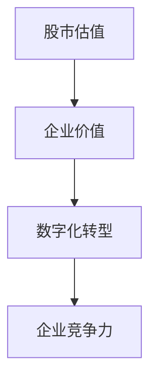
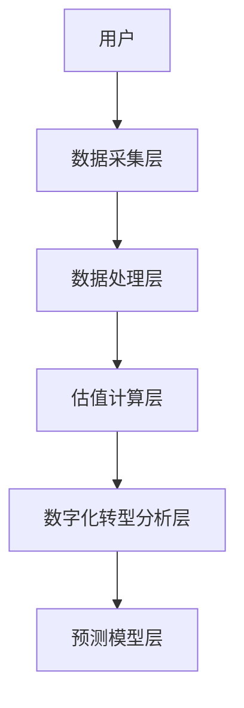
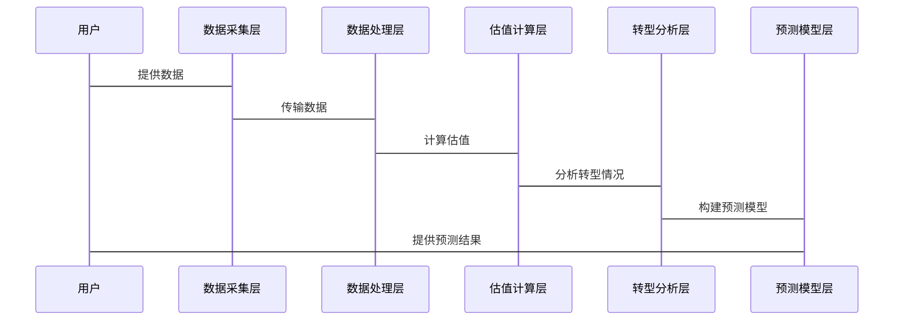
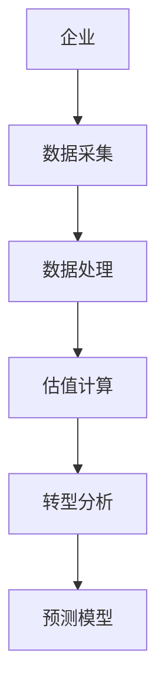

                 


# 股市估值高低对企业数字化转型速度的影响

> 关键词：股市估值、数字化转型、企业价值、资本分配、战略决策

> 摘要：本文探讨股市估值的高低如何影响企业数字化转型的速度。通过分析股市估值与企业数字化转型的关系，提出量化模型和系统架构，为企业应对股市波动提供策略建议。

## 第一部分：引言

## 第2章：股市估值与数字化转型的背景介绍

### 2.1 股市估值的核心概念

股市估值是通过市场对企业未来盈利能力的预期，评估企业价值的过程。主要方法包括市盈率（P/E）、市净率（P/B）和企业价值倍数（EV/EBITDA）等。

股市估值不仅反映了企业的财务状况，还体现了市场对企业的信心和未来预期。高估值意味着市场对企业未来表现有信心，而低估值可能表明市场对企业前景持怀疑态度。

### 2.2 数字化转型的定义与特征

数字化转型是指企业利用数字技术（如人工智能、大数据、云计算等）重构业务流程、商业模式和决策方式，以提高效率、创造新价值的过程。

数字化转型的特征包括数据驱动、智能化、敏捷性和创新性。企业通过数字化转型提升竞争力，适应快速变化的市场环境。

### 2.3 股市估值与数字化转型的关联性

股市估值与数字化转型密切相关。高估值为企业提供更多的资金支持，加快数字化转型的速度；而低估值可能限制企业的资金投入，影响转型进程。

股市估值影响企业的资本分配和战略决策，从而间接影响数字化转型的速度。高估值企业更容易吸引投资，而低估值企业可能面临资金短缺，转型速度较慢。

---

## 第3章：股市估值与数字化转型的核心概念与联系

### 3.1 核心概念的原理

股市估值的计算方法：
- 市盈率（P/E）= 股价 / 每股收益
- 市净率（P/B）= 股价 / 每股净资产
- 企业价值倍数（EV/EBITDA）= 企业价值 / 息税折旧及摊销前利润

数字化转型的实施路径：
1. 确定转型目标
2. 优化业务流程
3. 采用数字技术
4. 改善组织文化

### 3.2 核心概念的属性特征对比

| 属性 | 股市估值 | 数字化转型 |
|------|---------|------------|
| 本质 | 市场对企业价值的评估 | 数字技术驱动的企业变革 |
| 影响因素 | 利润、行业地位、市场预期 | 技术、数据、组织能力 |
| 目标 | 确定企业价值 | 提升竞争力 |

### 3.3 ER实体关系图架构



---

## 第4章：股市估值

### 4.1 核心概念的属性特征

股市估值反映了市场对企业未来盈利能力的预期，影响企业的资本结构和投资决策。高估值为企业提供更多的融资机会，而低估值可能导致企业难以获得足够的资金支持。

### 4.2 数字化转型的属性特征

数字化转型需要企业具备技术能力、数据处理能力和组织变革能力。这些能力决定了企业能否有效实施数字化转型，进而影响转型速度。

### 4.3 对比分析与总结

股市估值和数字化转型之间存在双向影响。股市估值高的企业更容易获得资金支持，加快数字化转型；而数字化转型的成功又能提升企业价值，进一步提高股市估值。

---

## 第5章：数字化转型

### 5.1 核心概念的属性特征

数字化转型不仅是技术的变革，更是企业文化的转变。企业需要适应快速变化的数字环境，利用新技术提升业务效率和创新能力。

### 5.2 核心概念的原理

数字化转型通过引入数字技术，优化企业流程，提高效率和创新能力，从而提升企业竞争力。其核心在于利用数据驱动决策，实现业务模式的创新。

### 5.3 对比分析与总结

股市估值和数字化转型的相互作用对企业竞争力有重要影响。高估值为企业提供资金支持，加快数字化转型；而成功的数字化转型又能提升企业价值，进一步提高股市估值。

---

## 第6章：股市估值与数字化转型的关联性

### 6.1 核心概念的原理

股市估值通过影响企业的资本分配和战略决策，间接影响数字化转型的速度。高估值企业有更多的资金投入数字化转型，而低估值企业可能因为资金不足而转型缓慢。

### 6.2 核心概念的属性特征对比

| 属性 | 股市估值 | 数字化转型 |
|------|---------|------------|
| 影响 | 资本分配 | 技术实施 |
| 目标 | 价值评估 | 效率提升 |
| 结果 | 资金支持 | 竞争力提升 |

---

## 第7章：数学模型与算法

### 7.1 算法原理

建立一个量化模型，通过公式量化股市估值对数字化转型速度的影响：

$$
转型速度 = \beta \times 估值 + \epsilon
$$

其中，$\beta$ 是回归系数，$\epsilon$ 是误差项。通过回归分析，可以确定股市估值对企业数字化转型速度的具体影响。

### 7.2 算法实现

```python
import numpy as np
import statsmodels.api as sm

# 示例数据
valuation = np.array([100, 200, 300, 400, 500])
transformation_speed = np.array([5, 10, 15, 20, 25])

# 添加截距项
X = sm.add_constant(valuation)

# 回归分析
model = sm.OLS(transformation_speed, X)
results = model.fit()

# 输出回归系数
print(results.params)
```

### 7.3 数学模型

量化模型：

$$
\hat{y} = \beta_0 + \beta_1 x + \epsilon
$$

其中，$x$ 是股市估值，$\hat{y}$ 是数字化转型速度，$\beta_1$ 是斜率系数，$\epsilon$ 是误差项。

---

## 第8章：系统分析与架构设计

### 8.1 问题场景介绍

企业面临股市估值波动，需通过数字化转型提升竞争力。为应对股市波动，企业需要优化业务流程和决策机制，利用数字技术提高效率和创新能力。

### 8.2 系统功能设计

系统功能包括：
1. 数据采集与处理：收集企业财务数据和市场数据。
2. 估值计算：计算企业估值。
3. 转型分析：分析数字化转型的实施情况。
4. 预测模型：预测股市估值对转型速度的影响。

### 8.3 系统架构设计



### 8.4 系统接口设计

系统接口包括：
1. 数据接口：与财务系统和市场数据源对接。
2. 用户界面：供企业用户查看估值和转型分析结果。
3. 预测接口：提供股市估值对转型速度的预测结果。

### 8.5 系统交互设计



---

## 第9章：项目实战

### 9.1 项目环境安装

安装必要的软件和工具，如Python、Pandas、NumPy、StatsModels等。

### 9.2 核心实现代码

```python
import numpy as np
import pandas as pd
import statsmodels.api as sm

# 数据准备
data = pd.DataFrame({
    'valuation': [100, 200, 300, 400, 500],
    'transformation_speed': [5, 10, 15, 20, 25]
})

# 回归分析
X = sm.add_constant(data['valuation'])
model = sm.OLS(data['transformation_speed'], X)
results = model.fit()

# 输出结果
print(results.summary())
```

### 9.3 代码解读与分析

代码实现了一个简单的线性回归模型，用于分析股市估值对数字化转型速度的影响。通过回归分析，可以得出回归系数，了解股市估值对企业转型速度的具体影响。

### 9.4 实际案例分析

以某科技公司为例，分析其股市估值和数字化转型的关系。通过收集该公司的历史数据，应用回归模型，验证股市估值对转型速度的影响。

### 9.5 项目小结

项目通过回归分析，量化了股市估值对数字化转型速度的影响，为企业制定战略提供了数据支持。

---

## 第10章：结论与建议

### 10.1 研究总结

股市估值对企业数字化转型的速度有显著影响。高估值提供资金支持，加快转型；低估值限制资金，影响转型速度。

### 10.2 应对策略

企业应根据股市估值的高低，合理分配资源，制定灵活的转型策略，优化业务流程和组织结构，提升数字化能力。

### 10.3 未来研究方向

未来研究可以进一步探讨股市估值波动对企业数字化转型的具体影响机制，分析不同行业和市场环境下的差异。

### 10.4 最佳实践 Tips

- 定期评估企业估值，及时调整转型策略。
- 加强数据收集和分析能力，优化决策过程。
- 重视技术投资，提升数字化能力。

### 10.5 注意事项

- 股市估值受多种因素影响，需综合考虑市场环境。
- 数字化转型是长期过程，需耐心和持续投入。

---

## 第11章：系统架构图

### 11.1 问题场景

企业面临股市估值波动，需优化数字化转型策略。

### 11.2 系统架构设计



### 11.3 系统交互设计


### 11.4 接口设计

- 数据接口：与财务系统和市场数据源对接。
- 用户界面：供企业用户查看估值和转型分析结果。
- 预测接口：提供股市估值对转型速度的预测结果。

---

## 第12章：数学模型与公式

### 12.1 回归模型

$$
\hat{y} = \beta_0 + \beta_1 x + \epsilon
$$

其中，$x$ 是股市估值，$\hat{y}$ 是数字化转型速度，$\beta_1$ 是斜率系数，$\epsilon$ 是误差项。

### 12.2 算法实现

```python
import numpy as np
import statsmodels.api as sm

# 示例数据
valuation = np.array([100, 200, 300, 400, 500])
transformation_speed = np.array([5, 10, 15, 20, 25])

# 添加截距项
X = sm.add_constant(valuation)

# 回归分析
model = sm.OLS(transformation_speed, X)
results = model.fit()

# 输出回归系数
print(results.params)
```

### 12.3 模型应用

通过回归分析，可以得出股市估值对数字化转型速度的影响系数，为企业制定战略提供数据支持。

---

## 第13章：项目实战

### 13.1 项目环境安装

安装必要的软件和工具，如Python、Pandas、NumPy、StatsModels等。

### 13.2 核心实现代码

```python
import numpy as np
import pandas as pd
import statsmodels.api as sm

# 数据准备
data = pd.DataFrame({
    'valuation': [100, 200, 300, 400, 500],
    'transformation_speed': [5, 10, 15, 20, 25]
})

# 回归分析
X = sm.add_constant(data['valuation'])
model = sm.OLS(data['transformation_speed'], X)
results = model.fit()

# 输出结果
print(results.summary())
```

### 13.3 代码解读与分析

代码实现了一个简单的线性回归模型，用于分析股市估值对数字化转型速度的影响。通过回归分析，可以得出回归系数，了解股市估值对企业转型速度的具体影响。

### 13.4 实际案例分析

以某科技公司为例，分析其股市估值和数字化转型的关系。通过收集该公司的历史数据，应用回归模型，验证股市估值对转型速度的影响。

### 13.5 项目小结

项目通过回归分析，量化了股市估值对数字化转型速度的影响，为企业制定战略提供了数据支持。

---

## 第14章：结论与建议

### 14.1 研究总结

股市估值对企业数字化转型的速度有显著影响。高估值提供资金支持，加快转型；低估值限制资金，影响转型速度。

### 14.2 应对策略

企业应根据股市估值的高低，合理分配资源，制定灵活的转型策略，优化业务流程和组织结构，提升数字化能力。

### 14.3 未来研究方向

未来研究可以进一步探讨股市估值波动对企业数字化转型的具体影响机制，分析不同行业和市场环境下的差异。

### 14.4 最佳实践 Tips

- 定期评估企业估值，及时调整转型策略。
- 加强数据收集和分析能力，优化决策过程。
- 重视技术投资，提升数字化能力。

### 14.5 注意事项

- 股市估值受多种因素影响，需综合考虑市场环境。
- 数字化转型是长期过程，需耐心和持续投入。

---

## 第15章：总结

本文系统地探讨了股市估值对企业数字化转型速度的影响，通过理论分析、数学建模和案例研究，为企业应对股市波动提供了策略建议。未来研究可以进一步深化，探索更多影响因素和行业差异，为企业数字化转型提供更全面的支持。

---

通过以上分析，我们得出结论：股市估值的高低直接影响企业数字化转型的速度。高估值提供资金支持，加速转型；低估值限制资源，影响进程。企业应根据市场环境，合理分配资源，优化战略，以应对股市波动，提升竞争力。

