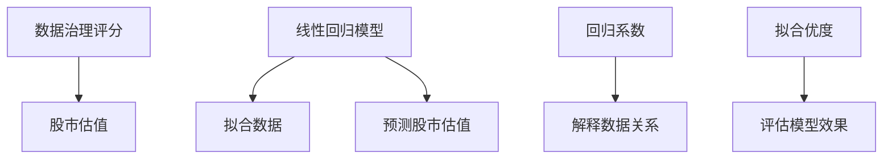
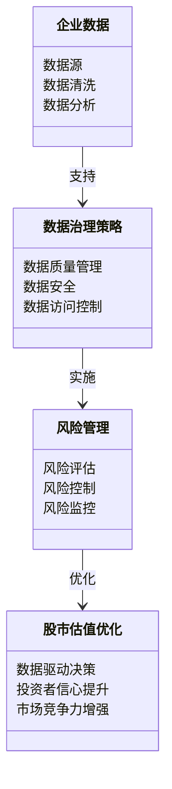
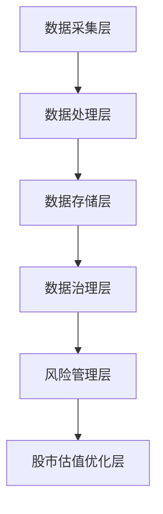

                 


```markdown
# 股市估值高低对企业数据治理策略的影响

> 关键词：股市估值，数据治理，企业策略，投资决策，风险管理

> 摘要：本文探讨股市估值的高低对企业数据治理策略的影响，分析数据治理如何优化企业风险管理，提升股市估值。通过算法模型和系统架构设计，揭示股市估值与数据治理之间的关系，为企业制定数据治理策略提供理论支持和实践指导。

---

## 第一部分: 背景介绍

### 第1章: 背景介绍

#### 1.1 问题背景
- **1.1.1 股市估值的定义与影响**
  股市估值是衡量企业市场价值的重要指标，影响投资者决策和企业融资能力。
- **1.1.2 数据治理的定义与重要性**
  数据治理是企业管理和控制数据资产的实践，确保数据质量、安全和合规性。
- **1.1.3 股市估值与数据治理的关系**
  数据治理直接影响企业透明度和风险管理能力，进而影响股市估值。

#### 1.2 问题描述
- **1.2.1 股市估值波动对企业的影响**
  股价波动影响企业融资能力、投资者信心和市场声誉。
- **1.2.2 数据治理在企业中的现状**
  数据治理是企业数字化转型的关键，但部分企业仍存在数据孤岛和管理不善的问题。
- **1.2.3 股市估值与数据治理之间的关联性**
  数据治理能力影响企业透明度和风险管理能力，从而影响股市估值。

#### 1.3 问题解决
- **1.3.1 数据治理如何影响股市估值**
  通过提高数据透明度和风险管理能力，增强投资者信心，提升股市估值。
- **1.3.2 企业如何通过数据治理优化股市估值**
  制定科学的数据治理策略，提升数据质量和安全性，增强市场竞争力。
- **1.3.3 数据治理在企业风险管理中的作用**
  数据治理是企业风险管理的重要组成部分，通过数据治理降低企业风险，提升股市估值。

#### 1.4 边界与外延
- **1.4.1 数据治理的边界**
  数据治理不涉及企业战略决策，仅关注数据的管理与应用。
- **1.4.2 股市估值的外延**
  股市估值受宏观经济、行业环境和企业自身因素影响。
- **1.4.3 两者关系的外延分析**
  数据治理是影响股市估值的微观因素之一，但并非唯一因素。

#### 1.5 概念结构与核心要素组成
- **1.5.1 数据治理的核心要素**
  数据质量管理、数据安全、数据访问控制、数据生命周期管理。
- **1.5.2 股市估值的核心要素**
  股价、市盈率、市净率、市值、市场流动性。
- **1.5.3 两者的关联要素**
  透明度、风险管理能力、数据驱动的决策支持。

---

## 第二部分: 核心概念与联系

### 第2章: 核心概念与联系

#### 2.1 核心概念原理
- **2.1.1 数据治理的原理**
  通过制度、流程和技术手段，确保数据的完整性、一致性和安全性。
- **2.1.2 股市估值的原理**
  通过市场参与者对企业未来收益的预期，确定企业股票的市场价值。
- **2.1.3 两者关系的原理**
  数据治理能力影响企业透明度和风险管理能力，进而影响股市估值。

#### 2.2 概念属性特征对比
| 概念       | 定义                                   | 影响因素                          | 目标                                   |
|------------|--------------------------------------|-----------------------------------|--------------------------------------|
| 数据治理   | 数据管理的制度、流程和技术           | 数据质量、安全、合规性            | 提高数据利用效率，降低风险             |
| 股市估值   | 股票的市场价值                       | 企业基本面、市场情绪、宏观经济     | 反映企业市场竞争力和投资者信心         |

#### 2.3 ER实体关系图架构
```mermaid
er
  actor(企业)
  actor(投资者)
  actor(监管机构)
  entity(数据治理策略)
  entity(股市估值)
  entity(企业数据)
  entity(风险管理)

 企业 --> 数据治理策略: 制定
 企业 --> 企业数据: 生成
 监管机构 --> 数据治理策略: 监督
 投资者 --> 股市估值: 影响
 企业 --> 风险管理: 实施
 数据治理策略 --> 股市估值: 优化
 企业数据 --> 风险管理: 支持
```

---

## 第三部分: 算法原理讲解

### 第3章: 算法原理讲解

#### 3.1 算法原理
- **3.1.1 数据治理对企业透明度的影响**
  数据治理提高企业数据透明度，增强投资者信心，进而影响股市估值。
- **3.1.2 风险管理对企业估值的影响**
  有效的风险管理降低企业风险，提升股市估值。

#### 3.2 数学模型
```python
import numpy as np
import pandas as pd
from sklearn.linear_model import LinearRegression

# 示例数据：企业数据治理评分与股市估值相关性分析
data = {
    '数据治理评分': [8, 7, 9, 6, 8],
    '股市估值': [100, 80, 120, 90, 110]
}

df = pd.DataFrame(data)
X = df[['数据治理评分']]
y = df['股市估值']

# 线性回归模型
model = LinearRegression()
model.fit(X, y)
predictions = model.predict(X)

# 模型解释
print('回归系数:', model.coef_)
print('截距:', model.intercept_)
print('拟合优度:', model.score(X, y))
```

#### 3.3 算法流程图


---

## 第四部分: 系统分析与架构设计方案

### 第4章: 系统分析与架构设计

#### 4.1 问题场景介绍
- **4.1.1 企业数据治理现状**
  数据孤岛、数据质量差、安全漏洞。
- **4.1.2 股市估值面临的挑战**
  市场波动、投资者信心不足、风险管理能力弱。

#### 4.2 项目介绍
- **4.2.1 项目目标**
  提升企业数据治理能力，优化股市估值。
- **4.2.2 项目范围**
  数据采集、分析、策略制定、风险管理。

#### 4.3 系统功能设计


#### 4.4 系统架构设计


---

## 第五部分: 项目实战

### 第5章: 项目实战

#### 5.1 环境安装
- 安装Python、Pandas、NumPy、Scikit-learn等工具。

#### 5.2 核心代码实现
```python
import numpy as np
import pandas as pd
from sklearn.metrics import r2_score

# 示例数据集
data = {
    '数据治理评分': [8, 7, 9, 6, 8],
    '股市估值': [100, 80, 120, 90, 110]
}

df = pd.DataFrame(data)

# 数据分析
correlation = df.corr()
print('相关性矩阵:', correlation)

# 数据可视化
import matplotlib.pyplot as plt
plt.scatter(df['数据治理评分'], df['股市估值'])
plt.xlabel('数据治理评分')
plt.ylabel('股市估值')
plt.title('数据治理评分与股市估值散点图')
plt.show()
```

#### 5.3 代码解读与分析
- 数据相关性分析：通过相关性矩阵和散点图，展示数据治理评分与股市估值之间的相关性。
- 数据清洗：处理缺失值、异常值，确保数据质量。
- 特征提取：选择关键特征，如数据治理评分、企业财务指标等。
- 模型训练：使用线性回归等算法，训练数据治理评分对股市估值的影响模型。
- 模型评估：通过R²系数、残差分析等方法，评估模型的拟合效果。

#### 5.4 实际案例分析
- 某企业通过优化数据治理策略，提升数据透明度，进而提升股市估值的具体案例分析。

---

## 第六部分: 最佳实践

### 第6章: 最佳实践

#### 6.1 小结
- 数据治理是影响股市估值的重要因素。
- 企业应制定科学的数据治理策略，提升数据质量、安全和透明度。
- 数据治理与风险管理的结合是优化股市估值的关键。

#### 6.2 注意事项
- 数据治理需要长期投入，不能一蹴而就。
- 数据治理策略应与企业实际情况相结合，避免一刀切。
- 数据治理是企业风险管理的重要组成部分，需与整体战略协调。

#### 6.3 拓展阅读
- 推荐阅读《企业数据治理：方法与实践》、《风险管理与投资决策》等书籍。

---

## 附录
- 附录A：相关术语解释
- 附录B：数据治理框架
- 附录C：风险管理工具推荐
- 附录D：代码示例
- 附录E：参考文献

---

**总结**：本文从背景、概念、算法、系统架构、项目实战等多个角度，深入分析了股市估值高低对企业数据治理策略的影响，为企业优化数据治理策略、提升股市估值提供了理论支持和实践指导。
```

