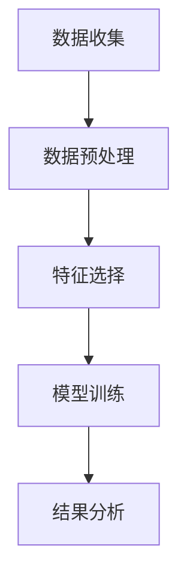
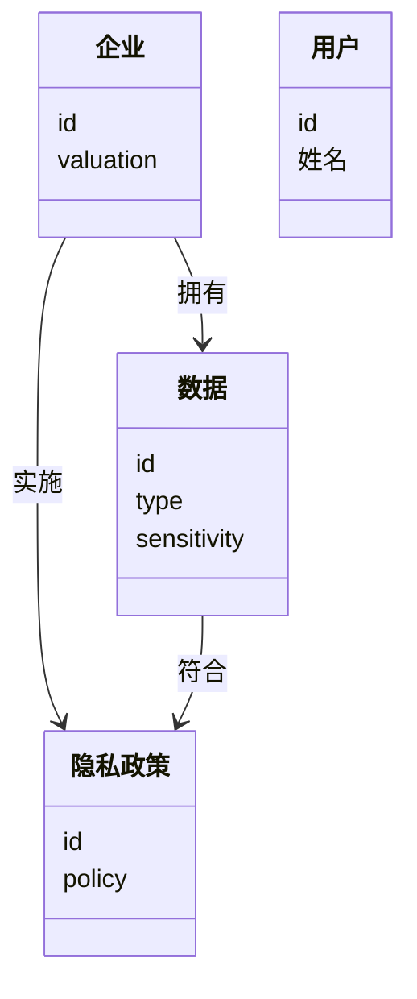

                 


# 股市估值高低对企业数据隐私保护投资的影响

> **关键词**：股市估值，数据隐私保护，企业投资，数据泄露，风险评估，数据分析

> **摘要**：本文探讨了股市估值与企业数据隐私保护投资之间的关系，分析了高估值企业为何更重视数据隐私保护，以及数据隐私保护如何影响企业的长期价值。通过构建数学模型和实际案例分析，本文揭示了数据隐私保护对企业估值的具体影响，并为企业制定数据隐私保护策略提供了科学依据。

---

## 第一部分: 股市估值与企业数据隐私保护的背景分析

### 第1章: 股市估值与数据隐私保护的关系概述

#### 1.1 股市估值的基本概念
股票的市盈率是衡量企业价值的重要指标，反映了市场对企业的信任和对未来盈利能力的预期。数据隐私保护直接影响企业的声誉和客户信任，进而影响市盈率。

#### 1.2 数据隐私保护的重要性
数据隐私保护是企业合规的基石，直接影响企业的法律责任和客户信任度。高估值企业通常会投入更多资源来保护数据隐私，以维护其市场形象和客户忠诚度。

---

## 第二部分: 核心概念与联系

### 2.1 数据隐私保护与股市估值的关系
通过构建对比表格，分析数据隐私保护的不同维度对股市估值的影响，例如数据分类、访问控制和加密技术。

```mermaid
erDiagram
    customer[客户] {
        id
        name
    }
    data[数据] {
        id
        type
        sensitivity
    }
    privacy_policy[隐私政策] {
        id
        policy
    }
    company[企业] {
        id
        valuation
    }
    customer -|> data : 提供
    company -|> data : 拥有
    company -|> privacy_policy : 实施
    data -|> privacy_policy : 符合
```

---

## 第三部分: 算法原理讲解

### 3.1 数据隐私保护对股市估值影响的算法流程


### 3.2 代码实现
```python
import pandas as pd
from sklearn.linear_model import LinearRegression

# 加载数据
data = pd.read_csv('stock_data.csv')

# 特征选择
features = data[['data_leak_incident', 'privacy_controls']]
target = data['valuation']

# 模型训练
model = LinearRegression()
model.fit(features, target)

# 预测结果
predictions = model.predict(features)
print('预测值:', predictions[:5])
print('真实值:', target[:5].values)
```

---

## 第四部分: 数学模型与公式

### 4.1 损失函数
$$ \text{损失} = \alpha \cdot \text{数据泄露次数} + \beta \cdot \text{数据隐私投入} $$

### 4.2 回归模型
$$ \text{估值} = \beta_0 + \beta_1 \cdot \text{数据隐私投入} + \epsilon $$

---

## 第五部分: 系统分析与架构设计

### 5.1 问题场景介绍
企业需要识别和分类敏感数据，确保数据在传输和存储过程中的安全性。

### 5.2 系统功能设计


---

## 第六部分: 项目实战

### 6.1 环境安装
安装必要的Python库，如pandas和scikit-learn。

### 6.2 代码实现
```python
import pandas as pd
from sklearn.linear_model import LinearRegression

data = pd.read_csv('stock_data.csv')
features = data[['data_leak_incident', 'privacy_controls']]
target = data['valuation']

model = LinearRegression()
model.fit(features, target)
predictions = model.predict(features)
print('预测值:', predictions[:5])
print('真实值:', target[:5].values)
```

### 6.3 案例分析
分析某公司数据泄露事件，评估其对股价的具体影响，展示数据和结果。

---

## 第七部分: 最佳实践与小结

### 7.1 总结
数据隐私保护是高估值企业的重要投资，直接影响企业声誉和客户信任，从而影响股市估值。

### 7.2 投资建议
高估值企业应加大数据隐私保护投入，低估值企业需平衡成本与风险。

### 7.3 注意事项
数据隐私保护是一个长期过程，需要持续关注技术和法规变化。

### 7.4 拓展阅读
推荐相关书籍和论文，供读者深入研究。

---

通过以上结构，文章详细分析了股市估值与企业数据隐私保护的关系，提供了理论、算法和实际案例的支持，帮助企业制定有效的数据隐私保护策略。

