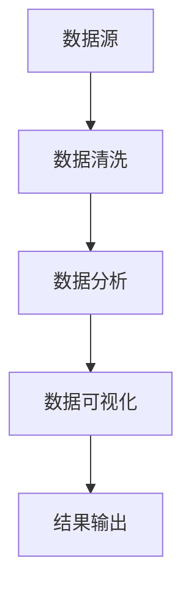
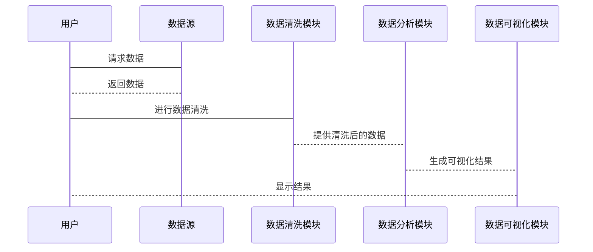

                 


# 股市估值高低对企业社会责任实践的影响

## 关键词：
- 股市估值
- 企业社会责任
- 股票定价
- 股东价值
- 社会责任投资

## 摘要：
股市估值与企业社会责任之间存在着密切的关联。随着社会对可持续发展的关注日益增加，企业社会责任（Corporate Social Responsibility, CSR）已成为影响企业股市估值的重要因素。本文通过分析股市估值与企业社会责任的关系，探讨企业社会责任如何影响股市估值的高低，以及企业如何通过实践社会责任来优化自身的股市表现。文章结合理论分析、数学模型和实际案例，为企业提供在社会责任实践中提升股市估值的策略和方法。

---

## 第1章：股市估值与企业社会责任的背景介绍

### 1.1 股市估值的基本概念
1.1.1 股票估值的定义与计算方法
1.1.2 股票估值与企业价值的关系
1.1.3 股票市场的波动性与投资者行为

### 1.2 企业社会责任的定义与特征
1.2.1 企业社会责任的多维度解读
1.2.2 企业社会责任的核心要素：经济、社会和环境责任
1.2.3 企业社会责任与可持续发展目标的关联

### 1.3 股市估值与企业社会责任的关系
1.3.1 企业社会责任对投资者决策的影响
1.3.2 股市估值对企业社会责任实践的敏感性
1.3.3 企业社会责任与股市估值的双向互动机制

---

## 第2章：企业社会责任对企业股市估值的影响分析

### 2.1 企业社会责任与股市估值的理论基础
2.1.1 利益相关者理论与企业社会责任
2.1.2 社会契约理论与企业价值
2.1.3 股票定价理论中的社会责任因素

### 2.2 企业社会责任对股市估值的具体影响
2.2.1 企业社会责任提升股市估值的路径
2.2.2 企业社会责任不足对股市估值的负面影响
2.2.3 不同行业企业社会责任对股市估值的影响差异

### 2.3 企业社会责任与股市估值的动态关系
2.3.1 高估值企业社会责任的强化效应
2.3.2 低估值企业社会责任的改善空间
2.3.3 股市估值波动对企业社会责任实践的反馈效应

---

## 第3章：股市估值与企业社会责任的数学模型构建

### 3.1 模型构建的理论基础
3.1.1 回归分析在股市估值研究中的应用
3.1.2 社会责任评分与股市估值的关系
3.1.3 统计学方法在模型构建中的作用

### 3.2 数学模型的建立
$$ V = \beta_0 + \beta_1 \cdot CSR + \beta_2 \cdot Financial\ Performance + \epsilon $$

其中：
- \( V \) 表示股市估值
- \( CSR \) 表示企业社会责任评分
- \( Financial\ Performance \) 表示企业财务绩效
- \( \epsilon \) 表示误差项

### 3.3 模型的验证与优化
3.3.1 数据来源与样本选择
3.3.2 模型的假设检验
3.3.3 模型的改进与扩展

---

## 第4章：系统分析与架构设计

### 4.1 系统功能设计
4.1.1 数据采集模块：从公开数据获取企业社会责任与股市估值数据
4.1.2 数据分析模块：利用Python进行数据清洗与建模
4.1.3 可视化模块：生成图表展示企业社会责任与股市估值的关系

### 4.2 系统架构设计


### 4.3 系统接口设计
4.3.1 数据接口：与数据库或API对接
4.3.2 用户接口：直观的可视化界面

### 4.4 系统交互流程


---

## 第5章：项目实战与案例分析

### 5.1 环境安装与数据获取
5.1.1 安装Python与相关库（Pandas、Scikit-learn、Matplotlib）
5.1.2 数据来源：股票数据API（如Yahoo Finance）与企业社会责任评分数据

### 5.2 核心代码实现
```python
import pandas as pd
import numpy as np
from sklearn.linear_model import LinearRegression
import matplotlib.pyplot as plt

# 数据清洗
data = pd.read_csv('stock_csr.csv')
data.dropna(inplace=True)
data['CSR_Score'] = data['CSR_Score'].astype(float)

# 模型训练
X = data[['CSR_Score', 'Financial_Performance']]
y = data['Stock_Valuation']
model = LinearRegression()
model.fit(X, y)

# 模型预测
predicted_valuation = model.predict(X)
plt.scatter(y, predicted_valuation)
plt.xlabel('Actual Valuation')
plt.ylabel('Predicted Valuation')
plt.title('Actual vs Predicted Stock Valuation')
plt.show()
```

### 5.3 案例分析与结果解读
5.3.1 某行业龙头企业的案例分析
5.3.2 模型预测结果与实际数据的对比
5.3.3 企业社会责任提升对股市估值的具体影响

---

## 第6章：总结与展望

### 6.1 核心观点总结
- 企业社会责任是影响股市估值的重要因素
- 高社会责任企业具有更高的长期估值潜力
- 股市估值波动对企业社会责任实践具有反馈效应

### 6.2 未来研究方向
- 更多行业的案例研究
- 长期与短期效应的对比分析
- 数字化工具在社会责任与股市估值研究中的应用

### 6.3 最佳实践建议
- 企业应注重社会责任实践以提升股市估值
- 投资者应关注企业的社会责任表现
- 政府与监管机构应推动社会责任与股市估值的联动机制

### 6.4 注意事项与风险提示
- 数据获取的局限性
- 模型的适用范围与限制
- 市场波动的不确定性

### 6.5 拓展阅读与学习资源
- 推荐书籍：《企业社会责任与可持续发展》
- 推荐网站：全球企业社会责任报告平台

---

## 附录：常用工具与资源

### 附录A：数据分析工具
- Python库：Pandas、Scikit-learn、Matplotlib
- 数据获取工具：Yahoo Finance API、公开企业社会责任报告

### 附录B：相关文献与报告
- 学术论文：企业社会责任与股市估值的相关研究
- 行业报告：社会责任投资（ESG）的趋势分析

### 附录C：代码示例与数据模板
- Python代码模板
- 数据格式与字段说明

---

## 结语

股市估值与企业社会责任的关系是企业治理与社会可持续发展的重要议题。通过本文的分析与实践，企业可以更好地理解社会责任对股市估值的影响，并制定相应的战略以提升自身价值。同时，投资者与监管机构也应关注这一领域，推动企业与市场的共同进步。

