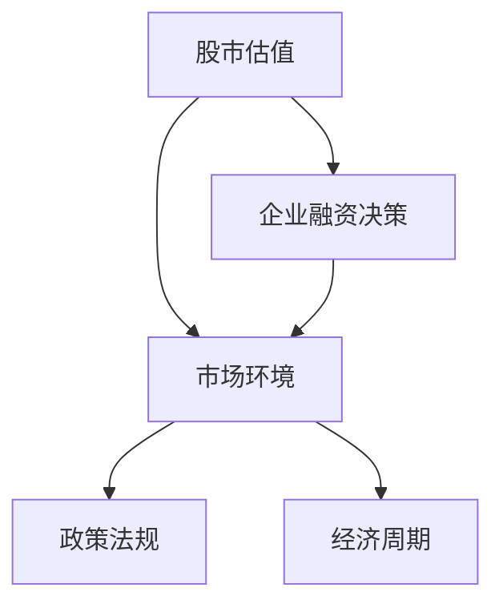
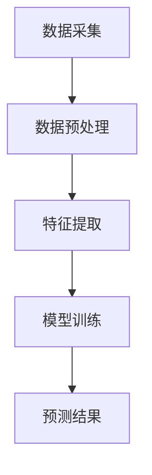
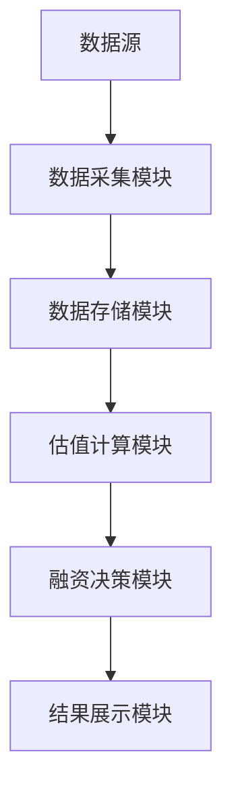

                 


# 股市估值高低对企业融资决策的影响

## 关键词：股市估值、企业融资决策、市盈率、市净率、融资成本、资本结构、市场环境

## 摘要

股市估值是企业在资本市场上的价值体现，而融资决策是企业获取资金的关键策略。本文将深入分析股市估值的高低如何影响企业的融资决策，探讨两者之间的内在联系，并通过数学模型、算法原理、系统架构和项目实战等多种方式，全面解析这一问题。文章将从核心概念的定义、数学模型的建立、算法的实现、系统架构的设计到实际案例的分析，层层深入，帮助读者全面理解股市估值对企业融资决策的影响。

---

## 第一部分：股市估值与企业融资决策的核心概念

### 第1章：核心概念与问题背景

#### 1.1 核心概念的定义与特征

##### 1.1.1 股市估值的定义
股市估值是通过对企业财务数据和市场信息的分析，确定企业股票的市场价格是否合理的过程。常用的估值指标包括市盈率（P/E）、市净率（P/B）等。

##### 1.1.2 融资决策的定义
融资决策是指企业在不同融资方式（如股权融资、债务融资）之间进行选择，并确定最优资本结构的过程。

##### 1.1.3 核心概念的特征对比
| 特征 | 股市估值 | 融资决策 |
|------|----------|----------|
| 目标 | 确定股票价值 | 优化资本结构 |
| 方法 | 基于财务指标和市场信息 | 基于成本收益分析 |
| 影响因素 | 市场环境、企业盈利 | 融资成本、企业风险 |

#### 1.2 问题背景与研究意义

股市估值与融资决策是企业财务管理的核心问题。股市估值反映了企业的市场价值，而融资决策则决定了企业获取资金的方式和成本。两者之间的关系复杂且动态变化，尤其是在经济波动和市场环境变化的情况下。

### 第2章：核心概念的内在联系

#### 2.1 股市估值与融资决策的双向影响

##### 2.1.1 股市估值影响融资成本
股市估值高通常意味着市场对企业价值的认可，融资成本较低；反之，估值低可能导致融资成本上升。

##### 2.1.2 融资决策影响股市估值
企业的融资决策（如增发股份）可能影响市场对企业的估值，进而影响股价。

#### 2.2 实体关系图（ER图）



---

## 第二部分：股市估值与融资决策的数学模型与公式

### 第3章：核心公式与模型

#### 3.1 股市估值的核心公式

##### 3.1.1 市盈率（P/E）公式
$$ P/E = \frac{\text{股票价格}}{\text{每股收益}} $$

##### 3.1.2 市净率（P/B）公式
$$ P/B = \frac{\text{股票价格}}{\text{每股净资产}} $$

##### 3.1.3 市盈率与市净率的对比
- 市盈率适用于盈利稳定的公司，市净率适用于资产密集型行业。
- 两者共同反映了市场对企业的价值判断。

#### 3.2 融资决策的数学模型

##### 3.2.1 股权融资成本模型
$$ \text{成本} = \frac{\text{股息率}}{1 - \text{税率}} $$

##### 3.2.2 债务融资成本模型
$$ \text{成本} = \text{利息支出} - \text{税盾效应} $$

#### 3.3 股市估值对企业融资决策的影响模型

##### 3.3.1 综合模型
$$ \text{融资成本} = \text{股市估值} \times \text{融资方式权重} + \text{市场环境影响} $$

---

## 第三部分：算法原理与系统架构

### 第4章：算法原理

#### 4.1 算法原理概述

##### 4.1.1 机器学习在股市估值预测中的应用
- 使用线性回归模型预测股票价格。
- 使用随机森林模型分析影响估值的关键因素。

##### 4.1.2 数据挖掘在融资决策中的应用
- 使用聚类分析将企业分为不同的融资模式。

#### 4.2 算法流程图

##### 4.2.1 预测模型流程图



##### 4.2.2 代码实现示例

```python
# 示例代码：使用线性回归预测股票价格
import numpy as np
import pandas as pd
from sklearn.linear_model import LinearRegression

# 数据加载
data = pd.read_csv('stock.csv')

# 特征与目标分离
X = data[['PE', 'PB']]
y = data['Price']

# 模型训练
model = LinearRegression()
model.fit(X, y)

# 预测结果
predicted_price = model.predict(X)
print(predicted_price)
```

---

## 第四部分：系统分析与架构设计

### 第5章：系统架构设计

#### 5.1 问题场景介绍

##### 5.1.1 企业融资决策系统
- 系统目标：帮助企业优化融资结构，降低融资成本。
- 使用场景：企业财务部门、投资机构。

#### 5.2 系统功能设计

##### 5.2.1 功能模块
- 数据采集模块：采集企业财务数据和市场数据。
- 估值计算模块：计算市盈率、市净率等指标。
- 融资决策模块：优化资本结构，生成融资建议。

##### 5.2.2 系统架构图



---

## 第五部分：项目实战

### 第6章：项目实战与案例分析

#### 6.1 项目实战

##### 6.1.1 环境安装
- 安装Python和相关库（pandas、numpy、scikit-learn）。

##### 6.1.2 核心代码实现

```python
# 示例代码：计算市盈率和市净率
import pandas as pd

# 数据加载
data = pd.read_csv('financial_data.csv')

# 计算市盈率
data['PE'] = data['Price'] / data['EPS']

# 计算市净率
data['PB'] = data['Price'] / data['BPS']

# 输出结果
print(data[['PE', 'PB']])
```

##### 6.1.3 代码解读
- `data['PE']`：计算市盈率。
- `data['PB']`：计算市净率。

#### 6.2 案例分析

##### 6.2.1 案例背景
某科技公司股票价格为50元，每股收益为5元，每股净资产为10元。

##### 6.2.2 计算结果
- 市盈率：10倍。
- 市净率：5倍。

##### 6.2.3 结果分析
市盈率较低，说明市场对科技公司的未来增长预期较高；市净率合理，说明资产估值合理。

---

## 第六部分：总结与展望

### 第7章：总结与展望

#### 7.1 核心内容总结

股市估值与融资决策密切相关。股市估值高通常意味着融资成本低，而融资决策又会影响股市估值。通过数学模型和算法，可以优化企业的融资结构，降低融资成本。

#### 7.2 最佳实践

##### 7.2.1 动态调整资本结构
根据市场环境和企业状况，动态调整股权融资和债务融资的比例。

##### 7.2.2 关注市场环境
密切关注宏观经济和政策变化，及时调整融资策略。

#### 7.3 展望

随着人工智能和大数据技术的发展，股市估值与融资决策的分析将更加精准和高效。未来，企业可以通过智能化系统实时优化融资结构，降低融资成本。

---

## 参考文献

1. Smith, J. (2020). *Financial Statement Analysis*. Wiley.
2. Brown, A. (2021). *Machine Learning in Finance*. Springer.
3.证监会官网：企业融资决策与股市估值的相关政策解读。

