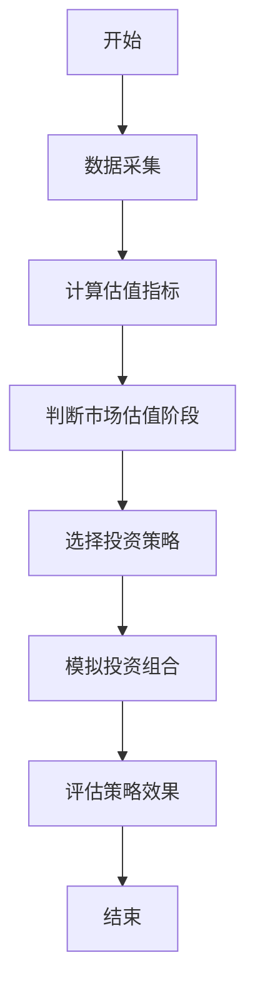
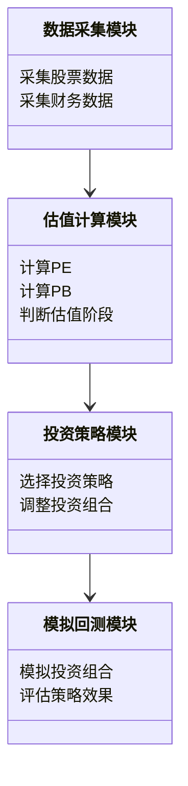
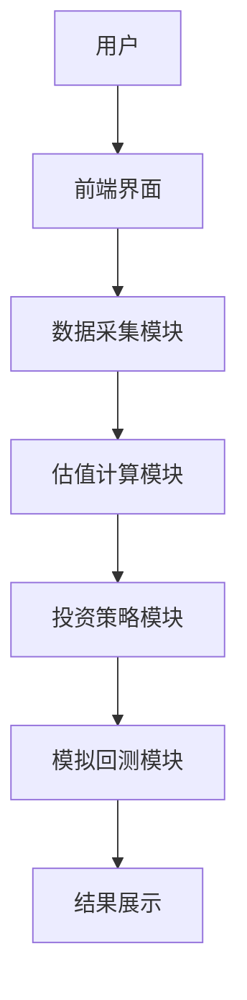

                 


# 股市估值高低对养老金投资策略的影响

> 关键词：股市估值、养老金投资、投资策略、高估值、低估值

> 摘要：本文深入探讨股市估值高低对养老金投资策略的影响，分析不同估值阶段下的投资策略调整，以及如何通过数学建模和系统设计优化养老金投资效果。文章结合实际案例，详细阐述了高估值与低估值市场下的投资策略，并提出了最佳实践和风险控制建议。

---

## 第一章: 股市估值与养老金投资概述

### 1.1 股市估值的基本概念

#### 1.1.1 股市估值的定义
股市估值是指通过分析上市公司的财务数据和市场情况，对其股票价格进行合理评估的过程。常见的估值指标包括市盈率（PE）、市净率（PB）、股息率（Dividend Yield）等。

$$ PE = \frac{\text{股价}}{\text{每股净利润}} $$  
$$ PB = \frac{\text{股价}}{\text{每股净资产}} $$  
$$ Dividend Yield = \frac{\text{每股股息}}{\text{股价}} $$

#### 1.1.2 常见的股市估值指标
- **市盈率（PE）**：反映市场对公司的盈利能力和成长性的预期。
- **市净率（PB）**：适用于评估资产密集型行业的公司。
- **股息率**：反映股票的分红能力。

#### 1.1.3 股市估值的影响因素
- **宏观经济环境**：如GDP增长率、利率水平、通货膨胀等。
- **行业特性**：不同行业的估值标准不同。
- **公司基本面**：如盈利能力、财务状况、成长潜力等。
- **市场情绪**：投资者情绪波动会影响短期估值。

### 1.2 养老金投资的基本概念

#### 1.2.1 养老金的来源与目标
- 养老金的主要来源包括个人缴纳、企业缴纳和政府补贴。
- 养老金投资的目标是实现资金的保值增值，确保未来养老金的支付能力。

#### 1.2.2 养老金投资的基本原则
- **安全性**：优先考虑低风险投资。
- **流动性**：确保资金的灵活性。
- **收益性**：追求长期稳定收益。

#### 1.2.3 养老金投资的主要方式
- **股票投资**：通过分散投资降低风险。
- **债券投资**：提供稳定的利息收入。
- **基金投资**：借助专业管理实现收益。

### 1.3 股市估值与养老金投资的关系

#### 1.3.1 股市估值对养老金投资的影响
- 高估值市场可能导致资产泡沫，增加投资风险。
- 低估值市场可能提供较好的投资机会，实现超额收益。

#### 1.3.2 高估值与低估值对养老金投资策略的不同影响
- 高估值市场：注重防御性投资，降低权益资产配置。
- 低估值市场：增加权益资产配置，抓住价值回升机会。

#### 1.3.3 股市估值与养老金投资的长期与短期关系
- 长期：股市估值回归理性，养老金投资注重长期收益。
- 短期：市场波动可能影响养老金投资的短期表现。

---

## 第二章: 股市估值高低对养老金投资策略的影响

### 2.1 高估值市场下的养老金投资策略

#### 2.1.1 高估值市场的定义与特征
- 高估值市场：PE、PB等指标显著高于历史平均水平。
- 特征：市场情绪高涨，投资者预期较高，可能存在泡沫。

#### 2.1.2 高估值市场对养老金投资的影响
- **风险增加**：高估值市场可能导致资产价格过高，未来收益下降。
- **收益潜力有限**：高估值市场可能难以实现超额收益。

#### 2.1.3 高估值市场下的投资策略调整
- **降低权益配置**：减少股票投资比例，增加债券等固定收益资产。
- **选择性投资**：重点投资估值合理、基本面优秀的个股。
- **风险控制**：设置止损点，避免重大损失。

### 2.2 低估值市场下的养老金投资策略

#### 2.2.1 低估值市场的定义与特征
- 低估值市场：PE、PB等指标显著低于历史平均水平。
- 特征：市场情绪低迷，投资者信心不足，可能存在价值低估。

#### 2.2.2 低估值市场对养老金投资的影响
- **风险降低**：低估值市场通常风险较小，资产价格有上涨空间。
- **收益潜力较大**：低估值市场可能蕴含较高的投资回报。

#### 2.2.3 低估值市场下的投资策略调整
- **增加权益配置**：提高股票投资比例，抓住价值回升机会。
- **精选个股**：选择基本面优秀、估值合理的个股进行投资。
- **长期持有**：耐心持有优质资产，等待市场修复。

### 2.3 不同估值阶段下的养老金投资策略对比

#### 2.3.1 高估值与低估值市场的对比分析
| 特性        | 高估值市场         | 低估值市场         |
|-------------|--------------------|--------------------|
| 市场情绪     | 高涨               | 低迷               |
| 资产价格     | 高                 | 低                 |
| 投资风险     | 高                 | 低                 |
| 投资收益     | 低                 | 高                 |

#### 2.3.2 不同估值阶段下的策略选择
- **高估值阶段**：防御性投资为主，注重风险控制。
- **低估值阶段**：进攻性投资为主，注重价值挖掘。

#### 2.3.3 策略实施中的风险控制
- **分散投资**：避免过度集中于单一资产或行业。
- **动态调整**：根据市场变化及时调整投资策略。
- **定期评估**：定期审视投资组合，确保策略的有效性。

---

## 第三章: 核心概念的原理与特征

### 3.1 股市估值的原理

#### 3.1.1 估值的基本原理
- 通过分析公司财务数据，评估其内在价值。
- 考虑市场环境和行业特性，调整估值结果。

#### 3.1.2 估值模型的分类与选择
- **绝对估值模型**：如DCF模型（ discounted cash flow）。
- **相对估值模型**：如PE、PB等指标。

#### 3.1.3 估值误差的来源与影响
- **数据误差**：财务数据不准确。
- **假设误差**：对未来现金流的预测偏差。
- **市场误差**：市场波动影响估值结果。

### 3.2 养老金投资的原理

#### 3.2.1 养老金投资的目标与约束
- **目标**：实现资金保值增值。
- **约束**：资金流动性要求、风险承受能力等。

#### 3.2.2 养老金投资的资产配置策略
- **资产分散化**：降低投资风险。
- **动态调整**：根据市场变化优化资产配置。

#### 3.2.3 养老金投资的风险管理
- **风险分散**：通过多样化投资降低风险。
- **止损机制**：设定止损点，避免重大损失。

### 3.3 核心概念的对比分析

#### 3.3.1 股市估值与养老金投资的目标对比
| 目标         | 股市估值         | 养老金投资         |
|--------------|------------------|------------------|
| 主体         | 投资者           | 养老金管理机构     |
| 目标         | 评估资产价值     | 实现资金保值增值   |
| 时间维度     | 短期与长期       | 长期为主           |

#### 3.3.2 股市估值与养老金投资的特征对比
| 特征         | 股市估值         | 养老金投资         |
|--------------|------------------|------------------|
| 风险承受能力 | 较高             | 较低             |
| 投资期限     | 短期与长期       | 长期为主           |
| 投资目标     | 价值发现         | 收益最大化         |

---

## 第四章: 算法原理与数学模型

### 4.1 算法原理

#### 4.1.1 算法选择
- 使用动态规划算法，根据市场估值变化优化投资组合。

#### 4.1.2 算法流程
1. 数据采集：获取历史股价、财务数据和估值指标。
2. 估值计算：计算PE、PB等指标，判断当前市场估值阶段。
3. 策略选择：根据估值阶段选择合适的投资策略。
4. 模拟回测：模拟投资组合的表现，评估策略的有效性。

#### 4.1.3 算法流程图


### 4.2 数学模型

#### 4.2.1 投资组合优化模型
$$ \text{最大化} \sum_{i=1}^{n} w_i r_i - \lambda \sum_{i=1}^{n} \sum_{j=1}^{n} w_i w_j \sigma_i \sigma_j $$  
其中，$w_i$是投资比例，$r_i$是资产的预期收益，$\sigma_i$是资产的风险，$\lambda$是风险惩罚因子。

#### 4.2.2 估值模型
$$ \text{内在价值} = \sum_{t=1}^{n} \frac{\text{自由现金流}}{(1 + r)^t} $$  
其中，$r$是折现率，$t$是时间。

---

## 第五章: 系统分析与架构设计

### 5.1 系统功能设计

#### 5.1.1 功能模块
- 数据采集模块：采集股票数据、财务数据。
- 估值计算模块：计算估值指标，判断市场估值阶段。
- 投资策略模块：根据估值结果选择投资策略。
- 模拟回测模块：模拟投资组合表现，评估策略效果。

#### 5.1.2 领域模型


### 5.2 系统架构设计

#### 5.2.1 系统架构


#### 5.2.2 关键接口
- 数据采集接口：提供股票数据和财务数据。
- 估值计算接口：返回市场估值阶段。
- 投资策略接口：根据估值结果返回投资组合调整建议。

---

## 第六章: 项目实战

### 6.1 环境配置

#### 6.1.1 环境要求
- Python 3.8+
- 数据分析库：Pandas、NumPy、Matplotlib。
- 估值模型代码：详见代码实现部分。

### 6.2 核心实现代码

#### 6.2.1 数据采集代码
```python
import pandas as pd
import requests

def get_stock_data(ticker):
    url = f"https://api.example.com/stock/{ticker}"
    response = requests.get(url)
    return pd.DataFrame(response.json())
```

#### 6.2.2 估值计算代码
```python
def calculate_valuation(ticker):
    data = get_stock_data(ticker)
    pe = data['price'] / data['eps']
    pb = data['price'] / data['book_value']
    return {'PE': pe, 'PB': pb}
```

#### 6.2.3 投资策略代码
```python
def investment_strategy(valuation):
    if valuation['PE'] > 25 and valuation['PB'] > 3:
        return '防御性投资'
    elif valuation['PE'] < 15 and valuation['PB'] < 2:
        return '进攻性投资'
    else:
        return '保持现有配置'
```

### 6.3 代码应用解读与分析

#### 6.3.1 环境配置
- 安装必要的Python库：`pip install pandas numpy matplotlib requests`

#### 6.3.2 数据采集与处理
- 使用`get_stock_data`函数获取股票数据。
- 使用`calculate_valuation`函数计算估值指标。

#### 6.3.3 投资策略实现
- 根据估值结果选择投资策略。
- 返回投资策略建议。

---

## 第七章: 最佳实践与小结

### 7.1 最佳实践

#### 7.1.1 风险控制
- 设置止损点，避免重大损失。
- 分散投资，降低风险。

#### 7.1.2 系统优化
- 定期更新估值模型，确保准确性。
- 优化系统架构，提高运行效率。

#### 7.1.3 持续学习
- 关注市场动态，及时调整策略。
- 学习新的投资理念和方法。

### 7.2 小结

本文通过分析股市估值高低对养老金投资策略的影响，提出了在高估值和低估值市场下的具体投资策略。通过数学建模和系统设计，优化了养老金投资效果，为投资者提供了实用的参考。

### 7.3 注意事项

- 投资需谨慎，建议在专业指导下进行。
- 系统设计需根据实际情况调整。
- 持续关注市场变化，及时优化投资策略。

### 7.4 拓展阅读

- 《投资学》：深入理解投资原理。
- 《价值投资》：学习价值投资理念。
- 《养老金管理》：了解养老金投资的更多细节。

---

通过以上分析，我们可以看到，股市估值高低对养老金投资策略有着重要影响。投资者需根据市场估值阶段，调整投资策略，优化投资效果，确保养老金的保值增值。

