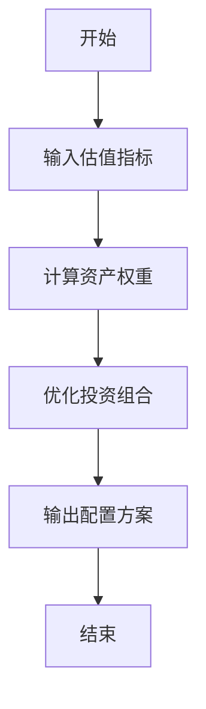
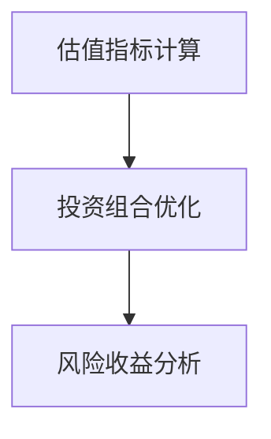

                 


# 股市估值高低对国际投资组合配置的影响

> 关键词：股市估值、投资组合配置、市盈率、市净率、资产配置优化、国际投资

> 摘要：本文探讨了股市估值高低对国际投资组合配置的影响，通过分析股市估值的核心概念、投资组合配置的基本原理、估值指标对配置策略的指导作用，以及基于估值的资产配置优化算法，为投资者提供科学的配置建议。文章结合实际案例，深入分析了如何根据股市估值动态调整投资组合，以实现风险可控、收益最大化的目标。

---

## 第1章: 股市估值与投资组合配置的背景介绍

### 1.1 股市估值的基本概念

#### 1.1.1 什么是股市估值
股市估值是指通过对公司财务数据和市场信息的分析，估算其股票的内在价值或市场价格与实际价值之间的关系。常见的估值指标包括市盈率（P/E）、市净率（P/B）、市销率（P/S）等。

#### 1.1.2 股市估值的重要性
股市估值是投资者进行投资决策的重要依据。通过合理的估值分析，投资者可以判断股票是否被高估或低估，从而做出买入、卖出或持有决策。

#### 1.1.3 股市估值的核心要素
- 公司基本面数据（如营业收入、净利润、自由现金流等）
- 市场利率、通货膨胀等宏观经济因素
- 行业竞争状况和公司竞争优势

### 1.2 国际投资组合配置的概述

#### 1.2.1 投资组合配置的基本概念
投资组合配置是指根据投资者的风险承受能力、收益目标和市场环境，将资金分配到不同资产类别（如股票、债券、现金等）中的过程。

#### 1.2.2 国际投资组合的特点
- 多元化：分散投资于不同国家和地区的资产，降低风险。
- 动态调整：根据市场环境变化和估值指标调整配置比例。
- 风险收益平衡：在风险可控的前提下追求最大收益。

#### 1.2.3 投资组合配置的目标与原则
目标：
- 实现资产的长期保值和增值。
- 优化风险收益比。

原则：
- 分散投资：避免过度集中于某一种资产或市场。
- 长期视角：关注长期收益，避免短期波动的干扰。
- 定期调整：根据市场变化和估值指标动态调整配置比例。

### 1.3 股市估值与投资组合配置的关系

#### 1.3.1 股市估值对投资组合配置的影响
- 高估值市场：减少高估值资产的配置比例，避免潜在的回调风险。
- 低估值市场：增加低估值资产的配置比例，挖掘潜在收益。

#### 1.3.2 高低估值对投资组合配置的指导意义
- 高估值资产：可能面临调整压力，需谨慎配置。
- 低估值资产：具备安全边际，适合长期持有。

#### 1.3.3 估值周期与投资策略的调整
- 在高估值市场中，投资者应注重风险控制，适当增加防御性资产（如债券、现金）的配置比例。
- 在低估值市场中，投资者可以增加权益类资产的配置比例，捕捉市场的回升机会。

---

## 第2章: 股市估值的核心概念与分析方法

### 2.1 股市估值的核心概念

#### 2.1.1 市盈率（P/E）的定义与计算
市盈率 = 股票价格 / 每股净利润（EPS）

- 低市盈率：可能意味着股票被低估，具备投资价值。
- 高市盈率：可能意味着股票被高估，存在回调风险。

#### 2.1.2 市净率（P/B）的定义与计算
市净率 = 股票价格 / 每股净资产（BPS）

- 低市净率：可能意味着股票被低估，适合价值投资者。
- 高市净率：可能意味着股票被高估，需谨慎考虑。

#### 2.1.3 市销率（P/S）的定义与计算
市销率 = 股票价格 / 每股营业收入（Revenue per share）

- 低市销率：可能意味着股票被低估，具备投资价值。
- 高市销率：可能意味着股票被高估，需谨慎考虑。

### 2.2 股市估值的分析方法

#### 2.2.1 相对估值法
相对估值法是通过比较同类资产的估值指标，判断目标资产的相对高低。

- 常用指标：市盈率、市净率、市销率。
- 应用场景：适用于成熟市场和同质化程度较高的资产。

#### 2.2.2 绝对估值法
绝对估值法是通过对公司未来现金流的贴现，计算其内在价值。

- 常用模型：现金流贴现模型（DCF）。
- 应用场景：适用于具有明确增长前景的公司。

#### 2.2.3 市场情绪与估值的关系
市场情绪是影响估值的重要因素。在市场情绪乐观时，高估值资产可能继续被推高；在市场情绪悲观时，低估值资产可能进一步被低估。

### 2.3 股市估值的核心指标对比

#### 2.3.1 市盈率与市净率的对比分析
| 指标 | 市盈率（P/E） | 市净率（P/B） |
|------|----------------|---------------|
| 定义 | 价格 / 净利润 | 价格 / 净资产 |
| 适用场景 | 高增长行业 | 低增长行业 |
| 优势 | 反映盈利能力 | 反映资产质量 |

#### 2.3.2 市盈率与市销率的对比分析
| 指标 | 市盈率（P/E） | 市销率（P/S） |
|------|----------------|---------------|
| 定义 | 价格 / 净利润 | 价格 / 营收 |
| 适用场景 | 利润稳定的公司 | 营收增长快的公司 |
| 优势 | 反映盈利能力 | 反映收入能力 |

#### 2.3.3 不同估值指标的适用场景
- 市盈率适用于利润稳定的公司。
- 市净率适用于净资产较高的公司。
- 市销率适用于营业收入增长快的公司。

### 2.4 本章小结

---

## 第3章: 投资组合配置的数学模型与算法原理

### 3.1 投资组合配置的数学模型

#### 3.1.1 现金流贴现模型
现金流贴现模型（DCF）用于估算公司的内在价值，公式如下：

$$ V = \sum_{t=1}^{n} \frac{CF_t}{(1 + r)^t} $$

其中：
- \( V \) 为公司内在价值
- \( CF_t \) 为第 \( t \) 年的现金流
- \( r \) 为折现率
- \( n \) 为预测年数

#### 3.1.2 马科维茨有效投资组合模型
马科维茨的有效投资组合模型旨在通过优化风险收益比，找到最优的资产配置比例。

公式：
$$ \min_w \left( \frac{1}{2} w^T \Sigma w \right) $$
$$ \text{subject to } \mathbf{w}^T \mathbf{1} = 1 $$

其中：
- \( w \) 为资产权重向量
- \( \Sigma \) 为资产间的协方差矩阵
- \( \mathbf{1} \) 为全为1的向量

#### 3.1.3 均值-方差优化模型
均值-方差优化模型通过最小化投资组合的方差（风险），在给定收益下找到最优配置。

公式：
$$ \min_w \left( w^T \Sigma w \right) $$
$$ \text{subject to } \mathbf{w}^T \mathbf{\mu} = \text{target return} $$

其中：
- \( \mu \) 为资产的期望收益向量
- \( \Sigma \) 为资产间的协方差矩阵

### 3.2 股市估值对投资组合配置的影响算法

#### 3.2.1 估值指标对权重分配的影响
根据资产的估值指标（如市盈率、市净率等），动态调整其在投资组合中的权重。

#### 3.2.2 基于估值的资产配置优化算法


#### 3.2.3 估值调整对组合风险收益的影响
通过调整高估值资产的权重，降低组合的整体风险；增加低估值资产的权重，提升组合的收益潜力。

### 3.3 本章小结

---

## 第4章: 国际投资组合配置的系统分析与架构设计

### 4.1 问题场景介绍

#### 4.1.1 投资者面临的估值挑战
- 如何准确判断资产的估值高低？
- 如何动态调整投资组合配置比例？

#### 4.1.2 国际市场配置的复杂性
- 不同国家和地区的市场环境差异大。
- 汇率波动对投资组合的影响。

#### 4.1.3 估值与配置的动态关系
- 高估值市场可能面临调整压力。
- 低估值市场可能具备投资机会。

### 4.2 系统功能设计

#### 4.2.1 估值指标计算模块
- 输入：公司财务数据、市场数据。
- 输出：市盈率、市净率等估值指标。

#### 4.2.2 投资组合优化模块
- 输入：估值指标、风险偏好。
- 输出：最优资产配置比例。

#### 4.2.3 风险收益分析模块
- 输入：投资组合配置比例。
- 输出：组合的风险收益比、潜在收益。

### 4.3 系统架构设计

#### 4.3.1 系统功能模块图


#### 4.3.2 系统交互流程图
```mermaid
graph TD
    User --> A[输入数据]
    A --> B[计算估值指标]
    B --> C[优化配置比例]
    C --> D[输出配置建议]
    User <-- D[获取配置建议]
```

### 4.4 本章小结

---

## 第5章: 项目实战——基于估值的国际投资组合配置

### 5.1 环境安装与配置

#### 5.1.1 安装Python环境
- 安装Python 3.8及以上版本。
- 安装必要的库：pandas、numpy、scipy、plotly。

#### 5.1.2 数据获取
- 从金融数据提供商获取股票数据。
- 下载相关宏观经济数据。

### 5.2 核心代码实现

#### 5.2.1 估值指标计算
```python
import pandas as pd

def calculate_valuation_indicators(stock_data):
    # 计算市盈率
    pe_ratio = stock_data['Close'] / stock_data['EPS']
    # 计算市净率
    pb_ratio = stock_data['Close'] / stock_data['BPS']
    # 计算市销率
    ps_ratio = stock_data['Close'] / stock_data['Revenue per share']
    return pe_ratio, pb_ratio, ps_ratio
```

#### 5.2.2 投资组合优化
```python
import numpy as np
from scipy.optimize import minimize

def optimize_portfolio(weights, covariance_matrix, target_return):
    # 定义目标函数
    def objective_function(x):
        return np.dot(x.T, covariance_matrix @ x)
    # 定义约束条件
    constraints = [
        {'type': 'eq', 'fun': lambda x: np.sum(x) - 1.0}
    ]
    # 求解优化问题
    result = minimize(objective_function, weights, constraints=constraints)
    return result.x
```

### 5.3 实际案例分析

#### 5.3.1 案例背景
假设投资者希望配置一个包含美国、欧洲和亚洲股票的投资组合。

#### 5.3.2 估值指标计算
```python
# 假设 stock_data 包含不同地区的股票数据
pe_us, pb_us, ps_us = calculate_valuation_indicators(stock_data_us)
pe_eu, pb_eu, ps_eu = calculate_valuation_indicators(stock_data_eu)
pe_as, pb_as, ps_as = calculate_valuation_indicators(stock_data_as)
```

#### 5.3.3 投资组合优化
```python
# 假设初始权重为 [0.3, 0.3, 0.4]
initial_weights = np.array([0.3, 0.3, 0.4])
covariance_matrix = ...  # 计算得到的协方差矩阵
optimized_weights = optimize_portfolio(initial_weights, covariance_matrix, target_return=0.08)
```

### 5.4 本章小结

---

## 第6章: 最佳实践与注意事项

### 6.1 最佳实践
- 定期回顾和调整投资组合。
- 结合宏观经济环境和市场情绪进行估值分析。
- 采用多元化的投资策略，降低风险。

### 6.2 小结
本文通过分析股市估值对国际投资组合配置的影响，为投资者提供了科学的配置建议。投资者可以根据市场环境和估值指标，动态调整投资组合，实现风险可控、收益最大化的目标。

### 6.3 注意事项
- 估值指标仅供参考，需结合实际情况进行判断。
- 投资组合配置需根据个人风险偏好进行调整。
- 定期审视和优化投资组合，避免过度集中。

### 6.4 拓展阅读
- 马科维茨的有效投资组合理论。
- 现金流贴现模型的详细应用。
- 国际投资中的汇率风险管理。

---

## 第7章: 总结与展望

### 7.1 总结
本文系统地探讨了股市估值高低对国际投资组合配置的影响，通过理论分析、算法优化和实际案例，为投资者提供了科学的配置建议。

### 7.2 展望
未来的研究可以进一步结合人工智能技术，开发更智能的投资组合优化算法。同时，探索更多元化的资产配置策略，以应对复杂的市场环境。

---

# 附录: 参考文献

1. 马科维茨，H. M. (1952). Portfolio Selection. Journal of Finance.
2. 纳什，J. (1950). The Bargaining Problem. Econometrica.
3. 弗里德曼，M. (1970). A Theory of the Consumption Function. Princeton University Press.

---

# 结束语

通过本文的分析，投资者可以更好地理解股市估值对国际投资组合配置的影响，并根据实际情况动态调整投资策略，实现长期稳健的投资回报。

