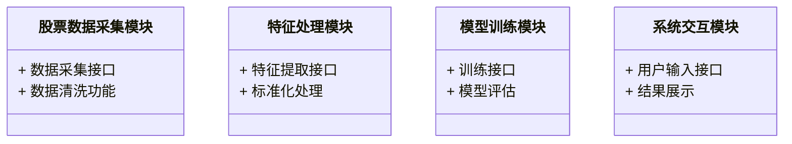

                 


# 股息率与全球股市估值的关系

## 关键词：股息率、股市估值、相关性分析、机器学习模型、投资策略

## 摘要：本文系统探讨股息率与全球股市估值之间的关系，通过数据分析、数学建模和机器学习算法，揭示股息率对股市估值的影响机制，并提出基于股息率的投资策略。文章从背景介绍、核心概念、算法原理、系统架构到项目实战，全面解析股息率与股市估值的关系，为投资者提供科学的决策依据。

---

# 第一章：背景介绍

## 1.1 股息率的定义与计算

股息率是衡量股票投资回报的重要指标，定义为每股股息（DPS）与股票市价（P）的比率：

$$ \text{股息率} = \frac{\text{每股股息}}{\text{股票价格}} $$

其中，每股股息是上市公司分配给每股股票的股息金额，股票价格是市场交易价格。股息率反映了股票的分红能力，是投资者评估投资收益的重要指标。

## 1.2 股市估值的基本概念

股市估值是衡量市场整体价值的指标，常用的估值指标包括市盈率（P/E）和市净率（P/B）。市盈率是股票价格与每股收益（EPS）的比率：

$$ \text{市盈率} = \frac{\text{股票价格}}{\text{每股收益}} $$

市净率是股票价格与每股净资产的比率：

$$ \text{市净率} = \frac{\text{股票价格}}{\text{每股净资产}} $$

这些指标共同反映了市场的整体估值水平，帮助投资者判断市场是否被高估或低估。

## 1.3 股息率与股市估值的关系

股息率与股市估值密切相关。股息率高的股票通常具有较高的分红能力，吸引价值投资者，从而推高股价；反之，股息率低的股票可能被市场冷落，导致股价下跌。这种关系通过股息率对市场整体估值的反馈作用，影响市场的整体表现。

---

# 第二章：股息率与股市估值的核心概念分析

## 2.1 核心概念的原理

股息率的内在逻辑在于分红能力，反映了企业的盈利能力和分红意愿。股市估值的理论基础包括基本面分析和市场情绪分析，两者共同作用于市场估值。

## 2.2 核心概念的属性对比

通过对比股息率与其他估值指标（如市盈率、市净率），可以发现股息率更关注分红能力，而市盈率和市净率更关注盈利能力和发展潜力。

| 指标 | 定义 | 作用 |
|------|------|------|
| 股息率 | 每股股息/股票价格 | 衡量分红能力 |
| 市盈率 | 股票价格/每股收益 | 衡量估值水平 |
| 市净率 | 股票价格/每股净资产 | 衡量资产价值 |

## 2.3 ER实体关系图

```mermaid
er
  股票
  ----> 股东: 持股比例
  股票
  ----> 股息: 每股股息
  股票
  ----> 市场估值: 市盈率、市净率
```

---

# 第三章：股息率与股市估值的相关性分析

## 3.1 数据预处理与特征提取

数据预处理包括数据清洗和特征选择。特征选择通常包括股息率、市盈率、市净率等指标。

```python
import pandas as pd

# 数据清洗
df.dropna(inplace=True)

# 特征选择
features = ['股息率', '市盈率', '市净率']
df = df[features]
```

## 3.2 相关性分析

通过计算Pearson相关系数，分析股息率与市盈率的相关性：

$$ r = \frac{\sum (x_i - \bar{x})(y_i - \bar{y})}{\sqrt{\sum (x_i - \bar{x})^2 \sum (y_i - \bar{y})^2}} $$

其中，$r$为相关系数，$x$和$y$分别为股息率和市盈率的数据。

## 3.3 相关性矩阵可视化

使用Python的seaborn库绘制相关性矩阵：

```python
import seaborn as sns

corr_matrix = df.corr()
sns.heatmap(corr_matrix, annot=True, cmap='coolwarm')
```

---

# 第四章：股息率预测模型的构建

## 4.1 数据预处理与特征选择

对数据进行标准化处理，并选择股息率、市盈率等特征。

```python
from sklearn.preprocessing import StandardScaler

scaler = StandardScaler()
df_scaled = scaler.fit_transform(df)
```

## 4.2 机器学习模型构建

使用线性回归和随机森林进行预测。

```python
from sklearn.linear_model import LinearRegression
from sklearn.ensemble import RandomForestRegressor

# 线性回归模型
lr_model = LinearRegression()
lr_model.fit(X_train, y_train)

# 随机森林模型
rf_model = RandomForestRegressor()
rf_model.fit(X_train, y_train)
```

## 4.3 模型评估与优化

评估模型性能，调整超参数。

```python
from sklearn.metrics import mean_squared_error

# 线性回归评估
y_pred_lr = lr_model.predict(X_test)
mse_lr = mean_squared_error(y_test, y_pred_lr)
print(f'线性回归 MSE: {mse_lr}')

# 随机森林评估
y_pred_rf = rf_model.predict(X_test)
mse_rf = mean_squared_error(y_test, y_pred_rf)
print(f'随机森林 MSE: {mse_rf}')
```

---

# 第五章：基于股息率的全球股市估值策略

## 5.1 不同市场环境下的策略选择

根据市场环境调整投资策略，例如在高股息率市场中投资防御性股票。

## 5.2 策略的有效性和风险

通过回测分析策略的有效性，评估风险和收益。

---

# 第六章：系统分析与架构设计方案

## 6.1 问题场景介绍

系统需要实时监控全球股市数据，分析股息率与估值的关系。

## 6.2 系统功能设计

使用Mermaid类图展示系统功能模块。



## 6.3 系统架构设计

使用Mermaid架构图展示系统架构。

```mermaid
context 股票估值系统 {
  股票数据采集模块 --> 特征处理模块
  特征处理模块 --> 模型训练模块
  模型训练模块 --> 系统交互模块
}
```

---

# 第七章：项目实战

## 7.1 环境安装

安装必要的Python库，如Pandas、NumPy、Scikit-learn等。

## 7.2 核心代码实现

实现数据采集、特征处理和模型训练。

```python
import pandas as pd
import numpy as np
from sklearn.linear_model import LinearRegression

# 数据采集
df = pd.read_csv('stock_data.csv')

# 特征处理
features = df[['股息率', '市盈率', '市净率']]
target = df['市场估值']

# 模型训练
model = LinearRegression()
model.fit(features, target)
```

## 7.3 案例分析

分析具体市场的股息率与估值关系，例如分析科技股和传统行业的差异。

---

# 第八章：最佳实践与小结

## 8.1 最佳实践

建议投资者结合股息率和市场估值进行综合分析，避免单一指标决策。

## 8.2 小结

本文通过系统分析股息率与全球股市估值的关系，揭示了两者之间的内在联系，并提出了科学的投资策略。

## 8.3 注意事项

投资者应关注市场环境和公司基本面，避免盲目跟从股息率指标。

## 8.4 拓展阅读

建议进一步研究股息率在不同经济周期中的表现，以及复杂模型在预测中的应用。

---

通过以上章节，读者可以全面理解股息率与全球股市估值的关系，并能够将其应用于实际投资分析中。

