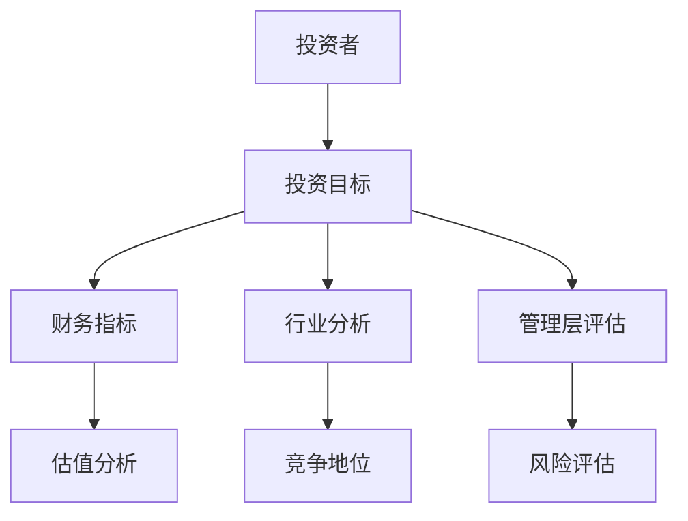
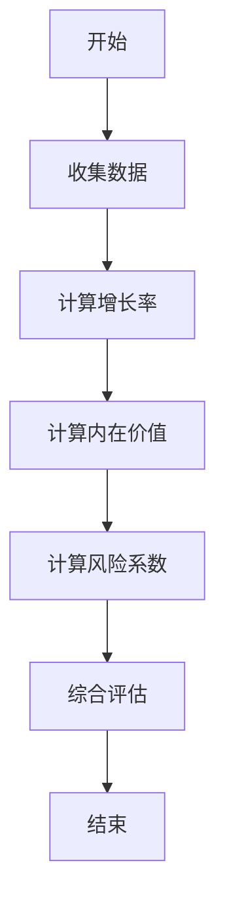

                 

# 肯尼斯·费雪的增长型价值投资

> **关键词**：增长型投资、价值投资、肯尼斯·费雪、投资策略、财务分析、风险管理、投资组合

> **摘要**：本文深入探讨了肯尼斯·费雪提出的增长型价值投资策略，分析其核心概念、算法原理、系统架构，并通过实际案例展示其在投资组合管理中的应用。文章结合理论与实践，为投资者提供了一套科学的投资方法，帮助其在复杂多变的市场中实现稳健收益。

---

## 第一部分：增长型价值投资的背景与核心概念

### 第1章：增长型价值投资的背景与核心概念

#### 1.1 增长型价值投资的背景

- **1.1.1 投资学的发展历程**  
  介绍了投资学从传统到现代的发展历程，强调了增长型与价值型投资的演变。

- **1.1.2 费雪投资理论的起源与演变**  
  讲述了肯尼斯·费雪的背景及其投资理论的形成过程，说明了增长型价值投资的来源。

- **1.1.3 增长型价值投资的重要性**  
  分析了在当前市场环境下，增长型价值投资的优势及其适用性。

#### 1.2 增长型价值投资的核心概念

- **1.2.1 增长型投资的定义与特点**  
  解释了增长型投资的定义，强调其注重公司未来增长潜力的特点。

- **1.2.2 价值投资的定义与特点**  
  介绍了价值投资的基本理念，强调寻找被市场低估的股票。

- **1.2.3 增长型价值投资的整合理念**  
  结合增长与价值的双重标准，提出了综合评估模型。

#### 1.3 增长型价值投资的核心要素

- **1.3.1 财务指标分析**  
  介绍了市盈率、市净率等关键财务指标的作用。

- **1.3.2 行业分析与竞争地位**  
  强调了行业分析的重要性，以及公司竞争地位对投资决策的影响。

- **1.3.3 管理层能力评估**  
  分析了管理层能力对公司长期增长的影响。

- **1.3.4 市场情绪与估值分析**  
  探讨了市场情绪对股票估值的影响，以及如何在市场波动中把握投资机会。

---

## 第二部分：增长型价值投资的核心概念与联系

### 第2章：增长型价值投资的核心概念原理

#### 2.1 增长型价值投资的原理

- **2.1.1 增长型投资的内在逻辑**  
  解释了为什么增长型企业值得投资，以及其与企业生命周期的关系。

- **2.1.2 价值投资的内在逻辑**  
  强调了寻找市场低估股票的重要性，以及其与市场有效性的关系。

- **2.1.3 两者结合的理论基础**  
  探讨了增长与价值结合的理论依据，以及其在实际投资中的应用。

#### 2.2 增长型价值投资的核心属性特征对比

- **2.2.1 增长型投资的属性特征**  
  列表对比了增长型投资与价值投资在目标、时间框架、风险偏好等方面的差异。

- **2.2.2 价值投资的属性特征**  
  详细描述了价值投资的核心特征，包括低估值、高安全边际等。

- **2.2.3 两者的核心差异与联系**  
  总结了增长型与价值型投资的主要区别，以及在实际投资中的互补性。

#### 2.3 增长型价值投资的ER实体关系图

---

## 第三部分：增长型价值投资的算法原理与数学模型

### 第3章：增长型价值投资的算法原理

#### 3.1 增长型价值投资的多因素分析模型

- **3.1.1 多因素分析模型的定义**  
  解释了多因素模型的概念及其在投资分析中的应用。

- **3.1.2 多因素分析模型的构建**  
  详细描述了模型的构建过程，包括因子选择、权重分配等步骤。

- **3.1.3 多因素分析模型的实现步骤**  
  列出实现模型的具体步骤，包括数据收集、因子分析、权重计算等。

#### 3.2 增长型价值投资的数学模型

- **3.2.1 增长率计算公式**  
  $$\text{增长率} = \frac{\text{Earnings}_{\text{Next\_Year}} - \text{Earnings}_{\text{Current\_Year}}}{\text{Earnings}_{\text{Current\_Year}}}$$

- **3.2.2 估值模型**  
  $$\text{内在价值} = \frac{\text{Earnings}_{\text{Next\_Year}}}{\text{增长率} - \text{贴现率}}$$

- **3.2.3 风险评估模型**  
  $$\text{风险系数} = \beta \times \text{市场风险溢价}$$

#### 3.3 增长型价值投资的算法流程图

---

## 第四部分：增长型价值投资的系统分析与架构设计

### 第4章：增长型价值投资的系统分析与架构设计

#### 4.1 问题场景介绍

- **4.1.1 投资者面临的挑战**  
  描述了投资者在选择股票时可能面临的挑战，如信息过载、市场波动等。

- **4.1.2 增长型价值投资的解决方案**  
  提出了通过系统化的方法来筛选和评估股票，帮助投资者做出明智决策。

#### 4.2 项目介绍

- **4.2.1 项目目标**  
  明确了项目的目标，即构建一个基于增长型价值投资策略的投资分析系统。

- **4.2.2 项目范围**  
  描述了项目的范围，包括数据采集、分析模块、决策模块等。

- **4.2.3 项目利益相关者**  
  列出了项目的主要利益相关者，包括投资者、数据供应商等。

#### 4.3 系统功能设计

- **4.3.1 领域模型 mermaid 类图**  
  通过 mermaid 绘制了系统的领域模型类图，展示了各模块之间的关系。

- **4.3.2 系统架构设计 mermaid 架构图**  
  绘制了系统的总体架构图，展示了系统的组成部分及其相互关系。

- **4.3.3 系统接口设计**  
  描述了系统的接口设计，包括数据接口、用户界面等。

- **4.3.4 系统交互 mermaid 序列图**  
  绘制了系统的交互流程图，展示了用户与系统之间的交互过程。

---

## 第五部分：增长型价值投资的项目实战

### 第5章：增长型价值投资的项目实战

#### 5.1 环境安装

- **5.1.1 安装 Python**  
  指导读者如何安装 Python，并配置必要的环境变量。

- **5.1.2 安装必要的库**  
  列出了需要安装的库，如 pandas、numpy 等，并指导如何安装。

#### 5.2 系统核心实现源代码

- **5.2.1 数据采集代码**  
  示例了如何从 Yahoo Finance 获取股票数据。

- **5.2.2 数据分析代码**  
  展示了如何计算增长率、估值等关键指标。

- **5.2.3 决策模块代码**  
  介绍了如何根据分析结果筛选符合条件的股票。

#### 5.3 代码应用解读与分析

- **5.3.1 代码功能解读**  
  详细解读了每段代码的功能及其在投资分析中的作用。

- **5.3.2 代码优化建议**  
  提供了优化代码的建议，如提高数据处理效率等。

#### 5.4 实际案例分析

- **5.4.1 案例背景介绍**  
  描述了案例的背景，包括选择的股票、行业等。

- **5.4.2 数据分析与结果解读**  
  展示了数据分析的过程及结果，解释了如何根据结果做出投资决策。

#### 5.5 项目小结

- **5.5.1 项目总结**  
  总结了项目的成果，强调了增长型价值投资策略的有效性。

- **5.5.2 经验与教训**  
  分析了在项目实施过程中遇到的问题及解决方法。

---

## 第六部分：增长型价值投资的最佳实践

### 第6章：增长型价值投资的最佳实践

#### 6.1 投资策略优化

- **6.1.1 组合优化**  
  提供了构建投资组合的建议，如分散投资、定期再平衡等。

- **6.1.2 风险管理策略**  
  分析了如何通过止损、止盈等方法控制投资风险。

#### 6.2 小结

- **6.2.1 核心观点回顾**  
  总结了文章的核心观点，强调了增长型价值投资的科学性和实用性。

- **6.2.2 未来展望**  
  展望了增长型价值投资的发展前景，提出了进一步研究的方向。

#### 6.3 注意事项

- **6.3.1 投资者需具备的基本能力**  
  强调了投资者需具备的财务分析能力、市场敏感度等。

- **6.3.2 投资中的常见误区**  
  提示了投资者在实际操作中可能遇到的误区及应对策略。

#### 6.4 拓展阅读

- **6.4.1 推荐书籍**  
  推荐了几本与投资相关的书籍，供读者深入学习。

- **6.4.2 专业资源**  
  列举了一些专业的投资资源，如投资网站、学术论文等。

---

## 结语

通过本文的详细讲解，读者可以全面理解肯尼斯·费雪的增长型价值投资策略，并掌握其在实际投资中的应用方法。无论是理论学习还是实践操作，这种投资策略都能为投资者提供科学的指导，帮助其在复杂多变的市场中实现稳健收益。

