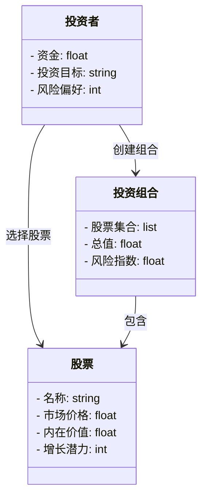
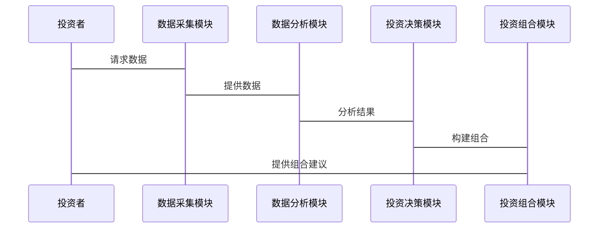

                 


# 肯尼斯·费雪的增长型价值投资：未来潜力股的发掘

> **关键词**：价值投资、增长型投资、肯尼斯·费雪、投资策略、股票分析、投资组合、现代投资理论  
> **摘要**：本文深入探讨了肯尼斯·费雪的增长型价值投资理论，分析了其核心概念、选股标准、投资策略以及在现代市场环境下的应用。通过结合经典投资理论与现代技术手段，本文为投资者提供了系统化的投资方法和实践指南，帮助读者在复杂多变的市场中发掘未来潜力股。

---

## 第一章: 价值投资的起源与核心理念

### 1.1 价值投资的起源

#### 1.1.1 投资学说的历史演变
价值投资作为一种经典的股票投资策略，其历史可以追溯到20世纪初。早期的投资者通过分析公司财务报表和市场趋势，试图找到被市场低估的股票。这种理念强调股票的内在价值，而非市场的短期波动。

#### 1.1.2 肯尼斯·费雪的生平与贡献
肯尼斯·费雪（Kenneth N. Fisher）是价值投资领域的先驱之一。他在20世纪30年代提出了“增长型价值投资”的概念，强调通过分析公司的基本面，寻找具有持续增长潜力的企业。他的投资理念对后来的投资者产生了深远影响。

#### 1.1.3 价值投资的核心理念
价值投资的核心在于寻找市场价格低于其内在价值的股票。投资者需要深入分析公司的财务状况、行业地位和未来发展前景，以识别那些具有长期增长潜力的企业。

---

## 第二章: 增长型价值投资的定义与特点

### 2.1 增长型投资的定义

#### 2.1.1 增长型投资的内涵
增长型投资是一种专注于投资具有高增长潜力企业的策略。与价值投资不同，增长型投资更注重企业的未来盈利能力，而非当前的市场价格。

#### 2.1.2 增长型投资与价值投资的区别
| 特性 | 价值投资 | 增长型投资 |
|------|----------|------------|
| 投资目标 | 寻找价格被低估的股票 | 寻找具有高增长潜力的企业 |
| 分析重点 | 当前市场价格与内在价值 | 未来盈利能力与增长空间 |
| 风险承受 | 较低 | 较高 |

#### 2.1.3 增长型投资的适用场景
增长型投资适合那些希望长期持有高增长企业的投资者，尤其在新兴行业和技术驱动的市场中表现更为突出。

---

## 第三章: 费雪投资策略的核心要素

### 3.1 费雪的选股标准

#### 3.1.1 公司盈利能力的评估
公司盈利能力是增长型投资的核心指标之一。费雪强调通过分析净利润率、ROE（股东权益收益率）等指标来评估公司的盈利能力。

#### 3.1.2 行业地位与竞争优势
费雪认为，具有强大行业地位和竞争优势的企业更有可能实现长期增长。他特别关注企业的市场占有率、品牌影响力和技术创新能力。

#### 3.1.3 管理层的诚信与能力
费雪认为，管理层的诚信和能力是企业成功的关键因素。他强调投资者需要深入研究管理层的背景和管理风格。

---

## 第四章: 费雪投资理念的现代应用

### 4.1 现代市场环境下的增长型投资

#### 4.1.1 数字经济与新兴行业的投资机会
随着数字经济的崛起，新兴行业如人工智能、大数据、区块链等领域为企业提供了巨大的增长潜力。费雪的增长型投资理念在这些领域中仍然适用。

#### 4.1.2 可持续发展与ESG投资的影响
现代社会对可持续发展的关注日益增加，ESG（环境、社会、治理）投资逐渐成为增长型投资的重要考量因素。

#### 4.1.3 全球化背景下的跨国投资策略
全球化使得企业能够在全球范围内扩展业务，投资者需要关注跨国公司的市场布局和国际化能力。

---

## 第五章: 投资组合的构建与管理

### 5.1 投资组合的理论基础

#### 5.1.1 马科维茨的现代投资组合理论
马科维茨的现代投资组合理论（MPT）为投资组合的构建提供了理论基础。他强调通过分散投资来降低风险，并通过优化组合来实现收益最大化。

#### 5.1.2 费雪增长型投资的组合构建原则
费雪的增长型投资组合构建原则包括：
1. 选择具有长期增长潜力的企业；
2. 分散投资以降低风险；
3. 长期持有优质股票。

---

## 第六章: 系统分析与架构设计方案

### 6.1 系统功能设计（领域模型）



### 6.2 系统架构设计

```mermaid
--- 题目 ---
系统架构图

```

### 6.3 系统交互设计



---

## 第七章: 项目实战

### 7.1 环境配置

```bash
# 系统环境
Python 3.9+
Jupyter Notebook
Pandas, NumPy, Matplotlib
```

### 7.2 核心实现代码

```python
import pandas as pd
import numpy as np

# 数据预处理
def preprocess_data(df):
    df['ROE'] = df['净利润'] / df['股东权益']
    df['增长潜力'] = df['收入增长率'] * df['净利润增长率']
    return df

# 费雪选股模型
def fisher_stock_selection(df, threshold=0.15):
    selected = df[(df['ROE'] > threshold) & (df['增长潜力'] > df['行业平均增长潜力'])]
    return selected

# 投资组合优化
def optimize_portfolio(risk_free_rate, returns, cov_matrix):
    # 使用现代投资组合理论优化
    pass
```

---

## 第八章: 总结与展望

### 8.1 总结
费雪的增长型价值投资理念为投资者提供了寻找潜力股的系统化方法。通过结合现代技术手段和经典投资理论，投资者可以在复杂多变的市场中找到具有长期增长潜力的企业。

### 8.2 展望
随着技术的进步和市场的变化，增长型投资将更加依赖于数据分析和人工智能技术。未来，投资者需要不断学习和适应新的市场环境，以实现长期的财富增长。

---

**最佳实践 Tips**：
1. **深入研究**：在投资前，务必对目标公司进行深入研究，包括财务状况、行业地位和管理层能力。
2. **长期持有**：增长型投资需要耐心，长期持有优质股票才能实现最大收益。
3. **风险管理**：通过分散投资和合理配置资产，降低投资组合的整体风险。

通过本文的系统化分析和实战案例，读者可以更好地理解和应用费雪的增长型价值投资理念，为未来的投资决策提供有力支持。

