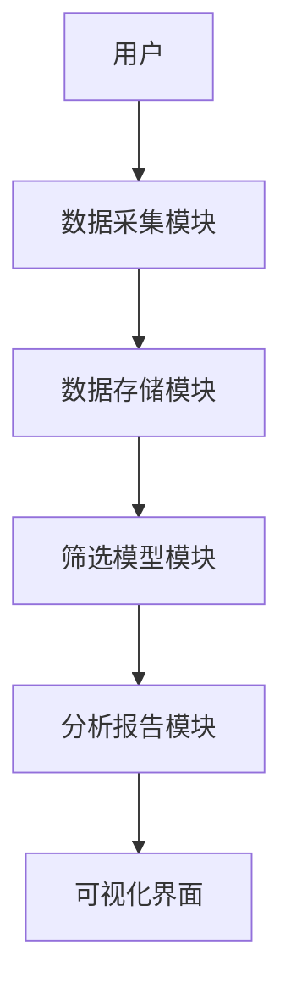
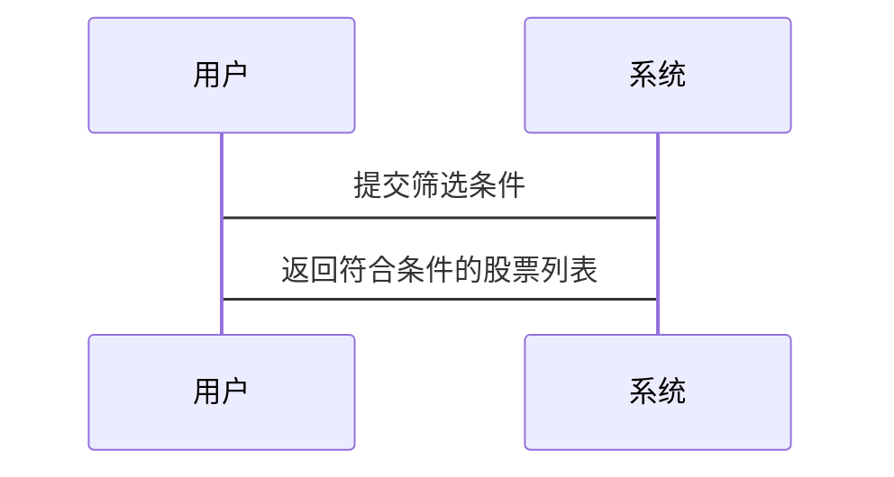

                 


# 肯尼斯·费雪的增长型价值股：寻找未来的赢家

> 关键词：增长型价值股、价值投资、肯尼斯·费雪、投资策略、股票分析、投资回报

> 摘要：本文深入探讨了肯尼斯·费雪的增长型价值股投资理念，通过系统分析和实战案例，揭示了如何在股票市场中识别和投资具有高成长性和低估值的优质企业。文章从价值投资的基本原理出发，结合企业基本面分析、行业趋势、竞争优势评估以及股价估值等多维度，详细阐述了增长型价值股的筛选标准和投资策略。同时，本文还提供了基于Python的股票数据分析工具和系统架构设计，帮助读者更好地理解和实践增长型价值股的投资方法。

---

# 第一部分：价值投资与增长型价值股概述

## 第1章：价值投资的基本原理

### 1.1 价值投资的定义与核心理念

#### 1.1.1 价值投资的起源与发展

价值投资是一种以基本面分析为基础的投资策略，起源于20世纪初。本杰明·格雷厄姆和戴维·多德是价值投资的鼻祖，他们提出了“安全边际”和“内在价值”的概念。价值投资的核心理念是寻找市场价格低于内在价值的股票，通过长期持有实现超额收益。

#### 1.1.2 价值投资的核心理念与原则

- **内在价值**：股票的真正价值是其未来现金流的现值，与市场价格无关。
- **安全边际**：买入价格应低于内在价值，以确保投资的安全性。
- **长期视角**：价值投资强调长期持有，忽略短期市场波动。

#### 1.1.3 价值投资与其它投资策略的对比

| 投资策略 | 核心关注点 | 优点 | 缺点 |
|----------|------------|------|------|
| 价值投资 | 内在价值与市场价格差 | 风险低、收益稳定 | 需要深入分析，见效慢 |
| 技术分析 | 价格与成交量 | 短期收益快 | 易受市场情绪影响 |
| 成长投资 | 高成长性企业 | 高增长潜力 | 风险高、波动大 |

---

## 第2章：肯尼斯·费雪的投资理念

### 2.1 肯尼斯·费雪的生平简介

#### 2.1.1 费雪的早年经历与职业背景

肯尼斯·费雪（Kenneth Fisher）是美国著名投资家，出生于1926年，被誉为“估值大师”。他在20世纪60年代创立了费雪投资公司，成为价值投资领域的先驱之一。

#### 2.1.2 费雪的投资哲学与成就

费雪的投资哲学继承并发展了格雷厄姆的价值投资理念，提出了“增长型价值股”的概念，即同时具备高成长性和低估值的股票。

#### 2.1.3 费雪投资理念的传承与发展

费雪的理念影响了后来的投资者，如彼得·林奇和沃伦·巴菲特，他的著作《怎样选择成长股》成为投资界的经典。

---

## 第3章：增长型价值股的定义与特点

### 3.1 增长型价值股的定义

#### 3.1.1 增长型股票的基本特征

- 高成长性：收入和利润持续增长。
- 高市盈率：通常高于行业平均水平。

#### 3.1.2 价值型股票的基本特征

- 低估值：市场价格低于内在价值。
- 稳定股息：通常有较高的股息率。

#### 3.1.3 增长型价值股的结合与平衡

增长型价值股是两类股票的结合：既具备高成长性，又具备一定的估值优势。

---

### 3.2 增长型价值股的特点

#### 3.2.1 高成长性企业的识别标准

- 净利润增长率 > 行业平均水平。
- 收入增长率稳定且持续。

#### 3.2.2 低估值企业的识别标准

- 市盈率（P/E） < 行业平均水平。
- 市净率（P/B） < 行业平均水平。

#### 3.2.3 增长与价值的动态平衡

增长与价值不是固定的，需要根据市场环境和企业情况动态调整。

---

## 第4章：为什么选择增长型价值股

### 4.1 增长型价值股的投资优势

#### 4.1.1 长期回报潜力

增长型价值股兼具成长性和估值优势，长期回报潜力较高。

#### 4.1.2 风险管理的优势

通过低估值和高成长性的结合，降低了投资风险。

#### 4.1.3 市场周期中的稳定性

在市场波动中，增长型价值股的表现相对稳定。

---

### 4.2 增长型价值股的投资风险

#### 4.2.1 市场波动的风险

市场波动可能导致股价短期下跌。

#### 4.2.2 企业成长的不确定性

高成长性企业可能面临业绩不及预期的风险。

#### 4.2.3 估值偏差的风险

市场对估值的判断可能存在偏差。

---

# 第二部分：增长型价值股的核心分析框架

## 第5章：企业基本面分析

### 5.1 企业财务报表分析

#### 5.1.1 利润表分析

利润表反映了企业的收入和利润情况，重点关注净利润增长率和营业利润率。

#### 5.1.2 资产负债表分析

资产负债表反映了企业的资产、负债和所有者权益，重点关注资产回报率和负债水平。

#### 5.1.3 现金流量表分析

现金流量表反映了企业的现金流入和流出情况，重点关注经营活动现金流。

---

### 5.2 企业盈利能力分析

#### 5.2.1 净利润率

$$ \text{净利润率} = \frac{\text{净利润}}{\text{营业收入}} $$

#### 5.2.2 营业利润率

$$ \text{营业利润率} = \frac{\text{营业利润}}{\text{营业收入}} $$

#### 5.2.3 资产回报率

$$ \text{资产回报率} = \frac{\text{净利润}}{\text{总资产}} $$

---

### 5.3 企业成长性分析

#### 5.3.1 收入增长率

$$ \text{收入增长率} = \frac{\text{本期收入} - \text{上期收入}}{\text{上期收入}} $$

#### 5.3.2 净利润增长率

$$ \text{净利润增长率} = \frac{\text{本期净利润} - \text{上期净利润}}{\text{上期净利润}} $$

#### 5.3.3 资产增长率

$$ \text{资产增长率} = \frac{\text{本期资产} - \text{上期资产}}{\text{上期资产}} $$

---

## 第6章：行业分析与竞争优势

### 6.1 行业生命周期分析

#### 6.1.1 行业发展的不同阶段

- 初创期：企业数量少，市场潜力大。
- 成长期：企业数量增加，市场扩大。
- 成熟期：企业数量稳定，竞争激烈。
- 衰退期：市场萎缩，企业数量减少。

#### 6.1.2 行业周期对投资的影响

在成长期和成熟期，行业内的增长型价值股更具投资价值。

---

### 6.2 企业竞争优势分析

#### 6.2.1 核心竞争力的识别

- 技术优势：拥有独特的技术或专利。
- 市场地位：行业龙头或寡头垄断。
- 创新能力：持续研发投入，产品更新能力强。

#### 6.2.2 市场地位的评估

$$ \text{市场份额} = \frac{\text{企业销售额}}{\text{行业销售额}} $$

#### 6.2.3 企业创新与研发投入

创新能力强的企业更具成长潜力。

---

## 第7章：股价与估值分析

### 7.1 股票估值的基本方法

#### 7.1.1 市盈率（P/E）分析

$$ \text{市盈率} = \frac{\text{股价}}{\text{每股净利润}} $$

#### 7.1.2 市净率（P/B）分析

$$ \text{市净率} = \frac{\text{股价}}{\text{每股净资产}} $$

#### 7.1.3 市销率（P/S）分析

$$ \text{市销率} = \frac{\text{股价}}{\text{每股营业收入}} $$

---

### 7.2 增长型价值股的估值模型

#### 7.2.1 现金流折现模型（DCF）

$$ \text{内在价值} = \sum_{t=1}^{n} \frac{\text{现金流}}{(1+r)^t} + \frac{\text{终值}}{(1+r)^n} $$

#### 7.2.2 内在价值计算方法

通过DCF模型计算企业的内在价值，与市场价格进行对比。

---

## 第8章：系统分析与架构设计

### 8.1 问题场景介绍

我们需要设计一个系统，用于筛选和分析增长型价值股。

### 8.2 系统功能设计

- 数据采集：从数据库或API获取股票数据。
- 筛选模型：根据财务指标筛选增长型价值股。
- 分析报告：生成投资报告和可视化图表。

---

### 8.3 系统架构设计



---

### 8.4 系统交互设计



---

## 第9章：项目实战

### 9.1 环境安装

安装Python和相关库（如Pandas、Matplotlib）。

### 9.2 核心实现

编写代码，实现股票筛选和分析功能。

```python
import pandas as pd

# 假设df是股票数据
def is_growth_stock(df):
    return df['净利润增长率'] > 10

def is_value_stock(df):
    return df['市盈率'] < 15

# 筛选增长型价值股
growth_value_stocks = df[(df['净利润增长率'] > 10) & (df['市盈率'] < 15)]
```

---

### 9.3 案例分析

以某行业为例，分析具体股票的投资价值。

---

## 第10章：最佳实践

### 10.1 小结

增长型价值股是兼具成长性和估值优势的股票，是长期投资的理想选择。

### 10.2 注意事项

- 避免追涨杀跌。
- 定期复盘和调整投资组合。
- 保持对市场的敏感性和前瞻性。

### 10.3 拓展阅读

推荐阅读《怎样选择成长股》和《巴菲特投资策略》。

---

通过以上系统的分析和实战，我们可以更好地理解和投资增长型价值股，找到未来的赢家。

