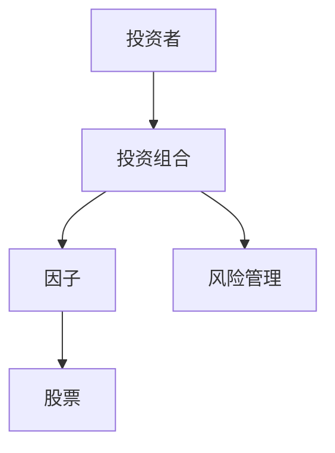
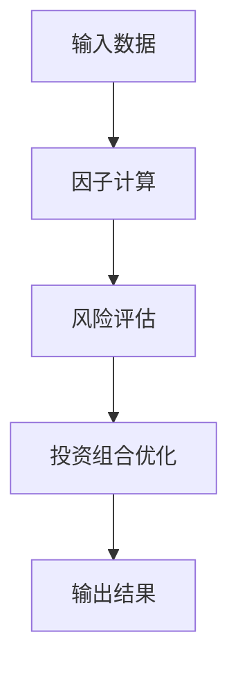
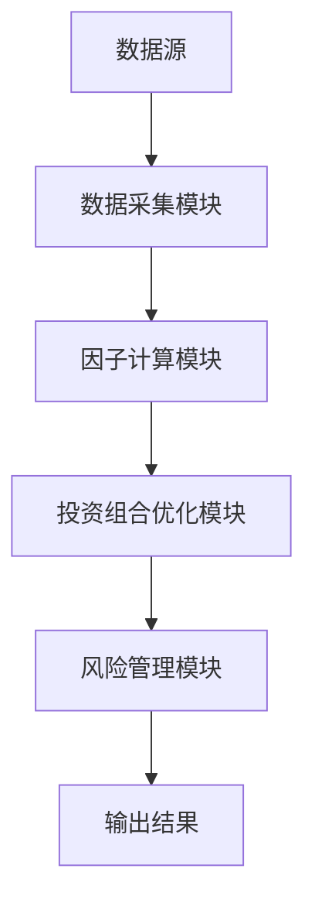
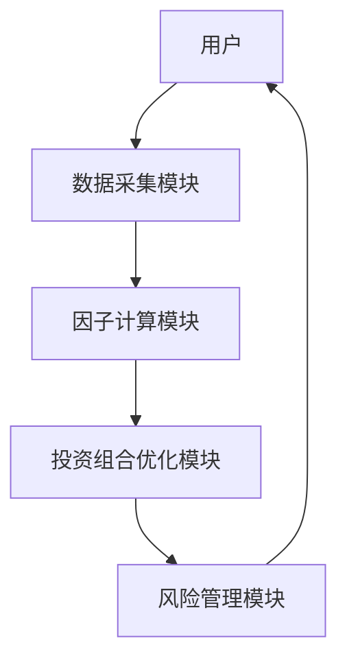

                 


# 肯尼斯·费雷尔的价值投资量化模型

## 关键词：
- 价值投资
- 量化模型
- 肯尼斯·费雷尔
- 风险管理
- 投资组合优化
- 因子分析
- 量化投资

## 摘要：
本文深入探讨了肯尼斯·费雷尔的价值投资量化模型，结合传统价值投资与现代量化方法，分析其核心概念、算法原理、系统架构，并通过实际案例展示其应用。文章从背景介绍、核心概念、算法流程、数学模型、系统设计、项目实战到最佳实践，全面解析该模型，帮助读者理解其在投资领域的重要性和实际应用。

---

## 第一部分: 价值投资量化模型的背景与基础

## 第1章: 价值投资与量化模型概述

### 1.1 价值投资的起源与发展

#### 1.1.1 价值投资的核心理念
价值投资是一种投资策略，强调以低于内在价值的价格购买优质资产。核心理念包括：
- **安全边际**：购买价格低于内在价值，以降低风险。
- **长期视角**：关注企业的长期表现，而非短期波动。
- **基本面分析**：通过分析企业的财务状况、行业地位等因素，评估其内在价值。

#### 1.1.2 量化投资的兴起
量化投资利用数学模型和算法，基于大量数据进行投资决策。其兴起得益于：
- **数据驱动**：通过大量数据发现投资机会。
- **算法交易**：利用算法快速执行交易，提高效率。
- **风险管理**：通过量化模型控制投资风险。

#### 1.1.3 肯尼斯·费雷尔的贡献
肯尼斯·费雷尔将价值投资与量化方法结合，提出了一种新的投资模型，结合了基本面分析和量化技术，提高了投资决策的科学性和效率。

### 1.2 价值投资量化模型的基本概念

#### 1.2.1 量化模型的定义
量化模型是通过数学公式和算法，将投资决策过程系统化的方法。它利用数据分析、统计建模等技术，帮助投资者做出更科学的投资决策。

#### 1.2.2 模型的核心要素
- **因子分析**：识别影响股票价格的关键因素，如市盈率、市净率等。
- **风险管理**：量化投资中的风险，制定有效的风险管理策略。
- **投资组合优化**：通过优化组合投资标的，最大化收益，最小化风险。

#### 1.2.3 模型的适用范围与边界
- **适用范围**：适用于股票、基金等金融资产的投资决策。
- **边界**：不适用于高频交易或短期市场波动的预测。

### 1.3 肯尼斯·费雷尔模型的独特性

#### 1.3.1 模型的核心思想
费雷尔模型强调在量化分析的基础上，结合企业的基本面因素，构建投资组合。它不仅考虑价格波动，还关注企业的内在价值和长期潜力。

#### 1.3.2 模型与传统价值投资的对比
- **传统价值投资**：依赖主观判断，注重安全边际和长期价值。
- **费雷尔模型**：结合量化分析，利用因子筛选和优化技术，提高投资效率。

#### 1.3.3 模型的优势与局限性
- **优势**：提高投资决策的客观性和科学性，降低人为情绪影响。
- **局限性**：依赖数据质量和模型假设，可能在市场剧烈波动时表现不佳。

## 第2章: 肯尼斯·费雷尔模型的核心概念与联系

### 2.1 核心概念原理

#### 2.1.1 因子分析与股票筛选
因子分析是通过统计方法识别影响股票价格的关键因素。常见的因子包括：
- **价值因子**：如市盈率、市净率。
- **动量因子**：如过去的价格趋势。
- **质量因子**：如资产负债率、ROE等。

#### 2.1.2 风险管理与投资组合优化
风险管理是量化模型的重要组成部分，通过量化风险暴露，制定有效的风险管理策略。投资组合优化则是通过数学方法，在不同资产之间分配资金，以实现收益与风险的最佳平衡。

#### 2.1.3 模型的数学基础
模型基于现代投资组合理论（MPT）和资本资产定价模型（CAPM），结合统计学和优化理论。

### 2.2 核心概念属性对比表

| 概念          | 传统价值投资 | 费雷尔模型 |
|---------------|--------------|------------|
| 数据驱动      | 低           | 高          |
| 因子分析      | 无           | 有          |
| 投资组合优化  | 少           | 多          |
| 风险管理      | 主观         | 客观        |

### 2.3 ER实体关系图


---

## 第3章: 肯尼斯·费雷尔模型的算法原理

### 3.1 算法流程图


### 3.2 算法实现代码

#### 3.2.1 因子计算
```python
import pandas as pd

# 加载数据
data = pd.read_csv('stock_data.csv')

# 计算市盈率因子
data['PE'] = data['Price'] / data['Earnings']

# 计算市净率因子
data['PB'] = data['Price'] / data['Book Value']
```

#### 3.2.2 风险评估
```python
import numpy as np

# 计算波动率
def calculate_volatility(returns):
    return np.std(returns)

# 示例数据
returns = [0.01, -0.02, 0.03, -0.01, 0.02]
volatility = calculate_volatility(returns)
print(f"波动率: {volatility}")
```

#### 3.2.3 投资组合优化
```python
import numpy as np

# 示例资产回报和协方差矩阵
returns = [0.05, 0.07]
cov_matrix = np.array([[0.02, 0.01], [0.01, 0.03]])

# 计算最优权重
def optimal_weights(returns, cov_matrix):
    n = len(returns)
    # 构造优化问题
    # 这里简化为等权重
    weights = np.array([1/n]*n)
    return weights

weights = optimal_weights(returns, cov_matrix)
print(f"最优权重: {weights}")
```

### 3.3 算法的数学模型和公式

#### 3.3.1 因子分析模型
$$
F_i = \alpha + \beta_i R_m + \epsilon_i
$$
其中，\( F_i \) 是因子值，\( R_m \) 是市场回报，\( \beta_i \) 是因子的敏感度，\( \epsilon_i \) 是误差项。

#### 3.3.2 投资组合优化模型
$$
\min_w \quad w^T \Sigma w \\
\text{subject to} \quad w^T \mu = r \\
w^T 1 = 1
$$
其中，\( w \) 是权重向量，\( \Sigma \) 是协方差矩阵，\( \mu \) 是预期回报向量，\( r \) 是目标回报。

---

## 第4章: 肯尼斯·费雷尔模型的数学模型与公式

### 4.1 因子分析与投资组合优化

#### 4.1.1 因子分析模型
$$
F_i = \alpha + \beta_i R_m + \epsilon_i
$$
其中，\( F_i \) 是因子值，\( R_m \) 是市场回报，\( \beta_i \) 是因子的敏感度，\( \epsilon_i \) 是误差项。

#### 4.1.2 投资组合优化模型
$$
\min_w \quad w^T \Sigma w \\
\text{subject to} \quad w^T \mu = r \\
w^T 1 = 1
$$
其中，\( w \) 是权重向量，\( \Sigma \) 是协方差矩阵，\( \mu \) 是预期回报向量，\( r \) 是目标回报。

---

## 第5章: 肯尼斯·费雷尔模型的系统分析与架构设计

### 5.1 系统功能设计

#### 5.1.1 数据采集模块
负责收集股票价格、财务数据等。

#### 5.1.2 因子计算模块
基于数据计算各种因子，如市盈率、市净率等。

#### 5.1.3 投资组合优化模块
根据因子和风险评估结果，优化投资组合。

#### 5.1.4 风险管理模块
实时监控投资组合的风险，调整权重以控制风险。

### 5.2 系统架构设计

#### 5.2.1 系统架构图


#### 5.2.2 系统交互图


---

## 第6章: 肯尼斯·费雷尔模型的项目实战

### 6.1 环境安装

#### 6.1.1 安装Python
```bash
python --version
pip install numpy pandas
```

#### 6.1.2 安装其他依赖
```bash
pip install matplotlib
pip install pyfolio
```

### 6.2 核心代码实现

#### 6.2.1 数据加载与预处理
```python
import pandas as pd

data = pd.read_csv('stock_data.csv')
data = data.dropna()
```

#### 6.2.2 因子计算
```python
data['PE'] = data['Price'] / data['Earnings']
data['PB'] = data['Price'] / data['Book Value']
```

#### 6.2.3 风险评估与投资组合优化
```python
import numpy as np

returns = data['Return'].values
volatility = np.std(returns)
```

### 6.3 实际案例分析

#### 6.3.1 数据分析
分析某时间段内股票的回报率和波动率。

#### 6.3.2 模型应用
应用费雷尔模型筛选出具有较高价值的股票，并构建投资组合。

#### 6.3.3 结果解读
解释模型输出的投资组合及其风险和回报。

### 6.4 项目小结

---

## 第7章: 肯尼斯·费雷尔模型的最佳实践与小结

### 7.1 小结

### 7.2 注意事项
- 数据质量至关重要，需确保数据准确无误。
- 模型假设需合理，避免过度依赖模型。
- 定期监控和调整投资组合，应对市场变化。

### 7.3 未来趋势
- 更多数据源的整合，如社交媒体数据。
- 人工智能技术的应用，提升模型的预测能力。
- 区块链技术的引入，增强数据安全性和透明度。

### 7.4 拓展阅读
- 《量化投资入门》
- 《价值投资的真谛》
- 《风险管理的艺术》

---

通过以上章节的详细讲解，我们全面探讨了肯尼斯·费雷尔的价值投资量化模型，从理论基础到实际应用，为投资者提供了科学的决策工具。希望本文能为价值投资与量化分析的结合提供新的视角和方法。

