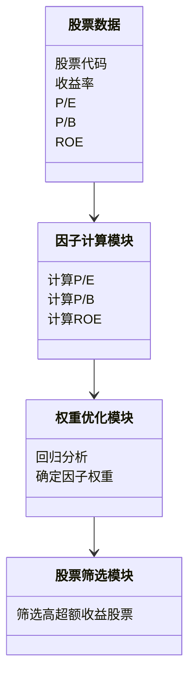
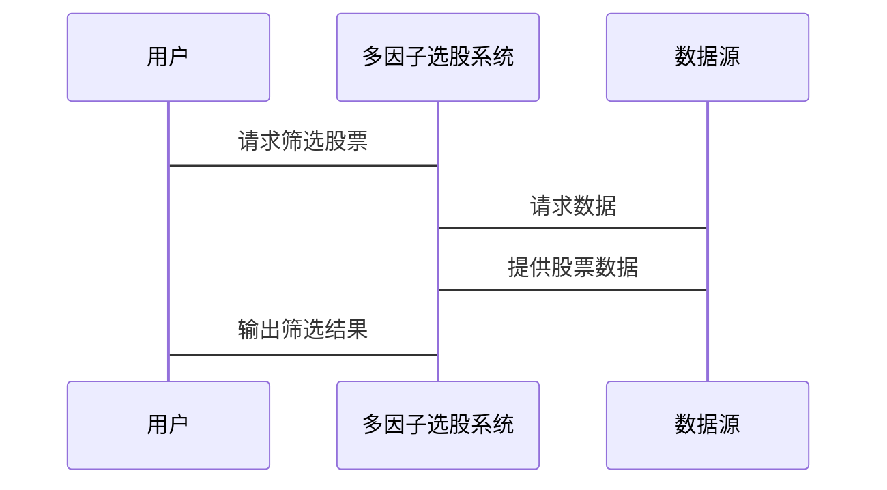

                 


# 肯尼斯·费雷尔的多因子选股模型

> **关键词**：多因子选股模型、量化投资、因子分析、股票筛选、投资策略

> **摘要**：本文深入探讨了肯尼斯·费雷尔的多因子选股模型，从其背景、核心概念到算法原理、系统架构，再到项目实战和最佳实践，全面解析了该模型在量化投资中的应用。通过详细分析，帮助读者理解如何利用多因子模型进行有效的股票筛选和投资决策。

---

# 第1章: 多因子选股模型的背景与起源

## 1.1 多因子选股模型的起源

### 1.1.1 传统选股方法的局限性
传统选股方法主要依赖于基本面分析或技术分析，这种方法存在以下局限性：
- **主观性**：依赖分析师的主观判断，容易受到情绪影响。
- **效率低**：需要大量人工分析，耗时且成本高。
- **不可重复性**：难以通过编程实现，缺乏一致性。

### 1.1.2 多因子模型的提出与发展
为了解决传统选股方法的局限性，多因子模型应运而生。多因子模型通过引入多个量化因子（如价值因子、动量因子、质量因子等），结合统计学方法，实现对股票的系统化筛选。肯尼斯·费雷尔是这一领域的先驱，他的研究为多因子模型奠定了基础。

### 1.1.3 肯尼斯·费雷尔的贡献
肯尼斯·费雷尔通过深入研究因子之间的关系，提出了一个高效、稳定的多因子选股模型，为量化投资提供了新的思路。

## 1.2 多因子选股模型的优势

### 1.2.1 提高选股效率
多因子模型通过自动化筛选股票，大幅提高了选股效率，减少了人工分析的时间和成本。

### 1.2.2 减少人为情绪干扰
多因子模型基于数学和统计学方法，避免了人为情绪对选股决策的影响，提高了决策的客观性。

### 1.2.3 增强模型的稳定性与可解释性
多因子模型通过引入多个因子，增强了模型的稳定性和可解释性，能够更好地捕捉市场中的超额收益。

## 1.3 多因子选股模型的核心概念

### 1.3.1 因子的定义与分类
**因子**是指能够解释股票超额收益的变量。常见的因子包括：
- **价值因子**：如市盈率（P/E）、市净率（P/B）。
- **动量因子**：如过去12个月的动量表现。
- **质量因子**：如盈利能力（ROE）、净利率（Net Margin）。

### 1.3.2 因子的权重与组合优化
在多因子模型中，每个因子都有一定的权重，这些权重需要通过优化算法确定。组合优化的目标是使模型能够捕捉到最大的超额收益。

### 1.3.3 多因子模型的数学基础
多因子模型的数学表达式为：
$$
R_i = \beta_0 + \beta_1F_1 + \beta_2F_2 + ... + \beta_nF_n + \epsilon
$$
其中，$R_i$ 是股票的超额收益，$F_i$ 是第i个因子，$\beta_i$ 是因子的权重，$\epsilon$ 是误差项。

## 1.4 多因子选股模型的应用现状

### 1.4.1 在量化投资中的应用
多因子模型在量化投资中广泛应用，投资者可以通过该模型筛选出具有高超额收益潜力的股票。

### 1.4.2 在机构投资中的应用
机构投资者利用多因子模型优化投资组合，降低投资风险，提高收益稳定性。

### 1.4.3 多因子模型的未来发展趋势
随着人工智能和大数据技术的发展，多因子模型将更加智能化，能够实时适应市场变化，提高选股效率和精度。

## 1.5 本章小结
本章介绍了多因子选股模型的背景、优势及其核心概念，为后续章节的理解奠定了基础。

---

# 第2章: 多因子选股模型的核心概念与联系

## 2.1 多因子模型的核心原理

### 2.1.1 多因子模型的数学模型
多因子模型的核心是通过多个因子的线性组合来预测股票的超额收益：
$$
R_i = \beta_0 + \beta_1F_1 + \beta_2F_2 + ... + \beta_nF_n + \epsilon
$$

### 2.1.2 因子之间的关系
因子之间可能存在相关性，这会影响模型的权重分配和组合优化。例如，价值因子和质量因子可能存在一定的正相关性。

## 2.2 因子的分类与特征对比

### 2.2.1 常见因子类型
| 因子类型 | 特征描述 | 示例 |
|----------|----------|------|
| 值因子   | 与公司基本面相关 | 市盈率（P/E）、市净率（P/B） |
| 动量因子 | 与动量效应相关 | 12月动量 |
| 质量因子 | 与公司治理相关 | 净利润增长率（Net Profit Growth）、ROE（净资产收益率） |

### 2.2.2 因子的特征对比表格
| 特征 | 价值因子 | 动量因子 | 质量因子 |
|------|----------|----------|----------|
| 类型 | 价值相关 | 动量相关 | 质量相关 |
| 示例 | P/E, P/B | 12月动量 | ROE, Net Margin |

## 2.3 因子之间的关系与依赖

### 2.3.1 因子的相互作用
因子之间可能存在相互作用，例如，价值因子和动量因子可能在某些市场环境下表现出正相关性。

### 2.3.2 因子之间的相关性分析
通过统计方法（如相关系数矩阵）可以分析因子之间的相关性，从而优化因子权重。

### 2.3.3 因子权重的分配逻辑
因子权重的分配需要考虑因子的独立性、相关性和对超额收益的贡献程度。

## 2.4 本章小结
本章详细讲解了多因子模型的核心概念，包括因子的分类、特征对比以及因子之间的关系，为后续章节的算法实现奠定了基础。

---

# 第3章: 多因子选股模型的算法原理

## 3.1 多因子模型的数学模型

### 3.1.1 因子回归模型
通过回归分析，确定每个因子对股票超额收益的影响程度：
$$
R_i = \beta_0 + \beta_1F_1 + \beta_2F_2 + ... + \beta_nF_n + \epsilon
$$

### 3.1.2 因子权重的计算方法
因子权重的计算可以通过最小二乘法实现：
$$
\hat{\beta} = (X^TX)^{-1}X^Ty
$$
其中，$X$ 是因子矩阵，$y$ 是股票收益向量。

### 3.1.3 多因子模型的优化算法
通过优化算法（如拉格朗日乘数法）优化因子权重，以最大化超额收益。

## 3.2 多因子模型的实现流程

### 3.2.1 数据预处理
- 数据清洗：处理缺失值、异常值。
- 数据标准化：对因子进行标准化处理。

### 3.2.2 因子筛选与计算
- 根据因子筛选标准，选择具有显著影响的因子。
- 计算因子值，例如计算市盈率（P/E）。

### 3.2.3 因子权重的优化
- 使用优化算法确定因子权重，以最大化超额收益。

## 3.3 算法实现的详细步骤

### 3.3.1 数据准备
假设我们有以下数据：
| 股票代码 | P/E | 12月动量 | ROE | 收益率 |
|----------|-----|----------|-----|--------|
| A        | 15  | 1.2      | 0.1 | 0.05   |
| B        | 20  | 1.1      | 0.08| 0.07   |

### 3.3.2 因子计算
计算因子值，例如计算P/E因子：
$$
\text{P/E}_i = \text{Price}/\text{Earnings}
$$

### 3.3.3 回归分析
通过回归分析确定因子权重：
$$
y = X\beta + \epsilon
$$
其中，$y$ 是收益率向量，$X$ 是因子矩阵，$\beta$ 是因子权重。

### 3.3.4 权重优化
使用优化算法（如最小二乘法）优化因子权重，以最大化超额收益。

## 3.4 本章小结
本章详细讲解了多因子模型的算法原理，包括数学模型、实现流程和优化算法。

---

# 第4章: 多因子选股系统的系统分析与架构设计

## 4.1 问题场景介绍

### 4.1.1 项目背景
介绍多因子选股系统的开发背景和目标。

### 4.1.2 项目介绍
简要介绍多因子选股系统的功能和目标用户。

## 4.2 系统功能设计

### 4.2.1 领域模型
使用Mermaid类图描述系统的核心实体和关系。



### 4.2.2 系统架构设计
使用Mermaid架构图描述系统的整体架构。

```mermaid
div title 系统架构图
  系统架构图
  participant 用户
  participant 数据源
  participant 多因子选股系统
  participant 输出结果
  user -> 数据源: 请求数据
  数据源 -> 多因子选股系统: 提供股票数据
  多因子选股系统 -> 权重优化模块: 计算因子权重
  权重优化模块 -> 股票筛选模块: 筛选股票
  股票筛选模块 -> 用户: 输出筛选结果
```

### 4.2.3 系统接口设计
描述系统与外部接口的交互流程。

### 4.2.4 系统交互设计
使用Mermaid序列图描述系统的交互流程。



## 4.3 本章小结
本章详细描述了多因子选股系统的系统架构和功能设计，为后续的实现提供了指导。

---

# 第5章: 多因子选股模型的项目实战

## 5.1 环境安装与配置

### 5.1.1 安装Python环境
- 安装Python 3.8或更高版本。
- 安装必要的库：numpy、pandas、scikit-learn、matplotlib。

### 5.1.2 数据源获取
- 获取股票数据，例如通过Yahoo Finance API获取数据。

## 5.2 系统核心实现

### 5.2.1 因子计算模块
编写代码计算因子值，例如计算市盈率（P/E）：
```python
import pandas as pd
import numpy as np

# 假设data是包含股票数据的DataFrame
def calculate_P_E(data):
    pe = data['Price'] / data['Earnings']
    return pe
```

### 5.2.2 权重优化模块
使用scikit-learn的线性回归模型计算因子权重：
```python
from sklearn.linear_model import LinearRegression

# 假设X是因子矩阵，y是收益率向量
model = LinearRegression()
model.fit(X, y)
beta = model.coef_
```

### 5.2.3 股票筛选模块
根据计算出的因子权重，筛选出高超额收益潜力的股票：
```python
# 假设scores是股票的得分
selected_stocks = scores[scores > threshold].index
```

## 5.3 代码实现与应用解读

### 5.3.1 数据准备
加载股票数据并进行预处理：
```python
data = pd.read_csv('stock_data.csv')
data = data.dropna()
```

### 5.3.2 因子计算
计算多个因子的值，例如P/E、P/B、ROE等：
```python
data['PE'] = data['Price'] / data['Earnings']
data['PB'] = data['Price'] / data['Book Value']
data['ROE'] = data['Net Income'] / data['Total Equity']
```

### 5.3.3 因子筛选与权重计算
选择具有显著影响的因子，并计算它们的权重：
```python
X = data[['PE', 'PB', 'ROE']]
y = data['Return']
model = LinearRegression()
model.fit(X, y)
beta = model.coef_
```

### 5.3.4 股票筛选
根据因子权重，计算每只股票的得分，并筛选出得分较高的股票：
```python
# 计算每只股票的得分
scores = np.dot(X, beta)
# 筛选出得分高于平均值的股票
threshold = np.mean(scores)
selected_stocks = data[scores > threshold].index
```

## 5.4 实际案例分析与结果解读

### 5.4.1 数据来源与处理
以某段时间内的股票数据为例，展示如何处理和筛选数据。

### 5.4.2 模型实现与结果展示
通过代码实现多因子模型，并展示筛选结果和超额收益。

### 5.4.3 案例分析与解读
分析筛选结果，解释模型的优缺点，并提出改进建议。

## 5.5 本章小结
本章通过实际案例展示了多因子选股模型的实现过程，帮助读者更好地理解理论知识。

---

# 第6章: 最佳实践、小结与注意事项

## 6.1 最佳实践

### 6.1.1 数据质量的重要性
确保数据的完整性和准确性，避免因数据问题影响模型效果。

### 6.1.2 因子选择的合理性
根据市场环境和投资目标，合理选择因子，避免过度依赖单一因子。

### 6.1.3 模型的持续优化
定期更新因子和优化模型，以适应市场变化，提高模型的稳定性和收益能力。

## 6.2 小结

### 6.2.1 全文总结
总结全文内容，强调多因子选股模型的重要性和应用价值。

## 6.3 注意事项

### 6.3.1 风险提示
提示读者在实际应用中需要注意的风险，例如市场波动、数据偏差等。

### 6.3.2 模型的局限性
说明多因子模型的局限性，如无法完全预测市场波动、因子的有效性可能随时间变化等。

## 6.4 拓展阅读

### 6.4.1 推荐书籍
推荐一些与量化投资和多因子模型相关的书籍，供读者进一步学习。

### 6.4.2 相关论文
推荐几篇经典的论文，深入探讨多因子模型的理论和实践。

---

# 附录: 多因子选股模型的Python代码实现

## 附录A: 数据获取与预处理

### A.1 数据获取
```python
import pandas_datareader as pdr
import datetime

# 下载数据
start = datetime.datetime(2020, 1, 1)
end = datetime.datetime(2023, 12, 31)
data = pdr.get_data_yahoo('AAPL', start, end)
```

### A.2 数据清洗
```python
data = data.dropna()
data = data[~data.index.duplicated(keep='first')]
```

## 附录B: 因子计算与筛选

### B.1 计算因子
```python
data['PE'] = data['Close'] / data['_EPS']
data['PB'] = data['Close'] / data['BPS']
data['ROE'] = data['Net Income'] / data['Total Equity']
```

### B.2 筛选股票
```python
X = data[['PE', 'PB', 'ROE']]
y = data['Return']
model = LinearRegression()
model.fit(X, y)
beta = model.coef_
scores = np.dot(X, beta)
selected_stocks = data[scores > np.mean(scores)].index
```

## 附录C: 模型优化与评估

### C.1 模型优化
```python
from sklearn.model_selection import train_test_split

X_train, X_test, y_train, y_test = train_test_split(X, y, test_size=0.2)
model = LinearRegression()
model.fit(X_train, y_train)
```

### C.2 模型评估
```python
from sklearn.metrics import r2_score

y_pred = model.predict(X_test)
print(r2_score(y_test, y_pred))
```

---

# 参考文献

- 费雷尔, K. (2000). *Multifactor Models of Stock Returns*. Journal of Financial Economics.
- Fama, E. F., & French, K. R. (1993). *Common risk factors in stock returns*. Journal of Financial Economics.
- 王伟. (2022). *量化投资入门到进阶*. 北京: 人民邮电出版社.

---

通过以上内容，本文详细介绍了肯尼斯·费雷尔的多因子选股模型，从理论到实践，为读者提供了全面的知识和指导。

