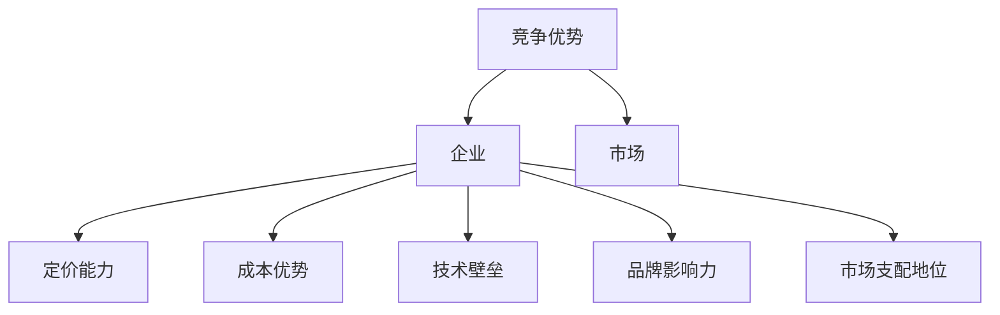
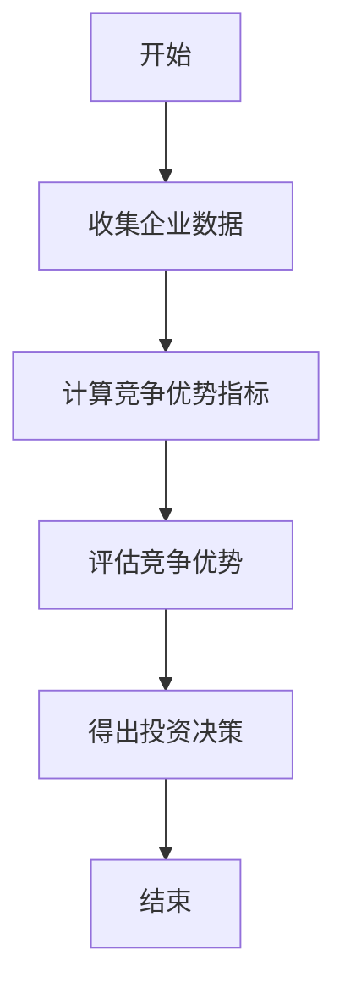
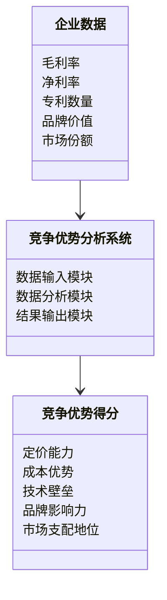
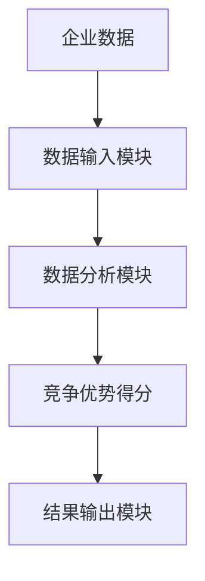
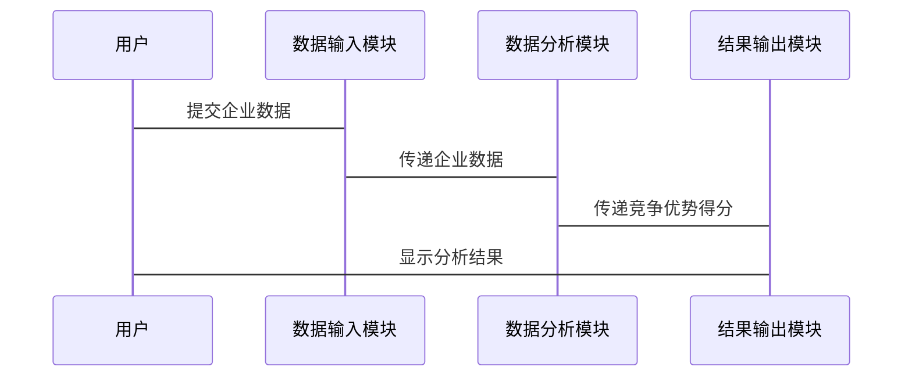

                 


# 《肯尼斯费雪的竞争优势分析》

## 关键词：竞争优势分析，肯尼斯·费雪，投资策略，算法原理，系统架构

## 摘要：  
竞争优势分析是投资学中的重要概念，由投资大师肯尼斯·费雪提出，旨在通过分析企业的竞争优势来评估其投资价值。本文将从概念、算法、系统架构等多维度详细解析竞争优势分析的理论与实践，结合实际案例和代码实现，帮助读者深入理解这一投资策略的核心思想与应用场景。

---

# 《肯尼斯费雪的竞争优势分析》

## 第1章: 竞争优势分析的背景与概念

### 1.1 竞争优势分析的背景

#### 1.1.1 投资学的演进与竞争优势分析的提出  
投资学作为一门经典的学科，经历了从简单的企业估值到复杂的投资策略的演进过程。在这一过程中，投资者逐渐意识到，仅仅关注企业的财务数据是不够的，还需要深入分析企业的竞争优势。竞争优势是企业在市场中立足的根本，决定了企业的长期盈利能力。  
竞争优势分析的概念最早由投资大师彼得·林奇提出，但真正将其系统化并应用于投资实践的是肯尼斯·费雪。费雪认为，竞争优势是企业在行业中能够长期保持高回报的核心因素，包括定价能力、成本优势、技术壁垒等。

#### 1.1.2 肯尼斯·费雪的生平与投资理念  
肯尼斯·费雪是美国著名投资家，被誉为“成长股投资之父”。他于1930年代开始投资生涯，并在1949年出版了经典著作《Common Stocks and Uncommon Profits》，系统阐述了竞争优势分析的理念。费雪提出，投资者应该选择那些具有可持续竞争优势的企业进行投资，而不是仅仅关注短期的市场波动。

#### 1.1.3 竞争优势分析的现实意义  
在当今竞争激烈的市场环境中，竞争优势分析的重要性愈发凸显。通过分析企业的竞争优势，投资者可以更好地识别出那些能够在长期市场中占据主导地位的企业，从而实现超额收益。此外，竞争优势分析还为企业战略决策提供了重要的参考依据。

### 1.2 竞争优势分析的核心概念

#### 1.2.1 核心概念的定义与内涵  
竞争优势分析的核心在于识别企业的独特优势，这些优势包括：  
1. **定价能力**：企业是否能够在不显著影响销售量的情况下提高产品价格。  
2. **成本优势**：企业是否能够以低于竞争对手的成本生产产品或提供服务。  
3. **技术壁垒**：企业是否拥有独特的技术或专利，使得竞争对手难以复制。  
4. **品牌影响力**：企业是否拥有强大的品牌形象，能够在市场上获得溢价能力。  
5. **市场支配地位**：企业是否在某个市场或细分市场中占据主导地位。

#### 1.2.2 竞争优势的属性特征对比表格  
为了更好地理解竞争优势的属性特征，我们可以将其与非竞争优势进行对比分析。以下是一个对比表格：

| **竞争优势属性**       | **特征描述**                                                                 |
|------------------------|-----------------------------------------------------------------------------|
| 定价能力               | 企业能够通过提高价格增加利润，而不必担心市场份额的流失。                   |
| 成本优势               | 企业能够以更低的成本生产产品或提供服务，从而在价格竞争中占据优势。         |
| 技术壁垒               | 企业拥有独特的技术或专利，竞争对手难以在短期内复制。                       |
| 品牌影响力             | 企业拥有强大的品牌形象，能够在市场上获得溢价能力。                         |
| 市场支配地位           | 企业在某个市场或细分市场中占据主导地位，能够影响市场价格和供需关系。         |

#### 1.2.3 ER实体关系图架构（Mermaid流程图）  



---

## 第2章: 竞争优势分析的核心原理

### 2.1 竞争优势分析的算法原理

#### 2.1.1 竞争优势分析的算法流程（Mermaid流程图）



#### 2.1.2 算法实现的Python源代码示例  

```python
def calculate_competitive_advantage(company_data):
    # 输入：company_data 包含企业的各项指标
    # 输出：竞争优势得分（0-1之间）
    # 计算定价能力
    pricing_power = company_data['毛利率'] - company_data['行业毛利率']
    # 计算成本优势
    cost_advantage = company_data['净利率'] / company_data['行业净利率']
    # 计算技术壁垒
    if company_data['专利数量'] > industry_patent_median:
        tech_barrier = 1
    else:
        tech_barrier = 0
    # 计算品牌影响力
    brand_influence = company_data['品牌价值'] / company_data['行业品牌价值均值']
    # 计算市场支配地位
    market_share = company_data['市场份额'] / company_data['行业市场份额均值']
    # 综合竞争优势得分
    advantage_score = (pricing_power + cost_advantage + tech_barrier + brand_influence + market_share) / 5
    return advantage_score
```

#### 2.1.3 算法原理的数学模型与公式（LaTeX格式）

优势得分公式：
$$ \text{优势得分} = \frac{\text{定价能力} + \text{成本优势} + \text{技术壁垒} + \text{品牌影响力} + \text{市场支配地位}}{5} $$

---

### 2.2 竞争优势分析的数学模型

#### 2.2.1 数学模型的构建与解释  
竞争优势分析的数学模型可以通过多元回归分析来构建，以企业的各项指标为自变量，竞争优势得分为因变量。模型如下：
$$ y = \beta_0 + \beta_1x_1 + \beta_2x_2 + \beta_3x_3 + \beta_4x_4 + \epsilon $$  
其中，$y$ 是竞争优势得分，$x_1, x_2, x_3, x_4$ 分别是定价能力、成本优势、技术壁垒和品牌影响力，$\epsilon$ 是误差项。

#### 2.2.2 通俗易懂的举例说明  
假设我们有两家公司，A 和 B，分别计算它们的竞争优势得分：

- 公司A：毛利率为20%，行业毛利率为15%，净利率为12%，行业净利率为8%，专利数量为10个，行业专利数量中位数为5个，品牌价值为500万，行业品牌价值均值为300万，市场份额为25%，行业市场份额均值为15%。  
计算得：  
定价能力 = 20% - 15% = 5%  
成本优势 = 12% / 8% = 1.5  
技术壁垒 = 1（因为10 > 5）  
品牌影响力 = 500万 / 300万 = 1.666  
市场支配地位 = 25% / 15% ≈ 1.666  
优势得分 = (5% + 1.5 + 1 + 1.666 + 1.666) / 5 ≈ 1.133

- 公司B：毛利率为18%，行业毛利率为16%，净利率为9%，行业净利率为6%，专利数量为3个，行业专利数量中位数为5个，品牌价值为200万，行业品牌价值均值为300万，市场份额为10%，行业市场份额均值为15%。  
计算得：  
定价能力 = 18% - 16% = 2%  
成本优势 = 9% / 6% = 1.5  
技术壁垒 = 0（因为3 < 5）  
品牌影响力 = 200万 / 300万 ≈ 0.666  
市场支配地位 = 10% / 15% ≈ 0.666  
优势得分 = (2% + 1.5 + 0 + 0.666 + 0.666) / 5 ≈ 0.693

通过比较，公司A的竞争优势得分更高，投资价值更大。

---

## 第3章: 竞争优势分析的系统分析与实现

### 3.1 问题场景介绍

#### 3.1.1 竞争优势分析的应用场景  
竞争优势分析可以应用于以下场景：  
1. 投资者选择具有竞争优势的企业进行投资。  
2. 企业通过分析自身竞争优势，制定发展战略。  
3. 行业分析师评估行业内的竞争格局。

#### 3.1.2 系统目标与功能需求  
构建一个竞争优势分析系统，能够：  
1. 收集和整理企业的各项指标数据。  
2. 计算企业的竞争优势得分。  
3. 提供可视化报告，帮助企业或投资者做出决策。

#### 3.1.3 系统边界与外延  
系统的边界包括数据输入、数据分析和结果输出三个部分。外延则包括数据来源、模型优化和用户界面设计。

### 3.2 系统架构设计

#### 3.2.1 系统功能设计（领域模型Mermaid类图）



#### 3.2.2 系统架构设计（Mermaid架构图）



#### 3.2.3 系统接口设计与交互（Mermaid序列图）



---

## 第4章: 竞争优势分析的项目实战

### 4.1 项目环境安装

#### 4.1.1 系统运行环境要求  
- 操作系统：Windows 10 或更高版本，或macOS 10.15 或更高版本  
- Python版本：Python 3.8 或更高版本  
- 依赖库：pandas、numpy、scikit-learn、mermaid、matplotlib

#### 4.1.2 开发工具与依赖库安装  
安装Python和必要的库：
```bash
pip install pandas numpy scikit-learn mermaid matplotlib
```

### 4.2 核心代码实现

#### 4.2.1 竞争优势分析算法的Python源代码  

```python
import pandas as pd
import numpy as np

def calculate_competitive_advantage(company_data):
    # 计算定价能力
    pricing_power = company_data['毛利率'] - company_data['行业毛利率']
    # 计算成本优势
    cost_advantage = company_data['净利率'] / company_data['行业净利率']
    # 计算技术壁垒
    tech_barrier = 1 if company_data['专利数量'] > company_data['行业专利数量中位数'] else 0
    # 计算品牌影响力
    brand_influence = company_data['品牌价值'] / company_data['行业品牌价值均值']
    # 计算市场支配地位
    market_share = company_data['市场份额'] / company_data['行业市场份额均值']
    # 综合竞争优势得分
    advantage_score = (pricing_power + cost_advantage + tech_barrier + brand_influence + market_share) / 5
    return advantage_score

# 示例数据
data = {
    '毛利率': [20, 18],
    '行业毛利率': [15, 16],
    '净利率': [12, 9],
    '行业净利率': [8, 6],
    '专利数量': [10, 3],
    '行业专利数量中位数': [5, 5],
    '品牌价值': [500, 200],
    '行业品牌价值均值': [300, 300],
    '市场份额': [25, 10],
    '行业市场份额均值': [15, 15]
}

df = pd.DataFrame(data)
df['竞争优势得分'] = df.apply(calculate_competitive_advantage, axis=1)
print(df)
```

#### 4.2.2 代码功能解读与优化建议  
上述代码通过输入企业的各项指标数据，计算其竞争优势得分。为了优化算法，可以考虑引入更多的指标，如企业成长性、管理团队等，并对模型进行参数调整以提高准确性。

### 4.3 实际案例分析

#### 4.3.1 案例背景与数据准备  
以两家公司为例，A公司和B公司，分别计算它们的竞争优势得分。

#### 4.3.2 竞争优势分析结果解读  
根据代码计算结果，A公司的优势得分为1.133，B公司为0.693，说明A公司具有更强的竞争优势。

#### 4.3.3 案例总结与经验分享  
通过案例分析，我们可以看到，竞争优势分析不仅能够帮助企业识别自身的竞争优势，还能为投资者提供重要的决策依据。

---

## 第5章: 竞争优势分析的最佳实践与拓展

### 5.1 投资决策中的竞争优势分析

#### 5.1.1 竞争优势分析在投资决策中的应用  
竞争优势分析是投资决策中的重要工具，可以帮助投资者识别出具有长期竞争优势的企业。

#### 5.1.2 竞争优势分析的注意事项与风险提示  
在实际应用中，需要注意数据的准确性和模型的适用性，避免片面性。

#### 5.1.3 竞争优势分析的未来发展趋势  
随着人工智能和大数据技术的发展，竞争优势分析将更加精准和智能化。

### 5.2 竞争优势分析的实践技巧

#### 5.2.1 优化建议  
1. 引入更多指标，如企业成长性、管理团队等。  
2. 定期更新模型，适应市场变化。  
3. 结合行业特点，调整模型参数。

#### 5.2.2 工具推荐  
1. 数据分析工具：Python、R、Excel。  
2. 可视化工具：Matplotlib、Tableau。  
3. 项目管理工具：Jupyter Notebook、Git。

---

## 总结

竞争优势分析是投资学中的重要工具，通过分析企业的竞争优势，投资者可以更好地识别出具有长期竞争优势的企业。本文从概念、算法、系统架构等多维度详细解析了竞争优势分析的理论与实践，并结合实际案例和代码实现，帮助读者深入理解这一投资策略的核心思想与应用场景。希望本文能够为投资者和企业提供有价值的参考，帮助他们在复杂的市场环境中做出更明智的决策。

