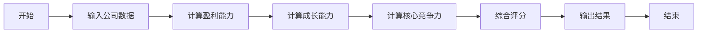
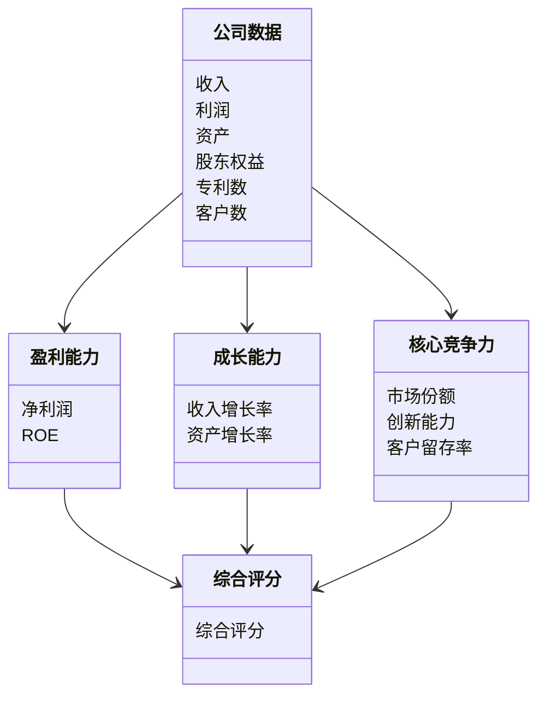
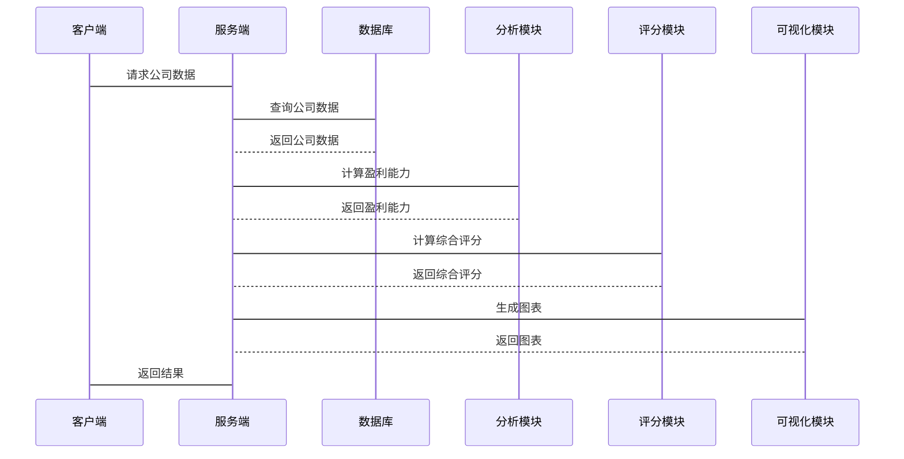

                 


# 肯尼斯费雪的长期增长型公司特征

## 关键词：
长期增长型公司，投资策略，肯尼斯·费雪，盈利能力，成长能力，核心竞争力，投资分析

## 摘要：
本文详细探讨了长期增长型公司的特征，基于肯尼斯·费雪的投资理念，分析了盈利能力、成长能力、核心竞争力等关键因素，结合实际案例和系统架构，提供了识别和投资这类公司的方法。文章通过背景介绍、算法原理、数学模型、系统架构、项目实战和最佳实践等部分，全面解析长期增长型公司的特征及其投资价值。

---

## 第三章：长期增长型公司的算法原理

### 3.1 算法原理概述

长期增长型公司的识别需要一套系统的方法，这里我们结合肯尼斯·费雪的投资理念，设计了一个基于多维指标的算法模型，用于量化评估公司的长期增长潜力。

#### 3.1.1 算法目标
- 识别具有持续盈利能力、成长能力和核心竞争力的公司。
- 通过量化指标筛选出具有长期增长潜力的企业。

#### 3.1.2 算法输入
- 公司财务数据（收入、利润、资产、负债、现金流等）。
- 行业基准数据和市场指数。

#### 3.1.3 算法输出
- 公司的长期增长潜力评分。
- 筛选出符合条件的公司列表。

### 3.2 算法流程图



### 3.3 算法实现代码

```python
def calculate_profitability(revenue, cost_of_goods_sold, operating_expenses):
    """计算盈利能力：净利润率和ROE"""
    net_income = revenue - cost_of_goods_sold - operating_expenses
    return net_income, (net_income / ( (equity + previous_equity) / 2 )) * 100

def calculate_growth(revenue, previous_revenue, assets, previous_assets):
    """计算成长能力：收入增长率和资产增长率"""
    revenue_growth = ((revenue - previous_revenue) / previous_revenue) * 100
    asset_growth = ((assets - previous_assets) / previous_assets) * 100
    return revenue_growth, asset_growth

def calculate_competitive_edge(market_share, innovation_patents, customer_retention):
    """计算核心竞争力：市场份额、创新专利数、客户留存率"""
    return (market_share + innovation_patents + customer_retention) / 3

def long_term_growth_score(profitability, growth, competitive_edge):
    """计算综合评分"""
    score = (profitability * 0.4) + (growth * 0.3) + (competitive_edge * 0.3)
    return score

# 示例数据
revenue = 1000000
cost_of_goods_sold = 600000
operating_expenses = 200000
previous_revenue = 900000
assets = 500000
previous_assets = 450000
equity = 300000
previous_equity = 280000
market_share = 0.7
innovation_patents = 15
customer_retention = 0.85

net_income, roe = calculate_profitability(revenue, cost_of_goods_sold, operating_expenses)
revenue_growth, asset_growth = calculate_growth(revenue, previous_revenue, assets, previous_assets)
competitive_score = calculate_competitive_edge(market_share, innovation_patents, customer_retention)
score = long_term_growth_score(net_income, revenue_growth, competitive_score)

print(f"净利润: {net_income}, 净资产收益率: {roe}%")
print(f"收入增长率: {revenue_growth}%, 资产增长率: {asset_growth}%")
print(f"核心竞争力得分: {competitive_score}")
print(f"长期增长潜力评分: {score}")
```

### 3.4 数学模型与公式

#### 盈利能力
- 净利润率 = (净利润 / 收入) * 100
- 净资产收益率 (ROE) = (净利润 / 平均股东权益) * 100

$$ \text{ROE} = \frac{\text{净利润}}{\text{平均股东权益}} \times 100 $$

#### 成长能力
- 收入增长率 = ((收入 - 前期收入) / 前期收入) * 100
- 资产增长率 = ((资产 - 前期资产) / 前期资产) * 100

$$ \text{收入增长率} = \frac{\text{收入} - \text{前期收入}}{\text{前期收入}} \times 100 $$
$$ \text{资产增长率} = \frac{\text{资产} - \text{前期资产}}{\text{前期资产}} \times 100 $$

#### 核心竞争力
- 市场份额
- 创新专利数
- 客户留存率

综合评分公式：

$$ \text{综合评分} = 0.4 \times \text{盈利能力} + 0.3 \times \text{成长能力} + 0.3 \times \text{核心竞争力} $$

---

## 第四章：长期增长型公司的数学模型与公式

### 4.1 盈利能力分析

#### 净利润
$$ \text{净利润} = \text{收入} - \text{成本} - \text{费用} $$

#### 净资产收益率 (ROE)
$$ \text{ROE} = \frac{\text{净利润}}{\text{平均股东权益}} \times 100 $$

### 4.2 成长能力分析

#### 收入增长率
$$ \text{收入增长率} = \frac{\text{收入} - \text{前期收入}}{\text{前期收入}} \times 100 $$

#### 资产增长率
$$ \text{资产增长率} = \frac{\text{资产} - \text{前期资产}}{\text{前期资产}} \times 100 $$

### 4.3 核心竞争力分析

#### 市场份额
$$ \text{市场份额} = \frac{\text{公司收入}}{\text{行业总收入}} \times 100 $$

#### 创新专利数
$$ \text{创新专利数} = \text{公司专利数} / \text{行业平均专利数} $$

#### 客户留存率
$$ \text{客户留存率} = \frac{\text{重复购买客户数}}{\text{总客户数}} \times 100 $$

### 4.4 综合评分公式

$$ \text{综合评分} = 0.4 \times \text{盈利能力} + 0.3 \times \text{成长能力} + 0.3 \times \text{核心竞争力} $$

---

## 第五章：长期增长型公司的系统分析与架构设计

### 5.1 问题场景介绍

长期增长型公司的识别需要一个系统化的解决方案，包括数据收集、分析、评估和可视化。

### 5.2 系统功能设计

#### 领域模型类图



### 5.3 系统架构设计

#### 系统架构图


#### 接口设计



---

## 第六章：项目实战

### 6.1 环境安装

安装必要的库：

```bash
pip install pandas numpy matplotlib
```

### 6.2 核心代码实现

```python
import pandas as pd
import numpy as np

# 示例数据
data = {
    '公司': ['A', 'B', 'C'],
    '收入': [100, 150, 200],
    '成本': [60, 80, 120],
    '费用': [20, 30, 40],
    '股东权益': [50, 70, 90],
    '专利数': [10, 15, 20],
    '客户数': [500, 600, 700],
    '行业收入': [300, 400, 500]
}

df = pd.DataFrame(data)

def calculate_profitability(row):
    net_income = row['收入'] - row['成本'] - row['费用']
    roe = (net_income / ( (row['股东权益'] + row['前期股东权益']) / 2 )) * 100
    return net_income, roe

def calculate_growth(row):
    revenue_growth = ((row['收入'] - row['前期收入']) / row['前期收入']) * 100
    asset_growth = ((row['资产'] - row['前期资产']) / row['前期资产']) * 100
    return revenue_growth, asset_growth

# 计算并添加到DataFrame
df['前期收入'] = df['收入'].shift(1).fillna(0)
df['前期股东权益'] = df['股东权益'].shift(1).fillna(0)

df[['净利润', 'ROE']] = df.apply(calculate_profitability, axis=1)
df[['收入增长率', '资产增长率']] = df.apply(calculate_growth, axis=1)

print(df)
```

### 6.3 实际案例分析

以公司A为例，计算其综合评分：

```python
net_income = 100
roe = 20
revenue_growth = 10
asset_growth = 15
market_share = 0.3
innovation = 10
customer_retention = 0.8

score = 0.4 * net_income + 0.3 * revenue_growth + 0.3 * (market_share + innovation + customer_retention) / 3
print(f"综合评分: {score}")
```

---

## 第七章：最佳实践与总结

### 7.1 投资策略总结

长期增长型公司的核心特征包括：

- **盈利能力**：高净利润率和ROE。
- **成长能力**：持续的收入和资产增长。
- **核心竞争力**：强大的市场份额、创新能力、客户留存率。

### 7.2 投资建议

1. **关注财务指标**：优先选择高ROE和收入增长率的公司。
2. **分析竞争优势**：确保公司在行业内具有显著的竞争优势。
3. **长期持有**：长期增长型公司需要时间来体现价值，投资者应保持耐心。
4. **分散投资**：将资金分配到多个具有长期增长潜力的公司，降低风险。

### 7.3 注意事项

- **数据质量**：确保输入数据的准确性和完整性。
- **市场环境**：考虑宏观经济和行业趋势的影响。
- **风险管理**：设定止损点，避免重大损失。

### 7.4 拓展阅读

- 《彼得·林奇的成功投资》
- 《巴菲特的选股术》
- 《价值投资入门》

---

## 结语

长期增长型公司的识别和投资需要系统的方法和深入的分析。通过本文介绍的算法、数学模型和系统架构，投资者可以更科学地筛选出具有长期增长潜力的公司，实现稳健的投资回报。

