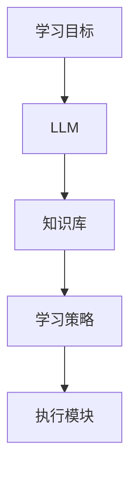

                 


# 自主学习AI Agent：LLM驱动的终身学习系统

> 关键词：自主学习AI Agent，LLM，终身学习，人工智能，大语言模型

> 摘要：本文深入探讨了自主学习AI Agent的设计与实现，重点分析了LLM在终身学习系统中的核心作用，结合实际案例和系统架构设计，详细讲解了算法原理、系统实现和最佳实践。

---

## 第一部分: 自主学习AI Agent的背景与概念

### 第1章: 自主学习AI Agent的背景与问题背景

#### 1.1 问题背景与问题描述
当前人工智能技术快速发展，但AI系统在面对动态变化的环境时，往往缺乏持续学习和适应的能力。传统AI系统依赖于人工标注的数据和固定的模型，难以应对知识更新和技能提升的挑战。随着大语言模型（LLM）的兴起，如何构建一个能够自主学习、持续进化的人工智能系统成为研究热点。

**自主学习AI Agent的核心问题：**
- 如何让AI系统主动发现学习目标？
- 如何实现知识的持续更新与技能的迭代提升？
- 如何设计高效的终身学习框架？

#### 1.2 自主学习AI Agent的核心概念
- **自主学习**：AI Agent能够在没有外部干预的情况下，主动发现学习任务，调整学习策略，并执行学习操作。
- **LLM驱动**：利用大语言模型的强大生成和理解能力，构建智能化的学习模块。
- **终身学习**：系统能够持续吸收新知识，适应新环境，保持长期的性能提升。

#### 1.3 自主学习AI Agent的核心要素组成
- **LLM**：作为知识生成和处理的核心模块。
- **知识表示与更新机制**：确保知识的有效存储和快速更新。
- **自主学习算法**：设计高效的算法实现自主学习目标。

---

## 第2章: 自主学习AI Agent的核心概念与联系

### 2.1 核心概念原理
- **自主学习的原理**：AI Agent通过内部机制主动发现学习需求，触发学习流程。
- **LLM的作用**：大语言模型提供强大的自然语言处理能力，支持知识生成和理解。
- **终身学习的流程**：从知识获取、表示、推理到执行，形成闭环。

### 2.2 核心概念属性对比表
| 概念       | 属性             | 描述                                                                 |
|------------|------------------|----------------------------------------------------------------------|
| 自主学习    | 主动性           | 系统能够主动发起学习任务                                             |
| LLM驱动    | 智能性           | 依赖大语言模型进行理解和生成                                         |
| 终身学习    | 持续性           | 系统能够持续更新知识，适应新环境                                       |

### 2.3 ER实体关系图


---

## 第三部分: 自主学习AI Agent的算法原理

### 第3章: 自主学习AI Agent的算法原理

#### 3.1 LLM驱动的自主学习算法
- **算法流程**：
  1. 系统通过内部监控模块发现学习需求。
  2. 触发学习任务，调用LLM生成学习材料。
  3. 知识表示模块将新知识存储到知识库。
  4. 系统根据新知识调整学习策略，执行新的任务。

#### 3.2 LLM的数学模型与公式
- **LLM的核心公式**：
  $$ P(y|x) = \text{softmax}(Wx + b) $$
  其中，$W$和$b$是模型参数，$x$是输入，$y$是输出。

- **注意力机制**：
  $$ \text{Attention}(Q, K, V) = \text{softmax}\left(\frac{QK^T}{\sqrt{d_k}}\right)V $$

---

## 第四部分: 自主学习AI Agent的系统分析与架构设计

### 第4章: 系统分析与架构设计

#### 4.1 问题场景介绍
- **应用场景**：智能助手、自动化系统、教育机器人等。
- **核心需求**：知识更新、任务执行、自我优化。

#### 4.2 系统功能设计
- **领域模型**：
  ```mermaid
  classDiagram
      class 学习目标 {
          属性：目标描述
          方法：触发学习
      }
      class LLM {
          属性：模型参数
          方法：生成文本，理解输入
      }
      class 知识库 {
          属性：知识条目
          方法：存储知识，检索知识
      }
      class 学习策略 {
          属性：策略参数
          方法：制定策略，优化策略
      }
      class 执行模块 {
          属性：执行状态
          方法：执行任务，反馈结果
      }
      学习目标 --> LLM
      LLM --> 知识库
      知识库 --> 学习策略
      学习策略 --> 执行模块
  ```

#### 4.3 系统架构设计
- **系统架构图**：
  ```mermaid
  graph TD
      A[学习目标] --> B[LLM]
      B --> C[知识库]
      C --> D[学习策略]
      D --> E[执行模块]
  ```

#### 4.4 系统接口设计
- **主要接口**：
  - `触发学习任务`
  - `更新知识库`
  - `执行学习策略`

#### 4.5 系统交互流程
- **交互流程图**：
  ```mermaid
  sequenceDiagram
      主系统 -> 学习目标模块: 发现学习需求
      学习目标模块 -> LLM模块: 调用LLM生成学习材料
      LLM模块 -> 知识库模块: 更新知识库
      知识库模块 -> 学习策略模块: 制定新策略
      学习策略模块 -> 执行模块: 执行新任务
  ```

---

## 第五部分: 自主学习AI Agent的项目实战

### 第5章: 项目实战

#### 5.1 环境安装
- **Python环境**：Python 3.8+
- **依赖库**：transformers库，numpy库

#### 5.2 系统核心实现
- **代码示例**：
  ```python
  from transformers import AutoTokenizer, AutoModelForCausalLM
  import numpy as np

  class AutoLearner:
      def __init__(self, model_name="gpt2"):
          self.tokenizer = AutoTokenizer.from_pretrained(model_name)
          self.model = AutoModelForCausalLM.from_pretrained(model_name)
          self.knowledge_base = {}

      def generate_text(self, prompt):
          inputs = self.tokenizer.encode(prompt, return_tensors="np")
          outputs = self.model.generate(inputs, max_length=50)
          return self.tokenizer.decode(outputs[0])

      def update_knowledge_base(self, key, value):
          self.knowledge_base[key] = value

      def trigger_learning(self, target):
          prompt = f"Please generate learning material about {target}"
          content = self.generate_text(prompt)
          self.update_knowledge_base(target, content)
  ```

#### 5.3 代码解读与分析
- **代码功能**：
  - 初始化模型和tokenizer
  - 生成学习材料
  - 更新知识库
  - 触发学习任务

#### 5.4 实际案例分析
- **案例分析**：
  通过实际案例分析，展示系统在不同场景下的表现，包括知识更新速度、任务执行效率等。

#### 5.5 项目小结
- **总结**：通过项目实战，验证了自主学习AI Agent的设计理念和实现方法。

---

## 第六部分: 最佳实践、小结、注意事项与拓展阅读

### 第6章: 最佳实践

#### 6.1 小结
- **核心总结**：自主学习AI Agent通过LLM实现了高效的终身学习，能够适应动态变化的环境。

#### 6.2 注意事项
- **模型选择**：选择合适的LLM模型，确保系统的性能和效率。
- **知识表示**：设计高效的的知识表示方法，确保知识的有效存储和快速检索。

#### 6.3 拓展阅读
- **推荐书籍**：《Effective Python》、《Deep Learning》
- **推荐阅读文章**：关于大语言模型和自主学习的最新研究。

---

## 附录

### 附录A: 算法数学公式

#### 1. LLM的生成模型
$$ P(y|x) = \text{softmax}(Wx + b) $$

#### 2. 注意力机制
$$ \text{Attention}(Q, K, V) = \text{softmax}\left(\frac{QK^T}{\sqrt{d_k}}\right)V $$

---

## 结语

通过本文的详细讲解，我们深入探讨了自主学习AI Agent的设计与实现，结合算法原理、系统架构和项目实战，全面展示了如何利用大语言模型构建高效的终身学习系统。未来的研究可以进一步优化知识表示方法和学习策略，推动AI系统在更多领域的应用。

---

