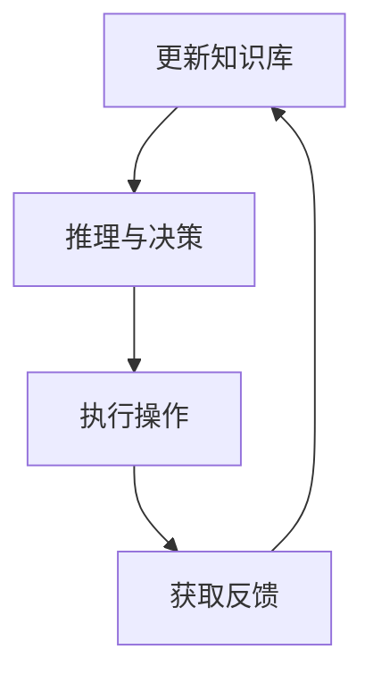
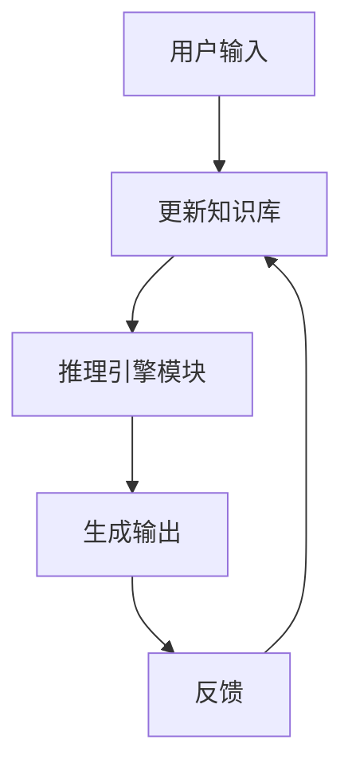

                 


# 自主学习型 AI Agent：利用 LLM 实现持续进化

> 关键词：自主学习型 AI Agent，LLM，持续进化，大语言模型，人工智能，机器学习

> 摘要：本文深入探讨了自主学习型 AI Agent 的概念、技术背景、实现原理及其应用价值。通过结合大语言模型（LLM）的技术优势，详细阐述了如何利用 LLM 实现 AI Agent 的持续进化。文章从理论到实践，系统性地分析了自主学习型 AI Agent 的设计原理、算法实现、系统架构，并通过实际案例展示了其在不同场景中的应用。同时，本文还探讨了当前技术的局限性及未来优化方向，为读者提供了全面的技术视角和实践指导。

---

## 第1章：自主学习型 AI Agent 的背景与概念

### 1.1 自主学习型 AI Agent 的定义与背景

#### 1.1.1 什么是自主学习型 AI Agent
自主学习型 AI Agent 是一类能够通过与环境交互、自我监督学习和持续优化自身行为的智能体。它不同于传统的基于规则的 AI 系统，能够通过外部反馈和内部推理不断改进自身的决策能力和知识储备。

#### 1.1.2 自主学习的核心特征
- **自主性**：AI Agent 能够在没有外部干预的情况下，自主完成任务和解决问题。
- **持续进化**：通过与环境的交互和反馈，AI Agent 能够不断优化自身的知识库和行为策略。
- **适应性**：能够根据环境的变化动态调整自身的行为模式，适应新的任务需求。

#### 1.1.3 自主学习与传统 AI 的区别
| 特性 | 传统 AI | 自主学习型 AI |
|------|---------|----------------|
| 决策方式 | 基于预设规则 | 基于学习和反馈优化 |
| 知识更新 | 需要人工干预 | 自动更新和进化 |
| 适应性 | 有限 | 强大的环境适应能力 |

---

### 1.2 技术背景与问题背景

#### 1.2.1 当前 AI 技术的发展现状
人工智能技术近年来取得了长足的发展，尤其是在深度学习和大语言模型（LLM）领域。然而，现有的 AI 系统大多依赖于固定的规则和预设的训练数据，缺乏自主学习和持续进化的能力。

#### 1.2.2 自主学习型 AI Agent 的问题背景
在实际应用中，AI 系统需要面对复杂多变的环境和多样化的需求。传统的 AI 系统在面对新问题时，往往需要依赖人工干预进行调整和优化，这限制了其在动态环境中的应用潜力。

#### 1.2.3 问题解决的必要性与目标
- **必要性**：随着 AI 系统应用场景的不断扩大，其需要具备更强的适应性和自主性。
- **目标**：通过结合 LLM 的技术优势，构建一种能够持续学习和进化的 AI Agent，使其能够在复杂环境中自主完成任务。

---

## 第2章：大语言模型（LLM）的基础

### 2.1 大语言模型的定义与特点

#### 2.1.1 什么是大语言模型
大语言模型（LLM）是指基于深度学习技术构建的大型语言模型，如 GPT 系列、BERT 系列等。这些模型通过大量数据的预训练，能够理解和生成人类语言。

#### 2.1.2 LLM 的核心特点与优势
- **大规模数据训练**：通过海量数据的预训练，模型能够掌握语言的多种表达方式和语义。
- **上下文理解能力**：LLM 具备强大的上下文理解和推理能力，能够处理复杂对话和多轮交互。
- **可扩展性**：LLM 可以应用于多种语言处理任务，如翻译、问答、文本生成等。

#### 2.1.3 LLM 与传统语言模型的对比
| 特性 | 传统语言模型 | LLM |
|------|---------------|------|
| 数据规模 | 较小 | 极大 |
| 复杂度 | 较低 | 极高 |
| 应用场景 | 有限 | 广泛 |

---

### 2.2 LLM 的技术基础

#### 2.2.1 深度学习与神经网络
深度学习是一种基于人工神经网络的机器学习方法，通过多层非线性变换来提取数据的高层次特征。

#### 2.2.2 变压器模型（Transformer）的原理
Transformer 是一种基于自注意力机制的深度学习模型，由编码器和解码器组成，广泛应用于自然语言处理任务。

#### 2.2.3 LLM 的训练与优化
- **预训练**：通过大量未标注数据的微调，使模型掌握语言的基本规律。
- **微调**：在特定任务上进行 fine-tuning，优化模型的性能。

---

## 第3章：自主学习型 AI Agent 的核心概念与联系

### 3.1 自主学习型 AI Agent 的核心概念

#### 3.1.1 自主性与持续进化能力
AI Agent 能够在没有外部干预的情况下，自主完成任务并优化自身行为。

#### 3.1.2 知识表示与推理能力
通过知识图谱和符号逻辑，AI Agent 能够进行推理和决策。

#### 3.1.3 与外部环境的交互能力
AI Agent 能够通过传感器或 API 与外部环境交互，获取信息并执行操作。

### 3.2 核心概念的联系与对比

#### 3.2.1 自主学习与强化学习的对比
| 特性 | 自主学习 | 强化学习 |
|------|-----------|-----------|
| 决策方式 | 基于学习和反馈 | 基于奖励机制 |
| 知识更新 | 自动更新 | 需要外部奖励 |
| 适应性 | 强大 | 较强 |

---

## 第4章：利用 LLM 实现自主学习的原理

### 4.1 LLM 在自主学习中的角色

#### 4.1.1 LLM 作为知识库的存储与更新
LLM 可以作为 AI Agent 的知识库，存储和更新其知识储备。

#### 4.1.2 LLM 作为推理引擎的作用
通过自然语言处理能力，LLM 可以帮助 AI Agent 进行推理和决策。

#### 4.1.3 LLM 作为交互接口的功能
LLM 可以作为 AI Agent 的交互接口，处理用户输入并生成输出。

### 4.2 自主学习的算法原理

#### 4.2.1 自主学习的基本算法
自主学习的算法通常包括以下几个步骤：
1. **感知环境**：通过传感器或 API 获取环境信息。
2. **推理与决策**：基于获取的信息进行推理和决策。
3. **执行操作**：根据决策结果执行操作。
4. **反馈与学习**：根据反馈调整知识库和决策策略。

#### 4.2.2 基于 LLM 的自主学习算法实现


---

## 第5章：系统架构与设计

### 5.1 系统功能设计

#### 5.1.1 功能模块
- **知识库模块**：负责存储和管理 AI Agent 的知识储备。
- **推理引擎模块**：负责进行推理和决策。
- **交互接口模块**：负责与外部环境进行交互。

#### 5.1.2 功能流程


---

## 第6章：项目实战

### 6.1 环境搭建

#### 6.1.1 安装依赖
```bash
pip install transformers torch
```

#### 6.1.2 下载模型
```bash
wget https://huggingface.co/gpt2/... --output gpt2-model.pth
```

### 6.2 核心代码实现

#### 6.2.1 知识库模块
```python
class KnowledgeBase:
    def __init__(self):
        self.knowledge = {}

    def update(self, key, value):
        self.knowledge[key] = value
```

#### 6.2.2 推理引擎模块
```python
class ReasoningEngine:
    def __init__(self, model):
        self.model = model

    def infer(self, input):
        return self.model.predict(input)
```

---

## 第7章：优化与展望

### 7.1 性能优化

#### 7.1.1 知识库优化
通过引入分布式存储和增量学习技术，提高知识库的更新效率。

#### 7.1.2 推理引擎优化
通过优化模型的训练策略和推理算法，提高推理引擎的效率。

### 7.2 实际应用案例

#### 7.2.1 智能助手
在智能助手应用中，自主学习型 AI Agent 可以通过与用户的交互不断优化自身的问答能力和任务处理能力。

#### 7.2.2 企业级应用
在企业级应用中，自主学习型 AI Agent 可以帮助优化业务流程和提高决策效率。

### 7.3 未来发展趋势

#### 7.3.1 多模态融合
通过结合视觉、听觉等多种模态信息，进一步提高 AI Agent 的感知能力和决策能力。

#### 7.3.2 强化学习结合
将强化学习技术与自主学习相结合，进一步提高 AI Agent 的适应性和进化能力。

---

## 总结

自主学习型 AI Agent 的实现是人工智能领域的一项重要突破，它通过结合大语言模型（LLM）的技术优势，实现了 AI 系统的持续进化和自主学习。本文从理论到实践，系统性地分析了自主学习型 AI Agent 的设计原理、算法实现、系统架构，并通过实际案例展示了其在不同场景中的应用。未来，随着技术的不断进步，自主学习型 AI Agent 将在更多领域展现出其强大的潜力和价值。

