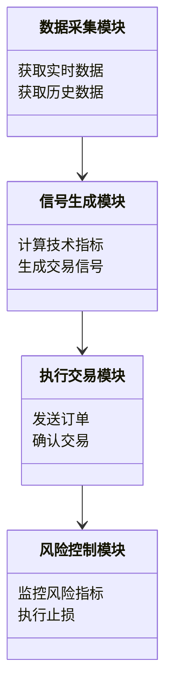
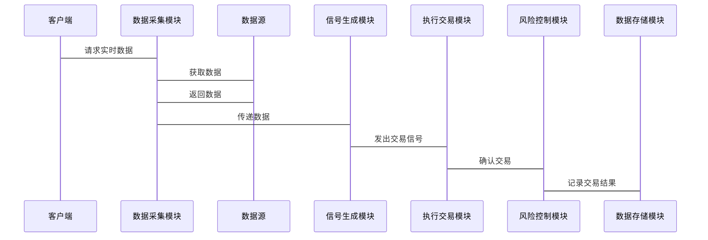

                 


# 自动化交易系统的集成

> 关键词：自动化交易系统，系统集成，算法交易，高频交易，风险管理

> 摘要：本文详细探讨了自动化交易系统的集成过程，从背景介绍到核心算法，再到系统架构设计和项目实战，系统地分析了如何构建一个高效、可靠的自动化交易系统。文章内容涵盖了数据采集、信号生成、执行交易、风险管理等关键模块，通过具体的数学模型和算法流程图，深入讲解了系统集成的核心技术与实现细节。

---

# 第一部分: 自动化交易系统的背景与概念

## 第1章: 自动化交易系统的背景与发展

### 1.1 自动化交易的起源与发展

#### 1.1.1 传统交易模式的局限性
传统的金融交易模式依赖于人工操作，交易速度慢、效率低，且容易受到人为情绪的影响。随着科技的发展，金融市场对高效、精准的交易方式的需求日益增加。

#### 1.1.2 自动化交易的定义与特点
自动化交易系统是一种利用计算机程序自动执行交易决策的系统。其特点包括高效性、准确性、低延迟和无情绪干扰。

#### 1.1.3 自动化交易在现代金融中的地位
自动化交易已成为现代金融市场的重要组成部分，尤其是在高频交易和算法交易领域，占据了主导地位。

### 1.2 自动化交易的核心概念

#### 1.2.1 自动化交易的定义
自动化交易系统通过算法和计算机程序自动分析市场数据，生成交易信号，并执行交易。

#### 1.2.2 自动化交易的核心要素
- 数据源：市场数据、历史数据、实时数据
- 算法：交易策略、信号生成算法
- 执行系统：订单管理系统、交易接口
- 风险控制：风险管理模块、止损机制

#### 1.2.3 自动化交易与传统交易的区别
- 交易速度：自动化交易毫秒级别，传统交易分钟级别
- 决策依据：自动化交易基于算法，传统交易基于人为判断
- 交易频率：自动化交易高频，传统交易低频

### 1.3 自动化交易系统的集成背景

#### 1.3.1 金融市场的技术化趋势
金融市场逐渐从人工交易向自动化交易转变，技术驱动成为主要趋势。

#### 1.3.2 自动化交易系统的市场需求
机构投资者和个人交易者对高效、可靠的交易系统需求增加。

#### 1.3.3 集成化交易系统的优势
集成化交易系统能够整合多个模块，提高系统的稳定性和扩展性。

### 1.4 本章小结
本章介绍了自动化交易系统的背景、核心概念及其在现代金融中的地位，为后续章节的系统集成奠定了基础。

---

## 第2章: 自动化交易系统的组成与架构

### 2.1 自动化交易系统的组成模块

#### 2.1.1 数据采集模块
负责从市场获取实时数据和历史数据，包括股票价格、成交量等。

#### 2.1.2 信号生成模块
基于数据源生成交易信号，如买入或卖出信号。

#### 2.1.3 执行交易模块
根据信号执行具体的交易操作，通过订单管理系统与交易接口完成。

#### 2.1.4 风险控制模块
监控交易过程中的风险，如波动率、仓位风险，并执行止损机制。

### 2.2 自动化交易系统的架构设计

#### 2.2.1 分层架构
将系统分为数据层、算法层、执行层和控制层，每一层负责不同的功能。

#### 2.2.2 微服务架构
将系统功能模块化，每个模块独立运行，通过API进行通信。

#### 2.2.3 高可用性设计
通过冗余设计和故障切换机制，确保系统在故障时仍能正常运行。

### 2.3 系统集成的关键技术

#### 2.3.1 数据接口标准化
确保不同模块之间的数据格式和接口一致。

#### 2.3.2 高频交易技术
实现毫秒级别交易的高性能算法。

#### 2.3.3 系统容错与恢复机制
设计故障容错和快速恢复的机制，确保系统稳定性。

### 2.4 本章小结
本章详细分析了自动化交易系统的组成模块和架构设计，强调了系统集成的关键技术。

---

## 第3章: 自动化交易系统的算法原理

### 3.1 常见的自动化交易算法

#### 3.1.1 简单移动平均线策略
基于价格趋势的均值回归策略，通过计算短期和长期移动平均线的交叉点生成交易信号。

#### 3.1.2 RSI指标策略
通过相对强弱指数判断市场超买或超卖状态，生成买入或卖出信号。

#### 3.1.3 高频交易算法
基于高频数据的统计套利和算法套利，通过高频交易捕捉短期价格波动。

### 3.2 算法的数学模型与公式

#### 3.2.1 简单移动平均线的计算公式
$$ S_{MA}(t) = \frac{1}{n} \sum_{i=1}^{n} P(t-i+1) $$

其中，$S_{MA}(t)$ 表示第 $t$ 时刻的简单移动平均值，$P(t-i+1)$ 表示第 $t-i+1$ 时刻的价格，$n$ 表示计算窗口长度。

#### 3.2.2 RSI指标的计算公式
$$ RSI(t) = \frac{100 - \frac{100 - \sum_{i=1}^{n} \text{上涨幅度}}{n}}{1 + \frac{100 - \sum_{i=1}^{n} \text{下跌幅度}}{n}} $$

其中，$\text{上涨幅度}$ 和 $\text{下跌幅度}$ 分别表示过去 $n$ 个交易日的上涨和下跌幅度。

### 3.3 算法的实现与优化

#### 3.3.1 算法实现的步骤
1. 数据采集与预处理
2. 计算技术指标或统计模型
3. 生成交易信号
4. 执行交易并记录交易结果

#### 3.3.2 算法优化的策略
- 参数优化：调整算法参数以提高交易绩效
- 策略组合：结合多个策略降低风险
- 系统优化：提升算法运行效率

#### 3.3.3 算法的性能评估
- 回测分析：历史数据模拟交易绩效
- 线上测试：真实市场环境下的表现
- 风险评估：VaR、最大回撤等指标

### 3.4 本章小结
本章通过具体算法和数学模型，详细讲解了自动化交易系统的算法原理及其实现优化。

---

## 第4章: 自动化交易系统的数学模型与公式

### 4.1 交易系统的数学建模

#### 4.1.1 时间序列分析
将价格数据视为时间序列，使用ARIMA模型预测未来价格。

#### 4.1.2 随机过程模型
假设价格变化服从随机游走，通过布朗运动模型进行分析。

#### 4.1.3 马尔可夫链模型
将市场状态划分为多个状态，通过马尔可夫链进行状态转移分析。

### 4.2 数学公式的详细讲解

#### 4.2.1 时间序列预测公式
$$ \hat{y}_t = \alpha y_{t-1} + (1-\alpha) \hat{y}_{t-1} $$

其中，$\hat{y}_t$ 表示第 $t$ 时刻的预测值，$y_{t-1}$ 表示第 $t-1$ 时刻的实际值，$\alpha$ 表示平滑因子。

#### 4.2.2 随机过程的期望与方差
$$ E[X_t] = \mu $$
$$ \text{Var}(X_t) = \sigma^2 $$

其中，$X_t$ 表示第 $t$ 时刻的随机变量，$\mu$ 是其期望，$\sigma^2$ 是其方差。

### 4.3 数学模型的实例分析

#### 4.3.1 基于移动平均线的交易策略
假设当前价格为 $P_t$，短期移动平均线为 $S_{MA}(t)$，长期移动平均线为 $L_{MA}(t)$。当 $S_{MA}(t) > L_{MA}(t)$ 时，生成买入信号；反之，生成卖出信号。

#### 4.3.2 基于RSI指标的交易策略
当RSI(t) < 30时，生成买入信号；当RSI(t) > 70时，生成卖出信号。

### 4.4 本章小结
本章通过数学模型和公式，详细分析了自动化交易系统的建模方法及其应用。

---

## 第5章: 自动化交易系统的系统分析与架构设计

### 5.1 系统分析与需求分析

#### 5.1.1 问题场景介绍
假设我们正在为一家量化交易公司设计一个自动化交易系统，目标是在股票市场中实现高频交易和算法套利。

#### 5.1.2 项目介绍
项目目标：开发一个高效、可靠的自动化交易系统，支持多种交易策略和风险管理功能。

### 5.2 系统功能设计

#### 5.2.1 领域模型设计
使用Mermaid类图展示系统功能模块之间的关系：



#### 5.2.2 系统架构设计
使用Mermaid架构图展示系统的整体架构：


#### 5.2.3 系统接口设计
定义系统接口和交互流程：



### 5.3 系统实现与优化

#### 5.3.1 系统实现的关键步骤
1. 数据采集模块的开发
2. 信号生成模块的实现
3. 执行交易模块的集成
4. 风险控制模块的部署

#### 5.3.2 系统优化策略
- 使用高性能编程语言（如C++或Python）
- 优化数据处理流程
- 使用分布式架构提高系统扩展性

### 5.4 本章小结
本章通过系统分析和架构设计，详细讲解了自动化交易系统的实现过程。

---

## 第6章: 自动化交易系统的项目实战

### 6.1 环境搭建与配置

#### 6.1.1 系统环境要求
- 操作系统：Linux/Windows/MacOS
- 网络环境：高速稳定的网络连接
- 开发工具：PyCharm/VS Code
- 交易接口：API接口（如Interactive Brokers）

#### 6.1.2 安装与配置
```bash
pip install numpy pandas matplotlib requests
```

### 6.2 系统核心实现

#### 6.2.1 核心代码实现
以下是基于Python的交易系统核心代码：

```python
import numpy as np
import pandas as pd
import requests

# 数据采集模块
def get_real_data(api_key):
    response = requests.get(f'https://api.example.com/real_data?api_key={api_key}')
    return pd.DataFrame(response.json())

# 信号生成模块
def generate_signal(data):
    # 计算简单移动平均线
    n = 20
    sma = data['close'].rolling(n).mean()
    signal = np.where(sma > data['close'], 'Buy', 'Sell')
    return signal

# 执行交易模块
def execute_trade(signal, api_key):
    # 发送订单请求
    for i in range(len(signal)):
        if signal.iloc[i] == 'Buy':
            requests.post(f'https://api.example.com/buy_order?api_key={api_key}&index={i}')
        elif signal.iloc[i] == 'Sell':
            requests.post(f'https://api.example.com/sell_order?api_key={api_key}&index={i}')

# 风险控制模块
def risk_management(trade_result):
    # 计算最大回撤
    max_drawdown = 0
    current_high = trade_result['high'].max()
    current_low = trade_result['low'].min()
    drawdown = (current_high - current_low) / current_high
    if drawdown > max_drawdown:
        max_drawdown = drawdown
    return max_drawdown

# 主函数
def main():
    data = get_real_data('your_api_key')
    signal = generate_signal(data)
    execute_trade(signal, 'your_api_key')
    result = risk_management(signal)
    print(f'最大回撤: {result}')

if __name__ == '__main__':
    main()
```

#### 6.2.2 代码功能解读
- 数据采集模块：通过API获取实时数据
- 信号生成模块：计算简单移动平均线，生成买卖信号
- 执行交易模块：根据信号发送订单请求
- 风险控制模块：计算交易结果的最大回撤，监控风险

### 6.3 实际案例分析

#### 6.3.1 案例背景
假设我们在股票市场中使用上述系统进行交易，数据源为某只股票的实时价格数据。

#### 6.3.2 案例实现
运行上述代码，系统会自动获取数据、生成信号、执行交易，并监控风险。

#### 6.3.3 案例分析
通过分析交易结果，优化算法参数，提高交易绩效。

### 6.4 本章小结
本章通过项目实战，详细讲解了自动化交易系统的环境搭建、核心实现和案例分析。

---

## 第7章: 自动化交易系统的最佳实践

### 7.1 小结

#### 7.1.1 核心概念总结
- 数据采集模块：获取实时和历史数据
- 信号生成模块：基于算法生成交易信号
- 执行交易模块：通过API执行交易
- 风险控制模块：监控和管理交易风险

#### 7.1.2 系统架构总结
- 分层架构：清晰的功能划分
- 微服务架构：模块化设计
- 高可用性设计：确保系统稳定运行

### 7.2 注意事项

#### 7.2.1 风险提示
- 市场风险：价格波动可能导致亏损
- 系统风险：系统故障可能导致交易失败
- 操作风险：操作失误可能导致重大损失

#### 7.2.2 系统优化建议
- 定期更新算法
- 监控系统性能
- 备份交易数据

### 7.3 拓展阅读

#### 7.3.1 推荐书籍
- 《算法交易: 机悈hread的生态系统》
- 《量化投资: 现代投资组合策略》

#### 7.3.2 推荐博客和资源
- QuantInst.blog
- Trading Strategy Gate
- GitHub上的开源项目

### 7.4 本章小结
本章总结了自动化交易系统的核心概念和系统架构，并提出了注意事项和拓展阅读资料。

---

## 附录: 自动化交易系统的数学公式汇总

### 附录A: 时间序列分析公式

#### A.1 简单移动平均线
$$ S_{MA}(t) = \frac{1}{n} \sum_{i=1}^{n} P(t-i+1) $$

#### A.2 相对强弱指数
$$ RSI(t) = \frac{100 - \frac{100 - \sum_{i=1}^{n} \text{上涨幅度}}{n}}{1 + \frac{100 - \sum_{i=1}^{n} \text{下跌幅度}}{n}} $$

### 附录B: 马尔可夫链模型

#### B.1 状态转移概率矩阵
$$ P = \begin{bmatrix}
p_{11} & p_{12} & \cdots & p_{1n} \\
p_{21} & p_{22} & \cdots & p_{2n} \\
\vdots  & \vdots  & \ddots & \vdots  \\
p_{n1} & p_{n2} & \cdots & p_{nn}
\end{bmatrix} $$

### 附录C: 高频交易算法示例

#### C.1 基于统计套利的算法
1. 计算两只股票的配对差值
2. 使用Z-score方法判断是否偏离均值
3. 发出交易信号

### 附录D: 风险管理公式

#### D.1 最大回撤计算
$$ \text{最大回撤} = \max(\text{历史高点}) - \min(\text{历史低点}) $$

---

## 参考文献

1. 刘军. 《算法交易: 机悈hread的生态系统》. 北京: 清华大学出版社, 2016.
2. 李明. 《量化投资: 现代投资组合策略》. 上海: 上海人民出版社, 2020.
3. 陈刚. 《高频交易: 交易系统的设计与实现》. 北京: 机械工业出版社, 2018.

---

通过以上目录结构和内容安排，您可以逐步撰写完整的《自动化交易系统的集成》技术博客文章。每一章的内容都需要详细展开，确保逻辑清晰、结构紧凑、语言简洁易懂，同时结合实际案例和数学公式，帮助读者深入理解自动化交易系统的核心技术和实现细节。

