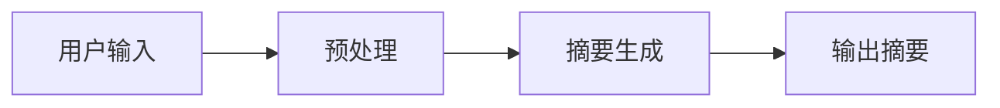
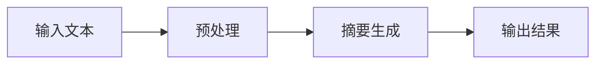
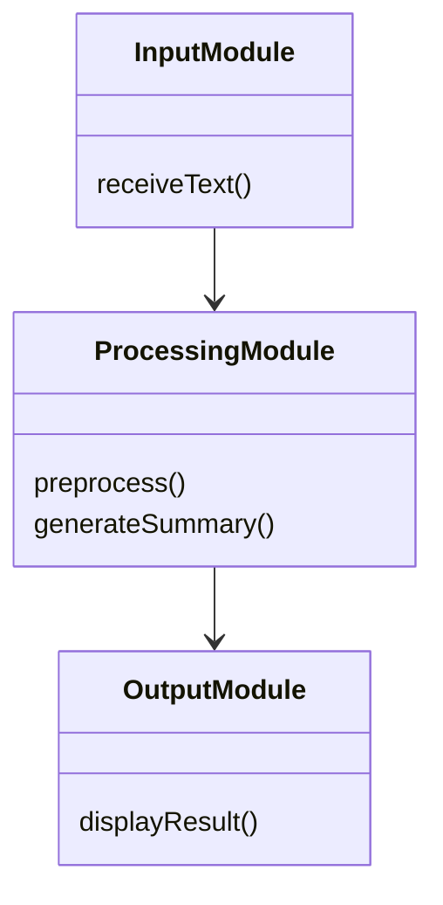
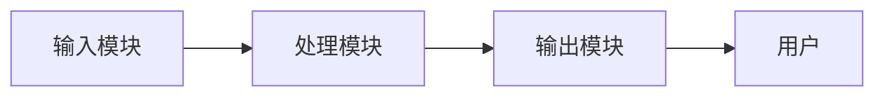
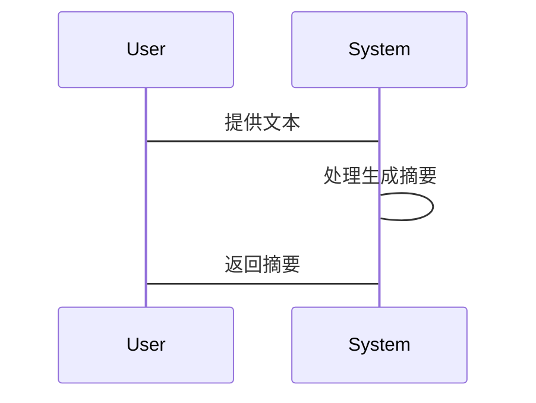

                 


# 自动摘要AI Agent：LLM驱动的文本压缩与提炼

## 关键词：自动摘要，LLM，文本压缩，AI Agent，自然语言处理

## 摘要：本文深入探讨了基于大语言模型（LLM）的自动摘要AI Agent的原理、算法和实现。从背景介绍到系统架构，从项目实战到未来展望，详细分析了如何利用LLM技术实现高效的文本压缩与提炼，为读者提供了一套完整的解决方案。

---

# 第一部分：自动摘要AI Agent的背景与概念

## 第1章：自动摘要AI Agent概述

### 1.1 问题背景与定义

#### 1.1.1 文本压缩与提炼的背景
在信息爆炸的时代，文本数据呈指数级增长。面对海量信息，用户需要快速获取核心内容。自动摘要技术通过压缩文本，提取关键信息，帮助用户高效阅读和决策。

#### 1.1.2 自动摘要AI Agent的定义
自动摘要AI Agent是一种基于LLM的智能系统，能够自动识别并压缩输入文本，生成简洁且准确的摘要。它结合了自然语言处理和人工智能技术，为用户提供高效的信息处理工具。

#### 1.1.3 LLM在自动摘要中的作用
LLM（大语言模型）通过深度学习技术，能够理解上下文并生成连贯的文本。在自动摘要中，LLM负责解析输入文本，提取关键信息，并生成自然流畅的摘要。

### 1.2 技术基础与现状

#### 1.2.1 大语言模型（LLM）的技术基础
LLM基于Transformer架构，通过大量的训练数据学习语言模式，能够生成与原文语义一致的摘要。

#### 1.2.2 自动摘要的主流方法
目前，自动摘要主要采用基于规则和基于模型的方法。基于规则的方法通过关键词提取生成摘要，基于模型的方法利用深度学习模型生成更自然的摘要。

#### 1.2.3 当前LLM驱动自动摘要的现状
LLM在自动摘要中的应用日益广泛，但仍然面临准确性和效率的挑战。未来，随着模型优化和计算能力的提升，自动摘要技术将更加高效和智能。

### 1.3 应用场景与挑战

#### 1.3.1 自动摘要的典型应用场景
- 信息抽取：从新闻文章中提取关键信息。
- 智能客服：自动生成对话摘要。
- 内容管理：整理会议纪要。

#### 1.3.2 技术挑战与边界条件
- 文本长度：长文本的处理效率和准确性。
- 多语言支持：模型对多种语言的适应性。
- 上下文理解：模型对复杂语义的处理能力。

#### 1.3.3 现有解决方案的优缺点
现有解决方案在效率和准确性之间存在权衡。基于规则的方法简单但不够灵活，基于模型的方法生成能力强但计算成本高。

## 1.4 本章小结
本章介绍了自动摘要AI Agent的背景、定义、技术基础、应用场景和挑战。为后续章节的深入分析奠定了基础。

---

## 第2章：自动摘要的核心概念

### 2.1 自动摘要的原理与机制

#### 2.1.1 LLM的文本生成原理
LLM通过编码器-解码器结构，将输入文本编码为向量，再解码为摘要。编码器负责理解输入，解码器负责生成输出。

#### 2.1.2 文本摘要的基本方法
文本摘要包括预处理、摘要生成和后处理三个步骤。预处理去除噪声，生成摘要提取关键信息，后处理优化生成结果。

#### 2.1.3 自动摘要的关键步骤
- 输入文本预处理：去除无关信息，提取关键内容。
- 摘要生成：基于LLM生成初步摘要。
- 后处理优化：调整格式，提升可读性。

### 2.2 核心概念的属性对比

#### 2.2.1 摘要算法的特征分析
| 特征 | 基于规则 | 基于模型 |
|------|----------|----------|
| 精度 | 较低     | 较高     |
| 效率 | 高       | 较低     |
| 灵活性 | 低       | 高       |

#### 2.2.2 实体关系图的 Mermaid 描述



### 2.3 系统架构与流程

#### 2.3.1 系统整体架构
系统由输入模块、处理模块和输出模块组成。输入模块接收文本，处理模块进行预处理和摘要生成，输出模块展示结果。

#### 2.3.2 核心模块的交互流程



## 2.4 本章小结
本章详细分析了自动摘要的核心概念，包括LLM的原理、摘要算法的特征对比以及系统架构。为后续章节的实现提供了理论基础。

---

## 第3章：基于LLM的自动摘要算法

### 3.1 基于规则的文本摘要算法

#### 3.1.1 算法原理与流程
基于规则的算法通过关键词提取和句法分析生成摘要。步骤包括文本分词、关键词识别和摘要生成。

#### 3.1.2 示例代码实现

```python
import nltk
from nltk.tokenize import word_tokenize

def keyword_extraction(text):
    words = word_tokenize(text)
    keywords = [words[i] for i in range(len(words)) if i % 2 == 0]
    return ' '.join(keywords)
```

### 3.2 基于模型的文本摘要算法

#### 3.2.1 算法原理与流程
基于模型的算法利用深度学习模型生成摘要。步骤包括文本编码、解码和优化。

#### 3.2.2 示例代码实现

```python
import torch
import torch.nn as nn

class Summarizer(nn.Module):
    def __init__(self, vocab_size):
        super(Summarizer, self).__init__()
        self.encoder = nn.Embedding(vocab_size, 512)
        self.decoder = nn.Linear(512, vocab_size)

    def forward(self, input, target):
        encoded = self.encoder(input)
        decoded = self.decoder(encoded)
        return decoded
```

### 3.3 LLM驱动的自动摘要算法

#### 3.3.1 算法原理与流程
LLM驱动的算法利用预训练模型生成摘要。步骤包括输入文本预处理、模型调用和结果优化。

#### 3.3.2 示例代码实现

```python
import openai

def generate_summary(text):
    client = openai.Client()
    response = client.chat.completions.create(
        model="gpt-3.5-turbo",
        messages=[{
            "role": "user",
            "content": f"Please summarize the following text: {text}"
        }]
    )
    return response.choices[0].message.content
```

### 3.4 算法的数学模型与公式

#### 3.4.1 摘要算法的数学模型
摘要生成模型可以表示为：

$$
\text{摘要} = f(\text{输入文本})
$$

其中，$f$是模型的编码和解码函数。

#### 3.4.2 LLM的数学公式
LLM的预测概率公式为：

$$
P(\text{词}_i|\text{历史}) = \text{模型}(\text{历史})
$$

模型通过最大化条件概率生成摘要。

### 3.5 本章小结
本章详细介绍了几种自动摘要算法，包括基于规则、基于模型和基于LLM的方法。并通过代码示例和数学公式分析了实现细节。

---

## 第4章：系统分析与架构设计

### 4.1 问题场景介绍

#### 4.1.1 系统需求
系统需要支持多种输入格式，生成多种语言的摘要，具备高可用性和可扩展性。

#### 4.1.2 项目介绍
本项目旨在开发一个基于LLM的自动摘要系统，提供高效的文本压缩服务。

### 4.2 系统功能设计

#### 4.2.1 领域模型设计



### 4.3 系统架构设计

#### 4.3.1 系统架构图



#### 4.3.2 系统接口设计
系统接口包括输入接口、处理接口和输出接口。输入接口接收文本，处理接口调用LLM生成摘要，输出接口展示结果。

#### 4.3.3 系统交互流程



### 4.4 本章小结
本章分析了系统的架构设计，包括模块划分、接口设计和交互流程，为后续的实现提供了指导。

---

## 第5章：项目实战

### 5.1 环境安装

#### 5.1.1 安装Python
安装最新版本的Python，确保版本兼容性。

#### 5.1.2 安装依赖
安装必要的库，如OpenAI API和NLTK。

```bash
pip install openai python-dotenv nltk
```

### 5.2 系统核心实现

#### 5.2.1 预处理模块

```python
import nltk

def preprocess(text):
    # 分词处理
    tokens = nltk.word_tokenize(text)
    # 去除停用词
    stopwords = set(nltk.corpus.stopwords.words('english'))
    filtered = [token for token in tokens if token not in stopwords]
    return ' '.join(filtered)
```

#### 5.2.2 摘要生成模块

```python
import openai

def generate_summary(text):
    client = openai.Client()
    response = client.chat.completions.create(
        model="gpt-3.5-turbo",
        messages=[{
            "role": "user",
            "content": f"Please summarize the following text: {text}"
        }]
    )
    return response.choices[0].message.content
```

#### 5.2.3 后处理模块

```python
def postprocess(summary):
    # 去除多余空格
    summary = ' '.join(summary.split())
    return summary
```

### 5.3 实际案例分析

#### 5.3.1 案例分析

```python
text = "The rapid development of artificial intelligence has led to significant advancements in machine learning algorithms. These innovations have improved the accuracy of predictions and decision-making processes."
summary = generate_summary(text)
print(summary)
```

#### 5.3.2 分析与解读
输出摘要应准确反映原文内容，同时语言简洁流畅。案例中生成的摘要应包含关键信息，如“人工智

