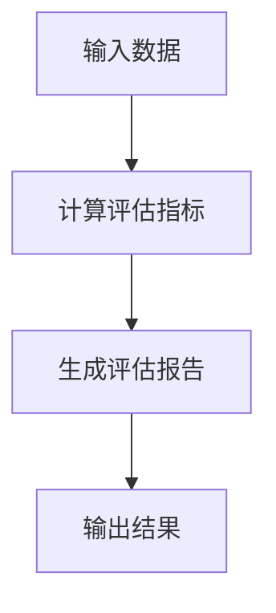
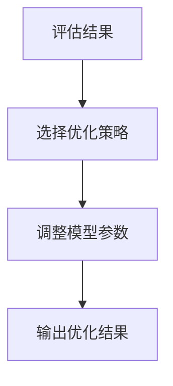

                 


# 自我改进型AI Agent：LLM的自我评估与优化

## 关键词
自我改进型AI Agent, 大语言模型, 自我评估, 优化算法, 人机交互

## 摘要
本文探讨了自我改进型AI Agent在大语言模型（LLM）中的应用，重点分析了LLM的自我评估与优化机制。文章从背景、核心概念、算法原理、系统架构设计、项目实战等方面展开，详细介绍了自我改进型AI Agent的实现过程，包括数学模型、优化算法、系统设计和实际案例分析。通过本文的分析，读者可以全面理解自我改进型AI Agent的技术原理和实际应用。

---

## 第1章: 自我改进型AI Agent的背景与概念

### 1.1 AI Agent的发展历程
#### 1.1.1 AI Agent的定义与分类
AI Agent（人工智能代理）是一种能够感知环境并采取行动以实现目标的智能实体。根据智能水平，AI Agent可以分为反应式代理、基于模型的代理、目标驱动代理和效用驱动代理。

#### 1.1.2 自我改进型AI Agent的提出背景
随着AI技术的发展，AI Agent需要具备更强的自主学习和优化能力，以适应复杂的现实环境。自我改进型AI Agent能够通过自我评估和优化，不断提高自身的性能和适应性。

#### 1.1.3 LLM在AI Agent中的作用
大语言模型（LLM）通过强大的自然语言处理能力，为AI Agent提供了丰富的语义理解和生成能力，使其能够更好地与人类交互并完成复杂任务。

### 1.2 自我改进型AI Agent的核心概念
#### 1.2.1 自我评估的定义与特点
自我评估是指AI Agent通过内部机制对自身性能进行测量和分析，以识别优缺点并为优化提供依据。

#### 1.2.2 自我优化的机制与目标
自我优化是基于自我评估结果，通过调整算法参数、改进模型结构或优化策略来提升AI Agent的性能。

#### 1.2.3 LLM在自我改进中的角色
LLM不仅作为信息处理的核心模块，还通过自我评估和优化算法，帮助AI Agent实现性能提升。

### 1.3 自我改进型AI Agent的应用场景
#### 1.3.1 自然语言处理领域的应用
在文本生成、机器翻译和问答系统中，自我改进型AI Agent能够通过自我评估和优化，提高生成质量。

#### 1.3.2 人机交互中的优化
通过自我评估，AI Agent能够更好地理解用户需求，优化交互流程，提升用户体验。

#### 1.3.3 企业级AI系统的改进
在企业级应用中，自我改进型AI Agent能够通过自我优化，提高系统的稳定性和响应速度。

---

## 第2章: 自我改进型AI Agent的核心原理

### 2.1 自我评估机制的数学模型
#### 2.1.1 评估指标的定义
常用的评估指标包括准确率、召回率、F1分数和困惑度（Perplexity）。

#### 2.1.2 评估函数的构建
评估函数通常由多个指标的加权组合构成，权重可以根据具体任务需求调整。

#### 2.1.3 评估结果的反馈机制
评估结果用于指导优化算法的调整，形成闭环的改进流程。

### 2.2 自我优化算法的实现
#### 2.2.1 优化目标的设定
优化目标通常包括提高生成质量、降低计算成本和提升用户体验。

#### 2.2.2 优化策略的选择
常用的优化策略包括贪心算法、随机搜索和强化学习。

#### 2.2.3 优化过程的监控与调整
通过监控关键性能指标，动态调整优化策略，确保优化过程的有效性。

### 2.3 LLM与自我改进的结合
#### 2.3.1 LLM的内部机制
LLM通过预训练和微调，具备强大的语义理解和生成能力。

#### 2.3.2 自我改进对LLM性能的提升
通过自我评估和优化，LLM能够更好地适应具体任务需求，提升性能。

#### 2.3.3 LLM在自我评估中的应用
LLM用于生成评估报告和优化建议，帮助AI Agent实现自我改进。

---

## 第3章: 自我改进型AI Agent的系统架构

### 3.1 系统整体架构设计
#### 3.1.1 系统模块划分
系统主要分为输入处理模块、评估模块、优化模块和输出模块。

#### 3.1.2 各模块的功能描述
输入处理模块负责接收输入数据，评估模块对数据进行分析和评估，优化模块根据评估结果进行优化，输出模块将结果反馈给用户。

#### 3.1.3 系统的交互流程
系统接收输入，进行评估，根据评估结果优化模型，最后输出结果。

### 3.2 自我评估模块的设计
#### 3.2.1 输入数据的处理
输入数据包括用户查询、历史记录和环境信息。

#### 3.2.2 评估指标的计算
计算准确率、召回率等指标，生成评估报告。

#### 3.2.3 评估结果的输出
评估结果用于指导优化模块进行调整。

### 3.3 自我优化模块的设计
#### 3.3.1 优化目标的设定
根据具体任务需求，设定优化目标。

#### 3.3.2 优化算法的选择
选择适合的优化算法，如梯度下降或遗传算法。

#### 3.3.3 优化结果的反馈
将优化结果反馈给评估模块，形成闭环。

---

## 第4章: 自我改进型AI Agent的算法实现

### 4.1 自我评估算法的实现
#### 4.1.1 算法流程图


#### 4.1.2 算法的数学模型
评估函数可以表示为：
$$
f(x) = \alpha \cdot \text{准确率} + \beta \cdot \text{召回率}
$$

#### 4.1.3 算法的实现代码
```python
def calculate_metrics(y_true, y_pred):
    accuracy = sum(y_true == y_pred) / len(y_true)
    recall = sum((y_true == 1) & (y_pred == 1)) / sum(y_true == 1)
    return accuracy, recall
```

### 4.2 自我优化算法的实现
#### 4.2.1 算法流程图


#### 4.2.2 算法的数学模型
优化目标可以表示为：
$$
\theta^* = \arg \min_\theta L(\theta)
$$
其中，$L(\theta)$是损失函数。

#### 4.2.3 算法的实现代码
```python
import numpy as np

def optimize_model(theta, learning_rate):
    theta = theta - learning_rate * np.gradient(L(theta))
    return theta
```

### 4.3 算法的测试与验证
#### 4.3.1 测试用例的设计
设计多个测试用例，覆盖不同的输入场景。

#### 4.3.2 测试结果的分析
分析测试结果，验证算法的有效性和鲁棒性。

#### 4.3.3 算法的优化建议
根据测试结果，进一步优化算法参数和结构。

---

## 第5章: 自我改进型AI Agent的项目实战

### 5.1 项目环境的搭建
#### 5.1.1 开发工具的安装
安装Python、TensorFlow和Keras等工具。

#### 5.1.2 依赖库的安装
使用pip安装所需的依赖库。

#### 5.1.3 开发环境的配置
配置IDE和开发环境，确保所有模块正常运行。

### 5.2 核心代码的实现
#### 5.2.1 自我评估模块的实现
```python
def self_assessment():
    # 输入数据
    input_data = ...
    # 计算评估指标
    accuracy, recall = calculate_metrics(input_data)
    # 生成评估报告
    report = f"Accuracy: {accuracy}, Recall: {recall}"
    return report
```

#### 5.2.2 自我优化模块的实现
```python
def self_optimization():
    # 调整模型参数
    theta = optimize_model(theta, learning_rate=0.01)
    # 输出优化结果
    print(f"Optimized parameters: {theta}")
```

#### 5.2.3 系统交互模块的实现
```python
def system_interaction():
    while True:
        user_input = input("请输入您的需求：")
        # 处理用户输入
        process_input(user_input)
        # 输出结果
        print("处理完成，请检查结果。")
```

### 5.3 代码的测试与调试
#### 5.3.1 测试用例的设计
设计多种测试用例，验证各模块的功能。

#### 5.3.2 测试结果的分析
分析测试结果，确保各模块协同工作正常。

#### 5.3.3 项目小结
总结项目实现过程中的经验和教训，提出改进建议。

---

## 第6章: 总结与展望

### 6.1 总结
本文详细介绍了自我改进型AI Agent的核心概念、算法原理和系统架构设计，通过实际案例分析展示了其应用价值。

### 6.2 展望
未来，随着AI技术的发展，自我改进型AI Agent将在更多领域得到应用，推动智能化系统的进一步发展。

---

通过以上目录和内容，您可以开始撰写完整的博客文章。每个部分都需要进一步展开，详细阐述各个主题，并确保内容逻辑清晰、结构紧凑。

