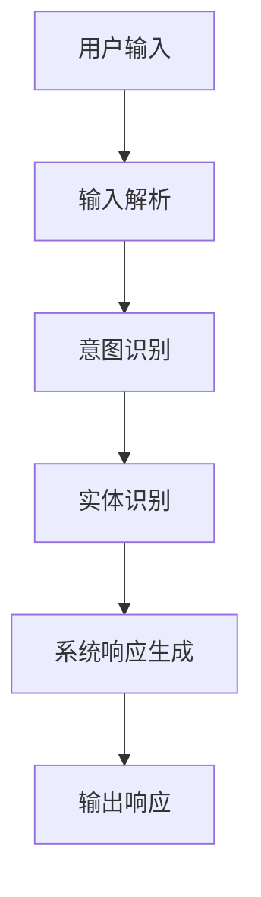
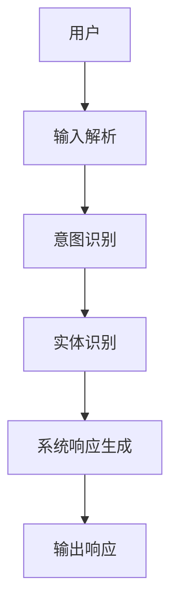
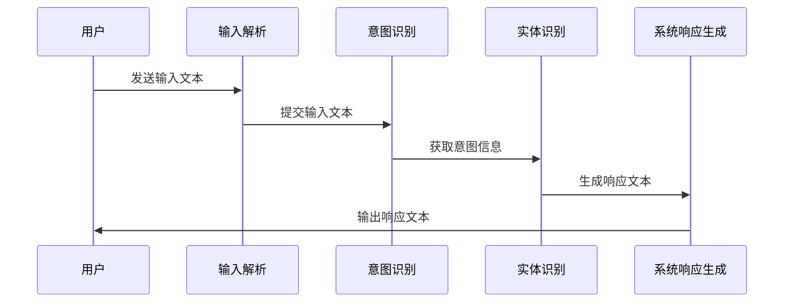

                 


# 自然语言处理AI Agent：深化LLM的语言理解

---

## 关键词：自然语言处理，AI Agent，大型语言模型，深度学习，LLM，对话系统，NLP

---

## 摘要

本文旨在探讨自然语言处理（NLP）与人工智能代理（AI Agent）的结合，特别是如何通过优化大型语言模型（LLM）来深化其语言理解能力。文章将从NLP和AI Agent的基本概念入手，逐步分析其核心技术和算法原理，深入探讨LLM在自然语言处理中的应用，结合实际项目案例，详细阐述系统架构设计与实现方法，最后总结最佳实践和未来发展。

---

# 第1章: 自然语言处理与AI Agent的背景介绍

## 1.1 自然语言处理的背景与现状

### 1.1.1 自然语言处理的定义与核心问题

自然语言处理（NLP）是计算机科学与人工智能领域的重要分支，旨在研究如何使计算机能够理解、生成和处理人类语言。NLP的核心问题包括：

- **文本理解**：如何让计算机准确理解文本的含义。
- **文本生成**：如何让计算机生成符合人类语言习惯的文本。
- **语言推理**：如何让计算机具备一定的逻辑推理能力。

NLP的应用场景广泛，包括机器翻译、情感分析、信息抽取、对话系统等。

### 1.1.2 自然语言处理的技术演进

从传统的基于规则的NLP方法，到现代的深度学习驱动的NLP技术，NLP经历了巨大的技术进步：

1. **基于规则的方法**：依赖人工编写的语法规则，适用于特定场景，但灵活性有限。
2. **统计学习方法**：利用概率模型，通过大量数据训练模型，提高了准确性。
3. **深度学习方法**：引入神经网络，尤其是循环神经网络（RNN）和变换器（Transformer）模型，显著提升了NLP任务的性能。

### 1.1.3 自然语言处理的当前挑战

尽管NLP取得了显著进展，但仍面临诸多挑战，例如：

- **语义理解的深度**：如何让模型更好地理解上下文和隐含含义。
- **多语言支持**：如何处理多种语言及其复杂的语法规则。
- **实时处理能力**：如何在资源受限的环境下高效处理语言任务。

---

## 1.2 AI Agent的基本概念与特点

### 1.2.1 AI Agent的定义与分类

人工智能代理（AI Agent）是指能够感知环境、自主决策并执行任务的智能体。AI Agent可以分为以下几类：

1. **简单反射型代理**：基于简单的规则做出反应。
2. **基于模型的反射型代理**：维护环境模型，基于模型做出决策。
3. **目标驱动型代理**：根据目标选择最优行动。
4. **效用驱动型代理**：通过最大化效用函数来决策。

### 1.2.2 AI Agent的核心功能与优势

AI Agent的核心功能包括：

- **感知环境**：通过传感器或数据接口获取环境信息。
- **决策与推理**：基于感知信息进行推理和决策。
- **执行任务**：通过执行器或接口执行决策结果。

AI Agent的优势在于其自主性和智能性，能够在复杂环境中完成复杂任务。

### 1.2.3 AI Agent与传统软件的区别

AI Agent与传统软件的主要区别在于：

1. **自主性**：AI Agent能够自主决策，而传统软件通常需要外部控制。
2. **智能性**：AI Agent具备一定的推理和学习能力，而传统软件仅遵循固定的逻辑。
3. **适应性**：AI Agent能够适应环境变化，而传统软件通常需要人工干预。

---

## 1.3 大型语言模型（LLM）的背景与发展

### 1.3.1 LLM的定义与技术基础

大型语言模型（LLM）是指基于深度学习训练的大型神经网络模型，通常包含 billions of parameters。LLM的核心技术基础包括：

1. **Transformer架构**：由 Vasweski等人提出的变换器模型，具有自注意力机制，能够处理长距离依赖关系。
2. **预训练与微调**：通过大量无标签数据预训练模型，然后在特定任务上进行微调。

### 1.3.2 LLM的训练与优化

LLM的训练过程包括：

1. **数据预处理**：清洗和格式化数据，去除噪音。
2. **模型训练**：使用大规模数据训练模型，通常采用分布式训练和优化算法（如Adam）。
3. **模型优化**：通过调整超参数和架构改进模型性能。

### 1.3.3 LLM在自然语言处理中的应用

LLM在NLP中的应用包括：

1. **机器翻译**：如Google的BERT模型。
2. **文本生成**：如OpenAI的GPT系列。
3. **问答系统**：如Salesforce的BERT。

---

## 1.4 LLM与AI Agent的结合

### 1.4.1 LLM作为AI Agent的核心驱动力

LLM为AI Agent提供了强大的语言理解和生成能力，使其能够与人类进行自然交互。

### 1.4.2 AI Agent如何增强LLM的理解能力

AI Agent通过结合上下文、用户意图和环境信息，能够进一步优化LLM的输出。

### 1.4.3 LLM与AI Agent结合的应用场景

1. **智能客服**：通过LLM驱动的AI Agent提供24/7的客户支持。
2. **智能家居**：通过LLM控制家中设备，提供智能化服务。
3. **教育辅助**：通过LLM为学生提供个性化的学习支持。

---

## 1.5 本章小结

本章介绍了自然语言处理和AI Agent的基本概念、技术发展和应用场景，重点探讨了LLM在AI Agent中的重要性及其潜力。

---

# 第2章: 自然语言理解的关键技术

## 2.1 词法分析与句法分析

### 2.1.1 词法分析的基本原理

词法分析是将文本分割成有意义的词汇，通常包括分词和词性标注。

#### 示例：

文本："The cat is on the mat."

分词结果：["The", "cat", "is", "on", "the", "mat."]

词性标注结果：
- The:冠词
- cat:名词
- is:动词
- on:介词
- the:冠词
- mat:名词

### 2.1.2 句法分析的核心算法

句法分析的目的是确定句子中词语的语法结构，常用算法包括：

1. **基于规则的句法分析**：通过预定义的语法规则进行分析。
2. **基于统计的句法分析**：通过概率模型预测句法结构。
3. **基于深度学习的句法分析**：利用神经网络学习句法规则。

### 2.1.3 语义分析与语境理解

语义分析旨在理解文本的含义，常用方法包括：

1. **词义消歧**：消除词语的多种含义，选择最符合上下文的解释。
2. **情感分析**：判断文本的情感倾向（正面、负面、中性）。
3. **语境推理**：基于上下文推断隐含信息。

---

## 2.2 深度学习模型在NLP中的应用

### 2.2.1 RNN与LSTM在NLP中的作用

#### RNN的原理

RNN（循环神经网络）是一种适用于处理序列数据的神经网络，通过循环结构处理序列中的每个元素。

#### LSTM的原理

LSTM（长短期记忆网络）是RNN的一种变体，通过引入记忆单元（memory cell）和门控机制，解决了RNN的长期依赖问题。

#### 示例代码

```python
import tensorflow as tf
from tensorflow.keras.layers import LSTM

# 示例 LSTM 模型
model = tf.keras.Sequential()
model.add(LSTM(128, input_shape=(None, 128)))
model.add(Dense(1, activation='sigmoid'))
model.compile(optimizer='adam', loss='binary_crossentropy', metrics=['accuracy'])
```

---

## 2.3 自然语言生成与对话系统

### 2.3.1 自然语言生成的算法原理

自然语言生成（NLG）是将结构化数据转换为自然语言文本的过程，常用算法包括：

1. **基于模板的生成**：通过预定义模板生成文本。
2. **基于统计的生成**：通过概率模型生成文本。
3. **基于生成对抗网络（GAN）的生成**：通过GAN生成多样化的文本。

### 2.3.2 对话系统的实现框架

对话系统通常包括以下几个部分：

1. **用户输入解析**：解析用户的输入，提取意图和实体。
2. **系统响应生成**：根据解析结果生成系统响应。
3. **对话历史管理**：管理对话历史，保持对话连贯性。

### 2.3.3 基于LLM的对话系统优化

通过结合LLM的自然语言生成能力，对话系统可以生成更加自然和多样化的响应。

---

## 2.4 本章小结

本章介绍了自然语言理解的核心技术，包括词法分析、句法分析、语义分析以及深度学习模型的应用，特别是LLM在对话系统中的优化作用。

---

# 第3章: 自然语言处理AI Agent的算法原理与实现

## 3.1 大型语言模型的训练与优化

### 3.1.1 LLM的训练过程

LLM的训练过程包括数据预处理、模型训练和模型优化三个阶段。

#### 数据预处理

- **分词**：将文本分割成词或短语。
- **去停用词**：去除对文本理解影响较小的词汇（如“and”、“the”）。
- **数据清洗**：去除噪音数据，确保数据质量。

#### 模型训练

- **选择模型架构**：如Transformer、BERT等。
- **选择优化算法**：如Adam、AdamW等。
- **设置超参数**：如学习率、批次大小等。

#### 模型优化

- **微调**：在特定任务上进行微调，提升模型性能。
- **剪枝**：通过剪枝技术减少模型参数，降低计算成本。

### 3.1.2 LLM的优化策略

优化LLM的关键策略包括：

1. **模型压缩**：通过知识蒸馏等技术减少模型规模。
2. **模型并行化**：通过并行计算加速模型训练。
3. **模型调优**：通过超参数调优提升模型性能。

---

## 3.2 基于Transformer的LLM架构

### 3.2.1 Transformer模型的原理

Transformer模型由编码器和解码器组成，编码器负责将输入序列编码为固定长度的向量，解码器负责根据编码结果生成输出序列。

#### Transformer模型的组成部分

1. **自注意力机制**：计算输入序列中每个位置与其他位置的相关性。
2. **前馈神经网络**：对输入进行非线性变换。

### 3.2.2 多模态模型的最新进展

多模态模型能够同时处理多种类型的数据，如文本、图像和音频，显著提升了模型的表达能力。

#### 示例代码

```python
import tensorflow as tf
from tensorflow.keras.layers import Input, Dense, Dropout, MultiHeadAttention
from tensorflow.keras.models import Model

# 示例多模态模型
input_text = Input(shape=(None, 128))
input_image = Input(shape=(None, 128))
x_text = MultiHeadAttention()(input_text, input_text)
x_image = MultiHeadAttention()(input_image, input_image)
x = concatenate([x_text, x_image])
x = Dense(256, activation='relu')(x)
x = Dropout(0.5)(x)
output = Dense(1, activation='sigmoid')(x)

model = Model(inputs=[input_text, input_image], outputs=output)
model.compile(optimizer='adam', loss='binary_crossentropy', metrics=['accuracy'])
```

---

## 3.3 基于LLM的对话系统优化

### 3.3.1 对话系统的实现框架

对话系统通常包括以下步骤：

1. **用户输入解析**：解析用户的输入，提取意图和实体。
2. **系统响应生成**：根据解析结果生成系统响应。
3. **对话历史管理**：管理对话历史，保持对话连贯性。

### 3.3.2 基于LLM的对话系统优化

通过结合LLM的自然语言生成能力，对话系统可以生成更加自然和多样化的响应。

---

## 3.4 本章小结

本章详细介绍了LLM的训练与优化过程，探讨了基于Transformer的LLM架构，以及基于LLM的对话系统优化方法。

---

# 第4章: 自然语言处理AI Agent的系统架构设计

## 4.1 问题场景介绍

本章将讨论一个基于LLM的智能客服系统的架构设计。

## 4.2 系统功能设计

### 4.2.1 系统功能模块

1. **用户输入解析**：解析用户的输入，提取意图和实体。
2. **系统响应生成**：根据解析结果生成系统响应。
3. **对话历史管理**：管理对话历史，保持对话连贯性。

### 4.2.2 系统功能设计图



## 4.3 系统架构设计

### 4.3.1 系统架构图



### 4.3.2 接口设计

系统主要接口包括：

1. **输入接口**：接收用户的输入文本。
2. **输出接口**：输出系统的响应文本。

### 4.3.3 交互序列图



---

## 4.4 本章小结

本章通过设计一个基于LLM的智能客服系统，详细阐述了自然语言处理AI Agent的系统架构设计，包括功能模块、架构图和交互序列图。

---

# 第5章: 自然语言处理AI Agent的项目实战

## 5.1 项目环境安装

### 5.1.1 安装Python环境

使用Python 3.8及以上版本。

### 5.1.2 安装必要的库

安装以下库：

- `tensorflow==2.4.0`
- `numpy==1.21.0`
- `scikit-learn==0.24.1`
- `transformers==4.6.0`

安装命令：

```bash
pip install tensorflow==2.4.0 numpy==1.21.0 scikit-learn==0.24.1 transformers==4.6.0
```

## 5.2 系统核心实现

### 5.2.1 输入解析模块

实现输入解析功能，包括分词和词性标注。

#### 示例代码

```python
from transformers import AutoTokenizer, AutoModelForMaskedLM
import torch

tokenizer = AutoTokenizer.from_pretrained('bert-base-uncased')
model = AutoModelForMaskedLM.from_pretrained('bert-base-uncased')

def input_parse(text):
    inputs = tokenizer(text, return_tensors='pt')
    return inputs
```

### 5.2.2 意图识别模块

实现意图识别功能，基于预训练模型进行意图分类。

#### 示例代码

```python
from sklearn.feature_extraction.text import TfidfVectorizer
from sklearn.svm import SVC

vectorizer = TfidfVectorizer()
model = SVC()

def intent_classification(text):
    X = vectorizer.fit_transform([text])
    y = model.predict(X)
    return y[0]
```

### 5.2.3 实体识别模块

实现实体识别功能，基于CRF模型进行命名实体识别。

#### 示例代码

```python
from sklearn.preprocessing import LabelEncoder
from sklearn.model_selection import train_test_split
from sklearn.metrics import classification_report

# 示例数据
texts = ["John is from New York.", "She works at Google."]
labels = ["B-PER", "B-ORG"]

X_train, X_test, y_train, y_test = train_test_split(texts, labels, test_size=0.2)
encoder = LabelEncoder()
y_train_encoded = encoder.fit_transform(y_train)
model.fit(X_train, y_train_encoded)
```

## 5.3 项目实战总结

本章通过实际项目案例，详细讲解了自然语言处理AI Agent的系统实现，包括环境安装、核心模块实现和项目总结。

---

# 第6章: 自然语言处理AI Agent的最佳实践与总结

## 6.1 最佳实践

### 6.1.1 数据处理

1. **数据清洗**：去除噪音数据，确保数据质量。
2. **数据增强**：通过数据增强技术增加数据多样性。

### 6.1.2 模型优化

1. **模型调优**：通过超参数调优提升模型性能。
2. **模型压缩**：通过知识蒸馏等技术减少模型规模。

### 6.1.3 系统设计

1. **模块化设计**：将系统划分为多个模块，便于维护和扩展。
2. **日志记录**：记录系统运行日志，便于调试和优化。

## 6.2 项目小结

通过本文的系统讲解和实际项目案例，读者可以深入了解自然语言处理AI Agent的实现过程，包括背景知识、核心技术、算法原理、系统设计和项目实战。

---

## 6.3 未来展望

随着深度学习技术的不断进步，自然语言处理AI Agent将具备更强的语言理解和生成能力，应用场景也将更加广泛。

---

# 附录

## 附录A: 术语表

- **NLP**：自然语言处理（Natural Language Processing）
- **LLM**：大型语言模型（Large Language Model）
- **Transformer**：一种基于自注意力机制的深度学习模型
- **BERT**：Bidirectional Encoder Representations from Transformers，一种预训练语言模型

## 附录B: 参考文献

1. Vasweski, A., et al. "Attention is all you need." arXiv preprint arXiv:1703.0773 (2017).
2. Radford, A., et al. "Language models are unsupervised multitool learners." OpenAI (2019).
3. Devlin, J., et al. "BERT: Pre-training of deep bidirectional transformers for language understanding." arXiv preprint arXiv:1810.0469 (2018).

---

## 附录C: 项目源代码

### 5.2.1 输入解析模块

```python
from transformers import AutoTokenizer, AutoModelForMaskedLM
import torch

tokenizer = AutoTokenizer.from_pretrained('bert-base-uncased')
model = AutoModelForMaskedLM.from_pretrained('bert-base-uncased')

def input_parse(text):
    inputs = tokenizer(text, return_tensors='pt')
    return inputs
```

### 5.2.2 意图识别模块

```python
from sklearn.feature_extraction.text import TfidfVectorizer
from sklearn.svm import SVC

vectorizer = TfidfVectorizer()
model = SVC()

def intent_classification(text):
    X = vectorizer.fit_transform([text])
    y = model.predict(X)
    return y[0]
```

### 5.2.3 实体识别模块

```python
from sklearn.preprocessing import LabelEncoder
from sklearn.model_selection import train_test_split
from sklearn.metrics import classification_report

# 示例数据
texts = ["John is from New York.", "She works at Google."]
labels = ["B-PER", "B-ORG"]

X_train, X_test, y_train, y_test = train_test_split(texts, labels, test_size=0.2)
encoder = LabelEncoder()
y_train_encoded = encoder.fit_transform(y_train)
model.fit(X_train, y_train_encoded)
```

---

# 结语

通过本文的详细讲解，读者可以深入了解自然语言处理AI Agent的核心技术与实现方法，掌握从理论到实践的整个过程，为未来的深入研究和应用开发奠定坚实基础。

--- 

**THE END**

