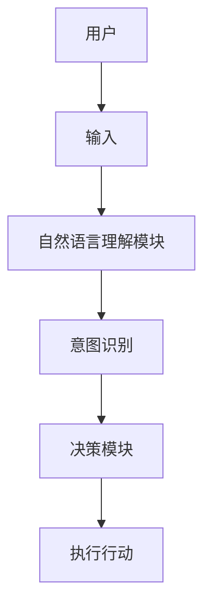
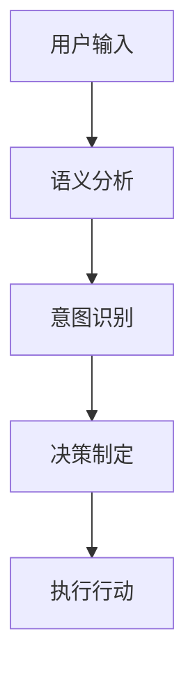
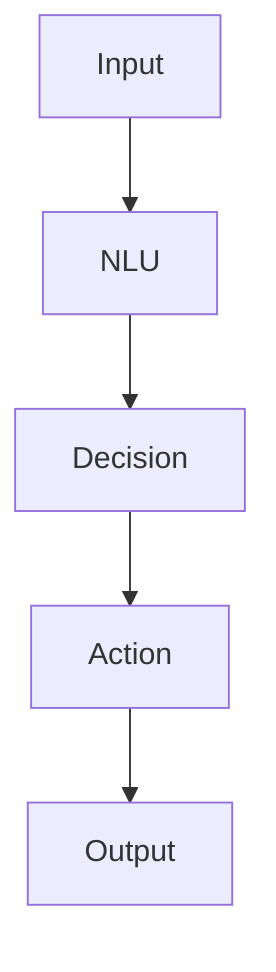
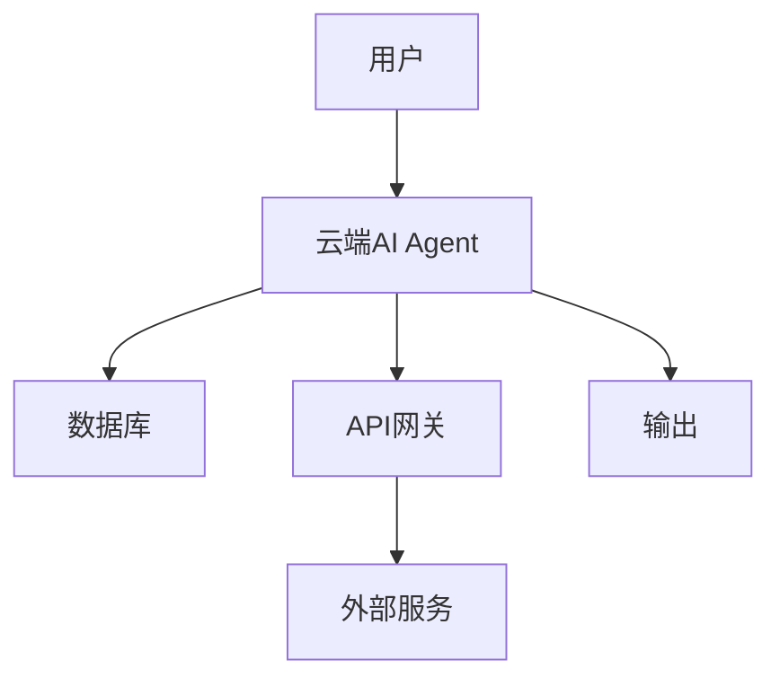

                 


# 自然语言理解增强AI Agent：深化LLM的语义分析

## 关键词：自然语言理解，AI Agent，大语言模型，语义分析，意图识别，上下文理解

## 摘要：本文探讨了如何通过增强AI Agent的自然语言理解能力，特别是利用大语言模型（LLM）的潜力，来提升语义分析的深度。我们从背景介绍开始，分析核心概念与联系，深入讲解算法原理，系统分析架构设计，并通过项目实战展示应用。最后，总结最佳实践，展望未来发展方向。

---

# 第1章: 自然语言理解与AI Agent的背景

## 1.1 自然语言理解的核心概念

### 1.1.1 自然语言理解的定义与目标

自然语言理解（Natural Language Understanding, NLU）是人工智能领域的重要分支，旨在让计算机能够理解人类的自然语言输入，如文本或语音。其目标是将输入的自然语言转换为计算机可以处理的结构化信息，从而实现人机交互或自动化任务。

- **定义**：NLU关注于理解输入的含义，而非仅仅是语法结构。
- **目标**：准确提取输入中的语义信息，支持后续处理或决策。

### 1.1.2 自然语言理解的挑战与现状

NLU面临的主要挑战包括：

1. **语义歧义**：同一句话可能有多种含义。
2. **上下文依赖**：理解需要依赖上下文信息。
3. **领域多样性**：不同领域的语言特点不同。

当前，基于大语言模型（LLM）的方法在NLU领域取得了显著进展，但仍然存在挑战，如数据需求大、计算资源消耗高等。

### 1.1.3 自然语言理解的应用场景

- **智能客服**：通过NLU理解用户问题，提供自动回复。
- **语音助手**：如Siri、Alexa，依赖NLU进行交互。
- **信息抽取**：从文本中提取关键信息，用于数据处理。

## 1.2 大语言模型（LLM）的背景与发展

### 1.2.1 大语言模型的定义与特点

- **定义**：LLM是基于大规模数据训练的深度学习模型，具有强大的语言生成和理解能力。
- **特点**：
  - 参数量大，通常超过 billions。
  - 预训练方法，通过大量通用数据学习语言规律。
  - 微调适应特定任务。

### 1.2.2 LLM在自然语言处理中的优势

- **通用性**：适用于多种任务，如翻译、问答、摘要。
- **上下文理解**：能够处理长文本，捕捉上下文信息。
- **生成能力**：不仅能理解，还能生成自然语言文本。

### 1.2.3 LLM的训练与优化

训练LLM涉及两个主要阶段：预训练和微调。

- **预训练**：在大规模通用数据上进行无监督学习，目标是预测词或下一个句子。
- **微调**：在特定任务数据上进行有监督微调，适应具体需求。

## 1.3 AI Agent的基本概念与功能

### 1.3.1 AI Agent的定义与分类

- **定义**：AI Agent是一种智能代理，能够感知环境并采取行动以实现目标。
- **分类**：
  - **简单反射型**：基于规则的反应式代理。
  - **基于模型的**：利用内部模型规划行动。
  - **学习型**：通过机器学习提升性能。

### 1.3.2 AI Agent的核心功能与技术

- **感知环境**：通过传感器或输入接口获取信息。
- **决策与行动**：基于感知信息做出决策并执行行动。
- **学习与适应**：通过经验或新数据优化性能。

### 1.3.3 AI Agent在不同领域的应用

- **智能家居**：控制家电，提供便捷生活。
- **自动驾驶**：处理复杂环境信息，做出驾驶决策。
- **电子商务**：推荐产品，优化用户体验。

## 1.4 自然语言理解与AI Agent的结合

### 1.4.1 NLU在AI Agent中的作用

- **语义解析**：理解用户输入的意图和需求。
- **对话管理**：根据理解调整对话流程。
- **任务执行**：将语义信息转化为具体行动。

### 1.4.2 增强AI Agent语义分析的意义

- **提升用户体验**：更准确理解用户需求，提供更优质服务。
- **增强决策能力**：基于更深度的语义理解做出更合理的决策。
- **扩展应用范围**：支持更多复杂场景和任务。

### 1.4.3 当前研究与应用的热点

- **多模态融合**：结合视觉、听觉等多种信息源。
- **实时性优化**：提升响应速度，减少延迟。
- **个性化服务**：根据用户特征提供定制化体验。

---

# 第2章: 自然语言理解增强AI Agent的核心概念与联系

## 2.1 核心概念的定义与属性

### 2.1.1 自然语言理解的语义分析

- **定义**：通过上下文、常识推理等方式，深入理解文本的含义。
- **属性**：
  - **准确性**：正确识别语义信息。
  - **鲁棒性**：应对噪声和模糊性。
  - **可解释性**：理解过程可被解释。

### 2.1.2 AI Agent的意图识别与执行

- **定义**：识别用户行为或语言中的意图，并将其转化为具体行动。
- **属性**：
  - **准确性**：正确识别意图。
  - **响应性**：及时响应用户输入。
  - **适应性**：适应不同用户和场景。

### 2.1.3 上下文理解与记忆机制

- **定义**：理解对话或任务的上下文信息，保持连续性。
- **属性**：
  - **连续性**：保持对话的连贯性。
  - **动态性**：根据新信息更新上下文。
  - **存储效率**：有效存储和检索上下文信息。

## 2.2 核心概念的对比分析

### 2.2.1 语义分析与意图识别的对比

| 特性                | 语义分析                          | 意图识别                          |
|---------------------|-----------------------------------|------------------------------------|
| 定义                | 分析文本的深层含义                | 确定用户的意图或目标              |
| 方法                | 基于词义、上下文                 | 基于模式匹配、规则                |
| 应用场景            | 文本摘要、信息抽取                | 自然语言交互、任务分配            |

### 2.2.2 不同AI Agent模型的性能对比

| 模型类型            | 基于规则的AI Agent               | 基于模型的AI Agent               | 基于学习的AI Agent               |
|---------------------|-----------------------------------|------------------------------------|------------------------------------|
| 优点                | 实现简单，成本低                 | 内部模型复杂，但更灵活            | 学习能力强，适应性好             |
| 缺点                | 需手动维护规则，扩展性差          | 需大量数据训练，计算资源消耗大     | 对数据依赖性强，需要高质量数据     |
| 应用场景            | 简单任务，如交通信号灯控制        | 中等复杂度任务，如智能家居         | 复杂任务，如自动驾驶、智能客服     |

### 2.2.3 NLU与传统文本处理方法的对比

| 方法                | NLU                              | 传统文本处理                     |
|---------------------|-----------------------------------|------------------------------------|
| 技术基础            | 深度学习、上下文理解              | 基于规则、关键词匹配             |
| 适用场景            | 复杂语义理解、对话系统            | 简单信息提取、分类               |
| 精度                | 高，但依赖模型训练和数据质量      | 较低，但实现简单                  |

## 2.3 实体关系图与流程图

### 2.3.1 自然语言理解增强AI Agent的实体关系图



### 2.3.2 自然语言理解增强AI Agent的流程图



---

# 第3章: 大语言模型的训练与优化

## 3.1 LLM的预训练过程

### 3.1.1 预训练目标

- **目标**：通过无监督学习，模型学习语言的分布和结构。
- **常用方法**：
  - **掩码语言模型**：随机遮蔽部分词，预测其值。
  - **下一句预测**：判断句子是否为原文的下一句。

### 3.1.2 预训练的数学模型

预训练过程通常使用掩码语言模型，损失函数为交叉熵损失：

$$
\mathcal{L} = -\frac{1}{n}\sum_{i=1}^{n}\log p(y_i|x_i)
$$

其中，$y_i$是真实标签，$x_i$是输入。

### 3.1.3 预训练的代码实现

```python
import torch
import torch.nn as nn

class MaskLM(nn.Module):
    def __init__(self, vocab_size):
        super().__init__()
        self.token_embeddings = nn.Embedding(vocab_size, 512)
        self.position_embeddings = nn.Embedding(512, 512)
        self.lm_head = nn.Linear(512, vocab_size)

    def forward(self, input_ids, attention_mask):
        # 假设input_ids为形状为 (batch_size, seq_length)
        # attention_mask为 (batch_size, seq_length)
        embedded = self.token_embeddings(input_ids) + self.position_embeddings(torch.arange(input_ids.size(1), device=input_ids.device).unsqueeze(0).repeat(input_ids.size(0), 1))
        # 假设10%的词被遮蔽
        masked_input = input_ids * (1 - attention_mask)
        # 预测被遮蔽词的概率
        logits = self.lm_head(embedded)
        return logits
```

## 3.2 LLM的微调过程

### 3.2.1 微调目标

- **目标**：针对具体任务（如问答、摘要）调整模型参数。
- **常用方法**：
  - 小样本数据微调：在特定任务数据上进行微调。
  - 参数冻结：冻结部分层的参数，仅微调顶层。

### 3.2.2 微调的数学模型

微调通常使用分类任务的交叉熵损失：

$$
\mathcal{L} = -\frac{1}{n}\sum_{i=1}^{n}\log p(y_i|x_i)
$$

其中，$y_i$是真实标签，$x_i$是输入。

### 3.2.3 微调的代码实现

```python
import torch
import torch.nn as nn

class FineTune(nn.Module):
    def __init__(self, vocab_size, output_size):
        super().__init__()
        self.bert = MaskLM(vocab_size)
        self.dropout = nn.Dropout(0.1)
        self.classifier = nn.Linear(512, output_size)

    def forward(self, input_ids, attention_mask, labels=None):
        hidden_states = self.bert(input_ids, attention_mask)
        pooled_output = hidden_states[:, 0, :]
        pooled_output = self.dropout(pooled_output)
        logits = self.classifier(pooled_output)
        if labels is not None:
            loss = nn.CrossEntropyLoss()(logits, labels)
            return logits, loss
        return logits
```

## 3.3 LLM的优化策略

### 3.3.1 参数优化

- **Adam优化器**：常用优化器，适合大多数任务。
- **学习率调度**：通常采用预热和衰减策略。

### 3.3.2 数据优化

- **数据增强**：通过数据扩展技术增强模型鲁棒性。
- **混合训练**：结合不同领域的数据进行训练。

### 3.3.3 模型压缩

- **剪枝**：移除冗余参数，减少模型大小。
- **知识蒸馏**：将大模型的知识迁移到小模型。

---

# 第4章: 自然语言理解增强AI Agent的系统分析与架构设计

## 4.1 系统功能设计

### 4.1.1 功能模块

- **NLU模块**：负责语义分析和意图识别。
- **决策模块**：基于NLU结果做出决策。
- **执行模块**：执行决策并反馈结果。

### 4.1.2 功能流程



## 4.2 系统架构设计

### 4.2.1 架构类型

- **基于云的架构**：后端处理，前端交互。
- **边缘计算架构**：在本地设备上进行处理，减少延迟。

### 4.2.2 架构设计的优缺点

| 架构类型            | 优点                                | 缺点                                  |
|---------------------|-------------------------------------|---------------------------------------|
| 基于云的架构          | 高可用性，易于扩展                | 延迟较高，依赖网络                    |
| 边缘计算架构          | 低延迟，实时性强                  | 部署复杂，维护困难                    |

### 4.2.3 架构实现



## 4.3 系统接口设计

### 4.3.1 接口定义

- **输入接口**：接收用户输入的文本或语音信号。
- **输出接口**：返回处理结果或执行反馈。

### 4.3.2 接口协议

- **RESTful API**：常用HTTP协议，适合Web应用。
- **WebSocket**：实时通信，适合需要实时反馈的场景。

---

# 第5章: 项目实战

## 5.1 环境安装

### 5.1.1 安装Python和必要的库

- **Python**：建议使用3.6及以上版本。
- **库**：`torch`, `transformers`, `mermaid`, `matplotlib`

### 5.1.2 安装步骤

```bash
pip install torch transformers mermaid matplotlib
```

## 5.2 系统核心实现

### 5.2.1 系统实现的代码

```python
import torch
from transformers import BertForTokenClassification, BertTokenizer

class NLUAgent:
    def __init__(self, model_name):
        self.tokenizer = BertTokenizer.from_pretrained(model_name)
        self.model = BertForTokenClassification.from_pretrained(model_name)
    
    def process_input(self, text):
        inputs = self.tokenizer(text, return_tensors="pt")
        with torch.no_grad():
            outputs = self.model(**inputs)
        return outputs.logits
```

### 5.2.2 代码实现的解读

- **初始化**：加载预训练模型和分词器。
- **处理输入**：将输入文本转换为模型可接受的格式。
- **模型推理**：获取模型输出，通常是概率分布。

## 5.3 实际案例分析

### 5.3.1 案例描述

- **任务**：情感分析。
- **输入**：用户评论文本。
- **输出**：情感极性（正面、负面、中性）。

### 5.3.2 案例实现

```python
agent = NLUAgent("bert-base-chinese")
text = "这个产品真的很不错！"
output = agent.process_input(text)
print(output)
```

### 5.3.3 案例分析

- **输入处理**：文本被分词为["这个", "产品", "真的很", "不错！"]。
- **模型输出**：每个词的概率分布，用于分类。

---

# 第6章: 总结与未来方向

## 6.1 总结

- **核心观点**：通过深化大语言模型的语义分析能力，AI Agent能够更准确理解用户需求，提供更优质服务。
- **主要方法**：结合NLU与AI Agent，利用LLM的强大能力，实现更复杂的任务。

## 6.2 未来方向

### 6.2.1 技术方向

- **多模态融合**：结合视觉、听觉等信息，提升理解能力。
- **可解释性增强**：让用户更容易理解AI的决策过程。
- **实时性优化**：降低延迟，提升用户体验。

### 6.2.2 应用场景

- **智能客服**：更智能的对话系统。
- **教育辅助**：提供个性化的学习建议。
- **医疗咨询**：辅助医生进行诊断。

---

# 结语

自然语言理解增强AI Agent是未来人机交互的重要方向，通过深化大语言模型的语义分析能力，AI Agent将能够更好地服务于人类，实现更智能、更自然的交互。希望本文能够为读者提供有价值的见解，并激发进一步的研究和探索。

---

