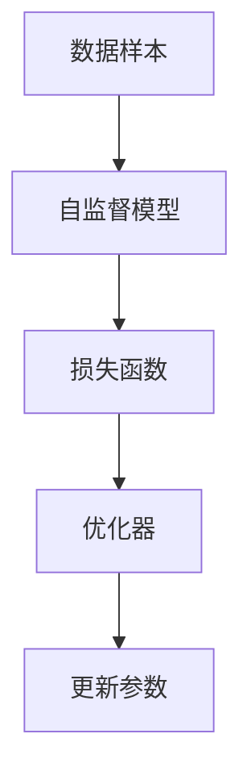
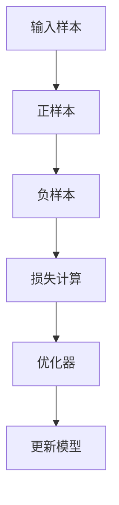
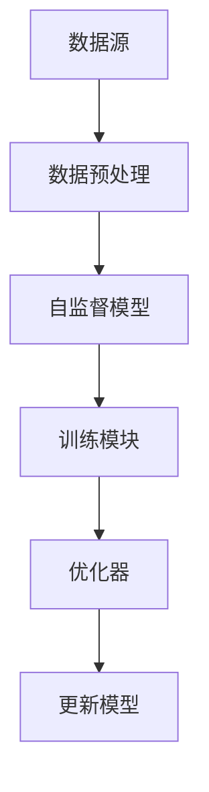

                 


# 自监督学习：减少AI Agent对标注数据的依赖

---

## 关键词：自监督学习、AI Agent、标注数据、无监督学习、深度学习、对比学习、生成模型

---

## 摘要：  
自监督学习是一种革命性的技术，能够显著减少AI Agent对标注数据的依赖，从而降低数据获取成本并提高模型的泛化能力。本文将深入探讨自监督学习的核心概念、算法原理、系统架构以及实际应用，帮助读者全面理解其工作原理和价值。

---

## 第1章: 自监督学习概述

### 1.1 自监督学习的背景与意义  
随着人工智能技术的快速发展，AI Agent的应用场景越来越广泛。然而，标注数据的获取成本高昂，且难以覆盖所有可能的场景。自监督学习作为一种新兴的无监督学习方法，通过利用未标注数据中的内在结构信息，显著降低了对标注数据的依赖。  

#### 1.1.1 数据标注的挑战与痛点  
- 数据标注需要大量人工劳动，成本高。  
- 标注数据的覆盖范围有限，难以满足复杂场景的需求。  
- 数据标注可能存在主观性和不一致性。  

#### 1.1.2 自监督学习的核心概念  
自监督学习是一种通过对比或生成方式，利用未标注数据学习特征表示的方法。其核心思想是通过构建目标函数，将未标注数据转化为有监督学习任务。  

#### 1.1.3 自监督学习的应用价值  
- 减少对标注数据的依赖，降低数据获取成本。  
- 提高模型的泛化能力，适用于数据稀缺的场景。  
- 支持零样本或小样本学习，拓展AI Agent的应用范围。  

---

### 1.2 自监督学习的基本原理  
自监督学习通过构建目标函数，将未标注数据转化为有监督学习任务。其核心在于设计对比学习或生成式的目标函数，使模型能够从数据中提取有用的特征。  

#### 1.2.1 自监督学习的定义  
自监督学习是一种无监督学习方法，通过构建目标函数，将未标注数据转化为有监督学习任务，从而学习数据的特征表示。  

#### 1.2.2 自监督学习与监督学习的区别  
| 特性             | 监督学习             | 自监督学习           |  
|------------------|----------------------|----------------------|  
| 数据类型         | 标签数据             | 未标注数据           |  
| 学习目标         | 预测标签             | 学习数据特征表示       |  
| 数据依赖         | 高                   | 低                   |  

#### 1.2.3 自监督学习的典型应用场景  
- 图像分类、目标检测等视觉任务。  
- 自然语言处理中的词嵌入学习。  
- 时间序列分析和异常检测。  

---

### 1.3 自监督学习的分类  
自监督学习主要分为以下几类：  

#### 1.3.1 对比学习  
对比学习通过构建正样本和负样本对，学习数据的特征表示。例如，将输入数据经过两种不同的预处理方式，分别作为正样本和负样本，计算其相似性。  

#### 1.3.2 生成式自监督学习  
生成式自监督学习通过生成模型，如GAN或VAE，学习数据的分布。模型通过生成数据并匹配真实数据分布，从而学习特征表示。  

#### 1.3.3 掩码预测  
掩码预测通过在数据中引入遮蔽机制，学习缺失信息。例如，BERT通过遮蔽部分单词，预测缺失的单词。  

---

### 1.4 自监督学习的核心优势  
#### 1.4.1 减少对标注数据的依赖  
自监督学习通过利用未标注数据，显著降低了对标注数据的依赖，使得AI Agent可以在数据稀缺的场景中依然有效。  

#### 1.4.2 提高模型的泛化能力  
自监督学习通过学习数据的内在结构，增强了模型的泛化能力，使其能够更好地适应不同场景。  

#### 1.4.3 降低数据获取成本  
通过减少对标注数据的依赖，自监督学习降低了数据获取的成本，使得AI Agent的部署更加灵活。  

---

### 1.5 本章小结  
本章介绍了自监督学习的背景、核心概念、分类以及核心优势。通过对比监督学习和自监督学习的区别，我们理解了自监督学习在减少标注数据依赖方面的独特价值。

---

## 第2章: 自监督学习的核心概念与联系  

### 2.1 自监督学习的核心原理  
自监督学习通过构建目标函数，将未标注数据转化为有监督学习任务。其核心在于设计对比学习或生成式的目标函数，使模型能够从数据中提取有用的特征。  

#### 2.1.1 对比学习的数学模型  
对比学习的目标函数通常采用信息瓶颈的思想，最大化正样本的相似性，同时最小化负样本的相似性。  

$$L = \log \frac{p(x,y)}{p(x)p(y|x)}$$  

其中，$x$是输入数据，$y$是对应的标签，$p(x,y)$是联合分布，$p(x)$和$p(y|x)$是边缘分布和条件分布。  

#### 2.1.2 生成式模型的工作机制  
生成式模型通过学习数据的分布，生成与真实数据分布相似的样本。例如，GAN通过生成器和判别器的对抗训练，学习数据的分布。  

#### 2.1.3 掩码预测的实现原理  
掩码预测通过在数据中引入遮蔽机制，学习缺失信息。例如，BERT通过遮蔽部分单词，预测缺失的单词。  

---

### 2.2 自监督学习的关键属性对比  
| 属性             | 对比学习           | 生成式自监督学习     | 掩码预测           |  
|------------------|-------------------|--------------------|-------------------|  
| 核心思想         | 对比特征表示       | 生成数据分布         | 预测缺失信息       |  
| 优缺点           | 特征表示能力强     | 数据生成能力强       | 任务针对性强       |  

---

### 2.3 自监督学习的ER实体关系图  


---

### 2.4 本章小结  
本章深入探讨了自监督学习的核心原理和关键属性，通过对比分析，我们理解了不同自监督方法的优缺点和适用场景。

---

## 第3章: 自监督学习的算法原理  

### 3.1 对比学习算法  
对比学习是一种通过构建正样本和负样本对，学习数据特征表示的方法。  

#### 3.1.1 对比学习的基本流程  


---

### 3.2 生成式自监督学习  
生成式自监督学习通过生成模型，如GAN或VAE，学习数据的分布。  

#### 3.2.1 GAN在自监督学习中的应用  
GAN通过生成器和判别器的对抗训练，生成与真实数据分布相似的样本。  

#### 3.2.2 VAE的自监督学习机制  
VAE通过变分推断，学习数据的分布。  

---

### 3.3 掩码预测算法  
掩码预测通过在数据中引入遮蔽机制，学习缺失信息。  

#### 3.3.1 BERT的自监督学习方法  
BERT通过遮蔽部分单词，预测缺失的单词。  

---

### 3.4 数学模型与公式  
#### 3.4.1 对比学习的损失函数  
$$L = \log \frac{p(x,y)}{p(x)p(y|x)}$$  

#### 3.4.2 生成式模型的数学表达  
$$p(x) = \int p(x|z)p(z)dz$$  

---

### 3.5 本章小结  
本章详细讲解了自监督学习的算法原理，包括对比学习、生成式自监督学习和掩码预测的具体实现。

---

## 第4章: 自监督学习的系统分析与架构设计  

### 4.1 系统功能设计  
自监督学习系统需要实现数据输入、特征提取、模型训练和结果输出等功能。  

#### 4.1.1 数据输入模块  
数据输入模块负责接收未标注数据，并进行预处理。  

#### 4.1.2 自监督学习算法模块  
算法模块实现自监督学习的核心算法，如对比学习或生成式模型。  

#### 4.1.3 模型训练模块  
训练模块通过优化目标函数，更新模型参数。  

#### 4.1.4 结果输出模块  
结果输出模块将模型输出的特征表示或生成样本进行处理，输出最终结果。  

---

### 4.2 系统架构设计  


---

### 4.3 系统接口设计  
#### 4.3.1 输入接口  
- 输入未标注数据。  

#### 4.3.2 输出接口  
- 输出模型特征表示或生成样本。  

#### 4.3.3 调用接口  
- 提供API接口，供其他系统调用。  

---

### 4.4 系统交互流程  


---

### 4.5 本章小结  
本章详细分析了自监督学习系统的功能设计、架构设计和交互流程，为实际应用提供了参考。

---

## 第5章: 自监督学习的项目实战与案例分析  

### 5.1 环境配置  
- 安装Python、TensorFlow、PyTorch等工具。  

### 5.2 核心代码实现  
#### 5.2.1 对比学习实现  
```python
import tensorflow as tf

def contrastive_loss(y_true, y_pred):
    margin = 1.0
    loss = tf.reduce_mean(tf.square(y_true - y_pred))
    return loss

model = tf.keras.Sequential()
model.add(tf.keras.layers.Dense(128, activation='relu'))
model.add(tf.keras.layers.Dense(128))
model.compile(optimizer='adam', loss=contrastive_loss)
```

#### 5.2.2 生成式模型实现  
```python
import tensorflow as tf

def generator():
    model = tf.keras.Sequential()
    model.add(tf.keras.layers.Dense(128, activation='relu'))
    model.add(tf.keras.layers.Dense(128))
    return model

def discriminator():
    model = tf.keras.Sequential()
    model.add(tf.keras.layers.Dense(128, activation='relu'))
    model.add(tf.keras.layers.Dense(1))
    return model
```

---

### 5.3 案例分析  
以图像分类任务为例，展示如何通过自监督学习预训练特征表示，再进行监督微调。  

---

### 5.4 本章小结  
本章通过实际案例，展示了自监督学习在项目中的具体实现和应用。

---

## 第6章: 高级主题与未来趋势  

### 6.1 自监督学习的前沿技术  
#### 6.1.1 结合强化学习的自监督学习  
通过强化学习的策略优化，进一步提升自监督学习的效果。  

#### 6.1.2 自监督学习的边缘计算应用  
在边缘计算场景中，自监督学习可以减少数据传输需求，降低计算成本。  

---

### 6.2 未来趋势  
- 自监督学习与多模态学习的结合。  
- 自监督学习在小样本学习中的应用。  
- 自监督学习的模型压缩与部署优化。  

---

## 第7章: 结论与展望  

### 7.1 本文总结  
自监督学习通过减少对标注数据的依赖，显著降低了AI Agent的训练成本，提高了模型的泛化能力。  

### 7.2 未来展望  
随着技术的进步，自监督学习将在更多领域得到应用，成为AI Agent的重要技术支柱。

---

## 参考文献  
（此处列出相关文献和参考资料）

---

通过以上目录和内容安排，我们可以系统地介绍自监督学习的核心概念、算法原理、系统架构和实际应用，帮助读者全面理解自监督学习如何减少AI Agent对标注数据的依赖。

