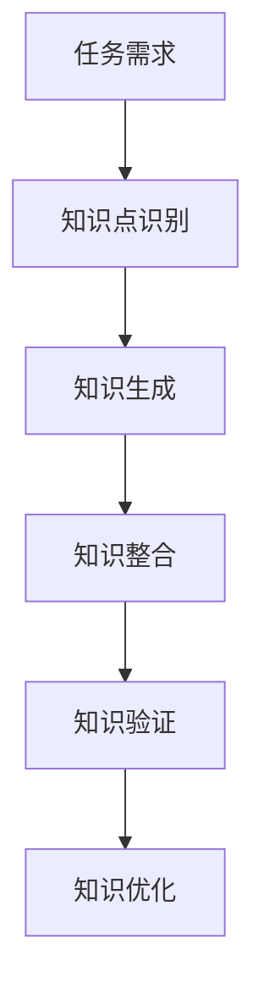
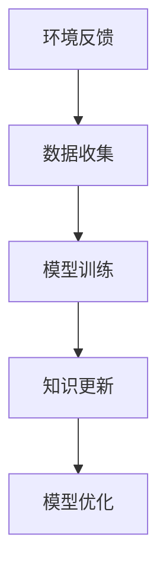
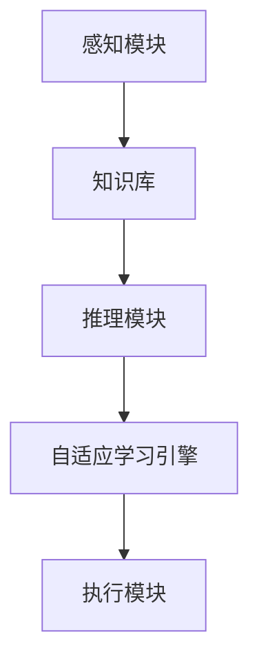
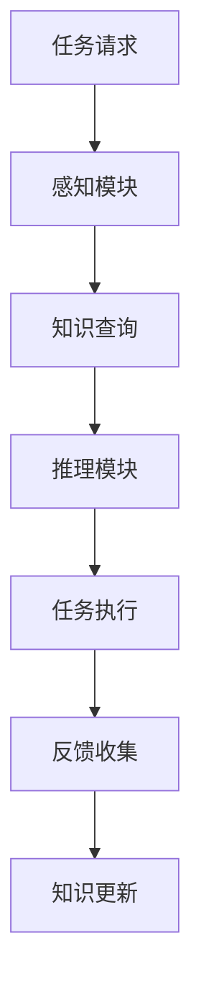

                 


# 自适应学习AI Agent：LLM的动态知识结构调整

## 关键词：自适应学习AI Agent，LLM，动态知识结构调整，人工智能，知识管理

## 摘要：  
随着人工智能技术的快速发展，AI Agent需要具备更强的自适应能力以应对复杂多变的任务需求。本文将深入探讨自适应学习AI Agent的核心原理，结合大语言模型（LLM）的技术特点，分析动态知识结构调整的实现方法，并通过实际案例展示其应用场景和优势。文章内容涵盖背景介绍、核心概念、算法原理、系统架构、项目实战等多个方面，帮助读者全面理解并掌握自适应学习AI Agent的设计与实现。

---

# 第1章: 自适应学习AI Agent与动态知识结构调整的背景介绍

## 1.1 问题背景与核心概念

### 1.1.1 当前AI Agent的发展现状  
AI Agent（智能体）作为一种能够感知环境、自主决策并执行任务的智能系统，近年来得到了广泛应用。然而，传统的AI Agent往往依赖于静态的知识库，难以应对动态变化的任务需求。随着人工智能技术的快速发展，尤其是大语言模型（LLM）的崛起，如何让AI Agent具备自适应学习能力成为研究热点。

### 1.1.2 知识结构调整的必要性  
在实际应用中，AI Agent需要处理的任务种类繁多，环境条件也千变万化。静态的知识结构无法满足动态任务的需求，容易导致决策错误或效率低下。因此，动态知识结构调整成为提升AI Agent性能的关键技术。

### 1.1.3 问题解决方法  
通过引入自适应学习机制，AI Agent能够根据任务需求动态调整知识结构，实时更新知识内容，从而更好地应对复杂环境中的任务挑战。

### 1.1.4 边界与外延  
- **边界条件**：自适应学习AI Agent主要应用于需要动态知识调整的任务场景，如对话系统、推荐系统等。  
- **外延**：动态知识结构调整技术可以应用于多种AI系统，如机器人、自动驾驶等，但本文主要聚焦于LLM驱动的AI Agent。

### 1.1.5 核心概念结构与组成  
自适应学习AI Agent的核心组成包括：感知模块、知识库、推理模块、自适应学习引擎和执行模块。知识库是AI Agent的知识存储中心，动态知识结构调整是通过自适应学习引擎实现的。

---

# 第2章: 自适应学习AI Agent的核心原理

## 2.1 自适应学习的原理

### 2.1.1 自适应学习的基本原理  
自适应学习是一种动态调整学习策略和知识结构的方法，能够根据任务需求和环境变化实时更新知识内容。

### 2.1.2 动态知识调整的机制  
动态知识调整通过分析任务需求和环境反馈，识别需要更新的知识点，并通过学习算法优化知识结构。

### 2.1.3 知识结构的自适应更新方法  
通过结合LLM的生成能力和强化学习算法，实现知识结构的动态更新和优化。

---

# 第3章: LLM在动态知识调整中的应用

## 3.1 LLM的基本工作原理  
LLM通过大规模预训练和微调，具备强大的语义理解和生成能力，能够为AI Agent提供丰富的上下文信息。

## 3.2 LLM在动态知识调整中的作用  
通过LLM生成新的知识内容，并将其整合到AI Agent的知识库中，实现动态知识更新。

## 3.3 动态知识调整与LLM的结合  
通过LLM的生成能力和自适应学习引擎，实现知识库的动态更新和优化。

---

# 第4章: 算法原理与实现

## 4.1 动态知识调整算法

### 4.1.1 算法概述  
动态知识调整算法通过分析任务需求和环境反馈，识别需要更新的知识点，并通过学习算法优化知识结构。

### 4.1.2 算法实现步骤  
1. 知识点识别：分析任务需求，识别需要更新的知识点。  
2. 知识生成：利用LLM生成新的知识点内容。  
3. 知识整合：将新知识点整合到知识库中，优化知识结构。  
4. 知识验证：通过验证任务执行效果，评估知识调整的效果。

### 4.1.3 算法流程图  


## 4.2 自适应学习机制

### 4.2.1 自适应学习的基本原理  
自适应学习通过分析任务执行效果，动态调整学习策略，优化知识结构。

### 4.2.2 自适应学习算法  
- **强化学习算法**：通过奖励机制，优化知识结构，提升任务执行效果。  
- **监督学习算法**：通过标注数据，训练AI Agent的知识更新模型。

### 4.2.3 自适应学习实现步骤  
1. 数据收集：收集任务执行数据和环境反馈。  
2. 模型训练：利用训练数据，训练自适应学习模型。  
3. 知识更新：根据模型预测结果，优化知识结构。  
4. 模型优化：通过迭代优化，提升自适应学习能力。

### 4.2.4 自适应学习流程图  


---

# 第5章: 系统架构与设计

## 5.1 系统架构设计

### 5.1.1 系统组成  
自适应学习AI Agent系统主要由感知模块、知识库、推理模块、自适应学习引擎和执行模块组成。

### 5.1.2 系统架构图  


## 5.2 知识库设计

### 5.2.1 知识库结构  
知识库包括静态知识和动态知识两部分，静态知识用于支撑基础任务，动态知识用于应对变化的任务需求。

### 5.2.2 知识存储与更新  
动态知识通过LLM生成，并通过自适应学习引擎进行更新和优化。

## 5.3 接口设计与交互

### 5.3.1 系统接口设计  
系统接口包括知识库接口、推理模块接口和自适应学习引擎接口。

### 5.3.2 系统交互流程图  


---

# 第6章: 项目实战与案例分析

## 6.1 项目实战

### 6.1.1 环境安装  
安装Python、LLM库（如GPT-3.5-turbo）和相关依赖。

### 6.1.2 核心功能实现  
实现知识点识别、知识生成、知识整合和知识验证功能。

### 6.1.3 代码示例  
```python
def dynamic_knowledge_adjustment(task_request):
    # 知识点识别
    key_points = identify_key_points(task_request)
    # 知识生成
    new_knowledge = generate_new_knowledge(key_points)
    # 知识整合
    updated_knowledge_base = integrate_new_knowledge(new_knowledge)
    # 知识验证
    validation_result = validate_knowledge_update(updated_knowledge_base)
    return validation_result
```

### 6.1.4 代码解读  
代码实现动态知识调整的核心功能，包括知识点识别、知识生成、知识整合和知识验证。

## 6.2 案例分析

### 6.2.1 应用场景  
在智能客服系统中，动态知识调整能够实时更新产品信息，提升客户服务质量。

### 6.2.2 实施步骤  
1. 收集客户需求，识别需要更新的知识点。  
2. 利用LLM生成新的产品信息。  
3. 整合新知识到知识库中，优化知识结构。  
4. 验证知识更新效果，提升客户服务质量。

### 6.2.3 案例分析  
通过案例分析，验证动态知识调整技术在实际应用中的效果和优势。

---

# 第7章: 最佳实践与注意事项

## 7.1 最佳实践

### 7.1.1 知识库设计  
合理设计知识库结构，区分静态知识和动态知识，提升知识管理效率。

### 7.1.2 算法选择  
根据具体任务需求，选择合适的动态知识调整算法，优化知识结构。

### 7.1.3 系统优化  
通过迭代优化，提升系统性能和自适应学习能力。

## 7.2 注意事项

### 7.2.1 知识更新频率  
动态知识调整的频率需要根据任务需求和系统性能进行调整，避免过度更新导致资源消耗过大。

### 7.2.2 知识准确性  
在动态知识调整过程中，需要注意知识的准确性，避免错误信息影响任务执行效果。

### 7.2.3 系统稳定性  
动态知识结构调整可能对系统稳定性造成影响，需要进行充分的测试和验证。

---

# 第8章: 小结与展望

## 8.1 小结  
本文详细介绍了自适应学习AI Agent的核心原理，结合LLM技术，探讨了动态知识结构调整的实现方法，并通过实际案例展示了其应用场景和优势。

## 8.2 未来展望  
随着人工智能技术的进一步发展，自适应学习AI Agent将在更多领域得到应用，动态知识结构调整技术也将更加智能化和高效化。

---

通过以上目录结构，您可以逐步展开每个部分的内容，撰写一篇完整的关于自适应学习AI Agent和LLM动态知识结构调整的技术博客文章。

