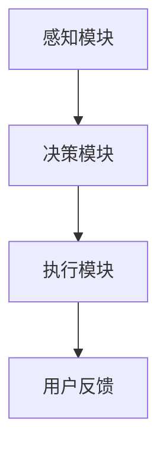
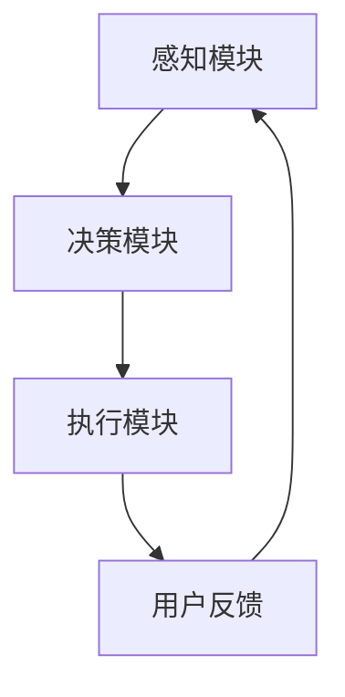
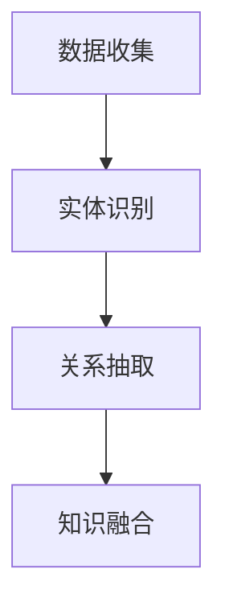
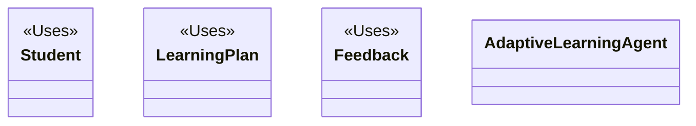
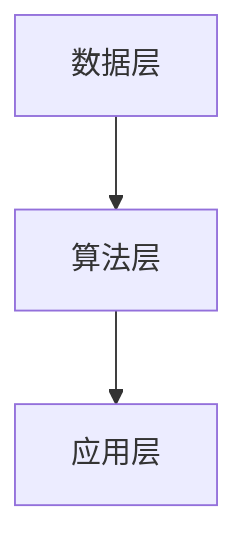
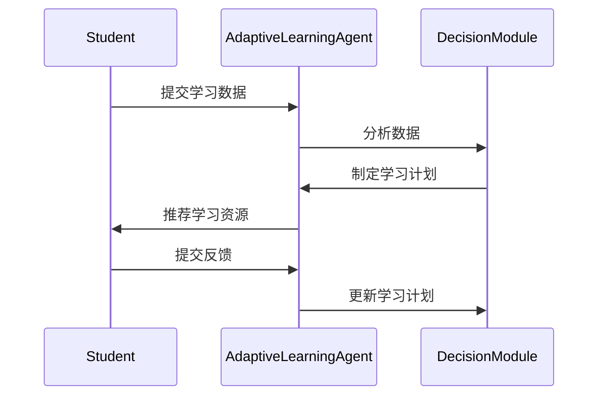

                 


# 自适应学习AI Agent：个性化的LLM教育系统

## 关键词
自适应学习，AI Agent，LLM，个性化教育，机器学习，教育系统

## 摘要
自适应学习AI Agent是一种结合了人工智能技术的教育工具，能够根据学生的学习情况动态调整教学策略，提供个性化的学习体验。本文将深入探讨自适应学习AI Agent的核心原理、算法实现、系统架构以及实际应用，帮助读者全面理解这一技术在教育领域的重要性和应用价值。

---

# 第1章：自适应学习AI Agent概述

## 1.1 问题背景与需求分析
### 1.1.1 当前教育系统中的学习挑战
传统的教育系统通常采用统一的教学模式，难以满足每个学生的个性化学习需求。学生的学习能力和兴趣差异较大，导致部分学生无法有效掌握知识，而其他学生则可能感到课程过于简单。这种一刀切的教学方式不仅降低了学习效率，还可能影响学生的学习积极性。

### 1.1.2 个性化学习的重要性
个性化学习强调根据学生的兴趣、能力和发展阶段，制定适合他们的学习计划。通过个性化学习，学生可以更高效地掌握知识，同时也能激发他们的学习兴趣和潜力。个性化学习已成为现代教育的重要趋势，尤其是在技术进步的推动下，实现个性化学习变得更加可行。

### 1.1.3 自适应学习AI Agent的定义与特点
自适应学习AI Agent是一种基于人工智能的教育工具，能够实时分析学生的学习数据，动态调整教学策略。其特点包括：
1. **个性化推荐**：根据学生的学习情况，推荐适合的学习资源和练习。
2. **实时反馈**：在学习过程中提供即时反馈，帮助学生及时纠正错误。
3. **动态调整**：根据学习效果和学生反馈，动态调整学习计划。
4. **多模态数据处理**：能够整合文本、语音、图像等多种数据源，提供更全面的学习分析。

### 1.1.4 当前应用现状与挑战
目前，自适应学习AI Agent已经在许多在线教育平台中得到应用，例如Khan Academy和Coursera等。然而，其应用仍面临一些挑战，包括数据隐私问题、模型复杂性以及技术与教育实践的结合难度。

---

# 第2章：自适应学习AI Agent的核心原理

## 2.1 自适应学习AI Agent的工作原理
### 2.1.1 感知模块
感知模块负责收集和分析学生的学习数据，包括学习进度、错误率、学习时间等。通过这些数据，AI Agent能够了解学生的学习状态和需求。

### 2.1.2 决策模块
决策模块基于感知模块提供的数据，利用机器学习算法制定个性化的学习计划。例如，AI Agent可能会根据学生的学习速度和错误率，调整学习内容的难度和数量。

### 2.1.3 执行模块
执行模块负责将决策模块制定的计划转化为具体的行动，例如推荐学习资源、提供反馈等。这些行动通过用户界面呈现给学生，帮助他们更好地完成学习任务。

### 2.1.4 模块间的关系
感知模块、决策模块和执行模块之间的关系可以用以下流程图表示：



## 2.2 自适应学习AI Agent的核心概念对比
### 2.2.1 概念属性特征对比表
以下表格对比了自适应学习AI Agent与传统教育工具的核心概念属性特征：

| 特性                | 自适应学习AI Agent           | 传统教育工具           |
|---------------------|------------------------------|-----------------------|
| 学习个性化          | 是                           | 否                   |
| 实时反馈            | 是                           | 否                   |
| 数据驱动            | 是                           | 否                   |
| 自动调整            | 是                           | 否                   |
| 适用范围            | 单个学生                     | 所有学生             |

### 2.2.2 ER实体关系图
以下是一个简单的ER实体关系图，展示了自适应学习AI Agent系统的主要实体及其关系：

```mermaid
erd
    Student
    ----> (N:1) AdaptiveLearningPlan
    ----> (N:1) LearningResource
    ----> (N:1) Feedback
```

## 2.3 自适应学习AI Agent的架构图
以下是一个自适应学习AI Agent的架构图，展示了各个模块之间的关系：



---

# 第3章：自适应学习AI Agent的算法原理

## 3.1 推荐算法原理
### 3.1.1 协同过滤算法
协同过滤是一种基于用户行为相似性推荐内容的算法。其基本思想是，如果两个用户在历史行为上相似，那么他们可能会对同一内容感兴趣。

#### 3.1.1.1 协同过滤的数学模型
协同过滤的相似度计算可以用余弦相似度公式表示：

$$ \text{相似度}(u, v) = \frac{\sum_{i=1}^{n} u_i v_i}{\sqrt{\sum_{i=1}^{n} u_i^2} \cdot \sqrt{\sum_{i=1}^{n} v_i^2}}} $$

其中，$u$ 和 $v$ 是两个用户的偏好向量，$n$ 是内容项的数量。

#### 3.1.1.2 协同过滤的Python实现
以下是协同过滤算法的Python实现示例：

```python
def collaborative_filtering(user_matrix):
    # 计算用户间的相似度
    similarity = {}
    for u in user_matrix:
        for v in user_matrix:
            if u != v:
                similarity[(u, v)] = cosine_similarity(user_matrix[u], user_matrix[v])
    return similarity
```

## 3.2 强化学习算法原理
### 3.2.1 Q-Learning算法
Q-Learning是一种基于值函数的强化学习算法，适用于离线环境下的策略优化。其核心思想是通过不断更新Q值表，找到最优动作策略。

#### 3.2.1.1 Q-Learning的数学模型
Q-Learning的更新公式如下：

$$ Q(s, a) = (1 - \alpha) Q(s, a) + \alpha [r + \max_{a'} Q(s', a')] $$

其中，$\alpha$ 是学习率，$r$ 是奖励值，$s'$ 是新状态。

#### 3.2.1.2 Q-Learning的Python实现
以下是Q-Learning算法的Python实现示例：

```python
import numpy as np

class QLearning:
    def __init__(self, state_space, action_space, learning_rate=0.1):
        self.state_space = state_space
        self.action_space = action_space
        self.learning_rate = learning_rate
        self.Q = np.zeros((state_space, action_space))

    def update(self, state, action, reward, next_state):
        current_q = self.Q[state, action]
        next_max_q = np.max(self.Q[next_state])
        self.Q[state, action] = current_q + self.learning_rate * (reward + next_max_q - current_q)
```

## 3.3 知识图谱构建
### 3.3.1 知识图谱的构建流程
知识图谱的构建通常包括数据收集、实体识别、关系抽取和知识融合等步骤。以下是构建流程的Mermaid图：



---

# 第4章：自适应学习AI Agent的系统架构设计

## 4.1 问题场景介绍
自适应学习AI Agent系统需要解决的主要问题包括：如何实时分析学生的学习数据，如何动态调整学习计划，以及如何有效地与学生进行交互。

## 4.2 系统功能设计
### 4.2.1 功能模块
以下是系统功能模块的Mermaid类图：



### 4.2.2 接口设计
系统需要提供以下接口：
- 数据采集接口：用于收集学生的学习数据。
- 推荐接口：根据学生的学习数据推荐学习资源。
- 反馈接口：接收学生的学习反馈并更新学习计划。

## 4.3 系统架构设计
### 4.3.1 分层架构
自适应学习AI Agent系统采用分层架构，包括数据层、算法层和应用层。以下是分层架构的Mermaid图：



## 4.4 交互流程
以下是系统的交互流程图：



---

# 第5章：项目实战

## 5.1 环境安装
要运行自适应学习AI Agent系统，需要安装以下Python库：
- `numpy`：用于数值计算
- `scikit-learn`：用于机器学习算法
- `mermaid`：用于绘制图表

安装命令如下：
```bash
pip install numpy scikit-learn mermaid
```

## 5.2 核心代码实现
### 5.2.1 数据预处理
以下是一个简单的数据预处理代码示例：

```python
import numpy as np

def preprocess_data(data):
    # 标准化数据
    data = (data - np.mean(data)) / np.std(data)
    return data
```

### 5.2.2 模型训练
以下是基于协同过滤的推荐算法的训练代码：

```python
from sklearn.metrics.pairwise import cosine_similarity

def train_model(user_matrix):
    similarity_matrix = cosine_similarity(user_matrix)
    return similarity_matrix
```

## 5.3 案例分析
假设我们有一个包含10个学生的数据集，每个学生的学习数据包括5门课程的成绩。以下是如何使用协同过滤算法推荐学习资源的示例：

1. **数据预处理**：
   - 计算每门课程的平均成绩和标准差。
   - 对数据进行标准化处理。

2. **模型训练**：
   - 计算学生间的相似度矩阵。

3. **推荐学习资源**：
   - 根据相似度最高的学生，推荐相应的学习资源。

---

# 第6章：最佳实践

## 6.1 小结
自适应学习AI Agent是一种能够显著提升学习效率和效果的教育工具。通过实时分析学生的学习数据，动态调整教学策略，AI Agent能够为每个学生提供个性化的学习体验。

## 6.2 注意事项
在实际应用中，需要注意以下几点：
- **数据隐私**：确保学生数据的安全性和隐私性。
- **模型可解释性**：提高模型的可解释性，以便更好地理解和优化学习计划。
- **技术与教育的结合**：在技术实现的基础上，注重教育实践的应用和效果。

## 6.3 拓展阅读
- 《机器学习实战》：深入理解机器学习算法的实现和应用。
- 《自适应教育系统的设计与实现》：探讨自适应教育系统的设计方法和实现技术。

---

通过本文的详细讲解，我们希望能够帮助读者更好地理解自适应学习AI Agent的核心原理和实际应用，为教育领域的技术创新提供新的思路和方向。

