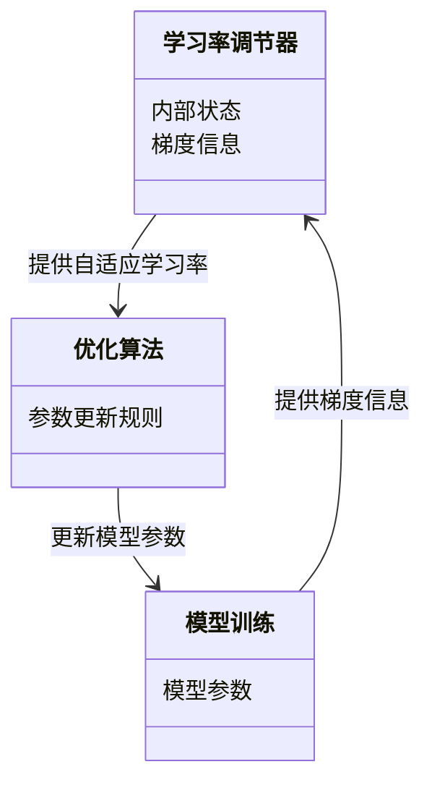
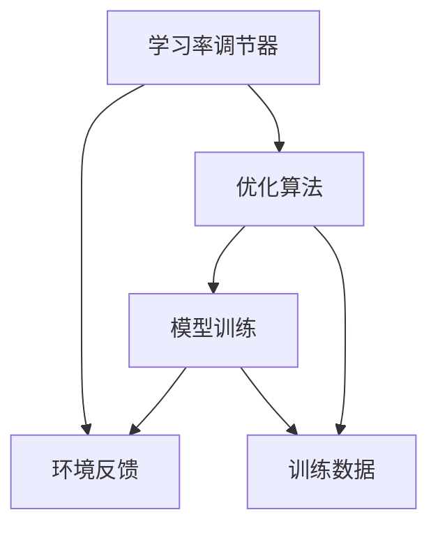
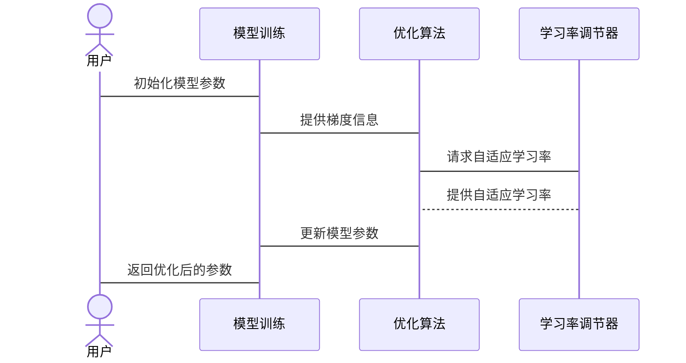

                 


# 自适应学习率在AI Agent训练中的应用

> 关键词：自适应学习率、AI Agent、优化算法、机器学习、深度学习

> 摘要：  
本文深入探讨了自适应学习率在AI Agent训练中的应用，分析了传统学习率的局限性，并详细介绍了自适应学习率的核心概念、算法原理、系统架构设计以及实际案例。通过对比不同优化算法，结合数学推导和代码实现，本文为AI Agent的训练提供了一种高效的学习率调节方法，帮助读者理解并掌握自适应学习率在实践中的应用。

---

## 第一部分: 自适应学习率在AI Agent训练中的背景介绍

### 第1章: 自适应学习率与AI Agent概述

#### 1.1 自适应学习率的背景与意义
在机器学习和深度学习领域，优化算法是训练模型的核心之一。传统优化算法（如随机梯度下降法，SGD）使用固定学习率，但在实际训练中，固定学习率难以适应不同训练阶段的梯度变化，导致训练过程不稳定或收敛速度慢。自适应学习率通过动态调整学习率，能够更好地适应训练过程中的梯度变化，从而提高训练效率和模型性能。

自适应学习率的核心思想是根据梯度信息动态调整每个参数的学习率，使得模型在训练过程中能够快速收敛，同时避免陷入鞍点或局部最优。这种动态调整机制在复杂的AI Agent训练中尤为重要，因为AI Agent需要在多任务、多环境的动态场景中进行高效学习和决策。

#### 1.2 AI Agent的基本概念与分类
AI Agent（人工智能代理）是一种能够感知环境、执行任务并做出决策的智能体。AI Agent可以根据具体任务和环境分为多种类型：

- **反应式AI Agent**：基于当前感知做出即时反应，适用于实时决策任务。
- **认知式AI Agent**：具有复杂推理和规划能力，适用于需要策略优化的任务。
- **强化学习AI Agent**：通过与环境交互，基于奖励机制优化自身策略。

自适应学习率在强化学习AI Agent中尤为重要，因为强化学习需要在复杂环境中动态调整参数，以实现高效的策略优化。

#### 1.3 本章小结
本章介绍了自适应学习率的背景和意义，并详细阐述了AI Agent的基本概念和分类。通过对比传统优化算法与自适应学习率的优势，强调了自适应学习率在AI Agent训练中的重要性。

---

## 第二部分: 自适应学习率的核心概念与联系

### 第2章: 自适应学习率的原理与实现

#### 2.1 自适应学习率的原理
自适应学习率的核心原理是通过动态调整每个参数的学习率，使其适应当前梯度的信息。与传统学习率固定不同，自适应学习率算法能够根据梯度的大小、方向和变化趋势，动态调整学习率，从而提高优化效率。

#### 2.2 自适应学习率的属性特征对比
以下是几种常见自适应学习率算法的对比：

| 算法名称 | 参数更新方式 | 优点 | 缺点 |
|----------|--------------|------|------|
| Adam     | 动量和自适应学习率结合 | 收敛速度快，适合大规模数据 | 参数更新可能不够稳定 |
| Adagrad   | 基于梯度历史累加 | 适合稀疏数据 | 易陷入零梯度区域 |
| RMSProp   | 基于梯度平方平均 | 稳定性好 | 对小批量数据敏感 |

#### 2.3 自适应学习率的ER实体关系图
以下是一个自适应学习率优化系统的ER实体关系图：

```mermaid
erDiagram
    actor 学习率调节器{}{
        id 内部状态
        id 梯度信息
    }
    actor 优化算法{}{
        id 参数更新规则
    }
    actor 模型训练{}{
        id 模型参数
    }
    学习率调节器 --> 优化算法 : 提供自适应学习率
    优化算法 --> 模型训练 : 更新模型参数
    模型训练 --> 学习率调节器 : 提供梯度信息
```

---

## 第三部分: 自适应学习率的算法原理讲解

### 第3章: 自适应学习率的核心算法

#### 3.1 自适应学习率的经典算法
##### 3.1.1 Adam优化算法
Adam（Adaptive Moment Estimation）是一种结合动量和自适应学习率的优化算法，其更新规则如下：

$$ m_t = \beta_1 m_{t-1} + (1 - \beta_1)g_t $$
$$ v_t = \beta_2 v_{t-1} + (1 - \beta_2)g_t^2 $$
$$ \theta_{t} = \theta_{t-1} - \eta \frac{m_t}{\sqrt{v_t} + \epsilon} $$

其中：
- $m_t$ 是梯度的一阶矩估计
- $v_t$ 是梯度的二阶矩估计
- $\beta_1$ 和 $\beta_2$ 分别是动量的衰减率和二阶矩的衰减率
- $\eta$ 是初始学习率
- $\epsilon$ 是防止除零的常数

以下是一个Adam算法的流程图：

```mermaid
graph TD
    A[初始化参数θ，m，v] --> B{计算梯度g}
    B --> C{更新m：m = β1*m + (1-β1)*g}
    C --> D{更新v：v = β2*v + (1-β2)*g^2}
    D --> E{更新θ：θ = θ - η*m/(sqrt(v)+ε)}
    E --> F{检查收敛条件}
    F --> G[结束]
    F --> H[继续迭代]
```

##### 3.1.2 Adagrad优化算法
Adagrad是一种基于梯度历史的自适应优化算法，其更新规则如下：

$$ \theta_{t} = \theta_{t-1} - \eta \frac{g_t}{\sqrt{v_t} + \epsilon} $$
$$ v_t = v_{t-1} + g_t^2 $$

以下是一个Adagrad算法的流程图：

```mermaid
graph TD
    A[初始化参数θ，v] --> B{计算梯度g}
    B --> C{更新v：v = v + g^2}
    C --> D{更新θ：θ = θ - η*g/sqrt(v+ε)}
    D --> E{检查收敛条件}
    E --> F[结束]
    E --> G[继续迭代]
```

##### 3.1.3 RMSProp优化算法
RMSProp是一种基于梯度平方平均的自适应优化算法，其更新规则如下：

$$ v_t = \beta v_{t-1} + (1 - \beta)g_t^2 $$
$$ \theta_{t} = \theta_{t-1} - \eta \frac{g_t}{\sqrt{v_t} + \epsilon} $$

以下是一个RMSProp算法的流程图：

```mermaid
graph TD
    A[初始化参数θ，v] --> B{计算梯度g}
    B --> C{更新v：v = β*v + (1-β)*g^2}
    C --> D{更新θ：θ = θ - η*g/sqrt(v+ε)}
    D --> E{检查收敛条件}
    E --> F[结束]
    E --> G[继续迭代]
```

#### 3.2 自适应学习率算法的数学模型
以下是一些自适应学习率算法的数学模型示例：

##### Adam算法的数学模型
$$ m_t = \beta_1 m_{t-1} + (1 - \beta_1)g_t $$
$$ v_t = \beta_2 v_{t-1} + (1 - \beta_2)g_t^2 $$
$$ \theta_{t} = \theta_{t-1} - \eta \frac{m_t}{\sqrt{v_t} + \epsilon} $$

##### Adagrad算法的数学模型
$$ \theta_{t} = \theta_{t-1} - \eta \frac{g_t}{\sqrt{v_t} + \epsilon} $$
$$ v_t = v_{t-1} + g_t^2 $$

##### RMSProp算法的数学模型
$$ v_t = \beta v_{t-1} + (1 - \beta)g_t^2 $$
$$ \theta_{t} = \theta_{t-1} - \eta \frac{g_t}{\sqrt{v_t} + \epsilon} $$

#### 3.3 自适应学习率算法的Python实现
以下是一个Adam优化算法的Python代码示例：

```python
import numpy as np

def adam_optimization(theta, grad, eta, beta1, beta2, epsilon):
    # 初始化动量和二阶矩
    m = np.zeros_like(theta)
    v = np.zeros_like(theta)
    m_hat = np.zeros_like(theta)
    v_hat = np.zeros_like(theta)
    
    for _ in range(iterations):
        # 更新动量
        m = beta1 * m + (1 - beta1) * grad
        # 更新二阶矩
        v = beta2 * v + (1 - beta2) * (grad ** 2)
        # 偏置校正
        m_hat = m / (1 - beta1 ** (_ + 1))
        v_hat = v / (1 - beta2 ** (_ + 1))
        # 更新参数
        theta = theta - eta * (m_hat / (np.sqrt(v_hat) + epsilon))
        # 更新梯度
        grad = compute_gradient(theta)
    return theta
```

---

## 第四部分: 系统分析与架构设计方案

### 第4章: 自适应学习率优化系统的架构设计

#### 4.1 问题场景介绍
在AI Agent的训练中，优化算法需要实时调整学习率以适应复杂的环境变化。自适应学习率优化系统通过动态调整学习率，帮助AI Agent在训练过程中更快收敛，提高模型性能。

#### 4.2 领域模型设计
以下是一个自适应学习率优化系统的领域模型类图：



#### 4.3 系统架构设计
以下是一个自适应学习率优化系统的架构图：



#### 4.4 系统接口设计
以下是自适应学习率优化系统的接口设计：

- **输入接口**：
  - 梯度信息：来自模型训练的梯度数据。
  - 参数初始化：模型初始参数。
- **输出接口**：
  - 学习率调节：动态调整后的学习率。
  - 参数更新：优化后的模型参数。

#### 4.5 系统交互设计
以下是一个自适应学习率优化系统的交互序列图：



---

## 第五部分: 项目实战

### 第5章: 自适应学习率优化算法的项目实现

#### 5.1 环境安装与配置
以下是项目所需的环境安装说明：

- Python 3.8+
- NumPy
- TensorFlow或PyTorch

#### 5.2 核心代码实现
以下是自适应学习率优化算法的Python代码实现：

```python
import numpy as np

def adaptive_learning_rate_optimizer(theta, grad, eta, beta, epsilon):
    # 初始化参数
    v = np.zeros_like(theta)
    # 动态调整学习率
    v = beta * v + (1 - beta) * (grad ** 2)
    # 更新参数
    theta = theta - eta / (np.sqrt(v) + epsilon) * grad
    return theta
```

#### 5.3 代码解读与分析
上述代码实现了自适应学习率优化算法，具体步骤如下：

1. **初始化参数**：初始化模型参数 $\theta$ 和用于存储梯度平方的变量 $v$。
2. **动态调整学习率**：根据梯度平方的历史信息，动态调整学习率。
3. **更新参数**：使用调整后的学习率更新模型参数。

#### 5.4 实际案例分析
以下是一个自适应学习率优化算法在AI Agent训练中的实际案例分析：

- **问题描述**：训练一个强化学习AI Agent，在复杂环境中进行策略优化。
- **解决方案**：使用自适应学习率优化算法动态调整学习率，帮助AI Agent在训练过程中更快收敛。
- **案例分析**：通过对比传统优化算法和自适应学习率优化算法的收敛速度和模型性能，验证自适应学习率优化算法的有效性。

#### 5.5 项目小结
本章通过实际案例分析，展示了自适应学习率优化算法在AI Agent训练中的应用效果。通过对比传统优化算法和自适应学习率优化算法，验证了自适应学习率优化算法在训练效率和模型性能上的优势。

---

## 第六部分: 最佳实践

### 第6章: 自适应学习率优化算法的实践经验总结

#### 6.1 小结
自适应学习率优化算法通过动态调整学习率，显著提高了AI Agent的训练效率和模型性能。在实际应用中，选择合适的自适应学习率算法，并根据具体任务和环境进行参数调整，能够进一步提升优化效果。

#### 6.2 注意事项
- 在实际应用中，需要注意自适应学习率算法的参数设置，尤其是动量系数和衰减率的选择。
- 需要根据具体任务和环境调整算法参数，以达到最佳优化效果。

#### 6.3 未来研究方向
- 研究更高效的自适应学习率调节方法。
- 探索自适应学习率在多任务学习和分布偏移问题中的应用。
- 结合强化学习和自适应学习率优化算法，研究更高效的AI Agent训练方法。

#### 6.4 拓展阅读
- 《Deep Learning》—— Ian Goodfellow
- 《Hands-On Machine Learning with Scikit-Learn, Keras, and TensorFlow》—— Aurélien Géron
- 《Adam: A Method for Stochastic Optimization》—— Diederik P. Kingma and Jimmy Ba

---

# 结语

本文系统地介绍了自适应学习率在AI Agent训练中的应用，从背景介绍到算法实现，再到系统架构设计和实际案例分析，为读者提供了全面的知识体系。通过对比不同自适应学习率算法的优缺点，结合实际项目案例，帮助读者更好地理解并掌握自适应学习率在实践中的应用。未来，随着AI技术的不断发展，自适应学习率优化算法将在更多领域展现出其独特的优势。

--- 

**全文完**

