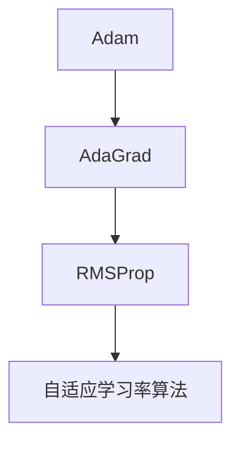
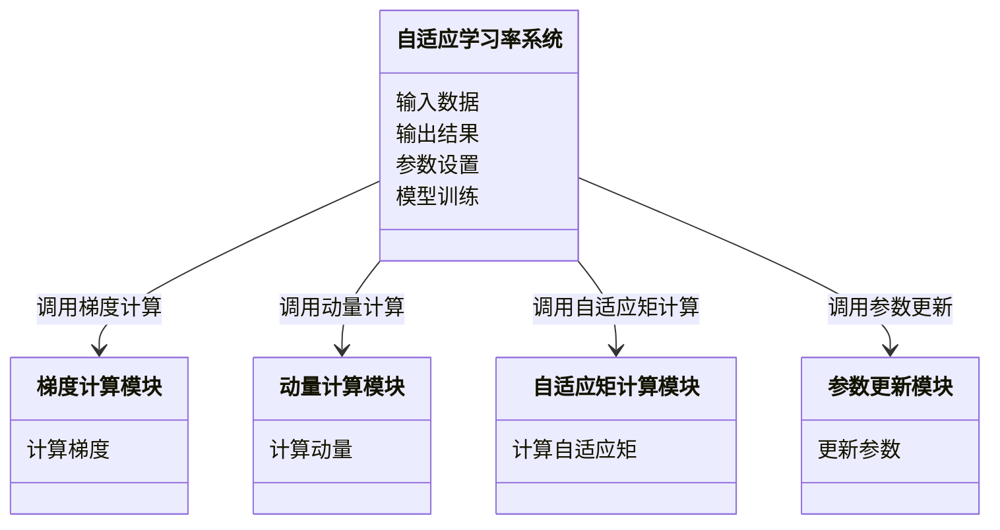
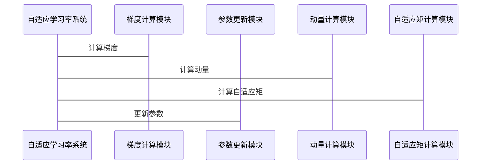

                 


# 自适应学习率：优化AI Agent的训练过程

## 关键词：
自适应学习率，AI Agent，机器学习，优化算法，训练过程

## 摘要：
自适应学习率是一种优化AI Agent训练过程的重要技术，它通过动态调整学习速率，使模型能够更快收敛并提高训练效率。本文将详细探讨自适应学习率的核心概念、算法原理、系统设计以及实际应用，帮助读者全面理解并掌握这一技术。

---

## 第一部分：自适应学习率的核心概念与背景

### 第1章：自适应学习率的基本概念

#### 1.1 什么是自适应学习率
自适应学习率（Adaptive Learning Rate）是指在训练AI模型的过程中，根据训练过程中的梯度信息动态调整学习速率的一种方法。与固定学习率相比，自适应学习率能够更好地适应不同参数更新的需求，从而加快收敛速度并提高模型性能。

- **自适应学习率的定义**：在训练过程中，学习速率不再是固定的，而是根据梯度信息动态调整。
- **与传统学习率的区别**：传统学习率固定，可能导致训练初期收敛过快或过慢；自适应学习率能够自动调整，避免这些问题。

#### 1.2 自适应学习率的重要性
自适应学习率在AI Agent的训练中具有重要意义，主要体现在以下几点：
1. **加快收敛速度**：通过动态调整学习速率，模型能够在不同阶段更高效地优化参数。
2. **提高训练稳定性**：自适应学习率能够缓解不同参数更新步长不一致的问题，避免训练过程中的震荡。
3. **适应复杂场景**：在复杂的优化问题中，自适应学习率能够更好地平衡不同参数的更新需求。

#### 1.3 自适应学习率的实现原理
自适应学习率的核心思想是根据梯度信息动态调整学习速率。具体来说：
1. **梯度信息**：通过计算梯度，了解参数的更新方向和幅度。
2. **动态调整**：根据梯度的大小和变化趋势，调整学习速率，使参数更新更加高效。

---

### 第2章：自适应学习率的核心概念与联系

#### 2.1 自适应学习率的核心算法原理
自适应学习率的核心算法主要包括Adam、AdaGrad和RMSProp等。这些算法通过不同的方式实现对学习速率的自适应调整。

- **Adam优化器**：结合动量和自适应学习率的思想，通过维护梯度的矩估计来动态调整学习速率。
- **AdaGrad优化器**：根据梯度的平方和动态调整学习速率，适用于稀疏数据的情况。
- **RMSProp优化器**：基于梯度的滑动平均值动态调整学习速率，具有较好的稳定性。

#### 2.2 自适应学习率算法的对比分析
以下是几种常见自适应学习率算法的对比表格和ER实体关系图：

**对比表格：**

| 算法名称 | 参数更新公式 | 动量机制 | 自适应学习率机制 |
|----------|--------------|----------|------------------|
| Adam     | $v_t = \beta_1 v_{t-1} + (1-\beta_1)g_t$<br>$s_t = \beta_2 s_{t-1} + (1-\beta_2)g_t^2$ | 是 | 是 |
| AdaGrad   | $\theta_{t+1} = \theta_t - \eta/\sqrt{s_t + \epsilon}$ | 否 | 是 |
| RMSProp   | $s_t = \rho s_{t-1} + (1-\rho)g_t^2$<br>$\theta_{t+1} = \theta_t - \eta g_t / \sqrt{s_t + \epsilon}$ | 否 | 是 |

**ER实体关系图（Mermaid）：**



#### 2.3 自适应学习率算法的数学模型
自适应学习率算法的数学模型是其核心内容，以下以Adam优化器为例进行详细讲解：

**Adam优化器的数学公式：**

- 矩估计：
  $$v_t = \beta_1 v_{t-1} + (1-\beta_1)g_t$$
  $$s_t = \beta_2 s_{t-1} + (1-\beta_2)g_t^2$$
  
- 参数更新：
  $$\theta_{t+1} = \theta_t - \eta \frac{v_t}{\sqrt{s_t + \epsilon}}$$

**公式推导与解释：**
- $\beta_1$ 和 $\beta_2$ 分别是动量和自适应矩估计的系数，通常取值为0.9和0.999。
- $\eta$ 是初始学习率，$\epsilon$ 是为了避免除以零而设置的极小值。
- 通过动量和自适应矩估计的结合，Adam能够在不同方向上动态调整学习速率。

---

### 第3章：自适应学习率的算法原理讲解

#### 3.1 自适应学习率的数学模型
自适应学习率的数学模型是其实现的基础，以下以Adam优化器为例进行详细讲解：

**Adam优化器的实现流程（Mermaid）：**

```mermaid
graph LR
    A[初始化参数θ₀] --> B[计算梯度g_t]
    B --> C[更新矩估计v_t和s_t]
    C --> D[计算更新步长]
    D --> E[更新参数θ_{t+1}]
```

**Python代码实现：**

```python
import numpy as np

def adam_optimizer(theta, gradient, eta, beta1, beta2, epsilon, t=0):
    # 初始参数
    m = theta.shape[0]
    v = np.zeros_like(theta)
    s = np.zeros_like(theta)
    
    for i in range(m):
        # 更新动量v
        v[i] = beta1 * v[i] + (1 - beta1) * gradient[i]
        # 更新自适应矩s
        s[i] = beta2 * s[i] + (1 - beta2) * (gradient[i] ** 2)
        # 参数更新
        theta[i] = theta[i] - eta * v[i] / (np.sqrt(s[i] + epsilon))
    
    return theta, v, s

# 示例调用
theta = np.array([0.5, 0.5])
gradient = np.array([0.4, 0.2])
eta = 0.01
beta1 = 0.9
beta2 = 0.999
epsilon = 1e-8

theta_new, v, s = adam_optimizer(theta, gradient, eta, beta1, beta2, epsilon)
print(theta_new)
```

#### 3.2 自适应学习率的算法实现
自适应学习率的实现需要结合具体的优化算法，以下以Adam优化器为例，详细讲解其实现步骤：

1. **初始化参数**：设置初始参数$\theta_0$和初始时刻$t=0$。
2. **计算梯度**：计算当前参数的梯度$g_t$。
3. **更新动量和自适应矩**：根据动量和自适应矩的系数$\beta_1$和$\beta_2$，更新动量$v_t$和自适应矩$s_t$。
4. **计算更新步长**：根据动量$v_t$和自适应矩$s_t$，计算更新步长。
5. **更新参数**：更新参数$\theta_{t+1}$。

**代码实现与结果分析：**
上述代码实现了一个简单的Adam优化器，能够动态调整学习速率。通过设置不同的参数，可以观察到模型的收敛速度和稳定性。

---

### 第4章：自适应学习率的系统分析与架构设计

#### 4.1 问题场景介绍
在实际的AI Agent训练中，自适应学习率的应用场景非常广泛。例如，在训练神经网络时，不同参数的梯度变化幅度可能差异很大，固定学习率可能导致某些参数更新过快或过慢，从而影响整体的收敛速度和模型性能。

#### 4.2 系统功能设计
自适应学习率系统的设计需要考虑以下几个方面：

1. **领域模型**：定义系统的核心模块及其交互关系。
2. **系统架构**：设计系统的整体架构，包括数据流、模块交互等。
3. **系统接口**：定义系统与其他模块的接口，确保数据传递和功能调用的顺畅。

**领域模型（Mermaid）：**



**系统架构（Mermaid）：**

```mermaid
architecturalDiagram
    系统边界
    包含：自适应学习率系统
    包含：梯度计算模块
    包含：参数更新模块
    包含：动量计算模块
    包含：自适应矩计算模块
```

**系统交互（Mermaid）：**



#### 4.3 项目实战
**环境安装：**
需要安装以下库：
- TensorFlow
- Keras
- NumPy

**代码实现：**
以下是一个简单的自适应学习率实现的代码示例：

```python
import numpy as np

def adaptive_learning_rate_optimizer(theta, gradient, eta, beta1, beta2, epsilon, t=0):
    # 初始参数
    m = theta.shape[0]
    v = np.zeros_like(theta)
    s = np.zeros_like(theta)
    
    for i in range(m):
        # 更新动量v
        v[i] = beta1 * v[i] + (1 - beta1) * gradient[i]
        # 更新自适应矩s
        s[i] = beta2 * s[i] + (1 - beta2) * (gradient[i] ** 2)
        # 参数更新
        theta[i] = theta[i] - eta * v[i] / (np.sqrt(s[i] + epsilon))
    
    return theta, v, s

# 示例调用
theta = np.array([0.5, 0.5])
gradient = np.array([0.4, 0.2])
eta = 0.01
beta1 = 0.9
beta2 = 0.999
epsilon = 1e-8

theta_new, v, s = adaptive_learning_rate_optimizer(theta, gradient, eta, beta1, beta2, epsilon)
print(theta_new)
```

**案例分析与结果解读：**
通过上述代码，我们可以观察到自适应学习率在实际训练中的应用效果。不同的参数设置会影响模型的收敛速度和最终性能，因此需要根据具体场景选择合适的参数。

---

### 第5章：自适应学习率的优化与实践

#### 5.1 最佳实践
在实际应用中，使用自适应学习率时需要注意以下几点：
1. **参数选择**：合理选择动量系数$\beta_1$和自适应矩系数$\beta_2$。
2. **超参数调整**：根据具体问题调整初始学习率$\eta$和$\epsilon$的值。
3. **模型监控**：在训练过程中，需要定期监控模型的损失值和收敛情况，确保优化过程的稳定性。

#### 5.2 小结
自适应学习率是一种强大的优化技术，能够显著提高AI Agent的训练效率和模型性能。通过合理设计和实现自适应学习率算法，可以在实际应用中取得更好的效果。

#### 5.3 注意事项
- 自适应学习率算法的收敛速度和稳定性依赖于参数设置，需要根据具体问题进行调整。
- 在实际训练中，可能需要结合其他优化技术（如正则化、批量归一化等）来进一步提高模型性能。

#### 5.4 拓展阅读
- 《Deep Learning》—— Ian Goodfellow
- 《Hands-On Machine Learning with Scikit-Learn, Keras, and TensorFlow》—— Aurélien Géron

---

通过以上内容，我们系统地介绍了自适应学习率的核心概念、算法原理、系统设计以及实际应用。希望读者能够通过本文深入理解自适应学习率在优化AI Agent训练过程中的重要作用，并能够在实际项目中灵活运用这一技术。

