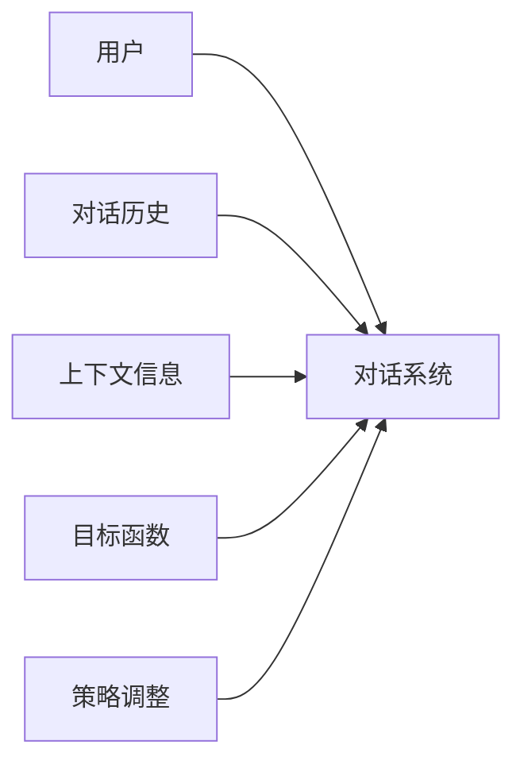
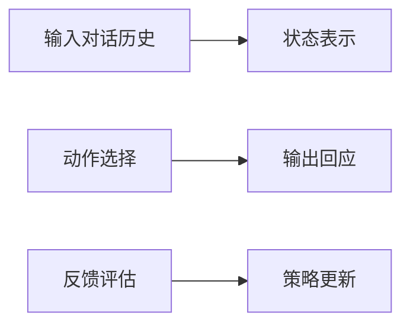
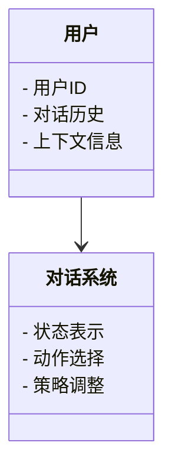
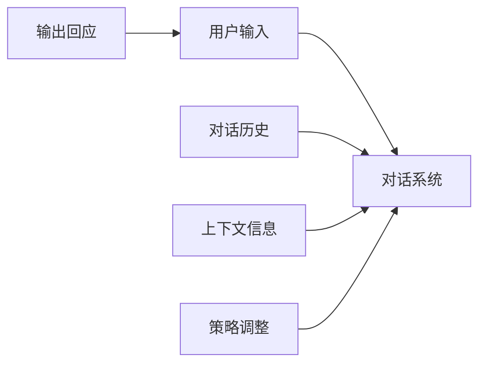

                 


# 自适应对话策略：提升AI Agent的交互质量

## 关键词：
- AI Agent
- 对话策略
- 自适应
- 交互质量
- 强化学习
- 系统架构

## 摘要：
本文详细探讨了自适应对话策略在提升AI Agent交互质量中的关键作用。通过分析问题背景、核心概念、算法原理、系统架构，结合实际案例和最佳实践，展示了如何通过优化对话策略和系统设计来实现更高效的用户交互。文章结构清晰，内容详实，旨在为AI开发者和研究人员提供理论支持和实践指导。

---

## 第1章：自适应对话策略概述

### 1.1 问题背景

#### 1.1.1 当前AI Agent对话中的问题
在传统对话系统中，对话策略通常基于固定的规则或预设的模板，难以应对用户的多样化需求和复杂场景。例如，客服系统在处理用户投诉时，可能无法根据用户情绪和语气调整回应方式，导致用户体验差。

#### 1.1.2 自适应对话策略的提出
自适应对话策略通过动态调整对话内容和风格，以更好地匹配用户需求和上下文信息。这种策略能够显著提升用户满意度和交互效率。

#### 1.1.3 自适应对话策略的目标与意义
目标包括提高对话系统的灵活性和适应性，减少对话失败率，增强用户体验。重要意义在于推动AI Agent从固定模式向智能化、个性化方向发展。

### 1.2 核心概念与联系

#### 1.2.1 自适应对话策略的核心概念
自适应对话策略通过实时分析对话历史、用户反馈和上下文信息，动态调整对话内容和风格。其核心在于策略的动态优化和个性化匹配。

#### 1.2.2 与传统对话策略的对比
| 对比维度 | 传统策略 | 自适应策略 |
|----------|----------|------------|
| 策略调整 | 固定或有限 | 动态优化 |
| 用户适应性 | 低 | 高 |
| 交互灵活性 | 有限 | 高 |

#### 1.2.3 实体关系图


---

## 第2章：自适应对话策略的核心原理

### 2.1 策略优化算法

#### 2.1.1 基于强化学习的策略优化
强化学习通过奖励机制优化策略。例如，当用户对某个回应满意时，系统获得正向奖励，反之则获得负向奖励。

#### 2.1.2 基于监督学习的策略调整
监督学习通过大量标注数据训练模型，预测最佳回应。例如，使用标注数据训练一个分类器，预测每个对话轮次的最佳回应。

#### 2.1.3 策略对比与选择
在策略优化过程中，需要对比不同算法的效果，选择最优策略。

### 2.2 算法原理

#### 2.2.1 基于强化学习的算法流程


---

## 第3章：数学模型与公式

### 3.1 状态表示

#### 3.1.1 向量空间模型
使用向量表示对话历史和当前状态。例如，利用词袋模型或TF-IDF方法将对话内容转化为向量。

#### 3.1.2 图结构模型
构建图结构模型，表示对话中的实体关系。例如，使用图神经网络处理对话中的实体关系。

#### 3.1.3 概率分布模型
利用概率分布模型预测下一个最佳动作。例如，使用多项式分布预测每个可能动作的概率。

### 3.2 动作选择

#### 3.2.1 基于最大似然估计
最大化目标函数的对数似然。例如，$$L(\theta) = \sum_{i=1}^{n} \log P(y_i|x_i,\theta)$$

#### 3.2.2 基于贝叶斯优化
通过贝叶斯方法优化策略参数。例如，$$P(\theta|D) = \frac{P(D|\theta)P(\theta)}{P(D)}$$

#### 3.2.3 基于马尔可夫决策过程
在马尔可夫决策过程中，选择最优动作。例如，$$Q(s,a) = r + \gamma \max_a Q(s',a)$$

---

## 第4章：系统分析与架构设计

### 4.1 问题场景分析

#### 4.1.1 用户需求分析
分析用户的多样化需求，如信息查询、问题解决等。

#### 4.1.2 系统功能设计
设计系统功能，如对话历史记录、上下文管理、策略调整等。

#### 4.1.3 系统性能指标
包括响应时间、准确率、用户满意度等。

### 4.2 系统架构设计

#### 4.2.1 领域模型设计


#### 4.2.2 系统架构图


---

## 第5章：项目实战

### 5.1 环境安装

#### 5.1.1 安装依赖
安装必要的Python库，如TensorFlow、PyTorch等。

#### 5.1.2 配置环境
配置开发环境，如Jupyter Notebook或IDE。

### 5.2 核心代码实现

#### 5.2.1 状态表示代码
```python
import numpy as np

def state_representation(dialog_history):
    # 简单的向量表示方法
    vector = np.zeros(100)
    for token in dialog_history:
        vector[hash(token) % 100] += 1
    return vector
```

#### 5.2.2 动作选择代码
```python
def action_selection(state, model):
    # 使用模型预测最佳动作
    actions = model.predict(state)
    return np.argmax(actions)
```

#### 5.2.3 策略优化代码
```python
def policy_optimization(reward):
    # 强化学习策略优化
    pass
```

### 5.3 实际案例分析

#### 5.3.1 案例描述
以客服对话为例，展示如何根据用户情绪调整回应方式。

#### 5.3.2 代码应用解读
解读上述代码的实际应用，分析其优缺点。

#### 5.3.3 总结与优化
总结案例中的经验教训，提出优化建议。

---

## 第6章：最佳实践与总结

### 6.1 最佳实践

#### 6.1.1 策略选择
根据具体场景选择合适的策略优化算法。

#### 6.1.2 系统设计
确保系统架构合理，功能模块清晰。

### 6.2 小结

本文详细探讨了自适应对话策略的核心概念、算法原理和系统架构，通过实际案例展示了其应用价值。自适应对话策略能够显著提升AI Agent的交互质量，为用户提供更优质的服务。

### 6.3 注意事项

- 确保数据质量和多样性。
- 定期更新策略以适应新场景。
- 注意隐私和数据安全问题。

### 6.4 拓展阅读

推荐相关书籍和论文，供读者深入学习。

---

通过以上步骤，您可以系统地撰写一篇关于自适应对话策略的技术博客，涵盖从基础概念到实际应用的各个方面。

