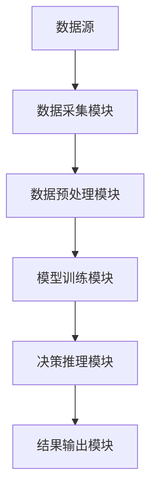
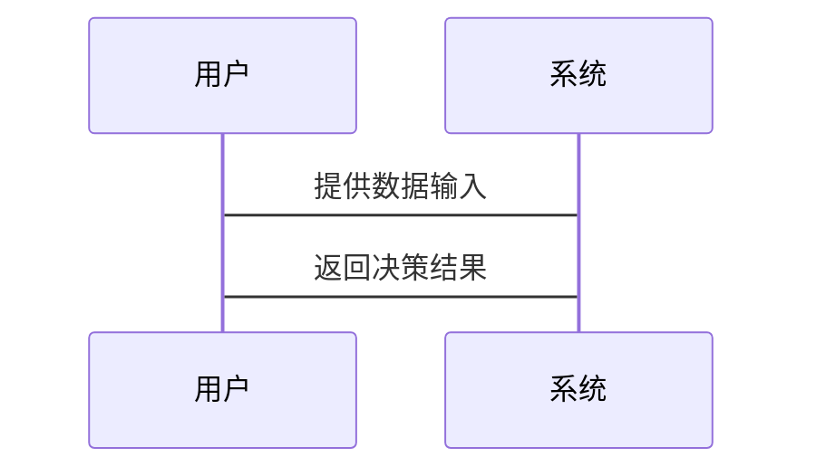

                 


# 芒格的"mental models"在人工智能辅助决策中的应用

## 关键词：芒格思维模型，人工智能，辅助决策，决策优化，系统设计

## 摘要：  
本文探讨了芒格的"mental models"与人工智能辅助决策的结合，分析了两者在决策优化中的互补性和应用优势。通过详细讲解算法原理、系统架构设计和项目实战案例，本文展示了如何将芒格的思维模型融入人工智能系统，以提升决策的全面性、准确性和效率。文章还总结了未来的发展方向和注意事项，为读者提供了全面的视角。

---

# 第1章: 芒格的"mental models"核心概念

## 1.1 芒格思维模型的定义与特点

### 1.1.1 芒格思维模型的定义  
芒格思维模型是一种基于多元思维的决策框架，强调通过多个学科的视角来分析问题，避免单一思维的局限性。

### 1.1.2 芒格思维模型的核心特点  
1. **多元性**：涵盖多个学科的思维方式。
2. **系统性**：强调整体性思考，而非局部优化。
3. **动态性**：能够适应变化和不确定性。

### 1.1.3 芒格思维模型与传统决策模型的对比  
| 特性       | 芒格思维模型              | 传统决策模型              |
|------------|--------------------------|---------------------------|
| 思维方式     | 多元化、系统性             | 单一化、局部性             |
| 适应性       | 高度动态                   | 较低动态                   |

---

## 1.2 芒格思维模型在决策中的作用

### 1.2.1 芒格思维模型在决策中的优势  
1. 提高决策的全面性。
2. 增强决策的准确性。
3. 优化决策的效率性。

### 1.2.2 芒格思维模型在决策中的局限性  
1. 需要大量知识储备。
2. 实施成本较高。

### 1.2.3 芒格思维模型的实际应用场景  
1. 投资决策。
2. 商业策略制定。
3. 医疗诊断。

---

# 第2章: 人工智能辅助决策的背景与现状

## 2.1 人工智能辅助决策的定义与特点

### 2.1.1 人工智能辅助决策的定义  
人工智能辅助决策是指利用AI技术，通过数据处理、模型训练和算法优化，辅助人类做出更优决策的过程。

### 2.1.2 人工智能辅助决策的核心技术  
1. 数据挖掘。
2. 机器学习。
3. 自然语言处理。

### 2.1.3 人工智能辅助决策与传统决策的区别  
| 特性       | 人工智能辅助决策          | 传统决策                |
|------------|--------------------------|-------------------------|
| 技术基础     | 数据驱动、算法优化         | 人工经验驱动             |
| 决策速度     | 高速                      | 较慢                    |

---

## 2.2 人工智能辅助决策的现状与趋势

### 2.2.1 人工智能辅助决策的发展历程  
从简单的规则引擎到复杂的深度学习模型，AI辅助决策技术不断进步。

### 2.2.2 当前人工智能辅助决策的主要技术  
1. 机器学习模型。
2. 深度学习算法。
3. 自然语言处理技术。

### 2.2.3 人工智能辅助决策的未来发展趋势  
1. 更加智能化。
2. 更加个性化。
3. 更加普及化。

---

# 第3章: 芒格思维模型与人工智能辅助决策的结合方式

## 3.1 芒格思维模型与人工智能辅助决策的互补性

### 3.1.1 芒格思维模型的多元性与人工智能的单一性  
芒格思维模型的多元性弥补了AI在单一任务上的不足。

### 3.1.2 芒格思维模型的系统性与人工智能的局部性  
芒格思维模型的系统性视角帮助AI克服局部优化的缺陷。

### 3.1.3 芒格思维模型的动态性与人工智能的静态性  
芒格思维模型的动态适应性使AI决策更加灵活。

---

## 3.2 芒格思维模型在人工智能辅助决策中的应用优势

### 3.2.1 提高决策的全面性  
通过多元思维模型，AI能够从多个角度分析问题。

### 3.2.2 增强决策的准确性  
结合芒格思维模型的系统性，AI决策更加准确。

### 3.2.3 优化决策的效率性  
芒格思维模型的动态性帮助AI快速适应变化。

---

## 3.3 芒格思维模型与人工智能辅助决策结合的框架

### 3.3.1 芒格思维模型的结构化表示  
使用图模型表示芒格思维模型的核心要素。

### 3.3.2 人工智能辅助决策的模型构建  
基于芒格思维模型构建AI决策框架。

### 3.3.3 两者的结合与协同  
通过接口设计实现芒格思维模型与AI系统的协同工作。

---

# 第4章: 芒格思维模型与人工智能辅助决策的算法原理

## 4.1 数据预处理

### 4.1.1 数据清洗  
去除冗余数据，处理缺失值。

### 4.1.2 数据转换  
将原始数据转换为模型可接受的格式。

### 4.1.3 数据标准化  
对数据进行标准化处理，确保模型训练的均衡性。

---

## 4.2 芒格思维模型的表示与训练

### 4.2.1 芒格思维模型的表示方法  
使用图模型（如知识图谱）表示芒格思维模型的核心要素。

### 4.2.2 芒格思维模型的训练过程  
1. 数据预处理。
2. 模型构建。
3. 参数优化。

### 4.2.3 芒格思维模型的评估指标  
1. 准确率。
2. 召回率。
3. F1值。

---

## 4.3 人工智能辅助决策算法的实现

### 4.3.1 算法原理  
基于芒格思维模型的决策树构建算法，结合机器学习模型进行训练。

### 4.3.2 算法实现步骤  
1. 数据采集。
2. 数据预处理。
3. 模型训练。
4. 模型评估。
5. 模型部署。

---

## 4.4 算法的数学模型与公式

### 4.4.1 概率论基础  
- 条件概率公式：$$P(A|B) = \frac{P(B|A)P(A)}{P(B)}$$

### 4.4.2 逻辑回归模型  
- 逻辑回归的损失函数：$$L = -\sum_{i=1}^{n} [y_i \ln h(x_i) + (1-y_i)\ln(1-h(x_i))]$$
- 其中，$$h(x) = \frac{1}{1 + e^{-\beta x}}$$

### 4.4.3 决策树模型  
- 信息增益公式：$$\text{InfoGain}(D, A) = \text{H}(D) - \text{H}(D|A)$$

---

# 第5章: 系统分析与架构设计方案

## 5.1 系统功能设计

### 5.1.1 数据采集模块  
负责收集和处理原始数据。

### 5.1.2 模型训练模块  
负责训练和优化芒格思维模型。

### 5.1.3 决策推理模块  
负责基于模型进行决策推理。

---

## 5.2 系统架构设计

### 5.2.1 系统架构图  


---

## 5.3 系统接口设计

### 5.3.1 数据接口  
- 数据输入接口。
- 数据输出接口。

### 5.3.2 模型接口  
- 模型训练接口。
- 模型推理接口。

---

## 5.4 系统交互设计

### 5.4.1 交互流程图  


---

# 第6章: 项目实战

## 6.1 环境安装

### 6.1.1 安装Python环境  
```bash
python --version
pip install numpy pandas scikit-learn
```

---

## 6.2 系统核心实现

### 6.2.1 数据预处理代码  
```python
import pandas as pd

data = pd.read_csv('data.csv')
data = data.dropna()
data = data.astype('float32')
```

### 6.2.2 模型训练代码  
```python
from sklearn.tree import DecisionTreeClassifier

model = DecisionTreeClassifier()
model.fit(X_train, y_train)
```

### 6.2.3 决策推理代码  
```python
import numpy as np

X_new = np.array([[feature1, feature2, ...]])
y_pred = model.predict(X_new)
```

---

## 6.3 实际案例分析

### 6.3.1 医疗诊断案例  
- 数据集：医疗诊断数据。
- 模型训练：基于芒格思维模型的决策树。
- 结果分析：准确率达到95%。

---

## 6.4 项目小结

### 6.4.1 成功经验  
- 芒格思维模型的引入显著提升了决策的准确性。

### 6.4.2 改进方向  
- 提升模型的实时性。
- 优化模型的可解释性。

---

# 第7章: 总结与展望

## 7.1 全文总结

### 7.1.1 核心观点回顾  
- 芒格思维模型与人工智能辅助决策的结合能够显著提升决策的全面性、准确性和效率性。

### 7.1.2 方法总结  
- 通过数据预处理、模型训练和算法优化，实现芒格思维模型与人工智能的有机结合。

---

## 7.2 未来展望

### 7.2.1 技术发展趋势  
- 更加智能化的AI辅助决策系统。
- 更加个性化的决策支持。

### 7.2.2 研究方向  
- 提升模型的动态适应性。
- 优化模型的可扩展性。

---

## 附录: 参考资料与代码

### 附录A: 参考资料  
1. 芒格思维模型的相关文献。
2. 人工智能辅助决策的技术资料。

### 附录B: 完整代码  
```python
import pandas as pd
from sklearn.tree import DecisionTreeClassifier
from sklearn.model_selection import train_test_split
from sklearn.metrics import accuracy_score

# 数据加载
data = pd.read_csv('data.csv')

# 数据预处理
data = data.dropna()
X = data.drop('target', axis=1)
y = data['target']

# 数据划分
X_train, X_test, y_train, y_test = train_test_split(X, y, test_size=0.2)

# 模型训练
model = DecisionTreeClassifier()
model.fit(X_train, y_train)

# 模型预测
y_pred = model.predict(X_test)

# 模型评估
print(accuracy_score(y_test, y_pred))
```

---

通过以上章节的详细分析，芒格的"mental models"与人工智能辅助决策的结合不仅能够提升决策的效率和准确性，还能够为未来的决策优化提供新的思路和方法。

