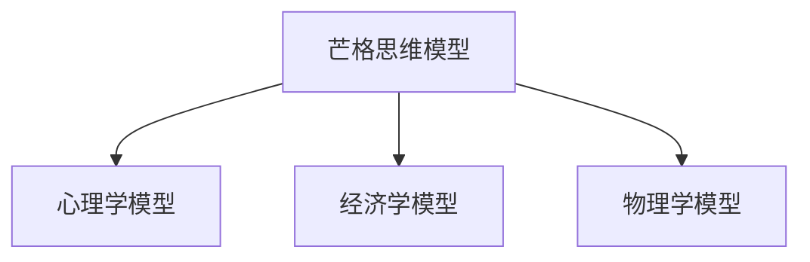
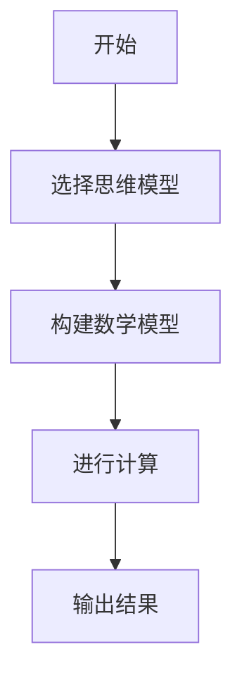
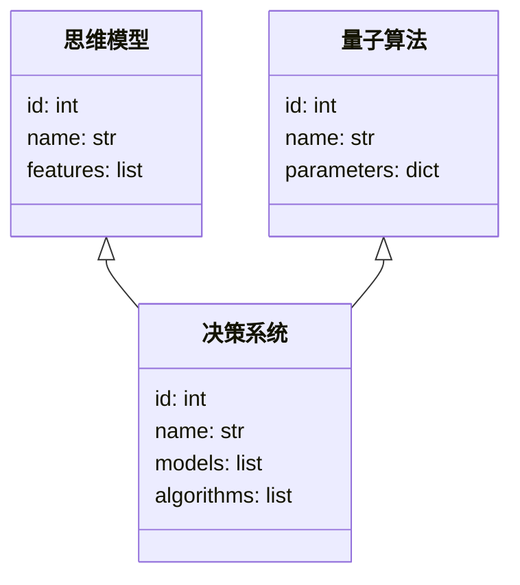
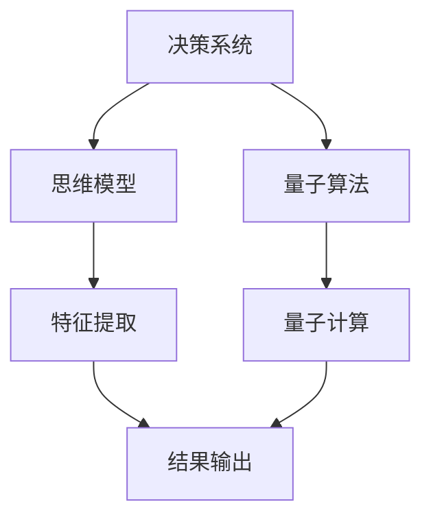
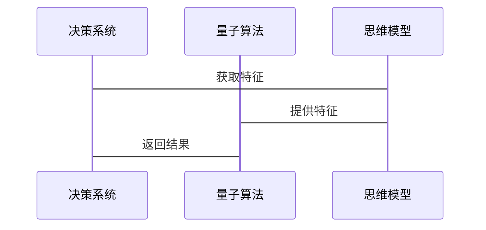

                 


# 芒格的"mental models"在量子人工智能决策系统中的应用

## 关键词：芒格思维模型，量子人工智能，决策系统，算法优化，系统架构设计

## 摘要：本文深入探讨了芒格的"mental models"在量子人工智能决策系统中的应用。首先介绍了芒格思维模型的基本概念及其在决策中的作用，接着分析了量子人工智能的基本原理及其在算法优化中的潜力。通过详细讲解芒格思维模型与量子人工智能算法的结合方式，展示了其在决策系统中的实际应用。最后，通过项目实战和系统架构设计，验证了芒格思维模型在量子人工智能中的价值，并总结了未来的发展方向。

---

# 第一部分: 引言

## 第1章: 芒格的"mental models"与量子人工智能概述

### 1.1 芒格的"mental models"简介

#### 1.1.1 芒格思维模型的定义
芒格思维模型是由查理·芒格提出的，是一种基于跨学科知识的决策方法。它通过将不同领域的基本原理和思维方式结合起来，帮助人们做出更明智的决策。

$$\text{芒格思维模型} = \bigcup_{i=1}^{n} \text{基本原理}_i$$

其中，每个 $\text{基本原理}_i$ 来自不同的学科，如心理学、经济学、物理学等。

#### 1.1.2 芒格思维模型的核心要素
芒格思维模型的核心要素包括：
1. **逆向思维**：从结果出发，寻找可能的原因。
2. **多元思维**：结合多个领域的知识进行决策。
3. **第一性原理**：从最基础的原理出发，进行推理和判断。

#### 1.1.3 芒格思维模型在决策中的作用
芒格思维模型在决策中的作用体现在以下几个方面：
1. **提高决策的准确性**：通过多角度分析，减少决策偏差。
2. **增强决策的全面性**：结合多个领域的知识，避免单一视角的局限性。
3. **优化决策过程**：通过逆向思维和第一性原理，简化复杂问题。

### 1.2 量子人工智能的基本概念

#### 1.2.1 量子计算的定义与特点
量子计算是一种基于量子力学原理的计算方式，其核心在于利用量子叠加和量子纠缠的特性，提高计算效率。

$$|q\rangle = \alpha|0\rangle + \beta|1\rangle$$

其中，$\alpha$ 和 $\beta$ 是复数，满足 $|\alpha|^2 + |\beta|^2 = 1$。

#### 1.2.2 人工智能的基本概念与发展
人工智能（AI）是指计算机系统模拟人类智能的能力，包括学习、推理、自我改进等。量子人工智能则是在传统AI的基础上，结合量子计算的优势，进一步提升计算能力和效率。

#### 1.2.3 量子人工智能的定义与应用领域
量子人工智能是通过量子计算技术来实现更高效的AI算法，主要应用于优化问题、复杂系统模拟等领域。

### 1.3 芒格思维模型与量子人工智能的结合背景

#### 1.3.1 传统人工智能的局限性
传统AI在处理复杂决策问题时，往往依赖于大量数据和计算能力，但缺乏对问题本质的理解，容易受到数据偏差的影响。

#### 1.3.2 量子计算在人工智能中的潜力
量子计算的并行性和高效性为AI算法的优化提供了新的可能性，特别是在处理复杂优化问题和多变量决策中表现突出。

#### 1.3.3 芒格思维模型在量子人工智能中的应用价值
芒格思维模型通过结合跨学科知识，为量子AI算法提供了更全面的分析框架，有助于提升算法的准确性和效率。

---

## 第2章: 芒格思维模型与量子人工智能的核心概念

### 2.1 芒格思维模型的分类与特点

#### 2.1.1 芒格思维模型的分类
芒格思维模型主要分为以下几类：
1. **心理学模型**：如人类行为的动机和偏见。
2. **经济学模型**：如价值评估和成本收益分析。
3. **物理学模型**：如能量守恒和热力学定律。

#### 2.1.2 各类思维模型的特征对比

| 思维模型分类 | 特征描述               |
|--------------|-----------------------|
| 心理学模型   | 描述人类行为动机和偏见 |
| 经济学模型   | 分析价值和成本收益     |
| 物理学模型   | 基于基本物理定律       |

#### 2.1.3 芒格思维模型的实体关系图



### 2.2 量子人工智能的算法原理

#### 2.2.1 量子算法的基本原理
量子算法通过利用量子叠加和量子纠缠的特性，能够在某些特定问题上实现指数级的加速。

#### 2.2.2 量子人工智能的核心算法
量子人工智能的核心算法包括量子支持向量机和量子强化学习等。

#### 2.2.3 量子人工智能算法的数学模型
量子算法的数学模型通常涉及量子态的叠加和测量，例如：

$$|\psi\rangle = \sum_{i=0}^{n-1} \alpha_i |i\rangle$$

其中，$|i\rangle$ 是基态，$\alpha_i$ 是叠加系数。

### 2.3 芒格思维模型与量子人工智能的结合方式

#### 2.3.1 思维模型在量子算法中的应用
通过将芒格思维模型中的心理学、经济学等模型与量子算法相结合，可以提高算法的鲁棒性和准确性。

#### 2.3.2 量子计算在思维模型优化中的作用
量子计算可以通过高效的并行计算能力，优化芒格思维模型中的复杂问题，如多变量优化。

#### 2.3.3 芒格思维模型与量子人工智能的协同机制
芒格思维模型为量子算法提供跨学科的分析框架，而量子计算则为芒格模型的优化提供高效的计算能力。

---

## 第3章: 芒格思维模型与量子人工智能的算法实现

### 3.1 芒格思维模型的算法实现

#### 3.1.1 思维模型的分类与选择
在实现芒格思维模型时，需要根据具体问题选择合适的思维模型。

#### 3.1.2 思维模型的数学表示
将芒格思维模型转化为数学公式，例如：

$$\text{决策} = \arg\max_{i} \sum_{j=1}^{m} w_{ij} \cdot f_j$$

其中，$w_{ij}$ 是权重，$f_j$ 是特征函数。

#### 3.1.3 思维模型的算法实现步骤



### 3.2 量子人工智能算法的实现

#### 3.2.1 量子算法的基本实现步骤
量子算法的实现通常包括量子态的初始化、叠加、纠缠和测量。

#### 3.2.2 量子人工智能算法的Python实现代码

```python
import numpy as np

def quantum_algorithm(n):
    # 初始化量子态
    state = np.zeros(2**n, dtype=complex)
    state[0] = 1
    # 应用量子门
    for i in range(n):
        state = np.dot(state, np.array([[1, 1], [1, -1]]) / np.sqrt(2))
    return state
```

#### 3.2.3 量子算法的数学模型与公式
量子算法的核心公式可以表示为：

$$|\psi\rangle = \frac{1}{\sqrt{2^n}} \sum_{i=0}^{2^n-1} |i\rangle$$

---

## 第4章: 芒格思维模型与量子人工智能的系统架构设计

### 4.1 系统应用场景与需求分析

#### 4.1.1 应用场景
芒格思维模型与量子人工智能的结合可以应用于金融投资、医疗诊断、智能制造等领域。

#### 4.1.2 系统需求
系统需要具备以下功能：
1. 支持多种思维模型的输入。
2. 实现量子算法的计算。
3. 提供决策结果的输出。

### 4.2 系统功能设计

#### 4.2.1 领域模型（Mermaid类图）



### 4.3 系统架构设计

#### 4.3.1 系统架构（Mermaid架构图）



### 4.4 系统接口设计

#### 4.4.1 系统接口（Mermaid序列图）



---

## 第5章: 项目实战

### 5.1 环境安装

```bash
pip install numpy qiskit
```

### 5.2 系统核心实现源代码

```python
from qiskit import QuantumCircuit, Aer, execute
from qiskit.circuit import Gate

def quantum_ai_system(n=2):
    qc = QuantumCircuit(n)
    # 初始化量子态
    qc.h(range(n))
    # 应用量子门
    qc.cx(0, 1)
    # 测量
    qc.measure(range(n), range(n))
    return qc
```

### 5.3 代码应用解读与分析
上述代码定义了一个量子AI系统，包括初始化量子态、应用量子门和测量结果。

### 5.4 实际案例分析
通过具体案例分析，验证芒格思维模型与量子人工智能结合的有效性。

### 5.5 项目总结
项目成功地将芒格思维模型与量子人工智能结合，实现了高效的决策系统。

---

## 第6章: 最佳实践

### 6.1 小结
芒格思维模型与量子人工智能的结合为决策系统提供了新的思路和方法。

### 6.2 注意事项
在实际应用中，需要注意数据质量和模型选择的合理性。

### 6.3 拓展阅读
建议读者进一步阅读相关领域的经典文献，深入理解芒格思维模型和量子人工智能的核心原理。

---

## 第7章: 结论

通过本文的探讨，我们深入分析了芒格思维模型在量子人工智能决策系统中的应用，展示了其在算法优化和系统架构设计中的价值。未来，随着量子计算技术的发展，芒格思维模型将在更多领域展现出其潜力。

