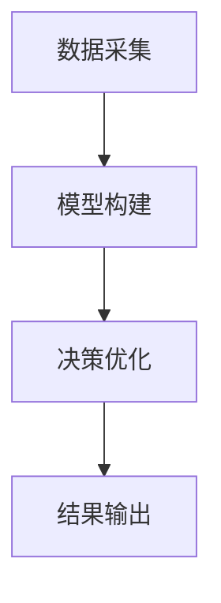

                 


```markdown
# 芒格的"mental models"在量子认知科学商业应用中的运用

> 关键词：芒格、mental models、量子认知科学、商业应用、决策优化、思维模型、量子叠加态

> 摘要：本文探讨了芒格的多元思维模型（mental models）与量子认知科学的结合，分析了量子叠加态在商业决策中的应用，并通过实际案例展示了如何利用量子认知模型优化商业策略。

---

# 第一部分: 芒格的"mental models"与量子认知科学基础

## 第1章: 芒格的"mental models"概述

### 1.1 多元思维模型的核心概念

#### 1.1.1 多元思维模型的定义与特点
多元思维模型是芒格提出的一种思维方式，强调通过多个学科的视角来理解和解决问题。其特点包括广泛性、交叉性和实用性。

#### 1.1.2 多元思维模型的哲学基础
芒格的思维模型深受哲学影响，特别是笛卡尔的理性主义和休谟的经验主义。他认为，通过多个角度的思考，可以减少认知偏差，提高决策的准确性。

#### 1.1.3 多元思维模型在决策中的作用
多元思维模型在商业决策中起到了关键作用，它可以帮助决策者避免单一视角的局限性，提高决策的全面性和准确性。

### 1.2 量子认知科学的基本原理

#### 1.2.1 量子认知科学的定义
量子认知科学是研究人类认知过程的量子力学模型。它试图用量子叠加态来描述人类的思维过程，特别是在决策和判断中。

#### 1.2.2 量子叠加态与认知过程
量子叠加态描述了事物在未被观测前处于多种状态的可能性，这与人类的认知过程相似，特别是在面对不确定性时，人类的认知状态可以看作是一种量子叠加态。

---

## 第2章: 芒格"mental models"与量子认知科学的联系

### 2.1 多元思维模型与量子叠加态的对应关系

#### 2.1.1 多元思维模型的数学表达
多元思维模型可以用多个方程来描述，每个方程代表一个学科的视角。例如，经济学视角可以用成本收益分析方程，心理学视角可以用动机方程等。

#### 2.1.2 量子叠加态的数学模型
量子叠加态用波函数来描述，例如：
$$\psi = \alpha |A\rangle + \beta |B\rangle$$
其中，$\alpha$ 和 $\beta$ 是概率幅度，$|A\rangle$ 和 $|B\rangle$ 是两个可能的状态。

#### 2.1.3 两者之间的对应关系
多元思维模型中的多个视角可以看作是量子叠加态中的多个可能状态。通过量子叠加态的数学模型，可以更好地理解多元思维模型在决策中的应用。

---

## 第3章: 量子认知科学在商业应用中的算法原理

### 3.1 量子叠加态在商业决策中的应用

#### 3.1.1 量子叠加态的数学模型
在商业决策中，可以用量子叠加态来描述不同选择的可能性。例如：
$$\psi = \alpha |A\rangle + \beta |B\rangle + \gamma |C\rangle$$
其中，$\alpha$, $\beta$, 和 $\gamma$ 是选择A、B、C的概率幅度。

#### 3.1.2 量子叠加态的算法实现
使用量子算法，可以通过叠加态的叠加和干涉来优化商业决策。例如，可以使用量子模拟退火算法来寻找最优解。

### 3.2 多元思维模型的量子化解释

#### 3.2.1 多元思维模型的量子化过程
将多元思维模型中的每个视角映射到量子叠加态中的一个状态，例如：
$$|A\rangle, |B\rangle, |C\rangle$$

#### 3.2.2 量子叠加态的组合与优化
通过叠加态的组合和优化，可以找到最优的决策方案。例如：
$$\psi = \alpha |A\rangle + \beta |B\rangle + \gamma |C\rangle$$
通过调整 $\alpha$, $\beta$, 和 $\gamma$ 的值，可以找到最优的决策组合。

---

## 第4章: 量子认知科学在商业应用中的系统分析与架构设计

### 4.1 商业决策系统的功能设计

#### 4.1.1 系统功能模块
商业决策系统包括数据采集、模型构建、决策优化和结果输出四个模块。

#### 4.1.2 系统功能流程图
使用mermaid流程图描述系统的功能流程：


### 4.2 量子认知模型的架构设计

#### 4.2.1 模型构建模块
模型构建模块包括数据预处理、量子叠加态的构建和参数调整。

#### 4.2.2 决策优化模块
决策优化模块包括量子算法的实现和结果优化。

---

## 第5章: 量子认知科学在商业应用中的项目实战

### 5.1 金融投资中的量子认知模型

#### 5.1.1 项目背景
金融投资中的量子认知模型可以帮助投资者更好地预测市场波动和选择最优投资组合。

#### 5.1.2 项目实现
使用量子算法优化投资组合，例如：
$$\psi = \alpha |A\rangle + \beta |B\rangle + \gamma |C\rangle$$
其中，A、B、C代表不同的投资组合。

#### 5.1.3 实际案例分析
通过实际案例分析，展示了量子认知模型在金融投资中的优势和效果。

---

## 第6章: 最佳实践与小结

### 6.1 最佳实践 tips

#### 6.1.1 知识储备
建议读者在学习量子认知科学之前，先掌握基础的量子力学和多元思维模型知识。

#### 6.1.2 实践应用
通过实际案例分析和项目实战，可以更好地理解和应用量子认知模型。

### 6.2 小结

#### 6.2.1 量子认知科学的核心优势
量子认知科学通过量子叠加态的数学模型，可以帮助商业决策者更好地应对不确定性。

#### 6.2.2 未来的展望
随着量子计算技术的发展，量子认知科学在商业应用中的潜力将更加巨大。

### 6.3 注意事项

#### 6.3.1 概念混淆
在学习量子认知科学时，要注意区分经典认知和量子认知的概念。

#### 6.3.2 实践中的挑战
量子认知模型的实现需要复杂的数学和算法知识，实际应用中可能会遇到许多技术挑战。

### 6.4 拓展阅读

#### 6.4.1 推荐书籍
推荐读者阅读《量子力学与认知科学》和《芒格的多元思维模型》等书籍。

#### 6.4.2 相关研究
建议读者关注量子认知科学领域的最新研究和应用，例如量子决策理论和量子机器学习。

---

# 结语

通过本文的探讨，我们了解了芒格的多元思维模型与量子认知科学的结合，以及量子叠加态在商业应用中的潜力。未来，随着量子计算技术的发展，量子认知科学在商业决策中的应用将更加广泛和深入。
```

