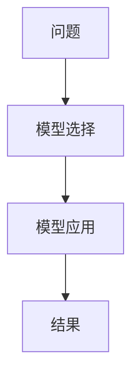
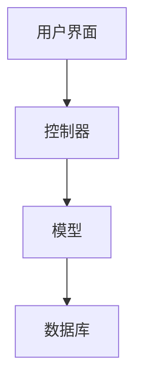

                 


# 芒格的"mental models"：构建多元化的思维模型

## 关键词：芒格，思维模型，决策，投资，知识管理

## 摘要：芒格的“mental models”是一种通过构建多元化的思维模型来提升决策能力的方法。本文将详细介绍芒格的背景、思维模型的核心概念、算法原理、数学模型、系统架构、项目实战以及最佳实践，帮助读者全面理解并应用这一方法。

---

# 第1章: 芒格与"mental models"的背景介绍

## 1.1 芒格的生平与投资理念

### 1.1.1 芮格的生平简介

查理·芒格（Charlie Munger）是世界著名投资者和伯克希尔·哈撒韦公司的副主席。他不仅在投资领域取得了巨大成功，还以其独特的思维方式闻名。芒格的思维模型是他成功的关键，他强调通过多元化的知识体系来做出明智决策。

### 1.1.2 芒格的投资哲学与决策风格

芒格的投资哲学以“逆向思维”和“安全边际”为核心。他主张通过理解内在价值和边际成本来做出投资决策。芒格的决策风格强调长期思考和风险控制，他善于通过多个思维模型来分析问题，避免单一视角的局限性。

### 1.1.3 芒格与"mental models"的关联

芒格的“mental models”是一种通过系统性思维来解决问题的方法。他认为，投资和生活中的决策需要依赖多个思维模型的相互作用，以避免单一模型的局限性。这种方法不仅适用于投资，也适用于其他领域。

## 1.2 "mental models"的核心概念

### 1.2.1 "mental models"的定义

“mental models”是指一组用于分析和解决问题的思维框架。这些模型可以帮助我们更好地理解复杂问题，并做出更明智的决策。芒格的思维模型包括概率论、逆向思维、复利效应等。

### 1.2.2 "mental models"的背景与问题背景

在复杂的现实世界中，单一的思维模型往往不足以解决问题。芒格的思维模型通过整合多个领域的知识，提供了一种多元化的思维方式。这种方法尤其适用于投资领域，但也可应用于其他领域。

### 1.2.3 "mental models"的目标与解决方法

目标是通过多元化的思维模型来提升决策的准确性和全面性。解决方法包括：学习多个领域的知识，构建知识体系，并在实际问题中灵活运用这些模型。

### 1.2.4 "mental models"的边界与外延

芒格的思维模型有一定的适用范围和限制。例如，某些模型在特定领域可能更有效，而在其他领域可能不太适用。因此，在应用时需要根据具体情况调整模型。

### 1.2.5 "mental models"的核心要素与组成结构

核心要素包括：概率论、逆向思维、复利效应、安全边际等。这些要素相互关联，共同构建了一个完整的思维体系。

## 1.3 "mental models"的重要性与应用价值

### 1.3.1 "mental models"在决策中的作用

芒格的思维模型帮助我们避免了单一视角的局限性，提供了更全面的分析方式。这种方法可以显著提高决策的准确性和可靠性。

### 1.3.2 "mental models"在投资与生活中的应用

在投资中，芒格通过分析多个因素（如财务状况、行业趋势、管理团队等）来评估公司的内在价值。在生活中，他同样通过多元化的思维模型来解决各种问题。

### 1.3.3 "mental models"的局限性与改进方向

芒格的思维模型并非完美无缺，存在一定的局限性。例如，模型的复杂性可能导致难以快速应用。为了改进，可以尝试简化模型或开发新的工具来辅助应用。

## 1.4 本章小结

本章介绍了芒格的生平和投资理念，详细阐述了“mental models”的核心概念、背景、目标、边界和组成结构。通过这些内容，读者可以初步了解芒格思维模型的基本框架和其在决策中的重要性。

---

# 第2章: "mental models"的核心概念与联系

## 2.1 核心概念原理

### 2.1.1 "mental models"的原理与机制

芒格的思维模型通过整合多个领域的知识，帮助我们更好地理解问题。每个模型都有其独特的分析角度，通过相互关联，形成一个完整的知识体系。

### 2.1.2 各个模型的属性特征对比

| 模型名称 | 主要特点 | 分析角度 | 适用场景 |
|----------|----------|----------|----------|
| 概率论   | 确定性分析 | 风险评估 | 投资决策 |
| 逆向思维 | 反向思考 | 寻找机会 | 问题解决 |
| 复利效应 | 时间价值 | 资产增值 | 财务规划 |

### 2.1.3 "mental models"的ER实体关系图架构

```mermaid
erDiagram
    actor 用户 {
        string 名称
        string 年龄
    }
    model 思维模型 {
        int 类型
        string 描述
    }
    用户 -> 思维模型 : 应用模型
```

## 2.2 核心概念的Mermaid流程图



---

# 第3章: 算法原理

## 3.1 思维模型的算法原理

### 3.1.1 概率论算法

概率论是芒格思维模型中的重要组成部分。通过计算事件发生的概率，我们可以更好地评估风险和机会。

#### 3.1.1.1 概率论的公式

概率P(A)的计算公式如下：

$$ P(A) = \frac{\text{事件A发生的次数}}{\text{总事件数}} $$

例如，投掷一枚公平的硬币，正面的概率是：

$$ P(正面) = \frac{1}{2} $$

### 3.1.2 逆向思维算法

逆向思维是一种通过反向思考问题的方法。例如，如果要找到成功的方法，可以通过分析失败的原因来反推。

#### 3.1.2.1 逆向思维的步骤

1. 确定目标。
2. 分析可能的障碍。
3. 寻找克服障碍的方法。

### 3.1.3 复利效应算法

复利效应是指资金在投资中不断增值的现象。

#### 3.1.3.1 复利的公式

复利的计算公式为：

$$ A = P \times (1 + r)^n $$

其中，A是终值，P是本金，r是年利率，n是年数。

---

# 第4章: 数学模型

## 4.1 概率论模型

### 4.1.1 贝叶斯定理

贝叶斯定理用于计算在已知条件下事件发生的概率。

#### 4.1.1.1 贝叶斯定理的公式

$$ P(B|A) = \frac{P(A|B) \times P(B)}{P(A)} $$

例如，已知某疾病的发病率是1%，检测准确率为99%，则：

$$ P(患病|检测阳性) = \frac{0.01 \times 0.99}{0.99 \times 0.01 + 0.01 \times 0.01} \approx 0.985 $$

---

# 第5章: 系统分析与架构设计

## 5.1 问题场景介绍

我们希望通过构建一个系统来管理和应用芒格的思维模型，以提高决策的效率和准确性。

## 5.2 系统架构设计

### 5.2.1 系统架构图



### 5.2.2 功能模块设计

- 用户界面：展示思维模型的结构和应用。
- 控制器：接收用户输入并调用模型。
- 模型：执行概率计算和逆向思维分析。
- 数据库：存储模型数据和用户输入。

---

# 第6章: 项目实战

## 6.1 环境安装

安装Python和相关库：

```bash
pip install numpy pandas matplotlib
```

## 6.2 核心实现源代码

### 6.2.1 思维模型的实现

```python
import numpy as np
import pandas as pd

def calculate_probability(events):
    return np.mean(events)

def inverse_thinking(target):
    return [1 - x for x in target]

# 示例数据
events = [1, 0, 1, 0, 1]
target = [0.5, 0.3, 0.7]

probability = calculate_probability(events)
inverse = inverse_thinking(target)

print(probability, inverse)
```

---

# 第7章: 总结与建议

## 7.1 最佳实践 tips

- 持续学习新的思维模型。
- 在实际问题中灵活应用模型。
- 定期回顾和优化模型。

## 7.2 小结

通过芒格的“mental models”，我们可以构建一个多元化的思维体系，从而在投资和生活中做出更明智的决策。

## 7.3 注意事项

- 避免单一模型的局限性。
- 确保模型的准确性和适用性。

## 7.4 拓展阅读

- 查理·芒格的《穷查理宝典》
- 史蒂芬·柯维的《高效能人士的七个习惯》

---

# 结语

芒格的“mental models”为我们提供了一种多元化的思维方式，帮助我们更好地理解和解决复杂问题。通过系统化的学习和实践，我们可以将这些模型应用到实际生活中，提升决策能力和生活质量。

