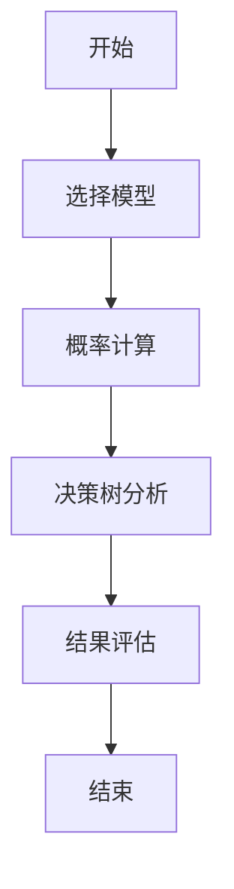
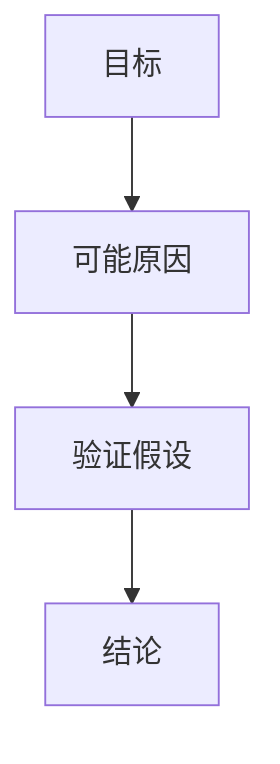
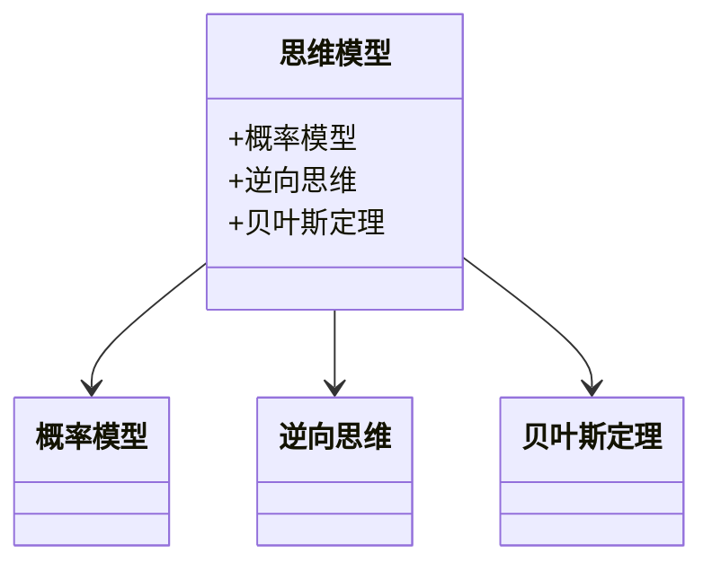
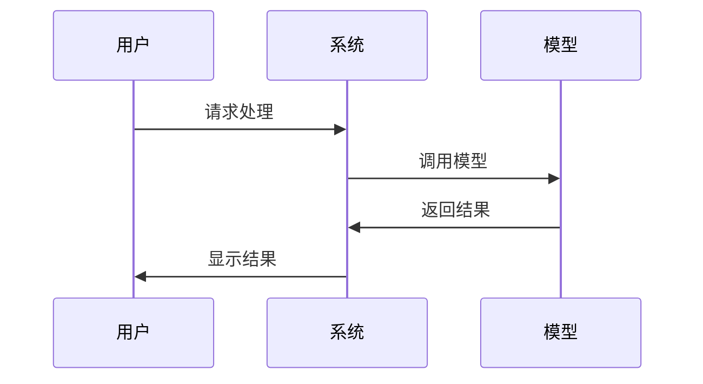

                 


# 芒格的"mental models"：构建多元化的思维模型

## 关键词：芒格，思维模型，决策树，概率论，贝叶斯定理，逆向思维，系统架构

## 摘要：芒格的"mental models"是一种通过构建多元化的思维模型来优化决策的方法。本文将从核心概念、算法原理、数学模型、系统架构等多维度详细解析芒格的思维模型，并通过实际案例展示其在项目中的应用，帮助读者掌握这一强大的思维方式。

---

## 第1章: 思维模型的核心概念

### 1.1 思维模型的定义与背景

#### 1.1.1 什么是思维模型
思维模型是指通过系统化的方法，将复杂问题分解为可理解的组成部分，并通过逻辑推理和数学分析来解决问题的框架。芒格将思维模型视为一种“工具箱”，帮助我们在决策时更加理性。

#### 1.1.2 思维模型的起源与演变
思维模型的概念源于哲学和科学领域，但芒格将其系统化并应用于实际决策中。他强调通过多学科的交叉思考来构建多元化的思维模型。

#### 1.1.3 芦格与思维模型的关联
芒格在其职业生涯中不断强调思维模型的重要性，认为它是投资决策和生活决策的核心工具。他通过《穷查理书》等著作详细阐述了这一理念。

---

### 1.2 思维模型的核心要素

#### 1.2.1 知识的结构化
思维模型的构建需要将零散的知识点进行结构化整理，形成一个有机的知识网络。例如，概率论、逆向思维等模型可以相互关联，形成完整的思维体系。

#### 1.2.2 模型的分类与特点
| 模型类型 | 核心原理 | 特点 | 应用场景 |
|----------|----------|------|----------|
| 概率论    | 事件发生的可能性 | 客观性、可计算性 | 投资决策、风险评估 |
| 逆向思维  | 从结果反推原因 | 创新性、批判性 | 问题解决、创新设计 |
| 贝叶斯定理| 后验概率的计算 | 动态性、准确性 | 数据分析、预测模型 |

#### 1.2.3 思维模型的边界与外延
思维模型的边界在于其适用范围和限制条件。例如，概率论依赖于数据的充分性，而逆向思维需要一定的背景知识支持。外延则是指模型之间的相互作用和综合应用。

---

### 1.3 思维模型的构建方法

#### 1.3.1 知识体系的构建
构建思维模型的第一步是将各个领域的知识进行系统化整理。例如，学习概率论的基本原理后，将其与实际问题相结合，形成解决问题的框架。

#### 1.3.2 模型之间的关联
思维模型的构建需要关注模型之间的关联性。例如，将概率论与贝叶斯定理结合，可以更准确地进行预测和决策。

#### 1.3.3 思维模型的应用场景
思维模型的应用场景广泛，包括投资决策、风险管理、问题解决等。通过实际案例的分析，可以帮助我们更好地理解模型的应用方法。

---

## 第2章: 思维模型的核心原理

### 2.1 概率论与决策树模型

#### 2.1.1 概率论的基本原理
概率论是思维模型的重要组成部分，它通过计算事件发生的可能性来帮助我们做出更合理的决策。

#### 2.1.2 决策树的构建与分析
决策树是一种将问题分解为多个可能结果的树状结构，帮助我们在复杂问题中找到最优解。



#### 2.1.3 概率在决策中的应用
通过概率计算，我们可以评估不同决策方案的风险和收益，从而做出更明智的选择。

---

### 2.2 逆向思维与反向推理

#### 2.2.1 逆向思维的定义与特点
逆向思维是一种从结果反推原因的思维方式，它可以帮助我们在问题解决中找到新的视角。

#### 2.2.2 反向推理的步骤与方法
反向推理的步骤包括：确定目标、分析可能的原因、验证假设等。



#### 2.2.3 逆向思维在实际问题中的应用
通过逆向思维，我们可以快速定位问题的根源，并找到解决方案。

---

### 2.3 贝叶斯定理与条件概率

#### 2.3.1 贝叶斯定理的基本公式
贝叶斯定理是条件概率的核心公式，其表达式为：

$$ P(A|B) = \frac{P(B|A) \cdot P(A)}{P(B)} $$

其中，$P(A|B)$ 是在$B$发生的条件下$A$发生的概率。

#### 2.3.2 条件概率的应用场景
条件概率在数据分析、预测模型等领域有广泛应用。例如，在投资决策中，我们可以利用条件概率评估不同市场环境下的收益情况。

#### 2.3.3 贝叶斯定理在决策中的作用
贝叶斯定理可以帮助我们根据已有信息更新对事件概率的评估，从而做出更准确的决策。

---

## 第3章: 思维模型的数学基础

### 3.1 概率论的数学公式

#### 3.1.1 概率的基本公式
概率的基本公式包括：
- 两个互斥事件的概率和：$P(A \cup B) = P(A) + P(B)$
- 两个独立事件的联合概率：$P(A \cap B) = P(A) \cdot P(B)$

#### 3.1.2 条件概率公式
条件概率的公式为：

$$ P(A|B) = \frac{P(A \cap B)}{P(B)} $$

#### 3.1.3 贝叶斯定理的数学表达
贝叶斯定理的数学表达式为：

$$ P(A|B) = \frac{P(B|A) \cdot P(A)}{P(B)} $$

---

### 3.2 决策树的数学分析

#### 3.2.1 决策树的构建步骤
决策树的构建步骤包括：确定目标、分析可能的结果、计算概率和收益等。

#### 3.2.2 决策树的期望值计算
决策树的期望值计算公式为：

$$ EV = \sum (概率 \cdot 收益) $$

---

### 3.3 思维模型的数学模型

#### 3.3.1 模型的数学表达
思维模型的数学模型可以表示为：

$$ f(x) = \sum_{i=1}^{n} a_i x_i $$

其中，$a_i$ 是模型的参数，$x_i$ 是输入变量。

#### 3.3.2 模型的参数估计
参数估计可以通过最小二乘法等方法进行。

---

## 第4章: 思维模型的系统架构

### 4.1 系统分析与设计

#### 4.1.1 系统分析的基本步骤
系统分析的基本步骤包括：需求分析、功能设计、模块划分等。

#### 4.1.2 系统设计的模块划分
系统设计的模块划分可以参考以下类图：



---

### 4.2 系统接口与交互设计

#### 4.2.1 系统接口的设计原则
系统接口的设计原则包括：简洁性、一致性、可扩展性等。

#### 4.2.2 系统交互的流程图
系统交互的流程图可以表示为：



---

## 第5章: 思维模型的项目实战

### 5.1 项目背景与目标

#### 5.1.1 项目背景介绍
项目背景：通过构建思维模型优化投资决策。

#### 5.1.2 项目目标设定
项目目标：提高投资决策的准确性和效率。

---

### 5.2 项目核心实现

#### 5.2.1 项目核心功能的实现
项目核心功能包括：概率计算、逆向推理、贝叶斯分析等。

#### 5.2.2 项目实现的代码示例
以下是概率计算的代码示例：

```python
def calculate_probability(events):
    probability = 1.0
    for event in events:
        probability *= (event / 100)
    return probability
```

---

### 5.3 项目小结

#### 5.3.1 项目成果
通过项目实战，我们验证了思维模型在实际决策中的有效性。

#### 5.3.2 经验总结
在项目中，我们学会了如何将理论应用于实践，并通过不断优化模型提高决策的准确性。

---

## 第6章: 思维模型的最佳实践

### 6.1 小结与总结

#### 6.1.1 本章小结
思维模型是一种强大的工具，能够帮助我们在复杂问题中找到最优解。

#### 6.1.2 总结
芒格的思维模型为我们提供了一种系统化的决策方法，值得我们在实际工作中深入应用。

---

### 6.2 注意事项与拓展阅读

#### 6.2.1 注意事项
在应用思维模型时，需要注意模型的适用性和数据的准确性。

#### 6.2.2 拓展阅读
推荐阅读《穷查理书》等书籍，深入理解芒格的思维模型。

---

## 附录: 思维模型的数学公式汇总

| 公式名称 | 公式表达 |
|----------|----------|
| 概率基本公式 | $P(A \cup B) = P(A) + P(B)$ |
| 条件概率公式 | $P(A|B) = \frac{P(A \cap B)}{P(B)}$ |
| 贝叶斯定理 | $P(A|B) = \frac{P(B|A) \cdot P(A)}{P(B)}$ |

---

通过本文的详细讲解和实际案例分析，我们希望能够帮助读者更好地理解芒格的思维模型，并将其应用于实际工作中，从而提高决策的准确性和效率。

