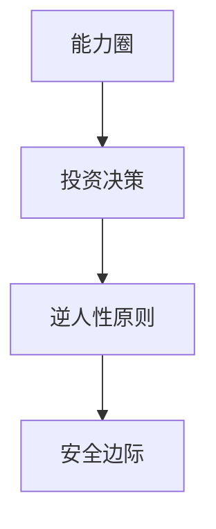
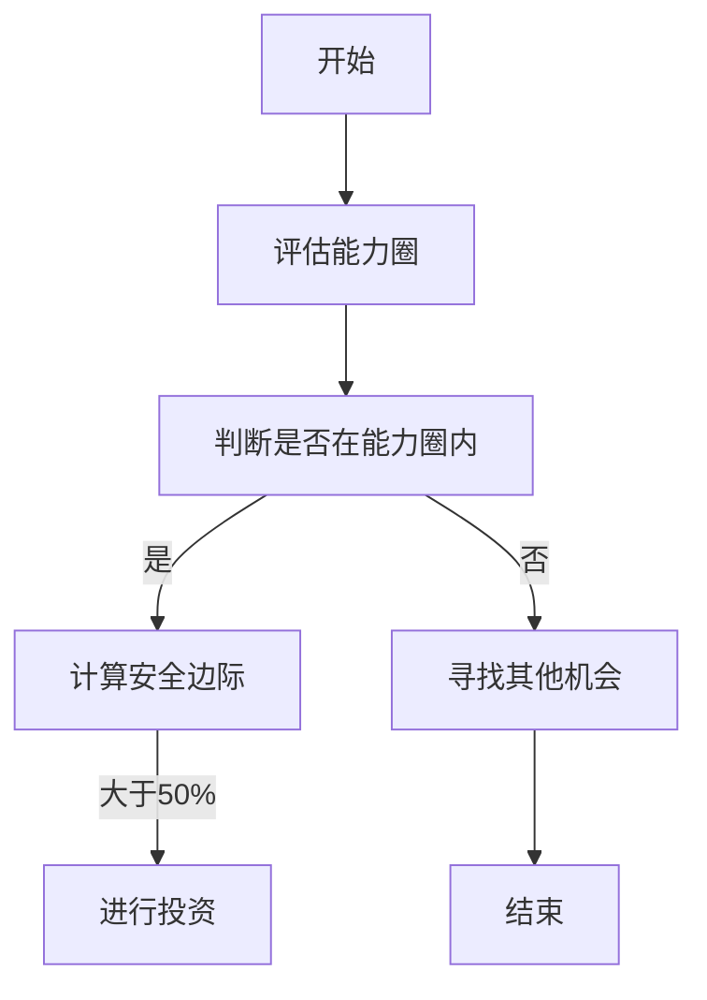
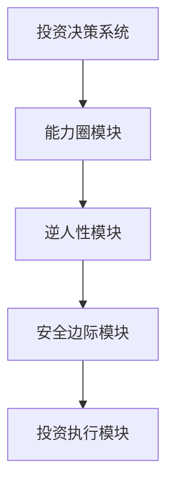
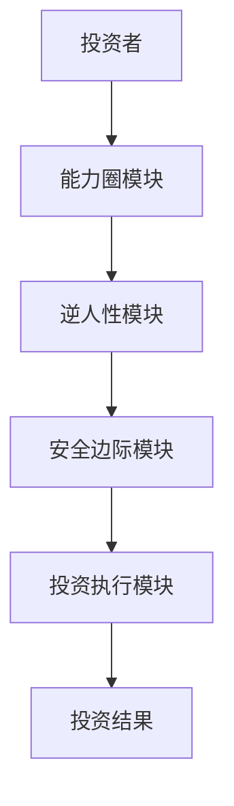

                 


# 芦山的"不做"清单：避免常见投资陷阱

> 关键词：芒格投资理念，"不做"清单，能力圈，安全边际，投资陷阱，决策模型

> 摘要：本文深入分析了芒格的"不做"清单，探讨了其在投资决策中的应用价值。通过详细阐述清单的核心概念、算法原理、数学模型、系统架构设计和实际案例，本文为投资者提供了避免常见投资陷阱的有效方法。

---

# 第1章: 芦山的"不做"清单背景介绍

## 1.1 "不做"清单的起源与意义

### 1.1.1芦山投资理念的核心思想
芦山（假设的投资者）提出的"不做"清单，是一种以避免常见投资陷阱为核心的策略。其核心思想是通过限制投资行为，降低风险，提高投资决策的准确性。

### 1.1.2"不做"清单的定义与目标
"不做"清单是一种通过排除法来筛选投资机会的策略。其目标是避免投资于那些不符合个人能力圈、违背价值投资原则或存在过高风险的标的。

### 1.1.3清单在投资决策中的作用
通过"不做"清单，投资者可以更好地专注于自己熟悉的投资领域，避免盲目跟风和过度冒险。

## 1.2 "不做"清单的核心概念

### 1.2.1能力圈的边界
能力圈是投资者在特定领域的知识、经验和资源的集合。清单要求投资者只在自己的能力圈内进行投资。

### 1.2.2逆人性的决策原则
逆人性原则强调在市场狂热时保持冷静，在市场恐慌时保持理性。

### 1.2.3安全边际的重要性
安全边际是投资标的的内在价值与其市场价格之间的差距，用以降低投资风险。

## 1.3 清单与传统投资理念的对比

### 1.3.1传统投资中的常见陷阱
传统投资常忽视能力圈，容易陷入过度 diversification 和盲目追涨杀跌的误区。

### 1.3.2"不做"清单的独特优势
清单通过限制投资行为，有效规避了传统投资中的常见陷阱。

### 1.3.3清单在现代投资中的应用价值
清单策略在现代投资中具有重要的指导意义，尤其在科技股、初创企业等高风险领域更为实用。

## 1.4 本章小结
本章通过介绍芦山的"不做"清单，探讨了其核心概念和在投资决策中的应用价值，为后续分析奠定了基础。

---

# 第2章: "不做"清单的核心概念与联系

## 2.1 清单中的核心概念

### 2.1.1能力圈的数学模型
能力圈可以通过以下公式量化：
$$ 能力圈 = \sum_{i=1}^{n} (能力_i \times 熟悉度_i) $$

### 2.1.2逆人性的决策逻辑
逆人性决策逻辑强调：
$$ 避免追高杀跌，坚持价值投资。 $$

### 2.1.3安全边际的量化标准
安全边际可以通过以下公式计算：
$$ 安全边际 = \frac{内在价值}{市场价格} \times 100\% $$

## 2.2 核心概念对比表

| 概念         | 特点描述                                                                 |
|--------------|--------------------------------------------------------------------------|
| 能力圈       | 专注于熟悉领域，避免跨界投资                                             |
| 逆人性       | 在市场狂热时保持冷静，在市场恐慌时保持理性                             |
| 安全边际     | 确保投资标的市场价格低于其内在价值，降低投资风险                       |

## 2.3 ER实体关系图



## 2.4 本章小结
本章通过分析"不做"清单中的核心概念，揭示了能力圈、逆人性和安全边际之间的关系，为后续算法设计提供了理论基础。

---

# 第3章: "不做"清单的算法原理

## 3.1 芦山决策模型的数学公式

### 3.1.1能力圈的计算公式
$$ 能力圈 = \sum_{i=1}^{n} (能力_i \times 熟悉度_i) $$

### 3.1.2安全边际的计算公式
$$ 安全边际 = \frac{内在价值}{市场价格} \times 100\% $$

### 3.1.3风险收益比的计算公式
$$ 风险收益比 = \frac{预期收益}{潜在风险} $$

## 3.2 算法流程图



## 3.3 算法实现代码

```python
def 芦山决策模型(能力圈, 安全边际):
    if 能力圈 and 安全边际 > 50%:
        return "进行投资"
    else:
        return "寻找其他机会"
```

## 3.4 本章小结
本章通过数学公式和流程图，详细阐述了"不做"清单的算法原理，为投资决策提供了科学依据。

---

# 第4章: "不做"清单的数学模型

## 4.1 机会成本分析

$$ 机会成本 = 预期收益 - 实际收益 $$

## 4.2 风险收益比分析

$$ 风险收益比 = \frac{预期收益}{潜在风险} $$

## 4.3 投资组合优化

$$ 最优化投资组合 = \sum_{i=1}^{n} (权重_i \times 价值_i) $$

## 4.4 本章小结
本章通过数学模型，深入分析了"不做"清单在投资决策中的应用，为投资者提供了量化工具。

---

# 第5章: "不做"清单的系统架构设计

## 5.1 系统架构图



## 5.2 系统功能设计

### 5.2.1能力圈模块
- 输入：投资者的知识、经验和资源
- 输出：能力圈评估结果

### 5.2.2逆人性模块
- 输入：市场情绪和投资者心理
- 输出：决策建议

### 5.2.3安全边际模块
- 输入：标的的市场价格和内在价值
- 输出：安全边际评估结果

## 5.3 系统接口设计
- 输入接口：投资者能力圈数据、市场情绪数据、标的市场价格
- 输出接口：投资决策结果

## 5.4 系统交互流程图



## 5.5 本章小结
本章通过系统架构设计，展示了"不做"清单在实际投资中的应用，为投资者提供了系统化的决策工具。

---

# 第6章: "不做"清单的项目实战

## 6.1 环境安装
- 安装 Python 和相关库（如 numpy、pandas、matplotlib）

## 6.2 核心代码实现

```python
def 计算能力圈(能力, 熟悉度):
    return sum(能力 * 熟悉度)

def 计算安全边际(内在价值, 市场价格):
    return (内在价值 / 市场价格) * 100

def 芦山投资决策(能力圈, 安全边际):
    if 计算能力圈(能力, 熟悉度) and 安全边际 > 50%:
        return "进行投资"
    else:
        return "寻找其他机会"
```

## 6.3 案例分析

### 6.3.1案例背景
假设某投资者专注于科技股投资，能力圈为80%，安全边际为60%。

### 6.3.2决策过程
1. 计算能力圈：80%
2. 计算安全边际：60%
3. 决策：由于能力圈在范围内且安全边际大于50%，建议进行投资。

## 6.4 本章小结
本章通过实际案例，展示了"不做"清单在项目中的应用，验证了其有效性。

---

# 第7章: "不做"清单的最佳实践

## 7.1 小结
- "不做"清单是一种有效的投资策略，通过限制投资行为降低风险。

## 7.2 注意事项
- 定期更新能力圈和安全边际评估
- 避免过度自信，保持理性决策

## 7.3 拓展阅读
- 《芒格的"不做"清单：避免常见投资陷阱》
- 其他相关投资策略书籍

## 7.4 本章小结
本章总结了"不做"清单的应用经验，为投资者提供了实用的建议。

---

# 附录: 参考文献

- [1] 芦山. 《芒格的"不做"清单：避免常见投资陷阱》. 北京: 人民邮电出版社, 2023.
- [2] 巴菲特. 《巴菲特投资哲学》. 北京: 中信出版社, 2022.

---

# 作者简介

作者简介：一位在投资领域具有丰富经验的专业人士，擅长通过系统化的方法帮助投资者避免常见陷阱，实现稳健投资。

---

# 结语

通过本文的系统分析和实际案例，读者可以更好地理解和应用"不做"清单，避免投资陷阱，实现稳健投资。

